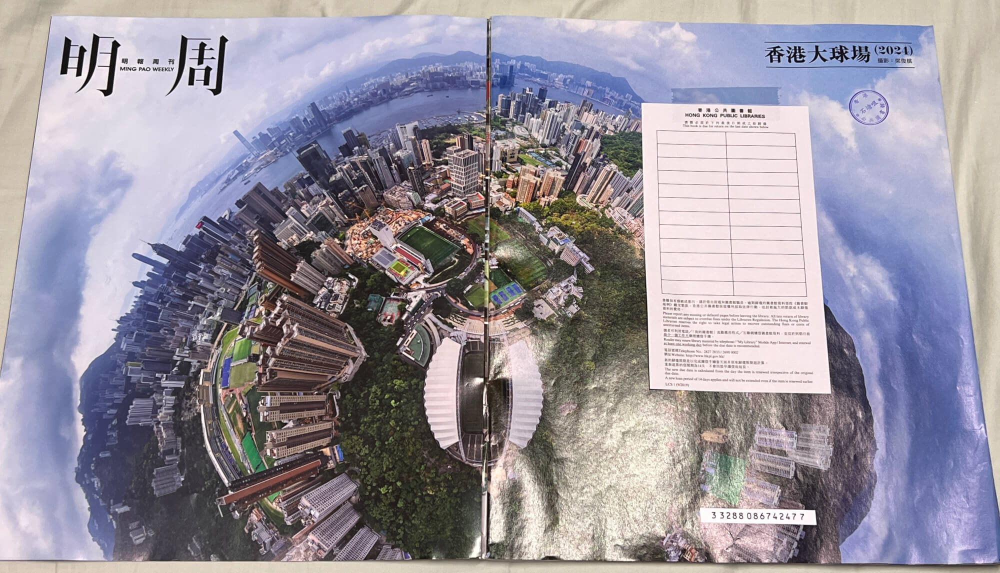
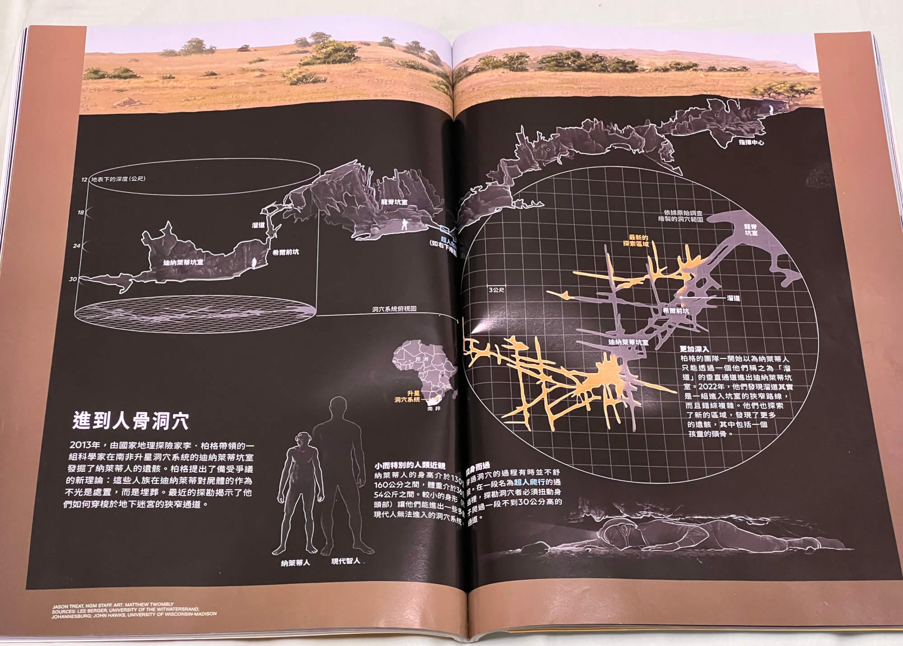
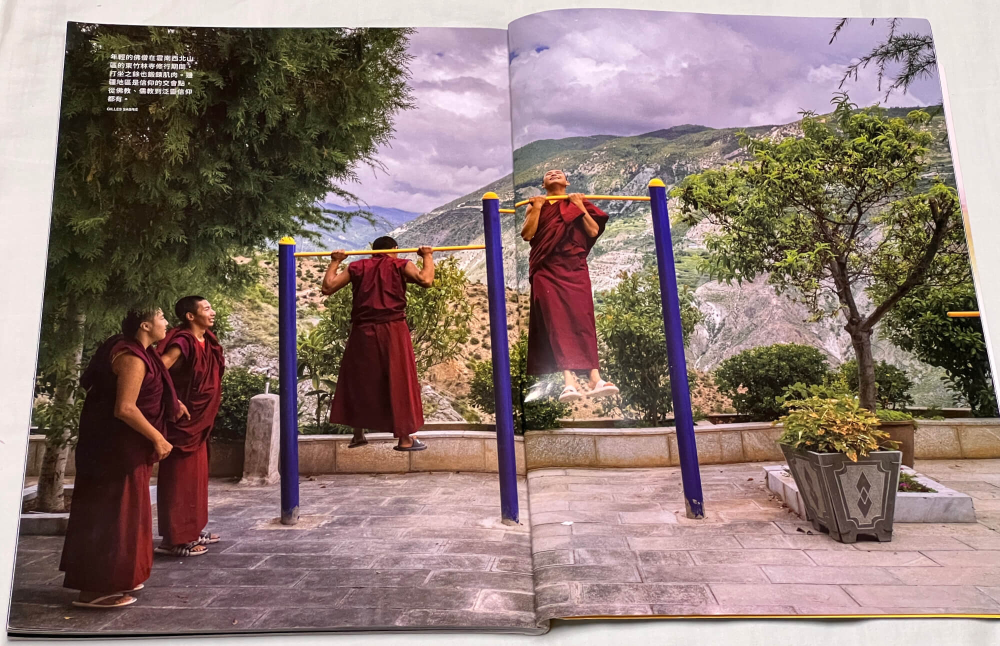

2024-10-17 周四 香港 晴

## 一、意外的阅读之旅

2024 年 10 月 17 日，星期四，晚上原本是我陪宝宝睡觉，从九点多睡到了近十二点，后来宝妈强行要换我，之后我就睡不着了，躺床上玩了会儿手机，越玩越空虚，于是开灯起床，挑灯阅读了杂志《国家地理》和《明报周刊》。
<!--more-->
## 二、纸质杂志的魅力

我一直都喜欢纸质杂志，尤其是旅游、地理类杂志，里面有很漂亮的大幅摄影作品，整幅页面极具视觉冲击力。还有各种地图和信息量很大的图表，细节丰富。这是纸质书比电子阅读好的地方。然而，暑期痛苦的三次搬家的经历让我深刻体会到了电子阅读的好处，以后藏书全部电子化，但即便如此，纸质杂志依然有着它独特的魅力。

## 三、对比内地和香港杂志购买渠道
回想起在内地的时候，获取杂志的渠道丰富多样。一方面，有一些杂志可以通过电子阅读的方式获取，比如《博看书苑》，只要有图书馆的注册码，便能轻松阅读很多杂志，包括《南方人物》《第一财经》《华夏地理》等，微信读书也能看到很多杂志，甚至包括很贵的《哈佛商业周刊》。另一方面，电商平台上还能以很低的价格买到杂志，尤其是过刊，折扣力度很大。

这与香港只能在便利店和报刊亭购买杂志的情况形成了鲜明的对比。我家附近主要是便利店，杂志种类有限，之前在中环码头边上偶然遇见了一个报刊亭，那里面的杂志种类之全，令人惊叹。英文的、繁体的杂志琳琅满目，涵盖了各个领域。然而，当我看到价格时，不禁咋舌，香港的杂志价格确实比内地贵了不少，本地的中文杂志大约30元一期，英文的商业杂志则要80-100元左右。

## 四、在香港借阅杂志
在内地，我常跑图书馆，也没少借书，但杂志通常只能在馆内阅览。而在香港，图书馆的杂志可以外借。当期或临近的杂志需在馆内阅览，而几个月前的旧杂志就可以直接借出，而且不占用借书的数量，书可以同时借十本，杂志多达二十本，体验非常好。我喜欢的地理、旅游类杂志时效性没那么强，借回来看很有趣。香港的图书馆中英文书各占一半，杂志也是如此。比如同一期的《国家地理》，可以同时借到繁体中文版和英文版，封面一样，内容对标，还能进行双语阅读，用来学习英语应该也很不错。

我从石塘咀公共图书馆借过两次杂志，第一次借的是几本英文的商业杂志，自己的词汇量不够，读起来过于吃力。这次借的是两本繁体中文的，78元的《国家地理》杂志中文版和30元的《明报周刊》。

## 五、阅读《国家地理》
首先翻开的是2023 年 7 月，总第 260 期的《国家地理》中文版，这本杂志是国家地理学会 135 周年的纪念版，主题为 “我们为何勇于探索”，介绍了许多探索的故事，其中有两个故事让我印象极为深刻。

## 5.1 南非洞穴探险

第一个故事是关于南非洞穴探险。在约翰内斯堡附近的一个地下洞穴中，人们发现了一种特殊人种的墓地，研究者认为这是人属但并非人种，类似于尼安德特人、丹尼索瓦人等。这种人类身高约一米三，比现代人小三分之一，脑容量也小很多。洞穴内部结构复杂，四通八达且十分狭窄。最小的地方宽度仅有 19 厘米，只有小个子的人才能进入。对于这个矮个人种，进入洞穴不难，但当今的探险家们为了进入洞穴，历经艰险。其中年近六十的负责人，等了一年，减重五十斤才终于冒着风险勉强进入。洞穴中能站直的地方很少，探险充满风险却也十分有趣。

一开始我也没特别留意到这个故事，直到翻开了洞穴的剖面图和结构图，震惊于它结构的复杂。看着杂志上的文字描述和精美的图片，我仿佛也置身于那个神秘的洞穴之中。想象着探险家们在狭窄的隧道中艰难爬行，在黑暗中探索未知的世界，心中不禁涌起一股敬佩之情。这个故事不仅让我了解到了南非洞穴的奇妙之处，也让我感受到了人类探索未知的勇气和决心。

## 5.2 云南手工艺

第二个让我印象深刻的故事名为 “仰赖手工艺的世界”。作者保罗・萨洛佩克正在进行一场 2 万公里的徒步旅行，计划名为 “走出伊甸园”。他2013年从非洲出发，参考原始人走遍世界的路线，途经中东，高加索，南亚，经过中国，穿越俄罗斯，最后的目标是南美。2021 年10月至 2022 年10月，他在中国云南走了一年多，从中缅边境腾冲出发，终到保山，探寻滇缅公路，又前往大理，了解 “大理福尼亚”，接着北上至丽江玉龙雪山和虎跳峡，一路走到四川。

这一路上，他讲述了许多与手工艺相关的故事。比如滇缅公路在未引入机械前全靠人力修建，十分危险且死亡率高。还讲述了一些手工艺艺人在山上劳作的事情，以及在西部山区中仍保留着许多手工艺传统。虽然大理和丽江已工业化，但在人迹罕至的山区，比如高黎贡山区，才是传统工艺的家园。还有一些有趣的小故事，如运骡子的人，因帮忙运水泥，修通了公路而生意没落。

作者的观察能力让我惊叹不已。他作为一个外国人在中国徒步，能找到本地向导以及懂生态的学者陪伴。因此，他对中国的动物、植物、风土人情了解得十分深入。包括大理的现在的躺平风情、滇缅公路的故事以及当地的人、手工艺的细节描写都很到位。其文笔不错，可能也得益于翻译的出色。故事充满悬念和想象空间，写作手法丰富，读起来十分有趣。

## 5.3 阅读感受
读完这本2023 年 7 月刊的《国家地理》，已是宁静的凌晨时刻，我的心中满是对杂志中精彩内容的回味与思考。
这本杂志让我领略了不同的风景、故事和文化，拓宽了自己的视野。它让我看到了人类探索未知的勇气和决心，也让我感受到了传统手工艺的魅力。

## 六、邂逅《明报周刊》
之后，我还看了 2024 年 5 月 3 号的《明报周刊》，总第 2892 期。这本由金庸创办的杂志，已发行 54 年，积累了深厚的底蕴。我借的这本是因为本期专题——香港大球场，作为一个足球爱好者，这个主题瞬间吸引了我。每期封面都明星，这期翻开后的拉页是香港大球场的航拍图，类似无人机三百六十度的航拍拍摄图，视觉冲击力极强。

翻开杂志，我先了解到了《明报周刊》的内容套路。通常一开始是明星、艺人的大幅照片，接着是文娱性质的内容，还有美食、生活、艺术以及香港社会的相关主题。而这一期，社会这部分围绕着香港大球场展开了深入的探讨。

香港大球场目前是香港最大的足球场，拥有 4 万个座位。去年梅西访港比赛就在这里举行，足以见其重要性。然而，随着启德运动场在年底建成，拥有 5 万个座位的启德将超过香港大球场，也将取代大型赛事的主办权。为了将香港大球场转变为供老百姓使用的体育运动和休闲设施，政府准备拆掉专业足球场看台，增加田径跑道，并减少座位至几千个。

杂志中，通过足球解说员以及港足老球员的回忆，展现了香港大球场的历史。这里曾举办过许多重要的比赛，也经历过骚乱，杨利伟和奥运金牌选手来访问过，贝利、马拉多纳等足球巨星也在此踢过球。
同时，也对香港足球场的现状进行了分析。因为香港足球水平一般，一般比赛难以坐满 4 万人，香港大球场平时使用较少。而旺角大球场作为第二热门的场地，球场较小，只有六千个座位，却是两个亚冠二级联赛两个球队的主场，常常能坐满。改造的原因是香港政府规划每个社区约二十五万人要有一个球场，香港岛约一百一十七万人，应有四个球场，但目前现有球场不太够，也没有土地建新球场。
此外，香港现在缺一万五千人左右的中型球场，只有一座港岛东边的小西湾球场，它虽有一定的规模，但不靠地铁，疏散不方便且周边有噪音干扰，导致很少举办比赛。目前香港大型活动有启德的五万座位和大球场的四万座位，但一万多的中型球场比较缺乏，可以想办法扩建几千人的球场，比如旺角。

## 七、总体感受
总体来说，《明报周刊》的可看内容比《国家地理》少一点，但偶尔翻翻，也能了解到香港本地的风土人情，阅读体验还算不错。虽然两本杂志都比较贵，未必舍得自己花钱购买，但时效性不强，借阅是个不错的选择。

在未来的日子里，我希望自己能够继续保持对阅读的热爱，多读一读自己喜欢的东西，也带着宝宝们养成阅读的习惯。无论是纸质杂志还是电子书籍，都能成为我探索世界的窗口。我期待着在阅读中发现更多的精彩，收获更多的感悟~