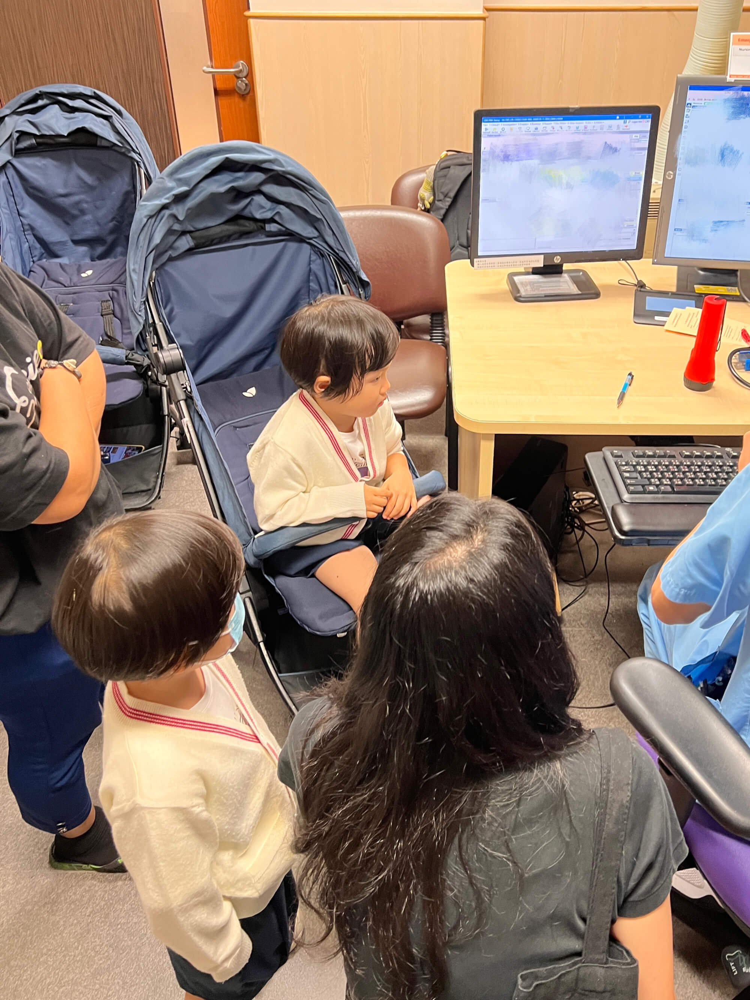
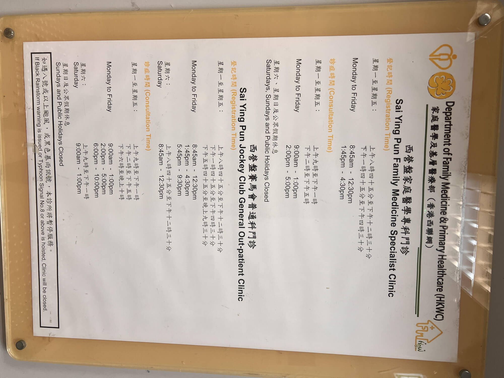
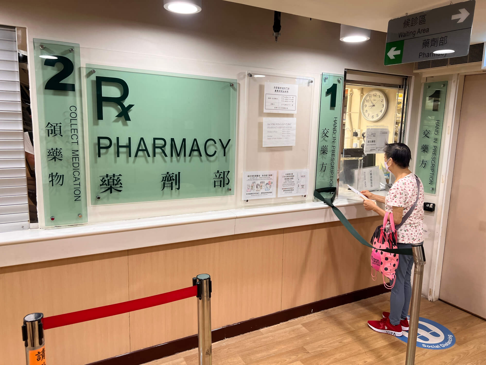

## 宝宝突感不适，医院抉择在眼前
近日，家中的三岁小宝贝海兔每天清晨起床都嚷嚷着脸疼，小脸蛋也确实泛起了红晕。宝妈由此怀疑可能是腮腺炎，心急如焚，必须要去一趟医院了！
<!--more-->

说到医院的选择，在香港大致有这么几种途径：

- 其一，公立医院，诊疗费用每次仅 50 港元，然而挂号难度着实不小；
- 其二，私立医院，预约相对便捷，就是贵，我们没有门诊医保；
- 其三，前往深圳就医，虽看病本身花费不高，但往返路途奔波劳累，实在折腾。

考虑再三，鉴于后续就医大概率仍会以公立医院为主，我决定先行尝试公立医院的就医流程，倘若实在不尽人意，再考虑私立医院或者自费购买医保等其他方案。

## 预约之路：波折中前行
由于宝宝没有香港出生证和身份证号，无法使用医管局的手机应用 HA go 进行预约，只能通过电话预约。此前曾用宝宝们的港澳通行证办理过登记，因而拥有了一个虚拟的医院身份证号，其格式为两位字母 +六位数字+一位验证码，与身份证号有几分相似。

每个医院都设有人自动电脑预约号码，拨通后，首先要选择语言，1 为粤语，2 英语，3 普通话。接着输入身份证号中间六位数字（宝宝们的号码是自动生成且按序递增，双胞胎的号码仅相差 1），随后输入出生年份，再对完整的身份证号进行确认（此时系统会播报前面的字母与后面的验证码），最后按 1 确认。若医院有号，系统便会告知最早可预约的时间，若同意则按 1 确认，所提供的均为 24 小时内的号源。若该医院无号，而附近其他医院有号时，系统也会予以推荐。

我拨打西营盘赛马会普通科门诊的电话，多次遇到无号的情况，难得有一回被告知附近香港仔的医院有号，可转过去却回复号已被抢光。

听闻医院放号规律是每个整点都有，其中早上 8、9、10 点放号数量相对较多，其他整点也会少量放号，并且还存在一些不定时的随机放号。我为此设置了诸多闹钟，前前后后拨打了不下二十次电话，最终成功抢到了 10 月 5 号西营盘赛马会普通科门诊院晚上 8 点 45 分的号。

宝妈对于这个时间很不满意，认为会影响宝宝睡眠，让我再抢更好的时间。我深知抢号的不易，尤其是家门口的医院（一般新界和离岛的医院容易抢，港岛和九龙比较难），舍不得放弃，不放弃旧无法约新的时间，于是用珊瑚宝宝的信息（娃多就是好），又打了很多次电话，一无所获，最后只能晚上去。

## 就诊时分：有序且高效
预约要求提前 15 分钟抵达医院排队，也就是8:30到医院，我们 8 点前完成宝宝沐浴，随即从家中出发，8 点半顺利到达医院并完成登记。有意思的是，登记时我们是 56 号，前一个号是 41 号，后面是 51 号。由此可见晚上就医人数寥寥，估计7 点半来排队登记应该也可行，毕竟从 41 号到 56 号之间不少患者早已看完离开，下次可以早点，就不用影响睡眠了。

8 点 40 分进入诊室，接诊的是一位年轻男医生。我们起初以普通话交流，奈何医生的普通话水平有限，宝妈便用粤语与医生沟通，我在一旁则听得一头雾水。医生先是询问宝宝姓名，耐心了解病情，接着轻轻取下宝宝口罩，仔细在脸部进行检查，随后又拿出一根检查棒查看喉咙，并询问牙齿是否疼痛，好在宝宝牙齿并无痛感。医生还顺带检查了一同前往的姐姐珊瑚，后来电子病历上错写成“elder brother”，被我及时指出更正为“elder sister”。

一番检查过后，医生开具了药物，应该是类似于布洛芬的退烧药，同时还出具了一份病假条，告知如有需要可向学校请假一天，有备无患。完成诊疗后，打印出药品清单与请假条，我们便前往取药处。

## 取药之程：便捷又快速
来到取药窗口，工作人员询问是否需要中文的用药说明，我给予肯定答复。随后工作人员核对宝宝中文名，通过港澳通行证仔细确认后，仅仅等待了几分钟，药品便准备就绪。所取药品包括两瓶红色药水，推测应为退烧药，类似布洛芬，还有一个注射器模样的器具，大概是方便抽取药水。

如此一来，从看病到取药，整个过程仅花费约 20 分钟，效率挺高，颇为满意。之后步行回家，全程总计一个多小时，整体体验较为便捷。

## 商业保险福利：意外之惊喜
晚上到家后，收到了安盛保险寄来的信件。信中提及我们所购买的是半私家住院医保，并且额外附赠第三方机构提供的门诊服务一年，普通科和专科总共可用 10 次，每次仅需支付 50 港元普通科，或120 港元专科，与香港公立医院价格一样。

此福利可在大陆、香港以及澳门通用，这无疑是一份相当不错的惊喜。日后若遇到公立医院挂号困难或者情况紧急之时，便能够凭借此医保前往私立医院就医，着实令人安心不少。

## 经验总结与后续规划
回顾此次就医经历，我有三点感受：
- 其一，公立医院的号源着实紧俏难抢，就像我昨天好不容易抢到今晚的号，可今天白天多次尝试预约更合适的时间却均以失败告终。在香港就医本就不易，能挂上号且医院离家较近，已属幸运，无需再耗费过多精力在预约上。
- 其二，晚上医院的人流量明显少于白天，对于较晚的号源，其实可以适当提前前往，比如提前半小时至一小时，这样既能避免长时间等待，又能减少对宝宝睡眠的影响。以往白天就医时，等待叫号往往需要 40 分钟，取药亦要等候 20 分钟左右，因为白天患者众多，看诊时一个号可能耗时十分钟，需等待四五个号，取药时前面或许有一二十个号，每个号也需几分钟时间。
- 其三，基于此次经历，后续的代办事项便是深入研究家附近有哪些能用保险的私立医院，详细了解其具体位置与联系电话，以便日后有需要时能够及时联系，做到未雨绸缪。 

然而，宝妈对此番看病经历却有着不同的见解，身为内地主治医生，她认为此次看病的意义不大，主要原因在于没能做检查。香港医院的验血流程较为繁琐，我上次抽血就等了三周时间，不像内地能够现场抽血，半小时出结果。在此次就诊过程中，医生仅通过语言交流来判断病情，无法借助抽血进一步验证，医生是全科的，判断病情不严重，不需要转专科，最后只是开了一点退烧药。因为家里常备美林布洛芬和抗生素，这个诊断和治疗方案宝妈自己在家里也能做，她认为医院理应进行专业的检查以辅助判断病情，这样才能真正体现就医的价值与意义！

