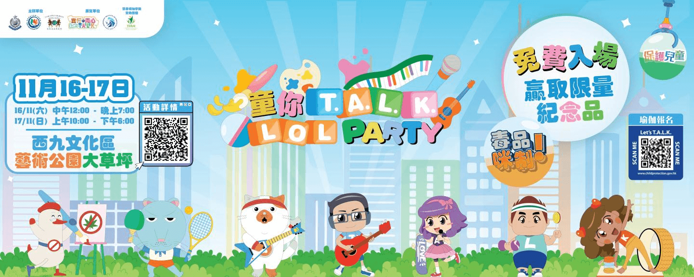

2024-11-16 周六 香港阴转雨 

## 一句话总结
今天是周六，下午我和宝妈带着两个宝宝一起去参加了“童你 T.A.L.K. LOL Party 2024”嘉年华，这是香港警务处毒品调查科联合家庭冲突及性暴力政策组举办的大型活动，融合运动、音乐和艺术元素，旨在向公众宣扬禁毒和保护儿童的重要信息

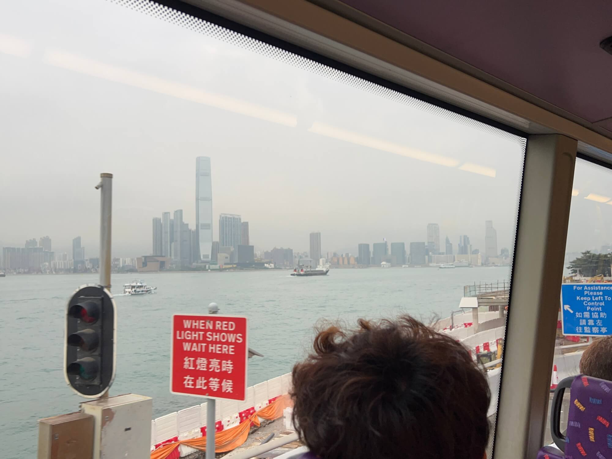

## 活动前奏：多种渠道的宣传
早在活动开始前一周，我就从多种渠道了解到这个活动。其中地铁站里的海报最为醒目，我上下班的西营盘和铜锣湾站的橱窗里都展出了此次活动的海报，我每次出入地铁时，都喜欢顺便观看海报，香港地铁里的海报内容也很丰富，除了广告外，也有很多本地生活的资讯，电影、演唱会、粤剧，公益活动等。这个活动海报上满是卡通图片，一眼望去就像是为孩子们准备的精彩活动，瞬间点燃了我的兴趣，我按照往常习惯，拍海报照片，到家后识别海报上的二维码，详细了解了活动日程。

周中的时候，路边领取的免费报纸《每日头条》上也出现了这个活动的报道，报纸上的内容比海报和官方网页更完整，除了重点介绍了想要打破吉尼斯记录的500人亲子瑜伽外，还提到嘉年华上有 40 个不同摊点的，这可太适合亲子游玩啦，而且还有机会拿到各种奖品，这让我对活动愈发期待。

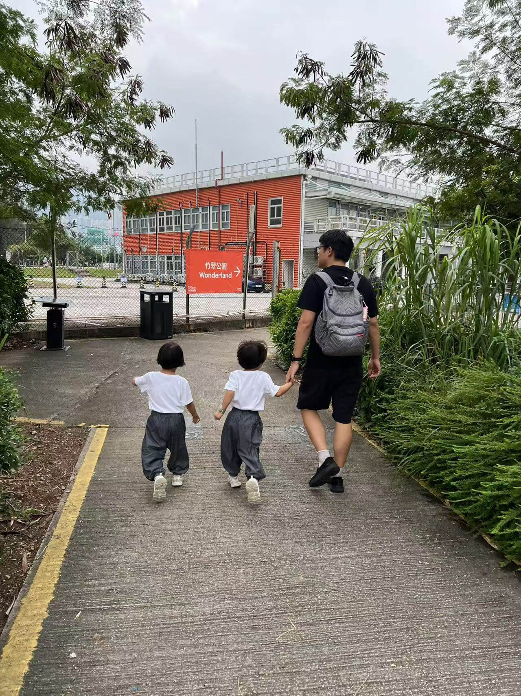

事后，我发现关注的几个香港亲子活动的博主也都发过这个活动，有的还有现场参与的图片。以后不出门，也能通过他们刷到一手亲子活动信息。

另外，为了写作这篇文章，我搜索了活动新闻，顺便找到了几个活动信息汇总网站，我觉得 klook 是最好的，有详细的活动介绍、时间地点、活动内容等，还有跳转链接，直达官网（这点比封闭的微信和小红书生态圈好多了）。

## 出行准备与计划：向着快乐出发

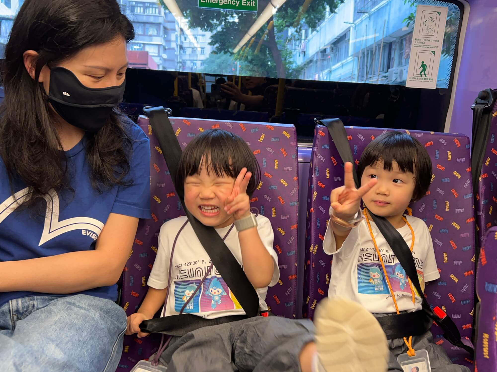
看到这些诱人的信息后，我们决定在周六去参加，周六下午3点有 500 人的亲子瑜伽活动，可惜名额已满，没报上。于是，我们在宝宝 3 点多睡醒再出发，走到薄扶林道乘坐 930 公交，两站，第一站水街，第二站就是西九龙了，然后步行去艺术公园大草坪。按照宝宝日常一个多小时“电量”来估算，四点多到，六点回家吃饭，这样安排既不会让宝宝太累，又能充分享受活动的乐趣。

## 西九龙风光：美好的海景
我们大概 4 点多到达西九龙。这里比我想象中的还要大，从公交车站出来后，我们沿着海边漫步前行，海景如同画卷一般在眼前展开，海边停泊着各式各样的船只，它们在夕阳的映照下，像是被镀上了一层金色的光辉，太阳缓缓西沉，天空绚丽多彩。海风轻轻拂过脸庞，带来了丝丝凉爽，那感觉就像大自然在温柔地抚摸着我们，舒服极了。

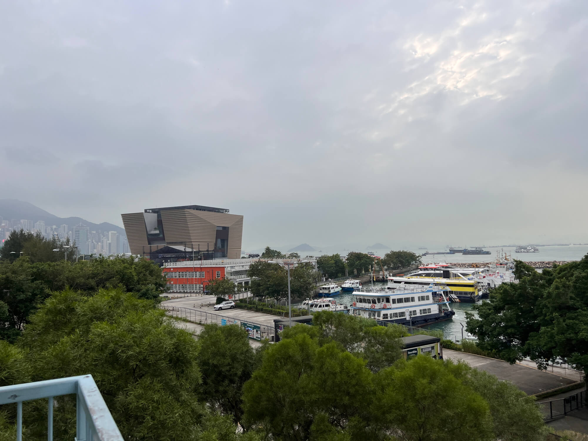

走着走着，我们先是看到了一个演唱会现场，没到入场时间，好多歌迷在排队等待。他们有说有笑，充满期待，现场还有人在售卖歌手的海报。旁边有一个小小的公园草地，不少人在里面遛狗，狗狗们欢快地奔跑着，它们的主人则在一旁悠闲地聊天，一片温馨的画面。

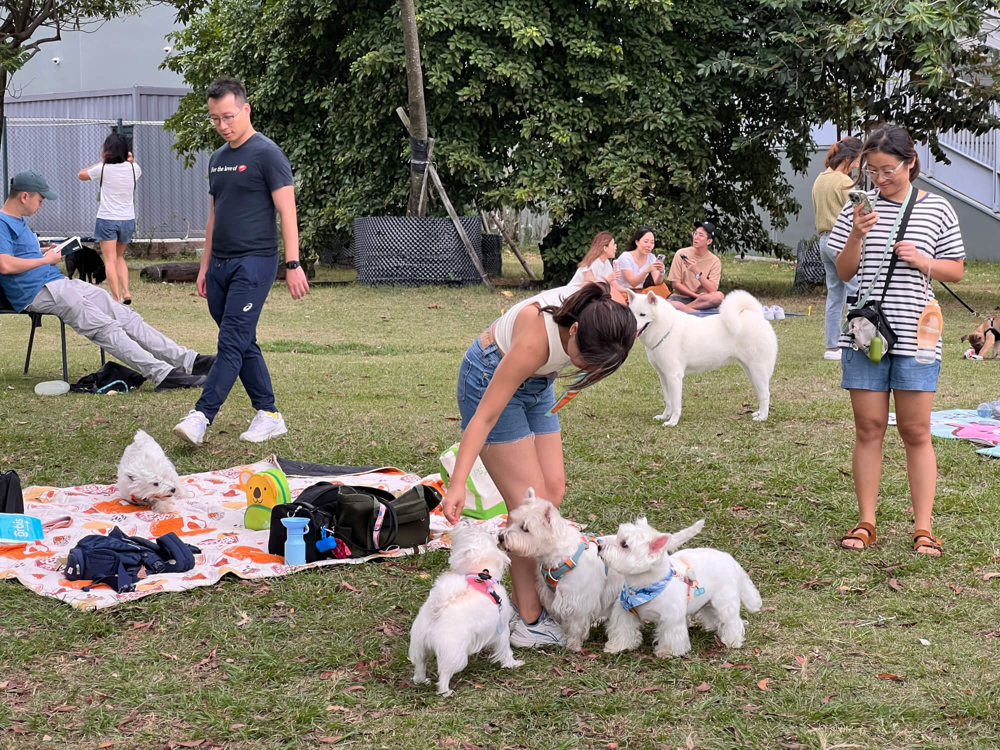

海滩边上也有人带着帐篷露营，他们或是躺在帐篷里休息，或是坐在外面欣赏海景，享受着这美好的时光。眺望对面港岛的高楼大厦，那种繁华与这边的宁静形成了鲜明的对比，让人感叹这座城市的多元魅力。

再往前走就是香港故宫了，建筑宏伟，气势非凡，仿佛在诉说着古老的故事。过了故宫，那片大草坪就是这次香港警务处搞活动的地方。

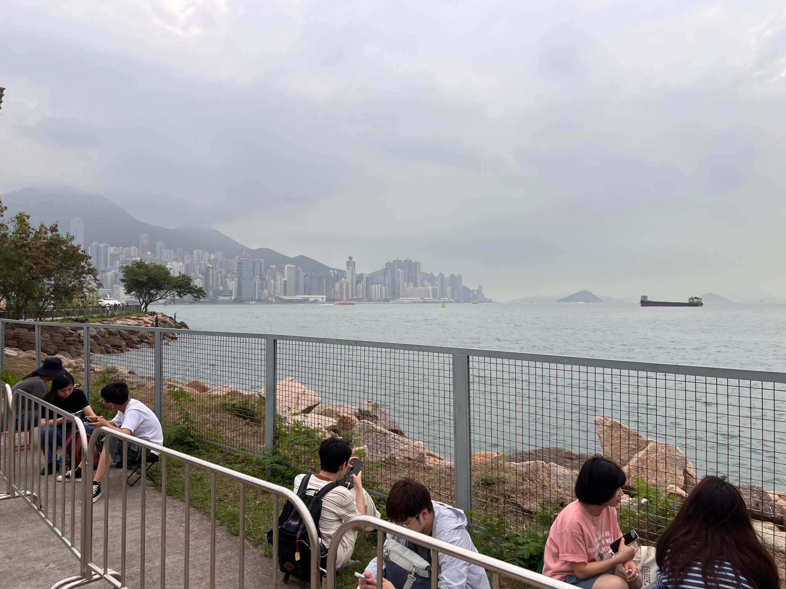

## 活动开场：领取盖章卡
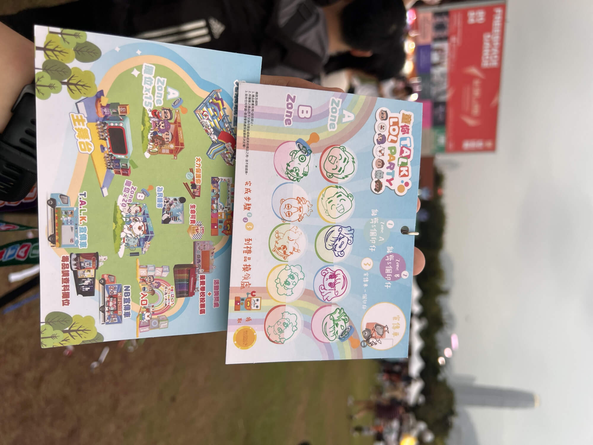
到达现场后，首先前往入口的信息处。那里有工作人员热情地迎接我们，可以自由选择不同颜色挂绳的盖章卡。每张卡上有 11 个盖章点，要求在两辆宣传车上盖一个章， 再在a 区盖 5 个章，b 区盖 5 个章，总共集满 11 个章就可以去领奖啦。宝宝们看到盖章卡都特别兴奋，拿着卡就迫不及待地想要开始我们的盖章之旅。

## 禁毒宣传车：震撼的教育
首先映入眼帘的是两辆宣传车，我们选择了禁毒主题宣传车排队，上车后，工作人员给我们发放了 3D 眼镜，戴上眼镜后观看一个禁毒短片。短片的内容十分震撼，它生动地展示了人吸食毒品后产生的致幻效果。画面中，原本平静的环境突然变得异常恐怖，身边的酒瓶子像是被赋予了生命一般飞了起来，紧接着一条大蛇张着血盆大口向人扑来，仿佛下一秒就要将人吞噬。还有吸毒者走在路上，眼神迷离，分不清方向，摇摇晃晃地走到路中间，然后被疾驰而来的汽车撞倒，场景触目惊心。这个短片深刻地告诫大家吸毒是一件极其危险的事情，它会对自己和身边的人造成无法挽回的伤害，千万不要沾染毒品。通过这种直观的方式，让我们更加深刻地认识到了禁毒的重要性，也为孩子们上了一堂生动的安全教育课。
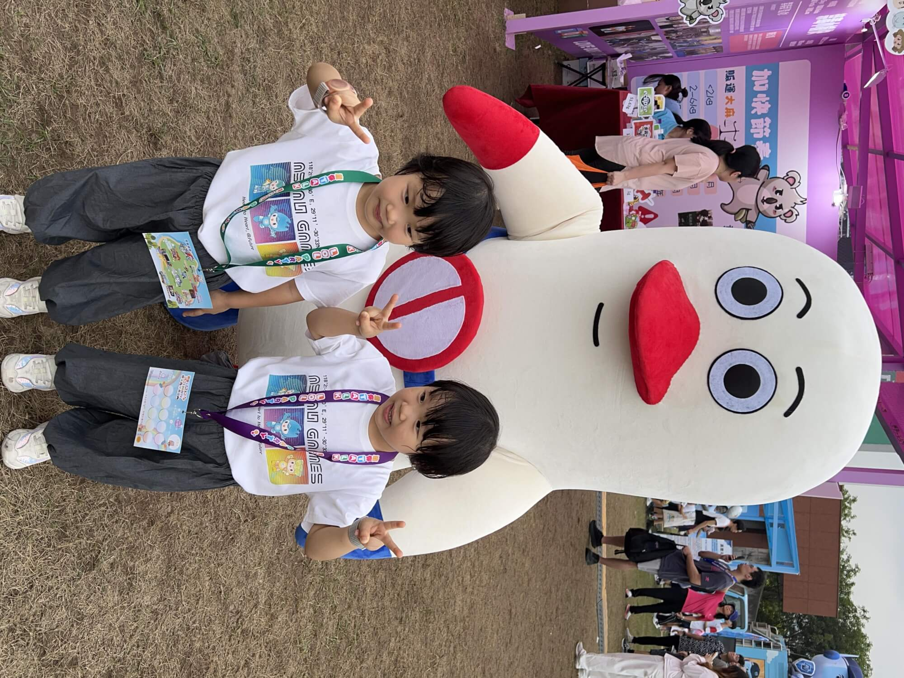

## A区趣味禁毒宣传：知识与乐趣并存
看完禁毒短片后，我们来到了 A 区。这里的摊点大多是中学生布置的，应该是警务处日常深入学校宣传，这些学校过来组织的摊位，这里游戏相对复杂些，感觉更适合小学及以上的孩子参与。

我带着宝宝先体验了结合禁毒宣传的小桌球、小高尔夫游戏，孩子们需要在击球的过程中回答一些关于禁毒知识的问题，既有趣又能学到知识。

我还参与了一个找毒品的游戏，在一个台面上隐藏了 7 种毒品，要求在 1 分钟内找到 4 种以上。这些毒品被巧妙地隐藏在各个角落，有的藏在树叶里，与周围的绿色融为一体，很难被发现；有的藏在桌子抽屉的夹缝里，需要仔细观察才能找到；还有的藏在拐角处，稍不注意就会错过。这个游戏不仅考验了我们的观察力，也让我们更加了解毒品可能隐藏的方式，提高了对毒品的警惕性。
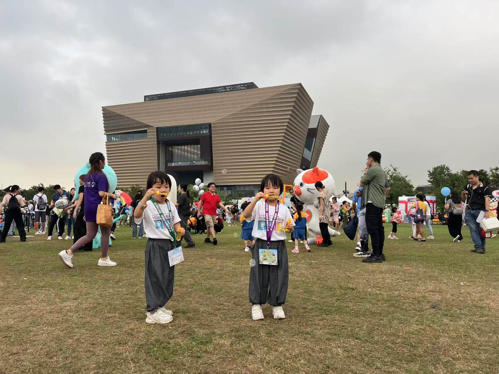
另外，还有飞镖游戏，打中不同的地方会有相应问题，要说出这是哪一种类型的物品，有的物品和日常的饼干之类混在一起，很容易混淆，需要仔细鉴别。这些游戏将禁毒知识融入其中，让孩子们在玩游戏的过程中，不知不觉地学习到了如何识别毒品，增强了自我保护意识。

我们在逛A区展位的时候，还遇到了“一哥”警务处处长在参观，警务处处长的专车车牌号是“1”，所以江湖人称“一哥”。

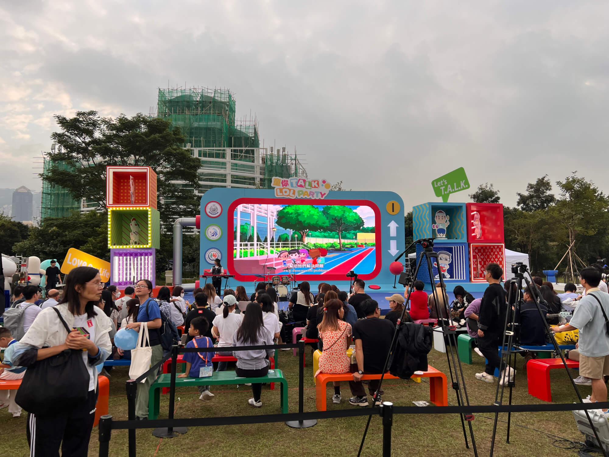
## 舞台与草坪：多彩的活动
A 区玩完后，往西走是个大舞台。舞台前面有很多座位，后面有大屏幕，这里是活动的中心区域之一。一开始，大屏幕上播放着动画片，好多小朋友被吸引过来，坐在座位上看得津津有味。欢快的音乐和精彩的动画画面，让孩子们沉浸在欢乐的氛围中。下午五点之后，舞台上迎来了几位驻唱歌手。他们依次上台，每个人都唱了几首动听的歌曲。

舞台旁边的中间大草坪是亲子瑜伽活动的场地，虽然我们没有报上亲子瑜伽，但能想象到当时那热闹而温馨的场景，后来看新闻，这里640人打破了「最多照顾者及被照顾者同时在户外团体瑜伽」的世界纪录。在草坪周边还有一些游戏，禁毒吉祥物有 “咪仔” 、“唔食 DUCK” 和 “鬼鼠鼠” ，家庭冲突及性暴力政策组的四位吉祥物是“德得”、“保寶”、“小健” 及 “小善” ，他们和大家互动，很多孩子们在草坪上嬉笑玩耍，家长们则在一旁陪伴，整个场面充满了欢声笑语。

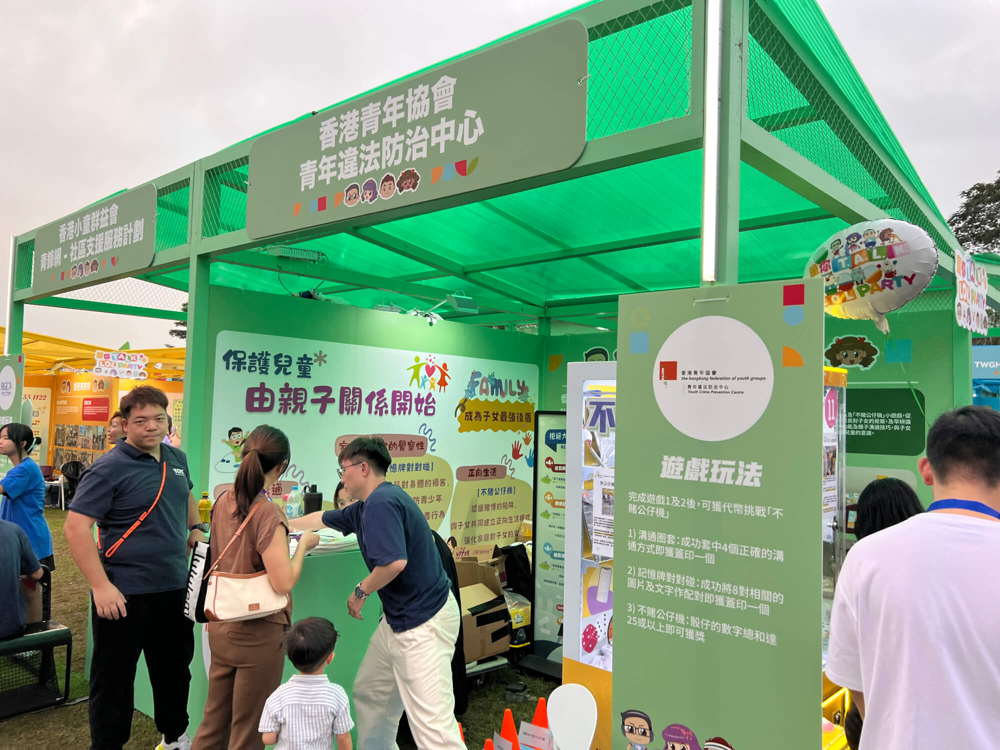

## B区保护儿童：充满爱的亲子区域

继续往西走，我们来到了 B 区。这里是保护儿童主题，摊位来自儿童福利机构，更偏重家庭和对孩子的关爱，游戏也更适合小宝宝。

我们先让宝宝参与了转盘游戏，转盘上有各种颜色，每个颜色对应着不同的要求。宝宝转到橙色，橙色要求对爸爸妈妈说“我爱你”，宝宝们很快就主动对妈妈说了“我爱你”，周围的人都被宝宝的天真可爱逗笑了，宝宝也因此拿到了小奖品，开心得不得了。

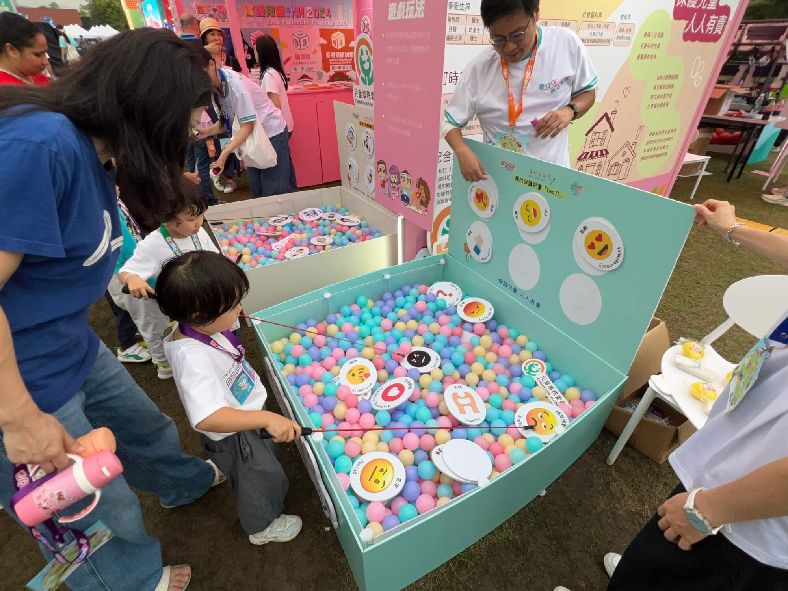

B 区适合小宝宝玩的游戏更多，比如踢球、套圈、海洋球、小猫钓鱼之类的。小宝宝们在这里玩得不亦乐乎，他们的笑声回荡在整个区域。这些游戏简单又有趣，让小宝宝们能够轻松参与，享受游戏的乐趣。

这里有医院，有福利机构，也有民间组织，它们除了发小奖品，还会发健康卡。比如东华三院的卡片上就给出了免费的咨询电话和二维码，方便人们在遇到心理问题或家庭矛盾时打电话求助。这让我感受到了活动组织者的用心，不仅关注孩子们的欢乐，也关心家长们的身心健康。两个宝宝看到了手机形状的信息卡，兴奋得拿在手上“打电话”，我也顺便让宝妈把求助号码存入手机，下次被娃搞崩溃前可以即时求助。

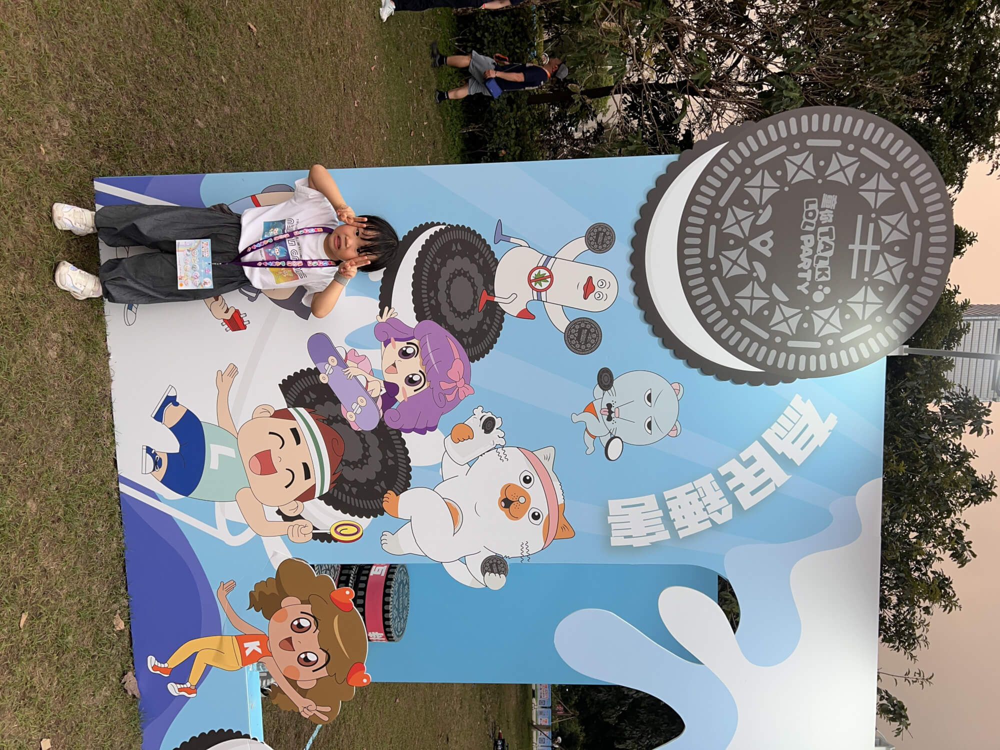

活动期间，也有一些机构在发放问卷，我做的问卷询问了家长平时带娃的压力情况，比如是常常觉得压力很大，还是偶尔有压力之类的问题。我留下了手机号，事后通过Whatsapp给我传送了测试结果：

    你好，多謝你於較早前參與了和諧之家的「和諧站」活動，並填寫了「親職壓力測試」，現向你傳送測試結果。
    根據分析，你的親職壓力程度屬於「低」。顯示你暫時受到輕微程度的管教壓力。建議你除了照顧孩子外，亦宜安排時間做自己享受的事情，照顧好自己，才能更有空間和力量照顧孩子。你亦可下載「和諧親子kit」應用程式，與孩子一起學習處理情緒。
    **此乃初步評估，若面臨情緒/壓力問題，請尋求專業協助。

结果还不错，建议也很好，不要一味付出（我和宝妈都会不知不觉从这个角度绑架对方），也要做自己享受的事情，照顾好自己。

## 扭蛋机盲盒领奖
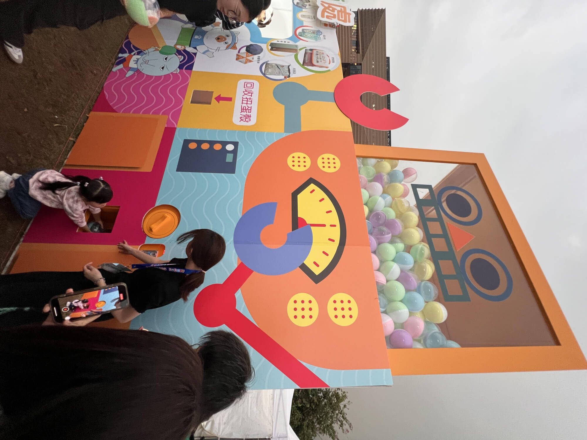
我们在 B 区玩了一会儿后，凑满了 11 个章，可以去领奖。领奖处有两种选择，领气球的队伍短一点，扭蛋机的队伍长一点。我去排了扭蛋机的队伍，宝妈则带着两个宝宝排队去玩充气城堡。

虽然扭蛋机的队伍排得慢，但秩序很不错。快到领奖处之前，有工作人员提前审核中奖卡并做记号，节省后续的时间。我有两张兑奖卡，每个家庭第一个球是从机器中扭出的盲盒塑料球，第二个球是工作人员从袋子里随机给的，这样虽然少了抽奖的乐趣，但节约了后续排队的时间，还是很高效的。还好我是一个人来领奖，要是带着宝宝来，一个能转游戏机，一个只能直接拿，估计又要闹起来了T_T，拿到球后，也有工作人员帮忙打开球、拿玩具、引导拿兑奖卡到柜台兑奖，能看出他们在努力提高效率，真的很用心！

## 充气城堡、海洋球游玩
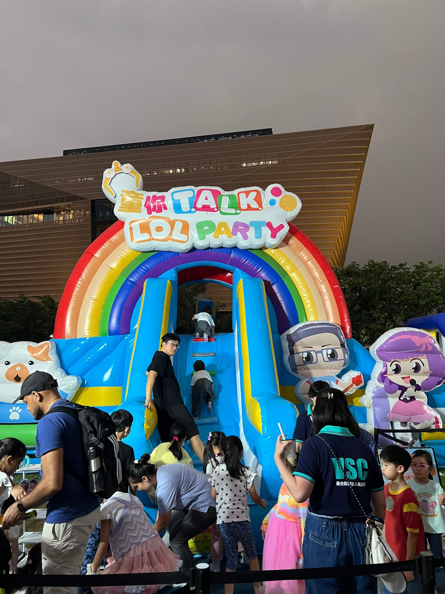
充气城堡是十分钟一场，连入场到退场大概十五分钟，每次最多容纳五十个人（大人和小孩一起）。我在排队领盲盒的时候，看到宝妈带着宝宝们排队，等我领完奖后，刚好排到，这里有人管着不让插队，于是我换出宝妈，带着宝宝们一起进入了充气城堡和海洋球区域。

人进满后，里面挺拥挤的，五十人真的是上限了。宝宝们在里面蹦蹦跳跳，我特别担心宝宝们不小心撞到一起，出现踩踏事故。

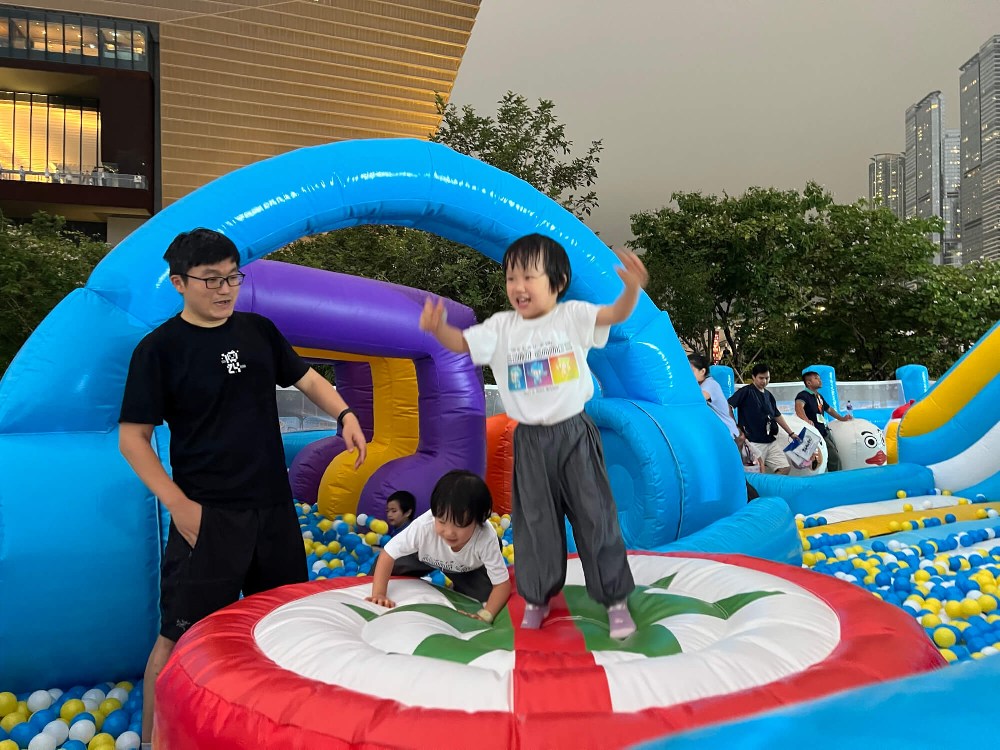

充气城堡分为三部分，中间滑梯滑下来有很多海洋球，两侧有棒棒糖、小蹦床等各种设施。两侧气充得足些，站得稳，中间部分明显气不足，像我这样体重较大的人站上去，感觉脚能踩到下面的地面，宝宝们也不容易站稳。好几次我都赶紧把宝宝抱到外面气更足的地方让他们玩，防止被滑梯冲下来的小朋友踩到，宝妈在外面拿着相机，兴奋地给我们拍照，宝宝们很享受玩耍过程，而我则一直保持警惕，时刻关注着宝宝们的安全，毕竟一个人带两个宝宝，就怕他们走出视线，发生危险。

## 欢乐延续：回家路上与晚餐时光
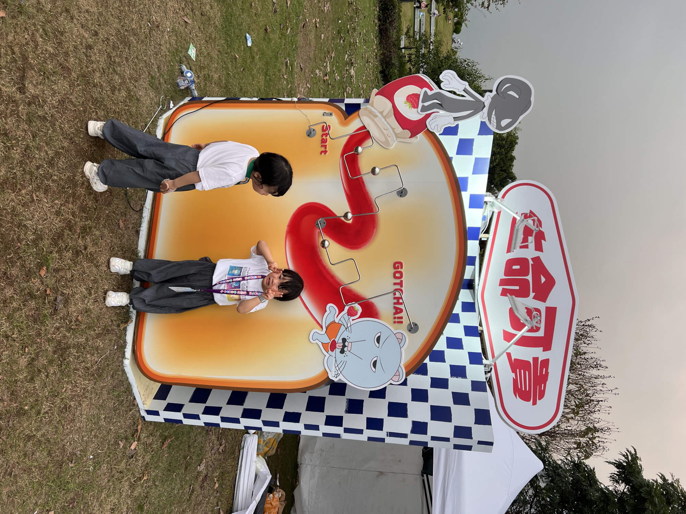
充气城堡玩到六点，天空开始飘起了毛毛雨。我们决定结束今天的游玩，赶紧往回走。先乘坐小巴到达地铁九龙站，然后换乘东涌线转港岛线回家。路上宝宝们可能是玩累了，都很安静，靠在我们身上休息。

到家的时候已经晚上七点多了，一进门就闻到了饭菜的香味，工人姐姐已经烧好了晚餐。宝宝们一看到餐桌，就像小饿狼一样跑了过去，坐在餐桌前，一边看动画片一边吃晚餐。

## 玩具的欢乐：宝宝的最爱小黑板
饭后，宝宝们迫不及待地把在活动中领到的玩具倒在地上玩了起来。今晚的玩具可真丰富啊，有汽车形状的小笔筒，宝宝们把它当成汽车在地上开来开去，嘴里还模仿着汽车的声音。还有印着吉祥物图案的搓澡巾，今晚洗澡正好能用上呢。此外，还有各种各样的玩具，像水壶、水杯、卡通画、明信片之类的。

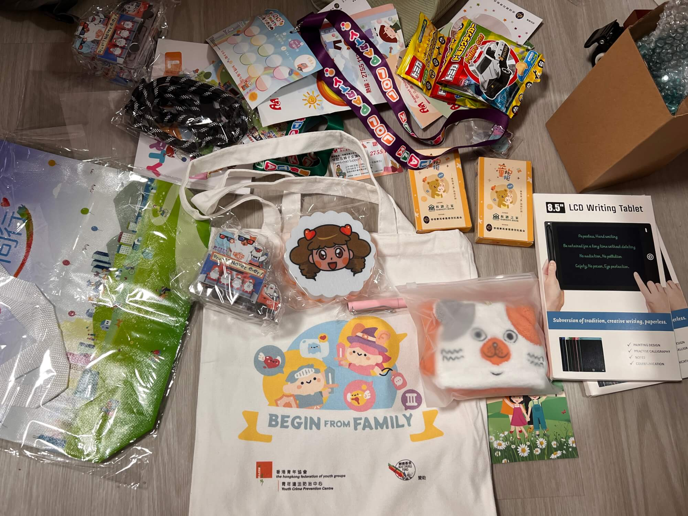
不过，宝宝们最喜欢的要数小黑板啦。这个小黑板用笔画画，还能“一键擦除”，我觉得这个小黑板很适合我们，平时宝宝在家用白纸画画，画几笔就把纸丢了，浪费了不少纸。有了这个小黑板，既能让宝宝尽情画画，又能避免浪费纸张。

我陪着宝宝一起画了小车车、小动物等，宝宝们笑得很开心了。看着宝宝们快乐的笑容，我觉得今天的活动真的是太有意义了，不仅让宝宝们玩得开心，还能让他们学到知识，收获玩具，真是一次难忘的亲子之旅！

