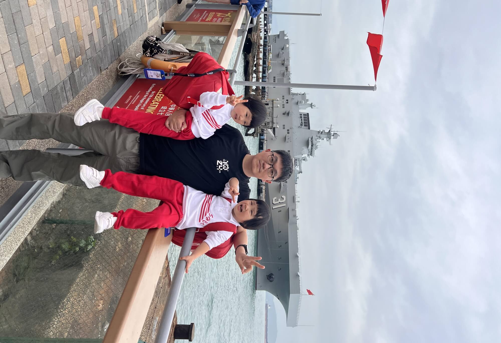
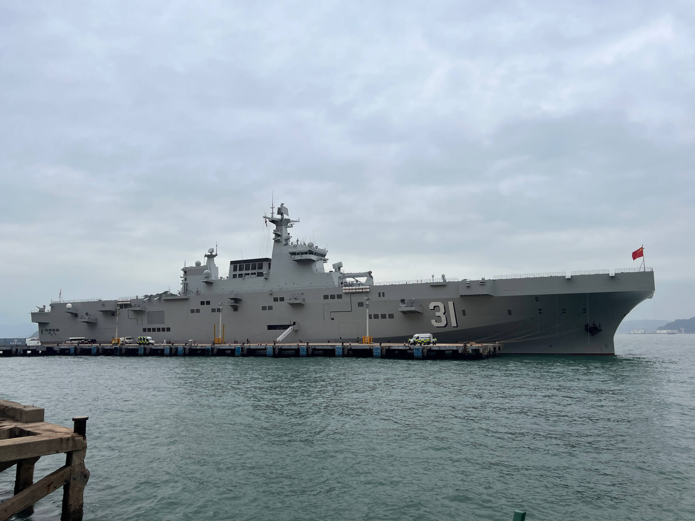
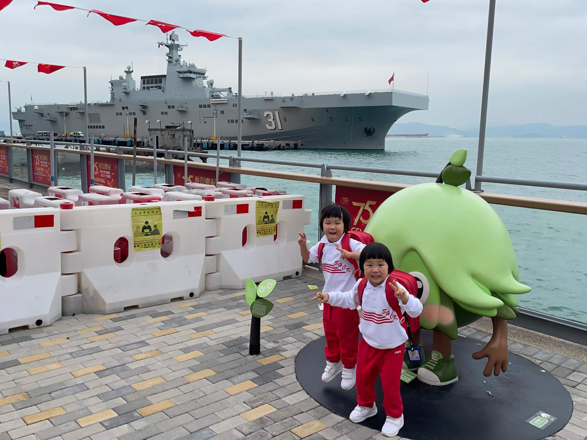
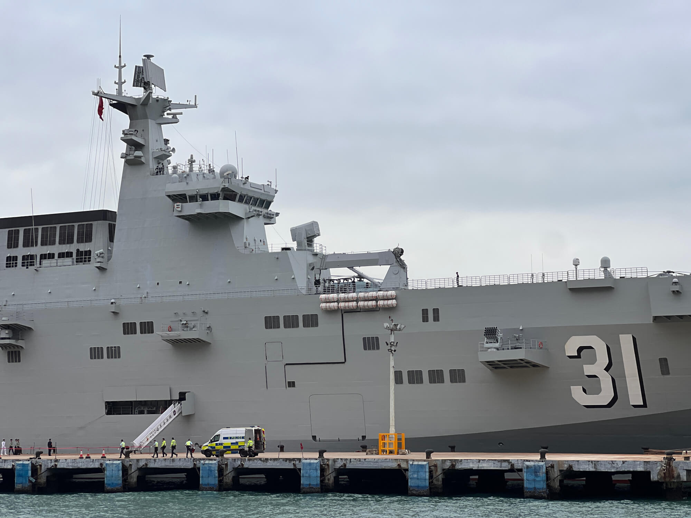
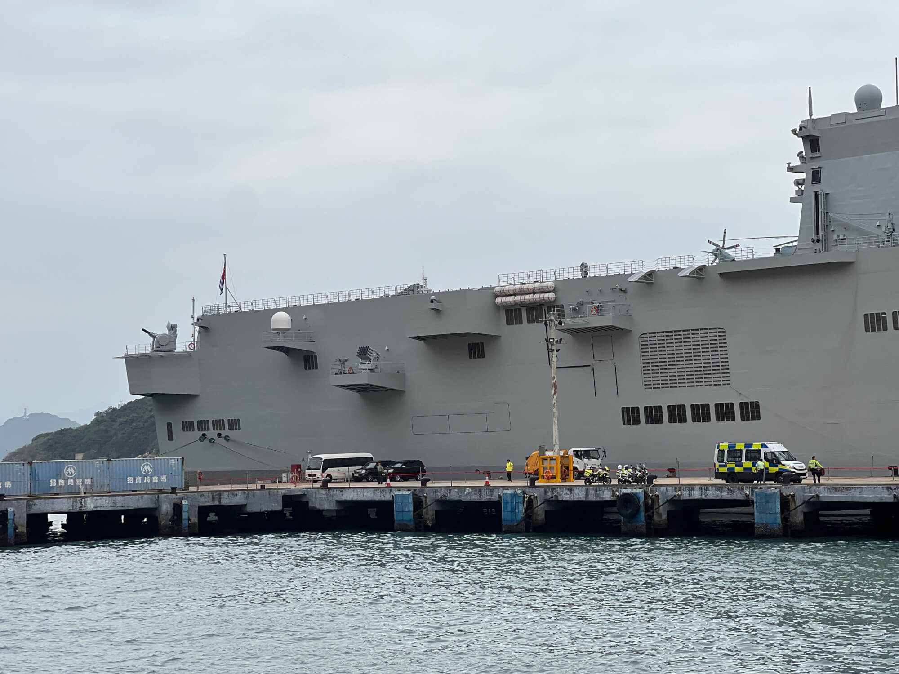
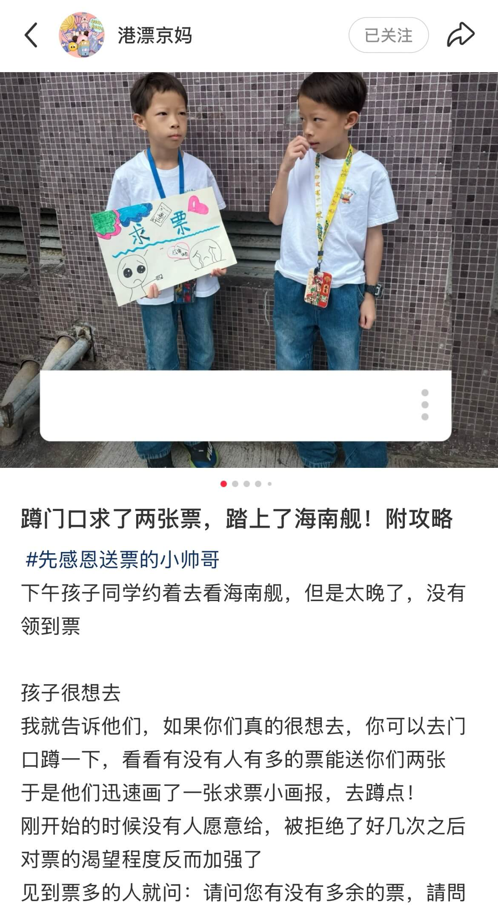
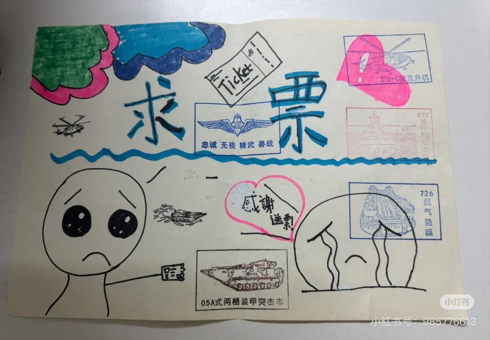
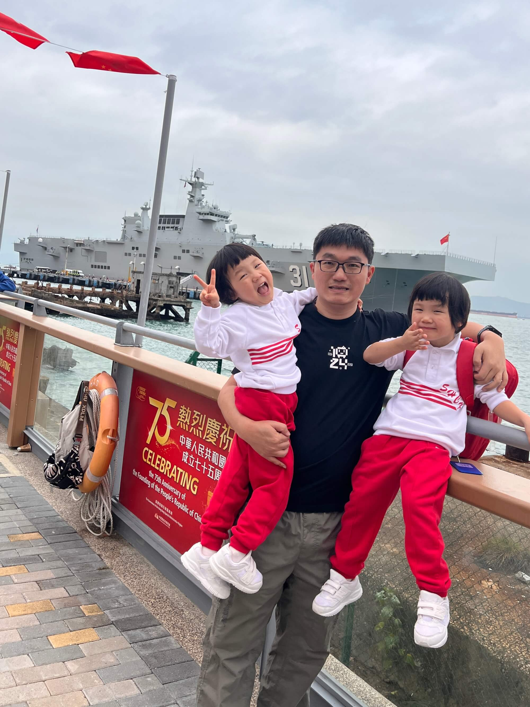

24-11-25 周一 多云

## 前往参观
今天中午，宝宝放学后，我带着她们前往坚尼地城，去看停靠在招商局码头的海南舰。一路上，宝宝满心好奇，不停地问着关于海南舰的各种问题，小脸蛋上洋溢着兴奋与期待。
<!--more-->

当我们抵达坚尼地城新海旁，一眼便望见了雄伟的海南舰静静停靠在水面之上。海南舰是我国自主研制的首型两栖攻击舰，排水量超过 4 万吨，如此庞大的身躯赋予了它强大的作战能力，堪称 “直升机航母”。它不仅能够搭载多架直升机，在海空作战中发挥关键作用，还具备装载气垫艇、坦克、装甲车辆等重型装备的能力，在登岛作战等复杂军事任务中无疑是一把利刃，彰显着我国强大的海军实力与科技水平，真可谓是国之重器，令人由衷地感到自豪与钦佩。

## 现场参观的感受

此次海南舰和长沙舰来香港访问，为期五天的时间里，可谓是全城关注。今天恰好是访问的最后一天，我想着无论如何也要带宝宝来感受一下它的威严，于是在宝宝放学后便匆忙赶来。尽管不能登舰近距离参观，但仅仅是站在岸边眺望，那巨大的舰体、长长的甲板，后排的大炮和火箭炮，就已经让我们深深感受到了它的壮观。宝宝的眼睛里闪烁着惊叹的光芒，嘴里不停地说着 “哇噻”，我知道，这一定会给她们种下对祖国强大军事力量崇敬与热爱的种子，扬我国威的同时，也在下一代心中筑牢了民族自豪感。

说起我自己，从小就是个北洋水师迷，对于那段充满传奇与悲壮的历史有着浓厚的兴趣。前两年更是沉迷于二战太平洋海战，找了很多播客、电影以及电视剧观赏，除了了解了海战的波澜壮阔与残酷壮烈，还关注了科技树的演化，后勤，损管等更多细节。也正因如此，能够在今天现场看到这样一艘现代化的大型战舰，内心的兴奋简直难以言表。这种兴奋不仅仅源于对军舰本身的喜爱，更是对我国海军从曾经的艰难起步到如今走向强大辉煌历程的一种感慨与欣慰。

而香港在这方面也有独特的魅力，也许是统战价值吧，从辽宁号到海南舰，香港都有更多公开参观的机会，此外，除了明确不能用无人机外，在岸边可以自由拍照，没有任何阻碍，人们可以尽情地将海南舰的雄姿定格在画面之中，无论是专业的摄影爱好者还是像我这样只是想留下纪念的普通市民，都能够自由自在地去捕捉那些美好的画面，尽情得感受这自豪的一刻！

## 让我印象深刻的求票故事

这次活动一开始没有公开发售票券，票都是通过内部渠道发放给学校、公务员等系统，所以我原本也没打算能拿到票。后来我在小红书上刷到很多人发帖求票，然而并没有多少回应。接着又有人说票是不记名的，在岸边闲逛时，有人给了他两张，他特别兴奋。再后来得知星期天上午临时加印了许多票在现场派发给市民，这样也能够登舰参观，这真的太令人激动了。

不过最让我动容的是，我在小红书上看到一位博主，带着两个小朋友画了写着 “求票” 的海报，然后在岸边举着海报，逢人便询问。起初遭遇了不少冷遇，大家要么说没有票，要么就是不理会。但小朋友继续向旁人解释，11 岁以下小孩不需要票，如果有多的票可以给他。过了一会儿，真有一位好心的叔叔给了他两张票，他开心极了，随后他妈妈就带着他顺利登舰了。

这个故事给我留下了极为深刻的印象，它让我明白，如果真的非常渴望登舰，办法总是有的。无论是搭车举着带路，还是求票举着海报，都要勇敢尝试，对比两张图，可以看出后来有好几个舰上的印章盖在小朋友的海报上，看起来特别漂亮。世上无难事，只怕有心人！
