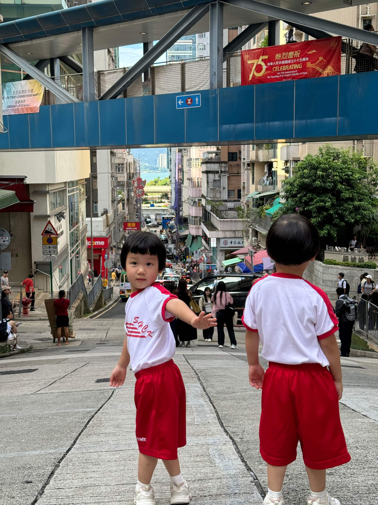

这两天参加了宝宝学校的165周年校庆视频制作比赛，我和宝妈借助AI工具，完成了这个充满挑战与惊喜的创作之旅，以下是经验分享，包含准备过程，原始文案和最终视频。
<!--more-->

## 一、比赛概况与初步规划
此次校庆视频制作比赛，主题为《爱，传承，圣心 165》。学校下发的通知里对作品有着明确要求：必须原创且无版权纠纷，时长限制在两分钟内，格式需是 MP4，像素为 1920×1080，画面横向比例 4:3 或 16:9 均可。完成后的作品要上传至 YouTube 并提交给学校，评选将围绕主题表达清晰度、原创性、创意和风格展开，奖项设有冠亚季军及 10 个优胜奖。

面对这样的比赛要求，我与宝妈进行了讨论，首先是要不要参加，考虑到参与学校活动对孩子成长有着积极意义，我们决定迎接挑战。然后，我和宝妈进行分工，我构思整体的制作方案，计划先借助 AI 强大的信息处理能力获取创意灵感，再结合实际素材进行整合与创作；宝妈则负责整理视频素材，并完成最后的剪辑和上传工作。

## 二、AI 助力创意构思
我选择了微软 Copilot、豆包、Kimi 等具有网络搜索能力的 AI 模型。将比赛要求的 PDF、主题以及学校名称等背景信息告知AI大模型，还提供了周末可以拍摄外景地点（如家周边的公园，西九龙等）的信息，期望AI能为我进行头脑风暴并设计脚本。

然而，AI 生成的结果不尽如人意。虽然它们能快速给出一些方案，但分镜和脚本较为格式化，在拍摄可行性和主题突出性上存在较大缺陷。例如，一些分镜设计过于理想化，难以在实际拍摄中实现，且在体现“爱传承，圣心 165”这一主题时不够深入和独特，未能很好地将学校的历史文化与主题相融合。一言以蔽之就是“主题缺乏灵魂”。

## 三、主题深度挖掘
在 AI 初步创作未达预期后，我决定自己深入挖掘主题。通过查询校史，得知建校于 1860 年，这一年正值《北京条约》签订，割让九龙和昂船洲，是有重大变革的一遍。我觉得这是一个将校史与香港历史紧密结合的绝佳切入点。于是，我以意大利传教士在这一历史背景下创立学校为起点，梳理学校与香港共同经历的转口贸易、金融发展、二战等历程，并巧妙地将“爱”与“传承”的元素贯穿其中。借助 AI 的文案创作能力，依据这些线索生成了一份更有深度的文案。文案中详细阐述了学校如何在香港的历史浪潮中坚守初心，传承教育使命，培养一代又一代学子，见证香港的变迁与发展，使学校的 165 年校庆主题有了更深厚的历史底蕴和文化内涵。

## 四、视频素材的探索与困境
有了文案后，我开始寻找合适的视频素材来匹配。首先尝试了一最近特别热门的几个 AI 视频生成工具，Pika, Runway, Dream-Machine，结果惨不忍睹，一句话概况就是“完全不能用”。这些工具存在诸多问题：生成的视频时长极短，仅五到十秒，且风格多为动画、卡通，与我想要的真实场景素材相差甚远。即使有个别相对接近需求的，其中的香港元素也存在偏差，地标建筑等图像与实际不符，明显是 AI 想象出来的，完全无法满足比赛要求。

随后，我将目光投向剪映。剪映能够依据文案自动搜索素材，这个功能比纯AI靠谱多了。根据的我上传的文案，生成了一段三分钟左右的视频，剪映生成的素材有一定可用性，如出现了校园截图、香港城市风光等。但也存在不少问题，素材中的学校并非宝宝所在学校，且整体时长超出比赛限制。为了符合要求，我不得不对文案进行简化，砍掉了关于《南京条约》《北京条约》等部分历史背景介绍，聚焦于校史与香港成长以及人才培养方面，最终将视频时长压缩至一分五十几秒（要求2分钟以内），这样拿到了一个60分的基础视频。

## 五、文字与语音的适配调整
由于学校位于香港，在文字和语音方面也经历了一番调整。

起初文案使用简体字且剪映采用普通话配音，后来意识到这样不合适，便改为繁体字。但在语言表达习惯上仍有瑕疵，像“生日”与“生辰”这类用词差异，尝试用 AI 修改未果，因为难以精准把握尺度。若润色过度，文案会充满粤语语气词导致理解困难；若润色不足，则仍保留较多普通话表达习惯。

在语音选择上，恰好剪映的“方言”里其提供了“靓女”和“粤语男生”两种粤语语音，“靓女”语音更合适，但需付费，无奈之下我们选用了粤语男生语音，也算勉强完成了语言与语音的适配。

## 六、个性化素材替换与完善
宝妈手机中的 iCloud 存储了大量视频素材，尤其是到香港后宝宝的成长视频，这成为了完善视频的关键资源，我们将剪映生成视频中的香港元素予以保留，其他设计校园生活相关的内容替换为自家孩子读书、郊游的视频。使视频更具个性化和针对性。不过，在进一步精细化处理上，我们考虑到可能存在的版权问题以及精力有限，下载了一些学校官网的照片，但没敢使用。最终完成了基本的视频剪辑工作，导出并上传至 YouTube。

## 七、经验总结与展望
回顾整个视频制作过程，虽然遇到了诸多困难和挑战，但也收获了宝贵的经验。这种借助 AI 生成文案，再利用剪映自动生成视频模版，最后替换个性化素材的方法，具有较高的可行性和效率。它对技术要求不高，无需复杂的剪辑和转场技巧，普通用户也能快速上手。

展望未来，无论是宝宝的生日，还是家庭年终总结等，都可以运用此方法快速制作出具有纪念意义的视频。比如在年终总结时，向 AI 提供每月大事的相关信息，让其生成文案，再通过剪映生成视频，最后将重点内容替换为家庭回忆素材，便能轻松制作出一个六十分甚至八十分的视频。这不仅能记录生活中的美好瞬间，还能为个人回忆增添色彩，让我们在数字化时代更好地珍藏那些珍贵的记忆与情感。！

## 最后分享一下第一版3分钟的文案：

    在 1841 年，香港岛的命运迎来了历史性的转变。英国海军的到来，让这个曾经宁静的渔村，开启了作为自由贸易港口的新篇章。这一年，香港开埠，如同被投入历史长河中的一颗石子，泛起了层层涟漪，从此踏上了一段充满挑战与机遇的旅程。
    
    在开埠初期，香港面临着诸多艰难困苦，疫病横行、淡水供应不足，还要与周边港口激烈竞争。然而，凭借着其优越的地理位置和顽强的生命力，香港逐渐在世界贸易舞台上崭露头角。时间不断推移，香港经历着风雨的洗礼，也在不断成长。1860 年，《北京条约》签订，九龙半岛南部被割让给英国。也正是在这一年，嘉诺撒圣心学校在香港这片土地上诞生。它犹如一盏明灯，在动荡的岁月中，为孩子们点亮了求知与希望的道路。
    
    嘉诺撒圣心学校创立后，秉持着爱与奉献的精神，在香港的历史变迁中坚定地传承着教育的火种。在过去的一个多世纪里，香港经历了战争的硝烟、经济的起伏、社会的变革，但嘉诺撒圣心学校始终坚守着自己的使命。老师们用无私的爱，培育着一代又一代的学生，让他们在知识的海洋中茁壮成长，为香港的发展注入了源源不断的活力。
    
    回首香港历史上的大事，无论是 20 世纪初的经济崛起，还是二战后的迅速工业化，嘉诺撒圣心学校的校友们都积极参与其中。他们有的成为了商业精英，为香港的经济繁荣贡献力量；有的投身于文化艺术领域，为香港的文化传承添砖加瓦；有的则致力于社会公益，用自己的行动诠释着嘉诺撒圣心学校的精神内涵。
    
    在漫长的历史进程中，嘉诺撒圣心学校与香港紧密相连，共同走过了风风雨雨。爱，是学校始终不变的主题，老师们对学生的关爱，学生们对母校的热爱，以及校友们对香港的挚爱，交织成了一幅温暖的画卷。传承，是学校的使命，知识的传承、精神的传承、文化的传承，让嘉诺撒圣心学校的优良传统在岁月的沉淀中愈发熠熠生辉。
    
    时至今日，香港已经成为了一个国际化的大都市，嘉诺撒圣心学校也在不断发展壮大。它依然坚守着爱的教育，传承着百年的精神，为培养更多优秀的人才而努力。在未来的日子里，嘉诺撒圣心学校将继续与香港一同前行，书写更加辉煌的篇章。
