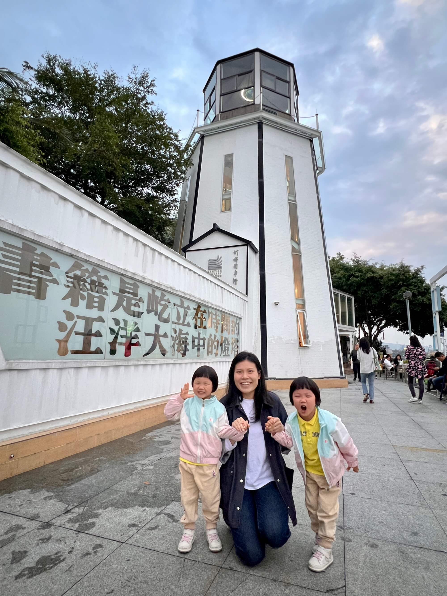
2024-11-23 周六 深圳 阴转雨
周六上午带着宝宝们在香港九龙公园参加了电信反诈嘉年华，[详见这篇](hong_kong_diary_d68/)，下午和宝妈汇合，前往深圳盐田游览。
<!--more-->

## 西九龙高铁站初体验
这是我第一次在西九龙搭乘高铁，整体感觉不错，不过，对于“灵活行”效率方面，我内心仍存些许疑虑。这是我的详细出境流程：
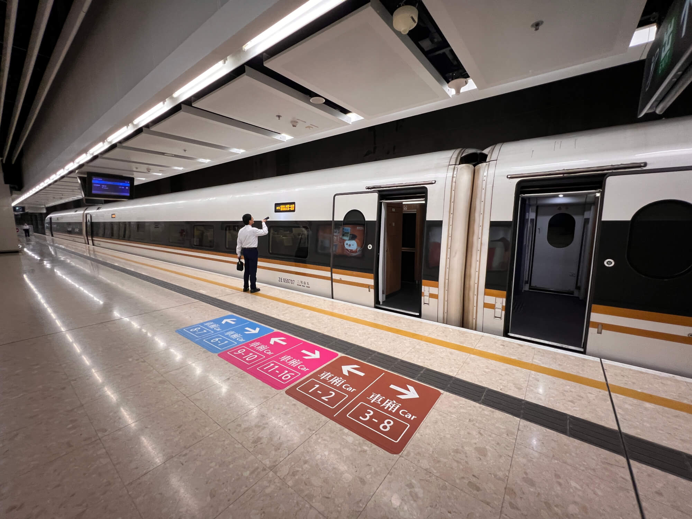

第一步是负一楼入口处查验内地身份证，此环节主要是确认乘客是否持有火车票，操作并不复杂，设有自助与人工通道两种选择。

第二步是安检，无需像乘坐飞机安检那般进行全身扫描，仅需摘帽接受简单检查，并将随身物品放置安检机即可。完成这一步骤后，下一层楼，便进入负二楼出境大厅。

第三步是通过香港海关，这里同样提供自助与人工通道，或许是因为当天出行人数不多的缘故，人工通道仅排了一两人。出去之后有一些免税店可以购物。

第四步接着便是一地两检的大陆海关，顺利过关后，再下一层楼，便能抵达候车大厅。

候车大厅位于地下三层，有很多等车口，月台数量约十几个，整体布局呈现 L 型，和内地的左右对称略有不同。登车开始后，乘客可借助扶梯或升降机下到月台上车，月台大约是地下四层。

## 高铁短途之旅与福田站印象
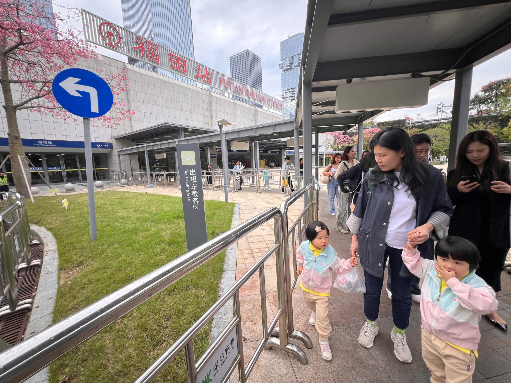
我所乘坐的车次终点是深圳福田，全程仅仅耗时十四分钟。列车行驶方向为倒着开，有趣的是，全程基本处于地下运行状态，仅有短暂的几秒能够见到光亮。很快便到达了福田站，福田站同样是地下车站，月台位于地下二楼，出站则是在地下一楼。站内空间宽敞大气且通透感十足，附近有三条地铁线，然而，从车站走到地铁也挺远的。我们打车去岗厦北开私家车，打车点秩序良好，仅需等待几分钟即可上车。不过，此次行程仅三公里多，司机或许是觉得太近了，脸上略显不快，但驾驶还是很平稳的，最终顺利将我们送达岗厦北。我前往地库取车后，便带着宝宝踏上了前往盐田的路途。

## 高铁“灵活行”思考
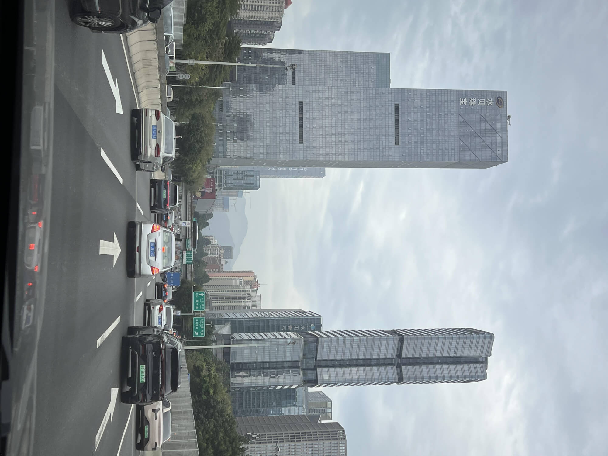

我们是周六下午1:52从西九龙到福田的直达车，二等座，一排 5 个座位，17排，可乘85人，实际车上仅仅坐了 10 人，占据了两人座的前五排，其他全是空着的。我们两大两小，恰好可以坐到边上的三人座，不用抱着小孩了。没想到香港到福田的车乘客这么少，根据我之前的经验，香港直达上海、杭州等长途车次，每天就只有一两趟，车票很紧俏。

港深之间的火车票改签规则与内地存在差异，除了常规的可改签一次之外，还拥有三次“灵活行”改签机会，不过限制条件较多。其一，站点不可变更，只能在深圳北、福田站与香港之间进行改签；其二、也是最受诟病的，就是只能改签港深往返的车次，无法改签诸如香港途径深圳去广州的车次；其三，只能改十五分钟以上的车，实际上过了海关到了进站口，5分钟足矣上车了。

比如我们，在过了海关后于候车之时，十五分钟以内的不能改；十五到三十分钟的有一俩车，也没坐满，但是终点站是广州，也不能改；只能改到半小时后的车次，如此一来，导致候车时间超过半小时，加上进站时间总共花费近一小时，浪费的时间挺多。相比之下，大巴和东铁线的候车时间则短得多，后两者算是随到随走，最多等待一二十分钟，并且在价格方面，高铁到福田票价 57元，大巴 60 元，相差无几。不过大巴小孩需要买票，而高铁小孩不占座则可免费。

我感觉，深港之间，可借鉴日本高铁或台湾台铁的自由席模式，地铁化运营，乘客随到随坐，或者像广深城际那样，车票随便购买、列车随便搭乘，自行寻找座位。如今高铁座位上有小灯可标注区间座位的售票情况，从技术层面而言，已经能够实现类似自由席的功能，只是管理规定较为死板，若能加以优化，提高效率，必然能够吸引更多乘坐大巴或东铁线的乘客选择高铁出行，从而更加凸显高铁跨城出行的独特优势。

## 盐田之行与换证波折之旅
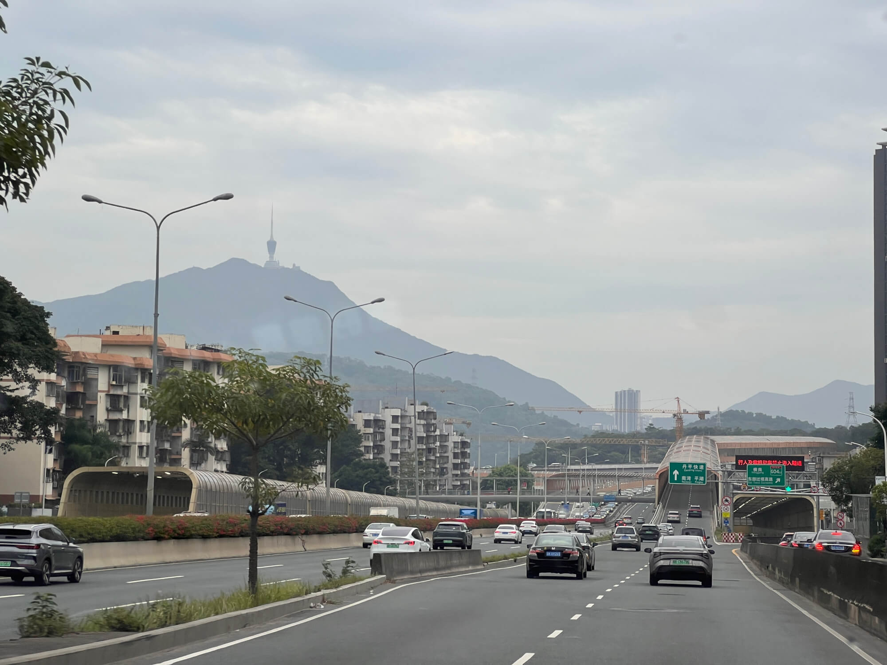

抵达深圳后，我们驱车前往盐田。此前之所以选择盐田，是因为想要更换港澳通行证，周四晚预约时发现深圳仅有盐田和大鹏可约周六，考虑到大鹏距离过远，最终选定了盐田。从福田前往盐田需要翻越梧桐山，有南北两条路线可供选择。南边是贴着深港边境的隧道，北边则有公路、高速及隧道。由于南边滨河大道交通拥堵状况较为严重，我们选择了北边路线。宝妈负责开车，宝宝起初吵闹着要看动画片，然而开车仅仅几分钟后，宝宝便沉沉睡去，甚至还打起了呼噜。深圳车水马龙，道路情况复杂，宝妈即便借助导航行驶，仍稍感吃力，好在驶上高速后，行车状况有所改善。

当我们抵达盐田出入境办理大厅时，傻眼了！之前所做的攻略存在错误信息，我们并不知晓在这里换证需要现场剪旧证，而我们后续还需要使用港澳通行证返回香港，一旦剪证便无法返程，白跑一趟！

后来才了解到，在香港本地可找中旅代办，并且无需收缴证件，价格也合理，来深圳办理的成本不仅更高，而且还要再来取证，极为不便。其次，大老远跑来盐田，到达之后我现场搜索才发现，罗湖和南山的办理点周六下午都能够现场取到当天号，早知道就不用跑这么远了，试错的成本也低点。

原本我们预定的酒店位于福田口岸附近，为了来盐田办事，特意改到了盐田这边的酒店，该酒店规定中午十二点后无法退房。既然事已至此，我们也只好接受，决定今天就在盐田好好感受一番。

## 理发抉择与趣味经历
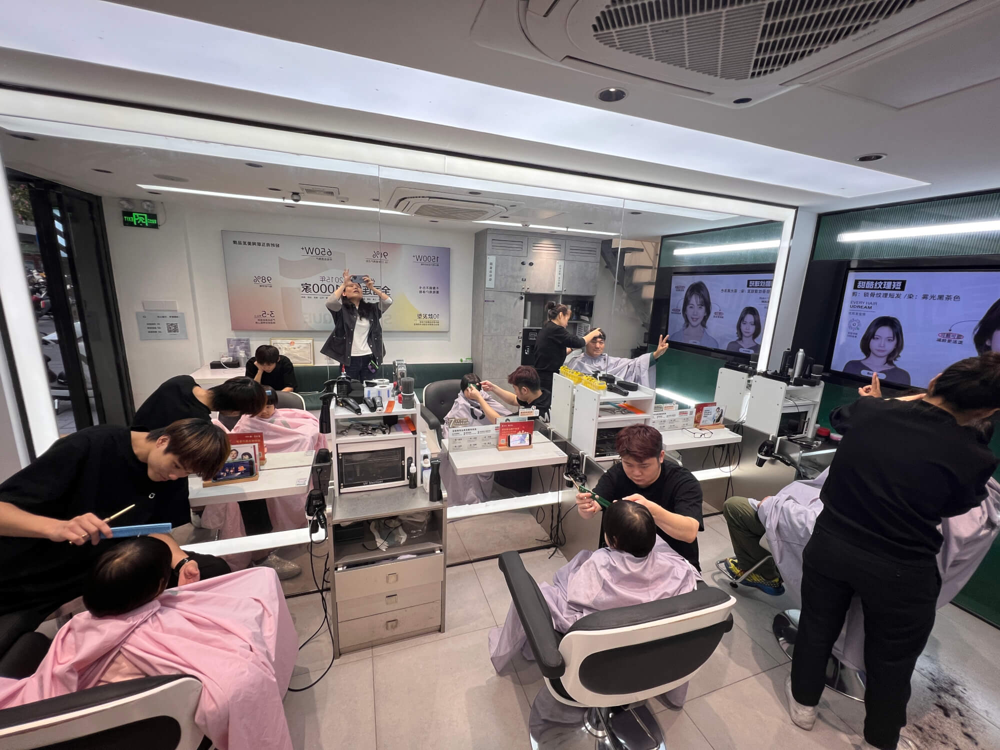
换证未果，我们便开始筹备下一步行动。此次来深圳，除了换证之外，还有几件顺便要做的事情，比如理发，两个宝宝需要修剪刘海，我也想修一下，在香港家楼下的理发店，价格颇为昂贵，男士理发需 250 元，女士高达 380 元，儿童修刘海一次也要 130 元。

我搜了周边的优剪。壹海城里有一家，周边吃喝玩乐设施一应俱全，极为便利，然而排队的人却很多，每个师傅面前都有三四个人在等待，粗略估算需要排近一小时。出入境大厅对面的那家理发店，有两个理发师，前面各有一人排队，大约需等待 15 分钟。附近老小区还有一家店，店内四个师傅都闲着，生意略显冷清。我和宝妈商议，最终选择了这家店。虽说老小区附近停车较为麻烦，但不用排队，便利性更好。
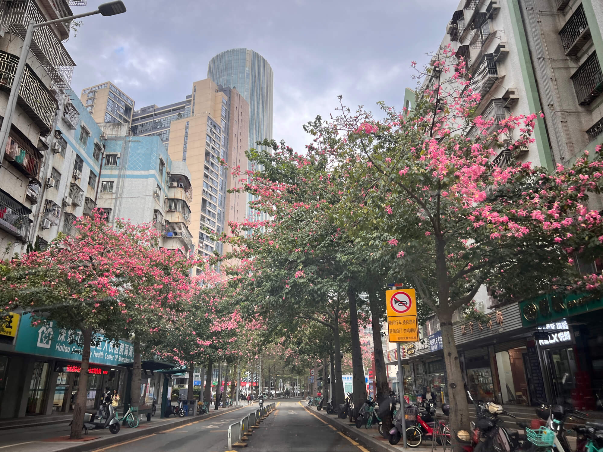
走进店内，发现确实如我们所料，店内空无一人，办理了 VIP 卡后，三人一次就回本了，我选择了洗剪吹，两个宝宝都是儿童剪发。我对发型要求并不高，只是告知理发师简单修剪一下，避免头发翘起来即可。可没想到两个宝宝起初死活不肯理发，闹了好一会儿，好在店内无人排队，不耽误时间。后来我和宝妈分别拿出手机给宝宝播放《拉布拉多警长》动画片，她们才乖乖配合理发。海兔先理好头发，珊瑚则不够配合，稍等了一会儿才完成。一家三口理发总共才花费一百出头，在香港，仅仅是一个小孩理发的价格。

## 酒店入住与周边景观赏览
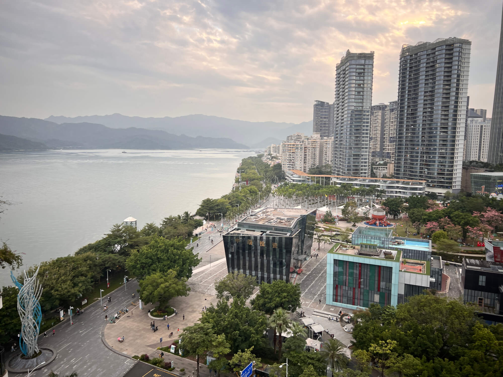
理完发后，我们满心欢喜地开车前往爸妈预定的盐田雅庭海湾大酒店。这家酒店的特色在于所有房间均为海景房，不过因为前方有住宅遮挡部分视线，都是半海景。我们挑选了朝南的房间，朝北是盐田港。

酒店楼下便是盐田中央公园，公园两边新矗立起不少高楼大厦，对面是大型商场壹海城以及成片的住宅，酒店后面还有凯越酒店。原本以为盐田这边放眼望去皆是一望无际的大海，实际这里是个小海湾，对面一公里就是香港的船湾。船湾那边的原生态环境保护得相当出色，与盐田这边的繁华景象形成了鲜明的对比。夜幕降临，盐田这边城市灯火辉煌，而对面船湾却只有星星点点的微弱灯光闪烁。值得一提的是，船湾那边山后有船湾水库，想当年香港水资源匮乏，一方面依靠从深圳运水，另一方面则是在船湾修建水库，以此来保障香港的供水需求。

我们所住的房间无法看到另一侧的海景，不过在酒店顶楼，夜晚能够眺望到规模宏大的盐田港，盐田港灯火通明，各类作业正在有条不紊地进行着。盐田港是深圳东边极为重要的港口，深圳西边则有蛇口港。盐田港在国内出口贸易运输领域发挥着举足轻重的作用，主要是远洋航线，诸如华强北的山寨机、价格低廉的电子配件等众多货物都是从这里运往世界各地，中美贸易有三分之一从盐田港运出。

## 灯塔图书馆漫步游览

办理完酒店入住手续后，时间大约是 5 点多，我们稍作休息便准备下楼去海边逛逛，然后前往对面的壹海城享用晚餐。

我们首先来到了楼下的网红打卡点——灯塔图书馆。灯塔图书馆大约有 4 层，一楼中间摆放着一张大桌子，周边环绕着一圈书籍，二楼设置了许多供读者看书的座椅，三楼和四楼则是备受欢迎的网红座椅。馆内前来打卡拍照的人络绎不绝，而真正安心看书的人却相对较少。我在一楼的自助办证机办理了一张盐田区图书馆的借书卡，借期为 30 天，虽然办证流程十分便捷，但我此次并没有借书的打算，只是带着宝宝前来参观游览。在这里，还能看到有妈妈正在给孩子绘声绘色地讲绘本，这里无疑是一处非常适合亲子休闲的好去处。
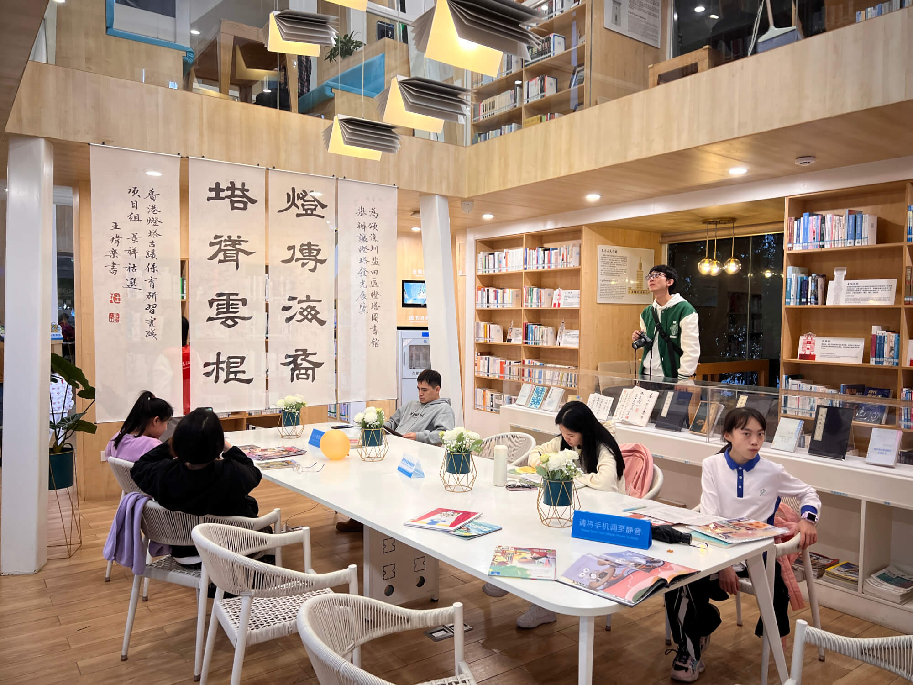

盐田区海边还分布着其他一些造型美观且免费向公众开放的图书馆。灯塔图书馆门口外设有奶茶店、茶座等休闲场所，还有自助明信片机。使用自助明信片机制作一张有声明信片需要花费 12 元，操作方式是先扫描二维码上传照片，还可以录制一分钟以内的语音，收到明信片的人不仅能够看到照片，还可以扫码收听语音。我兴致勃勃地制作了一张寄往南京老家的明信片，不过明信片上的二维码只有在微信生态里才能成功扫描打开，而且语音的音质较为一般。另外稳定性也有待提高，在照片打印过程中，我遇到了网络异常的问题，经过多次重试才得以成功打印。

## 海图遐思
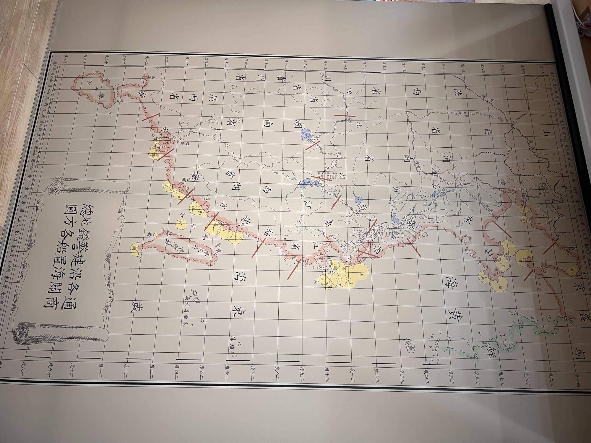

在灯塔图书馆内，我看到了两张海图，感觉十分有趣。其中一张是东南沿海海图，另一张则是新安县（也就是老深圳）地图，从这张老地图上清晰地标注出了香港岛和九龙被割占的痕迹。

看着香港岛在地图上的位置，我不禁心生疑惑，为何当年会选中香港岛呢？它并不在珠江口的主航道之上，西边的大屿山面积更大且更靠近主航道，更西边的澳门位于珠江口主航道并且被葡萄牙更早租用。或许离大陆南端九龙半岛距离较近，而且港口条件更好吧，所以香港岛就这样发展起来了。

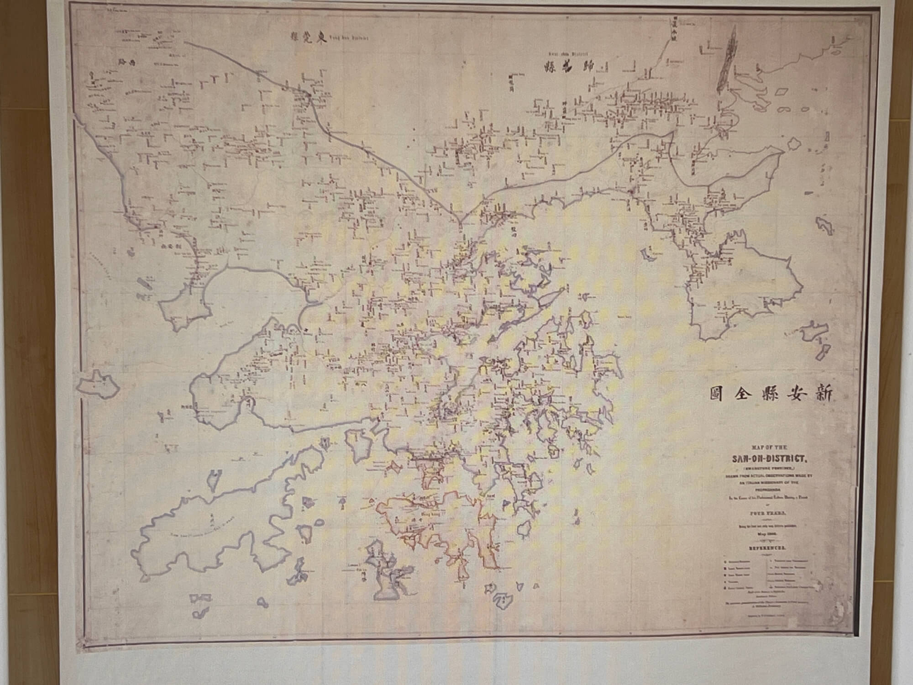

再对比如今深圳和香港的地图，会发现二者都发生了翻天覆地的变化。香港岛、九龙以及昂船洲等区域都进行了填海工程，昂船洲如今已经变成了大型货柜码头，并且与九龙相连。深圳这边，南山区域填海面积最大，区域范围相较于原来扩大了许多，宝中也是通过填海造地形成的，大铲岛都已经与大陆连为一体。深圳的发展方向在很大程度上受到地形的影响，由于东边有梧桐山、北边有山脉阻挡，所以多往西边有平地的宝安方向发展，深圳湾也有一半是填海而成的，而香港靠北区域却基本没有进行填海工程，比如盐田这边深圳填海造了很多新城，香港却依然保持着原生态，没有什么变化。

我不禁感叹，深圳和香港北部的地形虽然存在一定的局限性，但是深圳通过填海工程实现了快速发展，而香港北部却一直未能得到充分发展。香港明明拥有大量可供开发的土地，并且作为特别行政区还具备政策优势，如果能够放低姿态，积极与深圳协同发展，必然会吸引众多人才前来，只是令人不解的是，之前一直没有这样做，现在北部都会区发展也挺缓慢，实在是令人感到惋惜。

## 沿途海景与明斯克号航母往昔
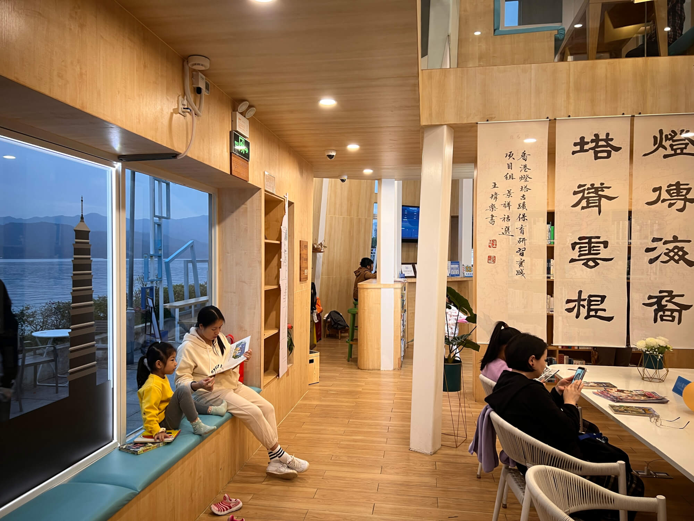
从灯塔图书馆前往壹海城的路上，我们一边漫步一边欣赏沿途的海景，内心感到无比舒畅。途中，我看到一块介绍牌，上面讲述了一段有趣的历史。在 16 年之前，这里曾经停放着明斯克号航母，它是 70 年代苏联海军的一艘航母舰。苏联解体后，俄罗斯由于经济困难，无力承担航母的维护费用，先是将其卖给韩国大宇集团，后来又辗转卖给中国，随后便停放在深圳盐田这边，作为一个旅游景点供游客参观游览。16 年前后因为用地纠纷，航母才不得不移走，后来，这艘航母又被卖给了大连的一家公司，停放在南通苏通大桥下面，在那里停放了 8 年。原本今年它将作为一个景点对外开放，然而令人遗憾的是，在维修过程中突发大火，航母遭受了严重的损毁，基本报废，想要恢复如初已经非常困难，实在是令人扼腕叹息。

这让我想起了一个有趣的段子，有人调侃说南通消防局成为了中国第一个拥有航母损管经验的消防队。以前在阅读二战战史、太平洋战史的时候，我才了解到航母损管的重要性。比如在日美航母对战中，航母受伤后，美国的损管团队能够迅速采取措施，使航母在短时间内修复并恢复战斗力，而日本在这方面则相对薄弱，所以日本航母的损失率、沉没率比美国要高。到了战争后期，日本由于综合国力下降，航母维修能力更是跟不上，导致航母数量越来越少，而美国海军则越战越强。没想到在和平年代的今天，中国的南通消防局却因为明斯克号航母失火而意外地积累了航母损管经验，这听起来确实有些诙谐有趣。
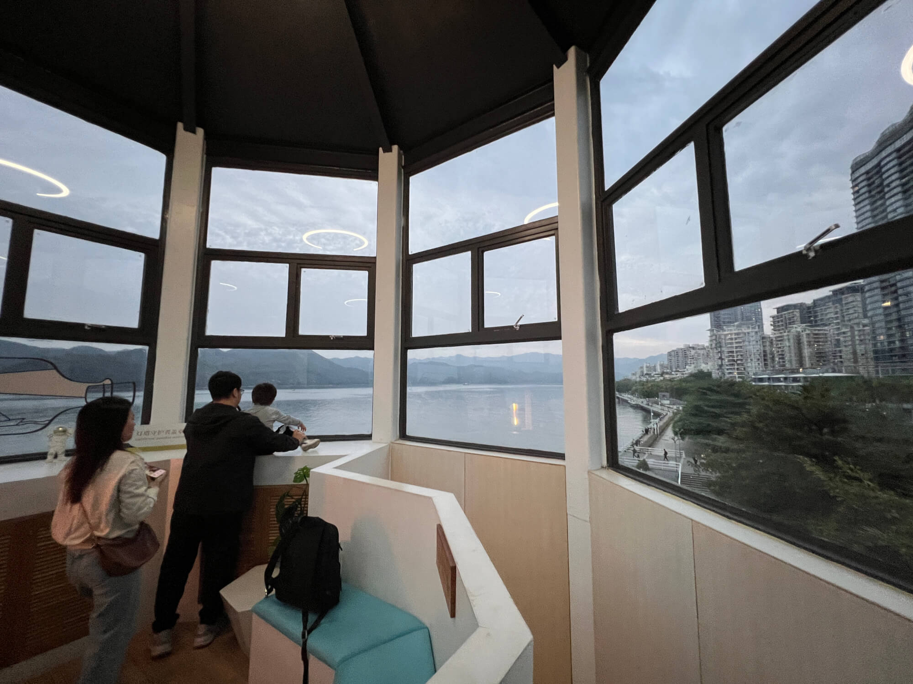

## 壹海城晚餐美好体验
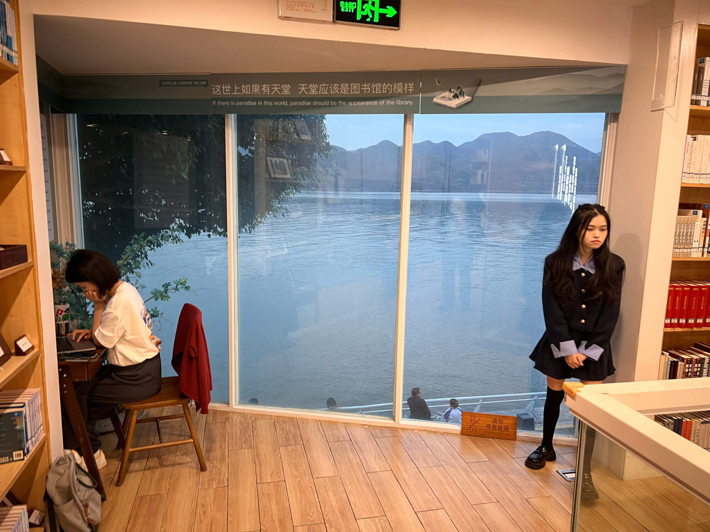
夜晚时分，我们在壹海城寻觅晚餐，宝妈最终选择了椰子鸡，其实我内心更倾向于酸菜鱼，不过还是尊重了妈妈的选择。我们点的虽然是两人套餐，但是分量却极其丰盛，我们四个人竭尽全力也未能将其吃完。

这家椰子鸡店号称一碗鸡汤使用了 4 个椰子，并且没有添加一滴水，味道自然是清甜可口。椰子鸡这道菜虽然使用的是海南的椰子，但似乎是深圳人将其发扬光大的，食材源于海南，却在广东粤菜的推广下声名远扬。喝完椰子汤后，倒入鸡汤，便可将其当作火锅使用，能够涮煮牛肉、菌菇套餐里的各种食材，还有宝妈喜爱的竹荪，竹笋里面包裹着虾肉，口感鲜美。套餐里还搭配了一大份煲仔饭，煲仔饭上面有肉、肠、蘑菇等食材，吃完饭后锅底还会形成一层香脆的锅巴，两个宝宝吃得津津有味。此外，套餐里还有一份辣味的鸭掌小吃。这份套餐价格为 299 元，虽然价格略高，但是考虑到其分量十足，也算是物有所值。

这家店的服务堪称一流，服务员热情周到，不仅帮忙盛饭、加汤，而且各种配套服务都十分到位。店内还提供儿童座椅，并且儿童围兜的种类也十分丰富，先拿的塑料围兜不太合适，后来服务员又贴心地拿来了专门的小熊猫形状儿童围兜。服务员始终面带微笑，态度热情主动，这种服务态度在香港是很难见到的。从香港来到这里，真有一种受宠若惊的感觉，相比之下，香港的服务业实在是差强人意，其白脸文化让年轻人自己毁掉了自身的就业优势，实在是让人感到无奈。

## 饭后活动
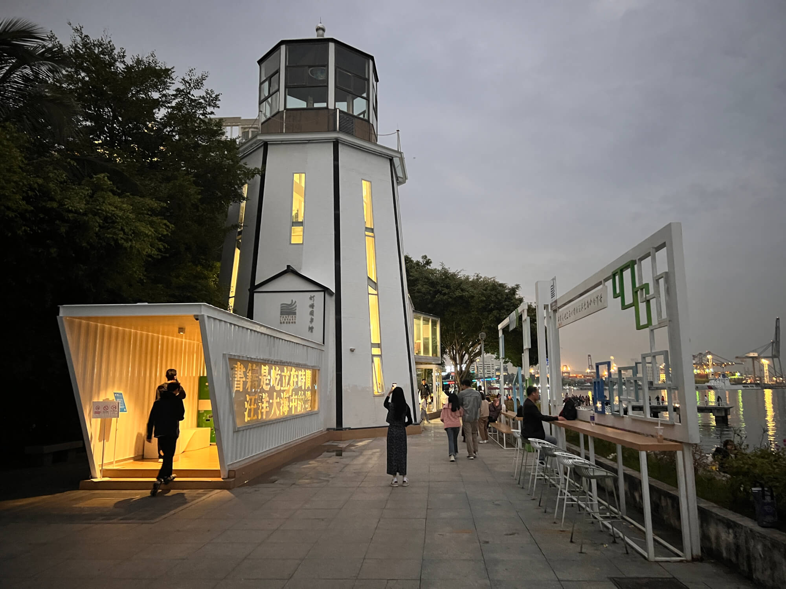
用餐完毕，宝妈意犹未尽，又兴致勃勃地点了一份喜茶。壹海城这边诸如霸王茶姬、瑞幸等热门品牌应有尽有。商场内人来人往，熙熙攘攘，人流量颇为可观，呈现出一片热闹非凡的景象。爸妈趁着这股热闹劲儿，在巴拉巴拉童装店精心为宝宝挑选了几件衣服。考虑到宝宝在香港穿着的夏季睡衣略显单薄，此次选购的是厚一些且加绒的冬装，款式新颖，材质柔软，保暖性能极佳，相信宝宝穿上后定会舒适又暖和。

我则独自前往西西弗图书馆，看了0 - 3 岁以及 3 - 6 岁书架上陈列的书籍种类，以便为日后在网上买书确定精准的方向。一番浏览下来，我发现三岁左右小孩的书籍大多以画画、动手类为主，这类书籍色彩鲜艳、内容丰富，能够极大地激发孩子们的创造力与动手能力，让他们在阅读与玩耍中收获知识与快乐。

随后，我们在商场一楼体验了趣味十足的小火车。小火车的票价为每人 30 元，家长可以陪同乘坐，十分人性化。玩法主要包含两个部分。其一，小火车会在商场一楼缓缓绕行一圈，全程大概耗时 8 分钟；其二，每排座位前还配备了射击游戏，乘客能够通过操作装置射击前面屏幕上出现的各种形态各异的怪兽。宝宝今日可谓是过足了瘾，将平日里在家中被宝宝们哄说的那些怪兽逐一消灭，兴奋之情溢于言表！

## 酒店 19 楼探秘
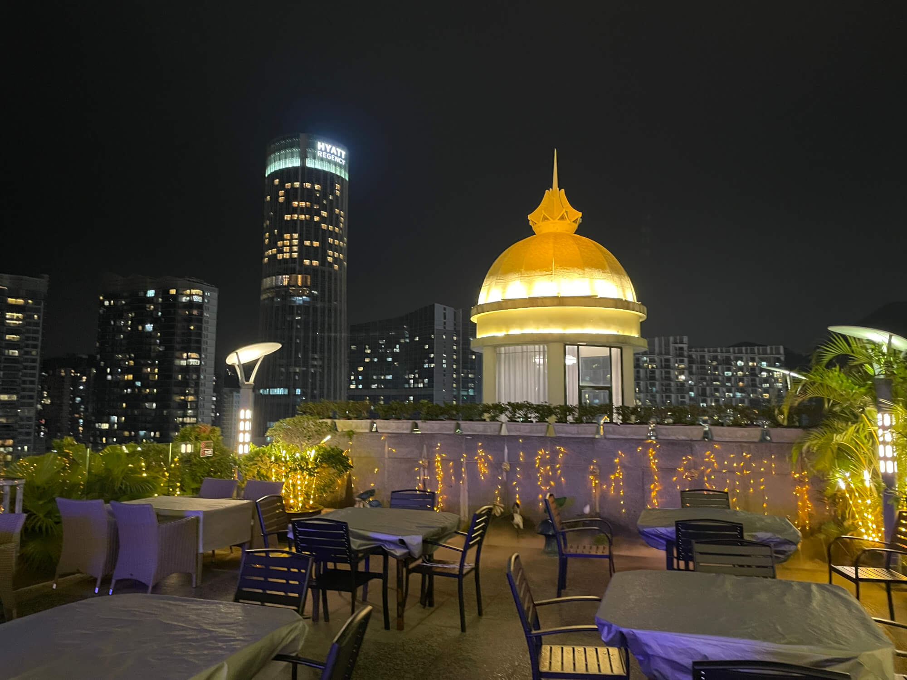
回到酒店，在电梯里我留意到一则醒目的提示，上面写着欢迎宾客前往 5 楼的健身房和 19 楼顶楼的音乐餐吧。这一信息瞬间点燃了我的好奇心，内心涌起一股强烈的探索欲望，迫切想要一探究竟。起初，宝妈对此提议兴致不高，，然而，在我的软磨硬泡之下，最终还是一同随着我踏上了前往 19 楼的探秘之旅。

当我们踏入 19 楼的音乐餐吧时，瞬间被眼前的景象所吸引。这里打造得美轮美奂，堪称酒店的一颗璀璨明珠。它位于酒店的顶楼露台，视野极为开阔。中间是一个宽敞明亮的大厅，这里是宾客用餐的主要场所。大厅四周环绕着高高的落地窗，站在窗前向外望去，那无垠的海景尽收眼底，波澜壮阔的大海在月光的映照下闪烁着迷人的银光，海风轻轻拂过，海浪拍打着岸边，发出悦耳的声响，构成了一幅如诗如画的美景。两边则是别具风情的露天小酒吧形式的区域，在这里，宾客可以一边品尝美食美酒，一边尽情享受着清新的海风与迷人的夜色。不仅如此，从这里还能够远眺船湾、沙田湾的壮丽海景，远处的山峦在夜色中若隐若现，与大海相互交融，相得益彰。餐吧内布置了许多精致的摇摇椅等装饰品，为整个空间增添了一份闲适与惬意。尽管当晚天空飘起了小雨，使得这里略显冷清，没有太多的宾客，但这丝毫没有影响到它独特的魅力。

在餐吧的另外一侧，错落分布着几个风格各异的餐厅。其中有摆放着吃正餐的圆桌的大厅，适合家庭聚餐或大型宴请；中间还巧妙地设置了适合朋友小聚餐的四人间餐厅，环境优雅，氛围温馨。餐厅外面装饰着会变色的月亮形状小灯等独具匠心的装饰品，在夜色中闪烁着柔和的光芒，与周围的海景相互映衬，美到极致。宝宝们一看到这迷人的景色，顿时兴奋不已，迫不及待地想要站上去拍照留念，他们在这片充满趣味的空间里嬉笑玩耍，玩得不亦乐乎。
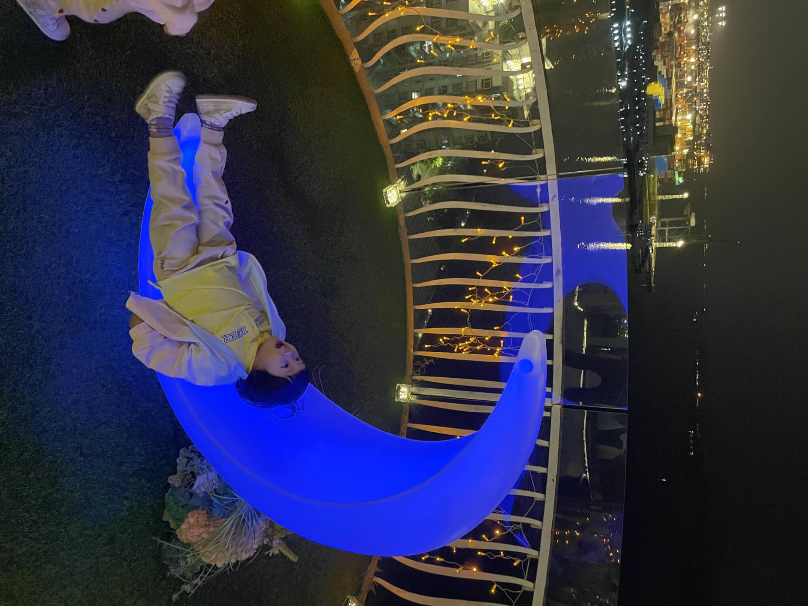

此情此景，不禁让我回想起曾经和宝妈在越南芽庄旅行时的美好经历。那时，我们也曾一同前往酒店顶楼酒吧，在那里尽情地吃吃喝喝、悠闲地逛逛玩玩，同时欣赏着迷人的海景。那是一段无比放松惬意的时光，令人难以忘怀。今晚虽然天空飘着小雨，这酒吧没有往日的热闹喧嚣，但却更显宁静祥和，也正因如此，反而更加适合宝宝们自由自在地玩耍。工作人员看到可爱的双胞胎宝宝，也被他们的萌态所吸引，过来与我们愉快地聊上几句。不得不说，双胞胎宝宝确实拥有一种独特的魅力，无论走到哪里，都仿佛自带光环。今天一天的行程中，就有好几处因为双胞胎宝宝而受到了特别的关注。甚至还有人打趣说，如果以后再有双胞胎宝宝，不妨取名叫永发永达，寓意着永远发达，这一番调侃让大家都忍俊不禁，哈哈大笑起来。

## 回房后的状况
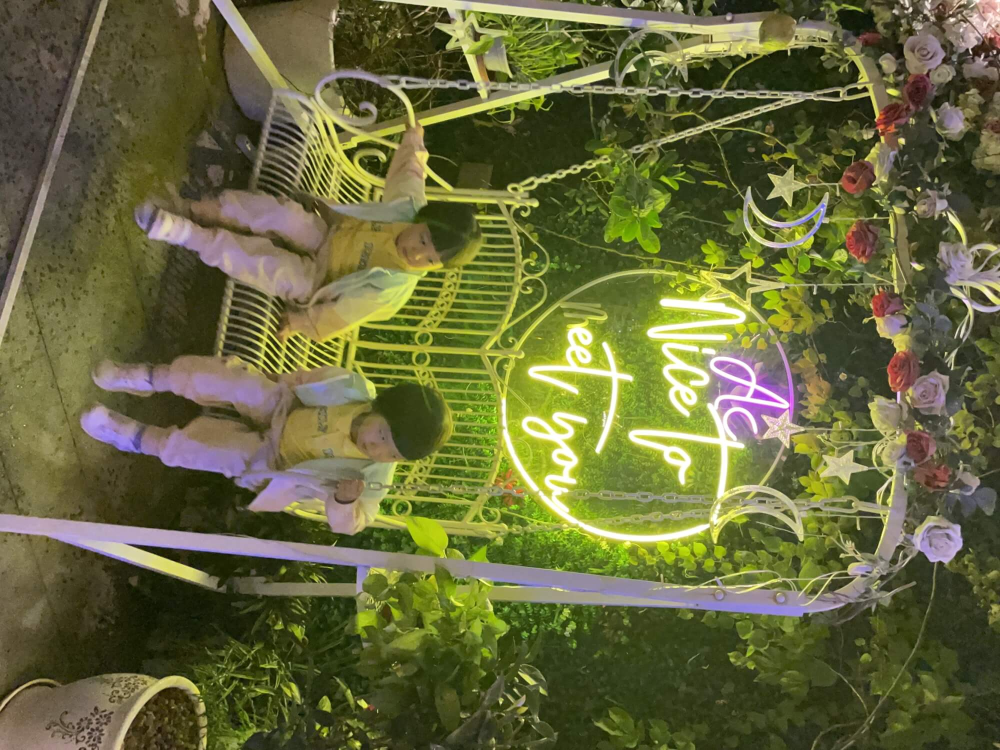

结束了在 19 楼的欢乐时光，我们回到房间。或许是一天的奔波劳累让我疲惫不堪，一回到房间，我便感觉全身的力气仿佛被瞬间抽干，一头倒在床上，很快便进入了梦乡。然而，宝宝们却仿佛丝毫没有倦意，依旧精力充沛，兴奋得在床上又蹦又跳，嘴里还欢快地唱着《音乐之声》里的一些经典歌曲。宝妈也被宝宝们的热情所感染，跟着一起哼唱起来。宝妈的歌声悠扬动听，相比之下，宝宝们的歌声虽然略显稚嫩，但却充满了童真童趣。我在半梦半醒之间，听到他们唱歌，有些英文单词发音不太准确，比如“together”这个单词，宝宝们的发音让我一时有些迷糊，需要仔细分辨才能明白意思。其实，宝宝们的英语口音以及不少汉字发音都还有待进一步纠正和提升。之前英文老师也曾专门提及，宝宝们在发音方面存在一些问题，希望我在家能够多多给予帮助和指导，让他们能够逐渐掌握正确的发音方法。

## 午夜阳台时光
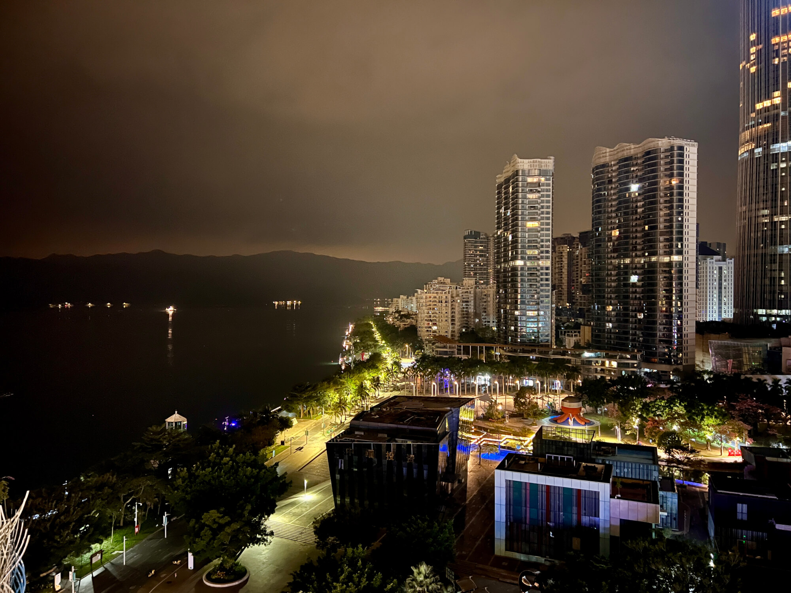

我在这一片欢声笑语中渐渐沉入梦乡，对于之后宝宝们的具体活动，我全然不知。这一觉睡得格外香甜，直到快 12 点时，我才突然醒来，上完厕所后，却发现自己毫无睡意。我本想躺在床上玩手机打发时间，可又担心会影响到宝宝们的休息。毕竟，为了让宝宝们能够睡得更加舒适宽敞，我们将房间里的两张一米五的床并成了三米的大通铺，我和宝妈分别睡在两头，宝宝们则安稳地睡在中间。

犹豫再三，我最终决定起身前往房间外带有海景的阳台。来到阳台，我发现外面热闹非凡，与房间内的宁静形成了鲜明的对比。隔壁房间的客人似乎正在阳台上尽情享受着这午夜的时光，他们或是大声地吹牛聊天，或是欢快地唱歌，还有人在悠闲地抽烟，各种声音交织在一起。楼下也是一片喧嚣，有刚刚结束游玩返回酒店的住客，有在海边悠然闲逛的路人，还有在附近喝酒吃夜宵的人们，他们的欢声笑语、呼喊叫嚷声此起彼伏，不绝于耳。不过，值得庆幸的是，房间的隔音效果相当不错，尽管外面如此吵闹，但房间内却依然保持着安静，丝毫不会影响到宝宝的睡眠。

我站在阳台上，一边玩着手机，一边欣赏着周围的夜景，内心感到无比放松。在香港居住时，房子空间狭小，没有阳台这样的休闲空间，因此，我已经好久没有感受过阳台所带来的舒适与惬意了。眼前的这个阳台虽然面积不大，但却仿佛是一个与家中其他空间截然不同的私人小天地。它是开放式的设计，只有半截玻璃栏杆环绕，站在这里，海风轻轻拂过脸颊，带来丝丝凉意，让人感觉格外清爽。我可以暂时将家庭生活中的琐事抛诸脑后，尽情地放松自己的身心，享受这难得的休闲时光。俯瞰下方，那迷人的海景、蜿蜒的海岸以及绿意盎然的中央公园尽收眼底，这美丽的景象让我陶醉其中，所有的烦恼与疲惫都在这一刻烟消云散，内心只留下一片宁静与祥和。

## 盐田印象
此前我从未涉足盐田，以往大多是在福田和南山一带活动。此次来到盐田，通过亲身体验与细致观察，我对这里有了初步的印象与认识。

盐田最重要的行业肯定是港口物流，不容易淤积的深水港创造了有利的航运条件。不过陆地上的区位条件相对而言略显逊色，这主要是因为盐田背后紧靠着鹏城第一峰——900多米的梧桐山，它却使得盐田的腹地极为狭小。即便通过填海工程来拓展空间，其可利用的发展空间仍然十分有限。

正是由于腹地不足这一先天劣势，盐田在地理区位上逐渐远离了深圳发展的主航道。就科技创新等前沿领域的发展而言，往西或许是更为合适的方向，毕竟西部区域在科创资源、产业基础以及人才集聚等方面都具有明显的优势，年轻人口也大多倾向于往那边流动，寻求更多的发展机会。

不过，盐田也拥有自身独特的资源与优势，那就是其美丽的海边风光。盐田的海边非常适合开展旅游活动，尤其是在周末，人们可以远离城市的喧嚣，来到这里尽情享受郊游的乐趣。再往西的大梅沙、大鹏等地更是山清水秀，景色迷人，是绝佳的旅游胜地。
