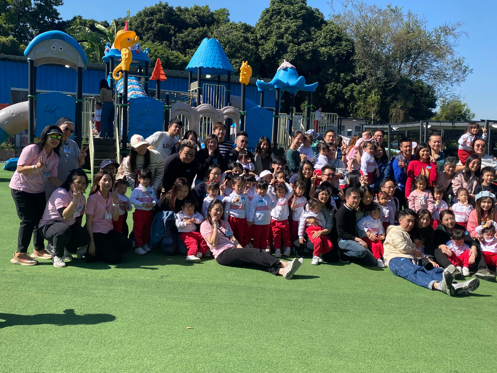
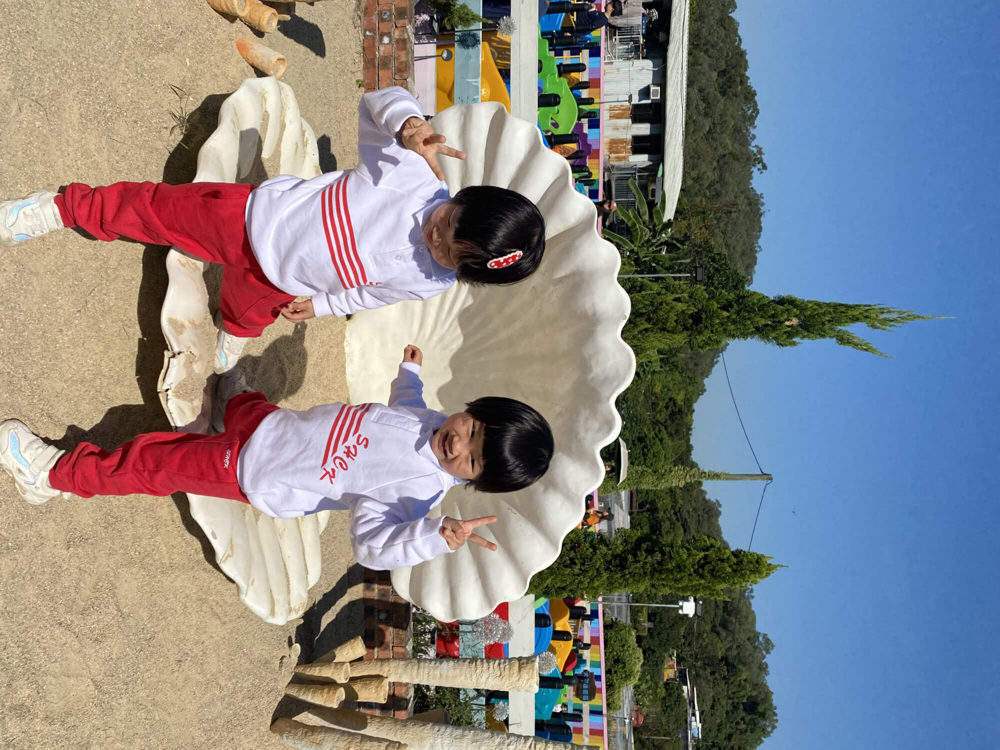
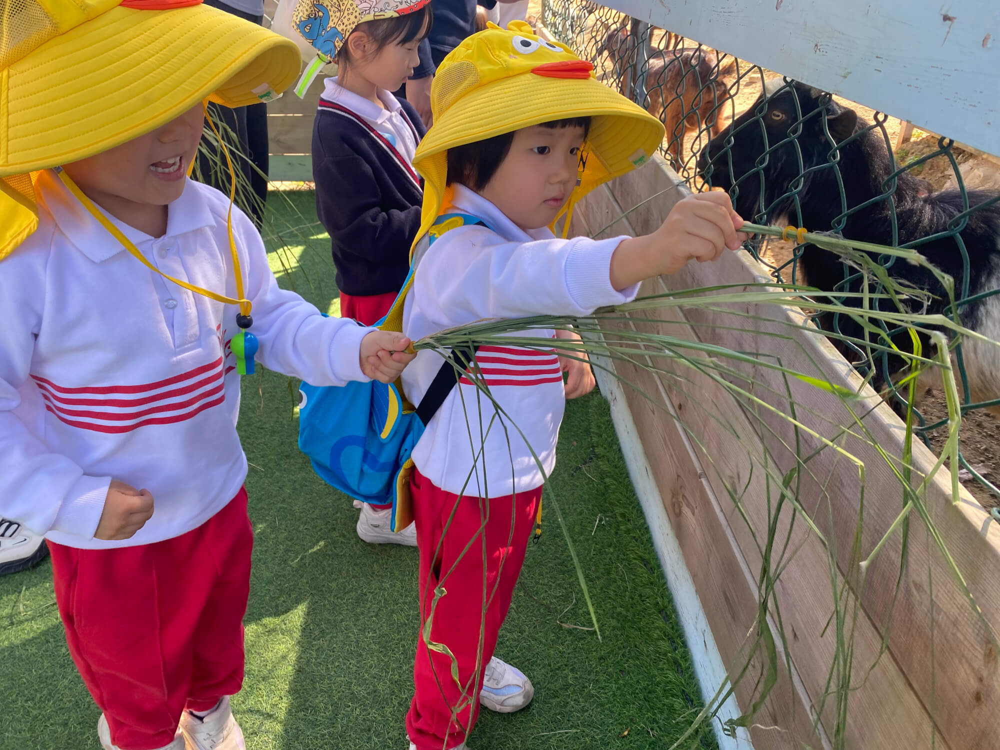
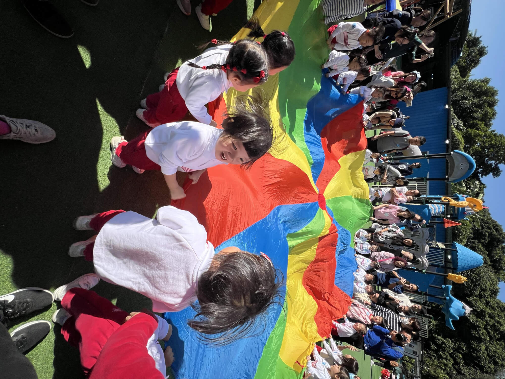
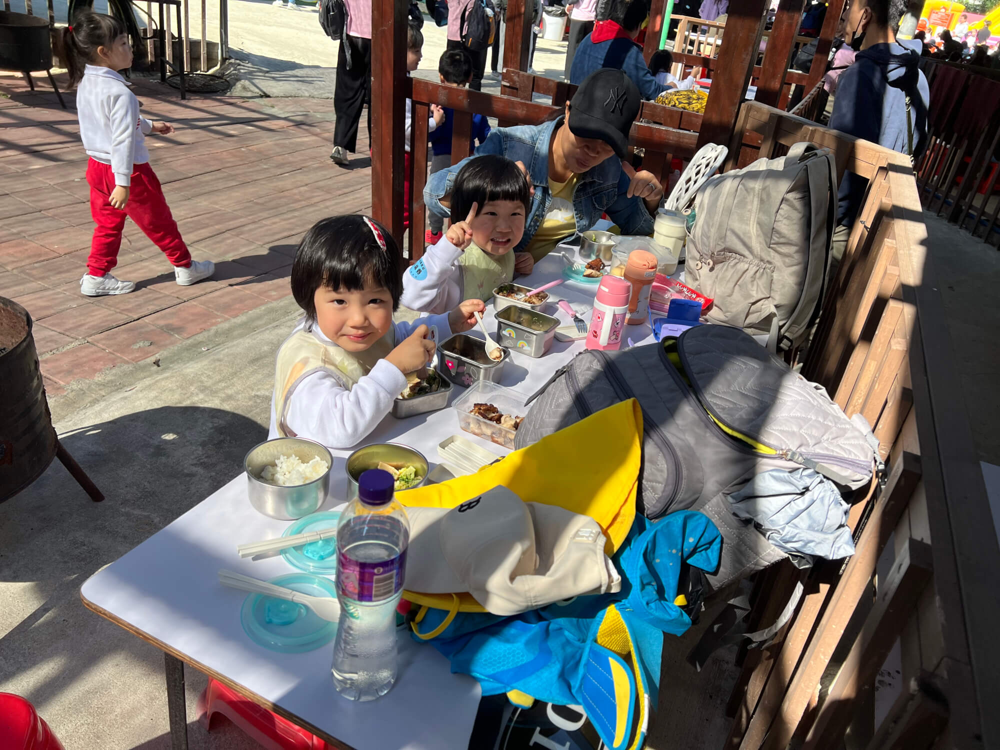
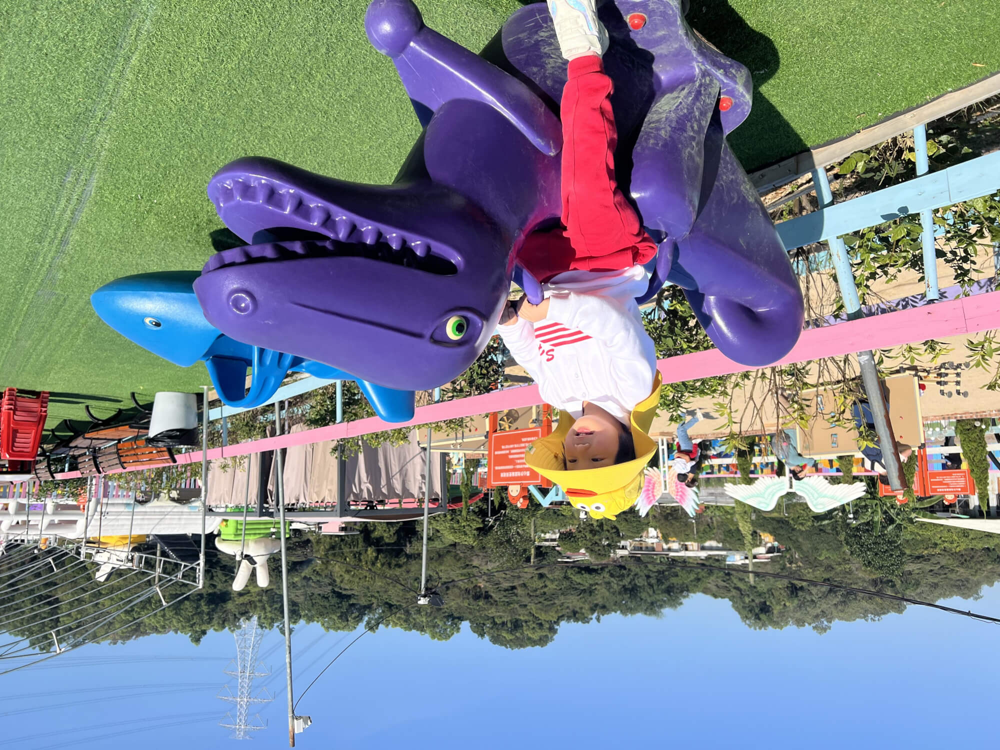
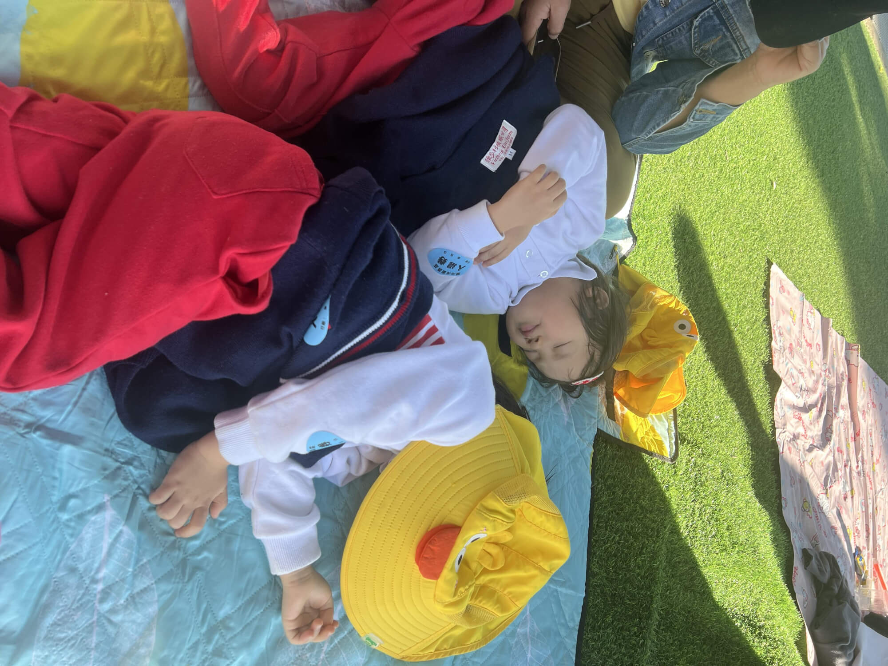
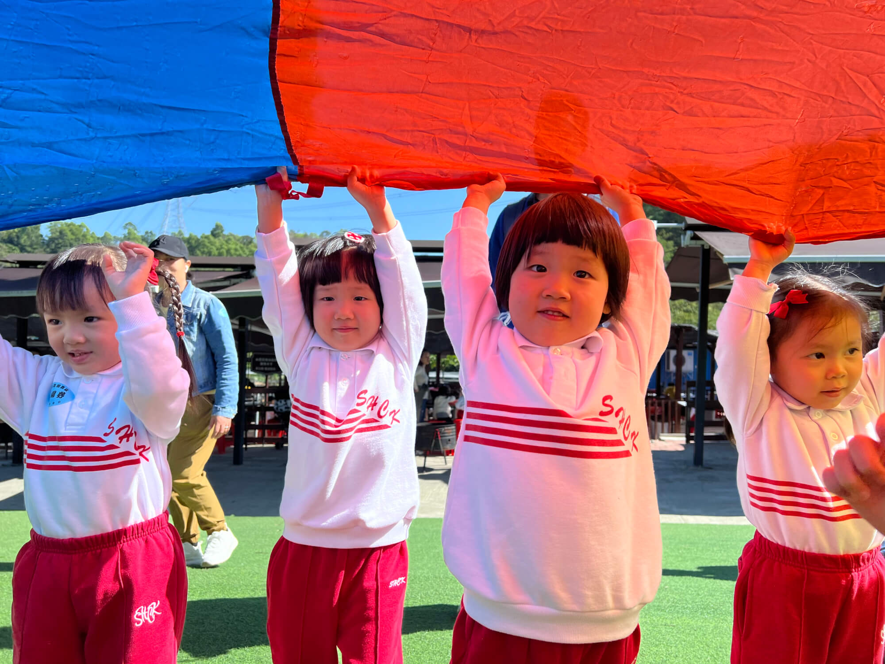

2024-11-30 周六 香港 晴

# 一、出发准备与行程
学校的秋游活动于元朗的开心农场庄园盛大举行，全校师生共同参与。周六上午 9 点半，我们准时抵达中环 3 号码头，现场人头攒动，众多身着圣心幼儿园校服的小朋友们映入眼帘。大家依据各自车票上的车号，在手持对应车号小旗子的导游引领下，配合班主任点名后依次有序上车。经过约一小时的车程，顺利抵达元朗的开心乐园农庄。
<!--more-->

# 二、农庄初印象

农庄内田园风光与童趣设施相得益彰。既有广袤的农田，草莓、西红柿等蔬果在田间茁壮成长，又有小羊、小兔子、小猫等可爱的小动物自在生活。此外，还配备了沙池等儿童游乐场地以及各类大型玩具，瞬间吸引了孩子们的目光。

# 三、参观与互动
入园后，导游热情地带领我们参观农田与小动物。到了自由活动时间，孩子们兴奋地奔向小羊。喂小羊时，海兔勇敢地冲在前面，珊瑚则略显羞涩，躲在后面一根根地喂。看着小羊欢快地吃草，孩子们脸上洋溢着纯真的笑容。

# 四、集体欢乐时光
随后迎来集体活动，老师组织本班小朋友开展趣味小游戏。一面巨大的彩虹旗成为游戏主角，小朋友们拉着旗边，或搭成帐篷模样，或欢快地在其中穿梭奔跑，还有家长参与其中的捉迷藏游戏，现场欢声笑语不断。游戏结束后，大家一同拍摄集体照，用镜头定格这美好的瞬间。

# 五、午餐与午后时光
午餐时间，学校虽有订餐，但我们自备了菲佣精心烹制的午餐，有香嫩的鸡排、营养丰富的西兰花炒蘑菇。孩子们使用便携饭盒，自主愉快地用餐。饭后，天气晴好，孩子们迫不及待地奔向滑梯、沙池等游乐区域，尽情享受午后的欢乐时光。 

# 六、畅玩游乐设施
孩子们迫不及待地开启玩耍模式，大型滑滑梯处，他们自觉排队，依次欢快滑下。接着奔向沙池，脱鞋脱袜尽情嬉戏，沙池里的滑梯也成了他们的最爱，反复玩耍乐此不疲。玩兴正浓时，海兔突感内急，途中又被摇摇马、旋转小船吸引，与小伙伴们开心畅玩。

# 七、午后小憩
一番玩乐后稍感疲惫，妈妈贴心地铺开地垫，两个小朋友依偎在树下甜甜睡去。此时部分大些的小朋友要去参加学校的游园会，因我校建校 165 周年而举办。考虑到自家孩子尚小，精力有限，我们仅报名了春游活动。大半小朋友先行登车返校，我们则继续享受这宁静的午睡时光。

# 八、活动尾声
大约三点，小朋友们悠悠转醒，此时农场人数渐少。不久，工作人员前来通知圣心幼儿园的活动时间即将结束，请大家到门口排队准备返程。我们迅速收拾物品，前往门口候车。

等待大巴期间，小朋友们嚷着要吃零食，妈妈借此教导他们分享的快乐，孩子们纷纷将零食与前后小伙伴共享。 随后乘坐大巴回到中环，再转乘地铁平安回家，为这次愉快的春游画上圆满句号。 

