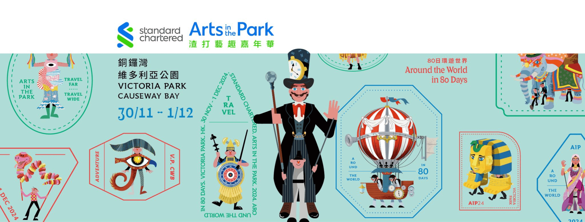
2024-12-01 周日 香港 晴

## 渣打艺趣嘉年华之旅
今天带着珊瑚和海兔两个宝贝去铜锣湾的维多利亚公园，参加渣打艺趣嘉年华，这是香港最具标志性的大型户外青年艺术活动，每年都花样翻新，今年的主题是“80 天环游地球”，有歌舞表演，有摊点，还有花车巡游，光听着就叫人满心期待。
<!--more-->
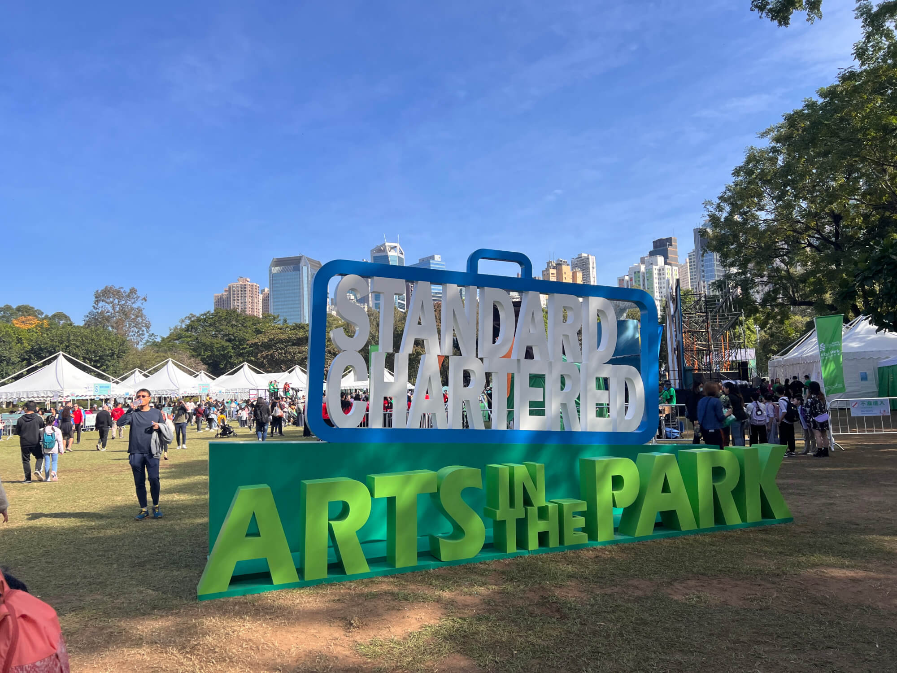

## 园内多彩初体验
一进公园大草坪，目光瞬间就被中央舞台吸引，身着绚丽服饰的演员载歌载舞，欢快的氛围扑面而来，仿若瞬间穿越到世界各地的欢庆现场。
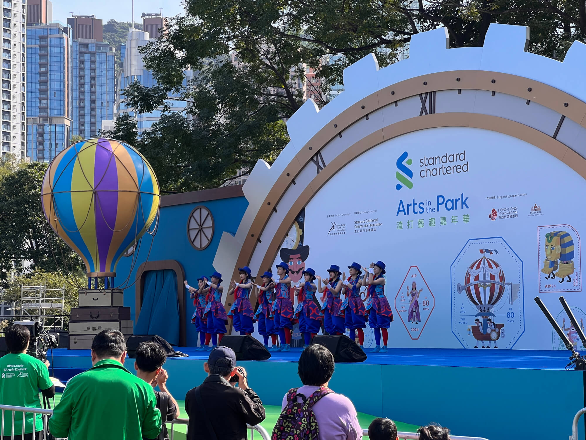

## 制作手工挂件
十点多的时候，游客还不算多，我们瞅准时机，奔向一个不用排队的手工摊位。
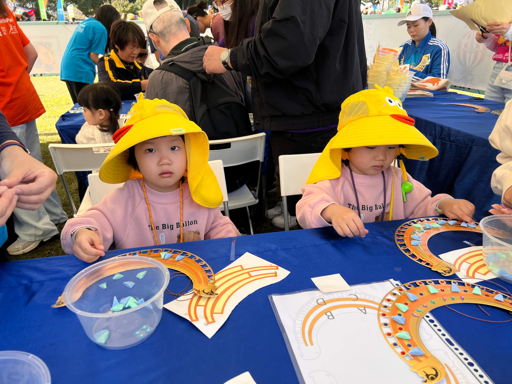

宝贝们要亲手制作挂脖挂件，风格带着浓郁的非洲风情，能随心贴上亮晶晶的装饰品、俏皮的贴画，海兔和珊瑚玩得不亦乐乎，小脸蛋上满是认真与喜悦。
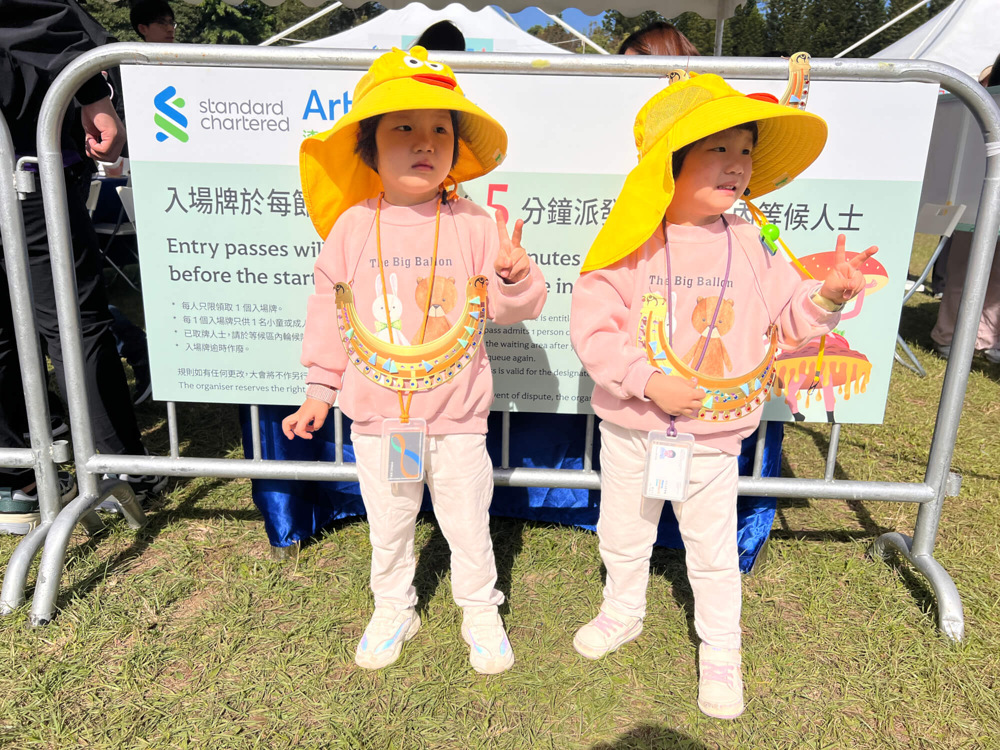

## 趣味彩绘时光

接着来到彩绘区域，队伍不长，十来分钟就排到了。彩绘图纸上足有十几种图案可选，海兔起初相中最复杂的脸上画老虎的复杂样式，珊瑚则挑中手上绘大鲨鱼、鲨鱼嘴在虎口位置，可以自由张开的设计。
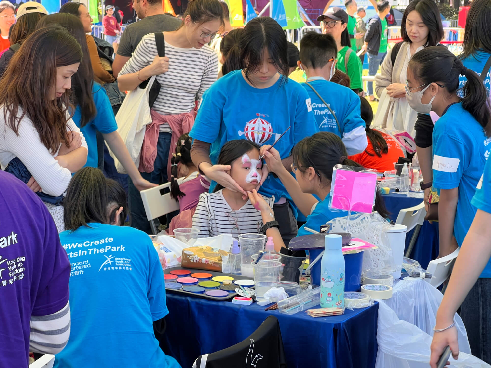

谁料，正要下笔，工作人员提醒海兔头发太长，会影响绘制，偏巧我们没带发夹，无奈只能调整。海兔改选手上画朵花，工作人员拿出网格窗花塑料纸，彩色印料往上一抹，眨眼间，一朵娇艳小花就在手上“盛开”，几分钟搞定。珊瑚那边的大鲨鱼是现场精心描绘，步骤虽多些，但也没费太多功夫，同样迅速完工。看着彩绘成果，宝贝们笑得眼睛眯成缝，成就感满满。
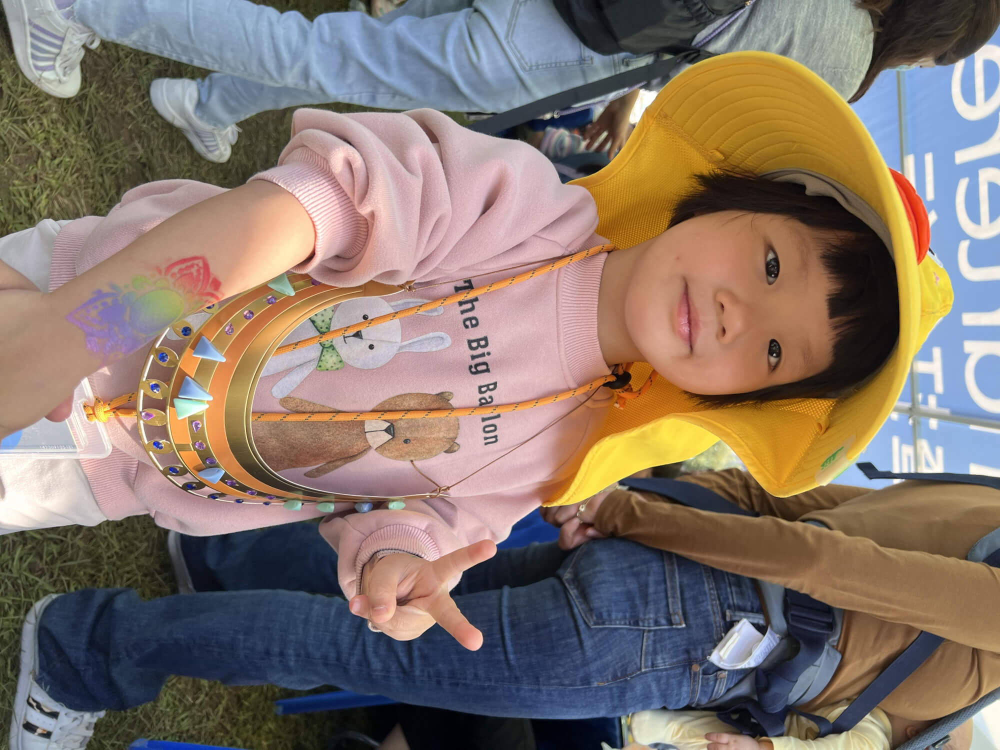

## 气球奇遇挑战
随后我们在外圈逛看了几个展览，然后气球摊点牢牢抓住宝贝们的目光，嚷着非玩不可。虽说牌子上明晃晃写着排队一小时，可拗不过他俩的执着劲儿。好在只排了半个多小时就进场。
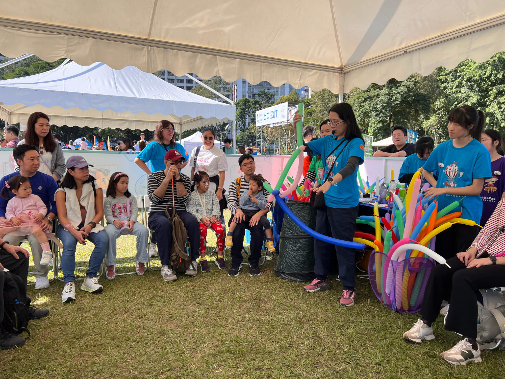
工作人员先细致讲解，随后给每人发 3 个长气球，教大家两两对折、扎成六面体三角锥模样，控制底部的三角形和头围大小一致，秒变创意气球帽。我帮珊瑚制作，工作人员帮海兔，齐心协力下，专属气球帽新鲜出炉。海兔、珊瑚戴上就舍不得摘下，蹦蹦跳跳，欢喜得不行。
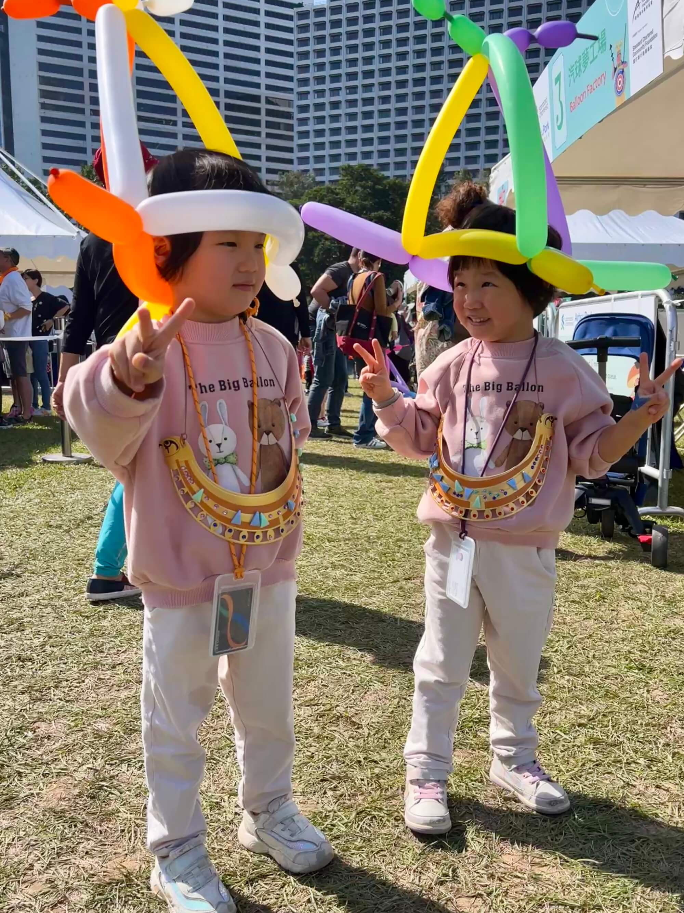

## 午后悠闲时光
等从气球摊出来，已临近 12 点，正是饭点。本想再排个热门项目，一看乌泱泱的长队，果断放弃，转去填调查表领小礼品。中央舞台依旧热闹非凡，我们边看节目边歇脚，吃点小饼干、喝点水垫肚子，还跟舞台旁的舞者美美合了影。
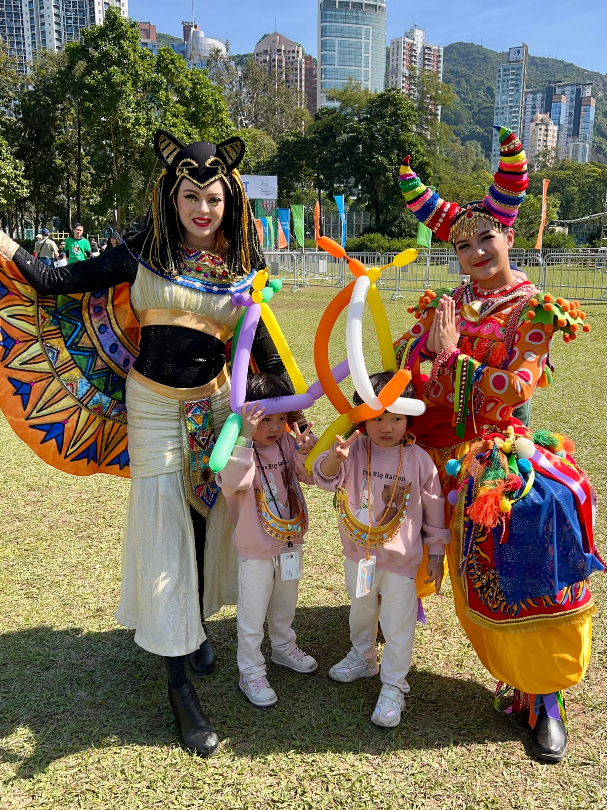

走到门口，又瞧见领礼品的队伍，凑上去收获颇丰——中式格格帽精致典雅，西式花帽时尚俏皮；还有 6 种水晶贴纸，我们仨将每种都收入囊中。
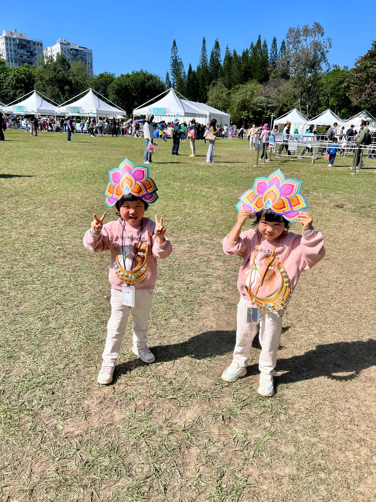

## 归家、午餐与傍晚出行
随后，宝贝们戴着帽子、拿着气球，开开心心走向地铁天后站，归家途中跟宝妈通电话知晓午饭有着落了。一点多迈进家门，午饭一上桌，饿坏的宝贝们不用催，大口大口吃着荷叶包饭、鸡肉、胡萝卜、毛豆烧肉，吃得那叫一个香，宝妈带的两盒饭被吃得精光，连汤都没剩。饭后，宝妈带着宝贝午睡，待睡醒，娘仨又奔赴上环海边，在港澳码头的信德中心尽情畅玩，晚餐选在麦当劳吃儿童餐，拿玩具。
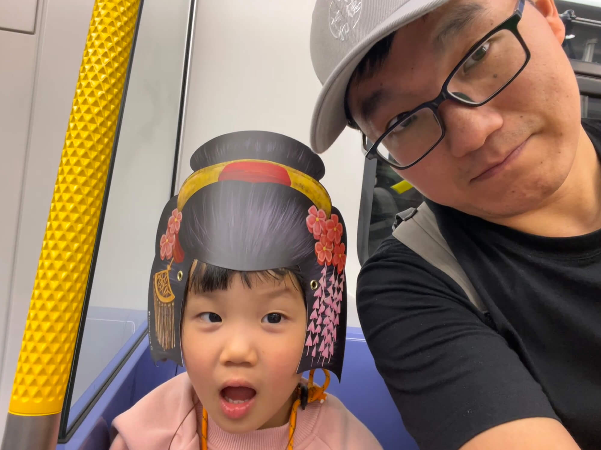

## 温馨晚间日常
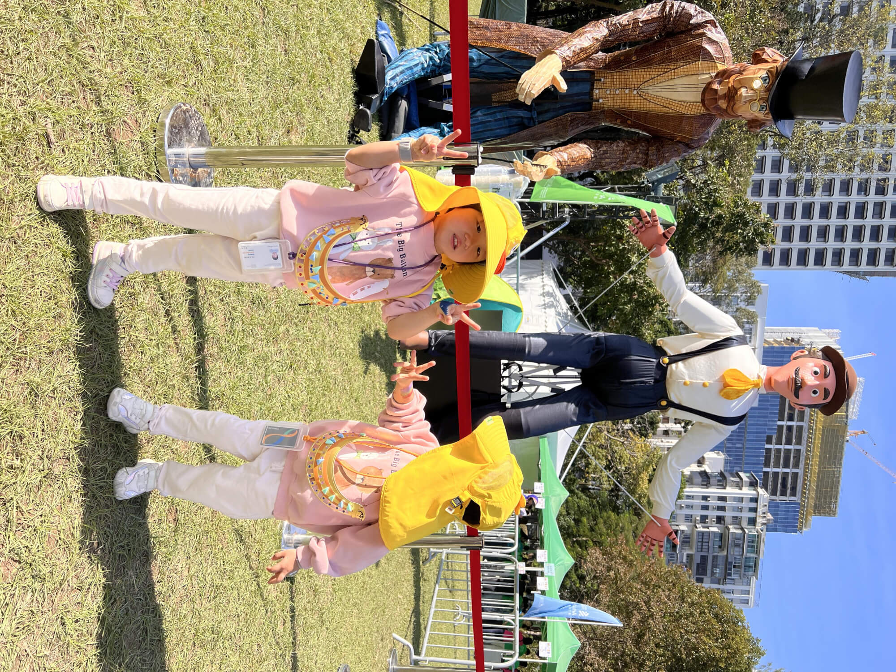
夜幕降临，回到家中。一家人围坐，细细回顾宝宝这一周表现，郑重其事在作业本上打分。而后便是洗漱时间，洗澡、吹头、喝牛奶、刷牙，一套流程下来，宝贝们带着一天的欢乐与满足，沉沉进入梦乡，为这充实的一天画上圆满句号。这一天，有惊喜、有欢笑，陪伴宝贝的每一刻都无比珍贵，期许未来还有更多这般美好的亲子时光。 