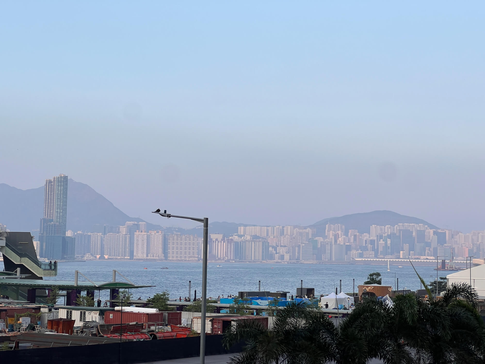
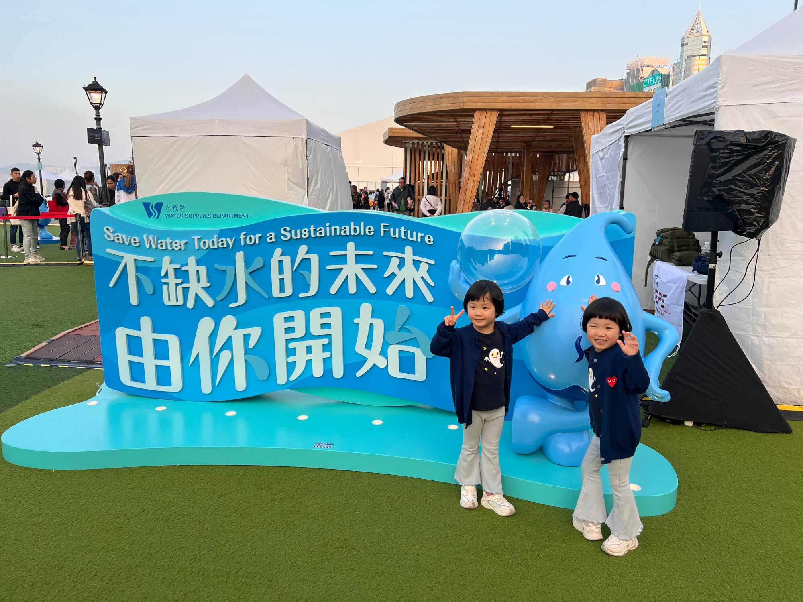
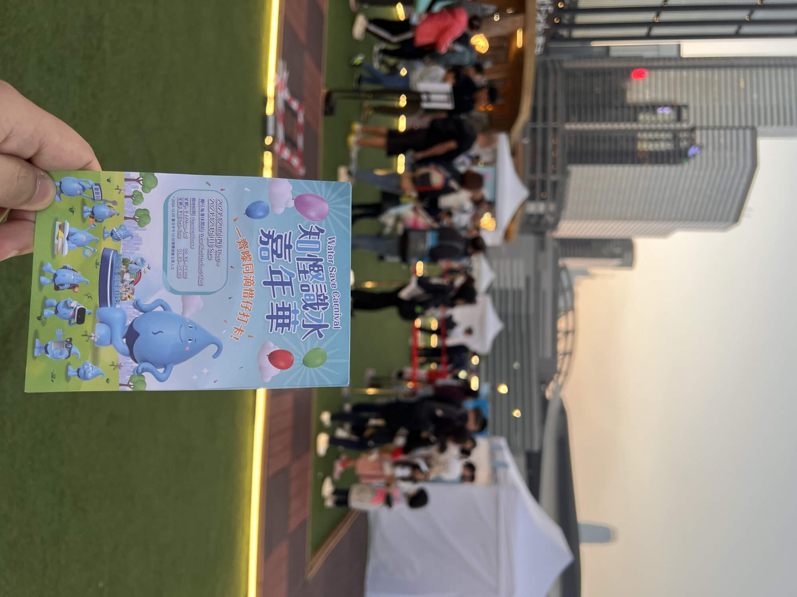
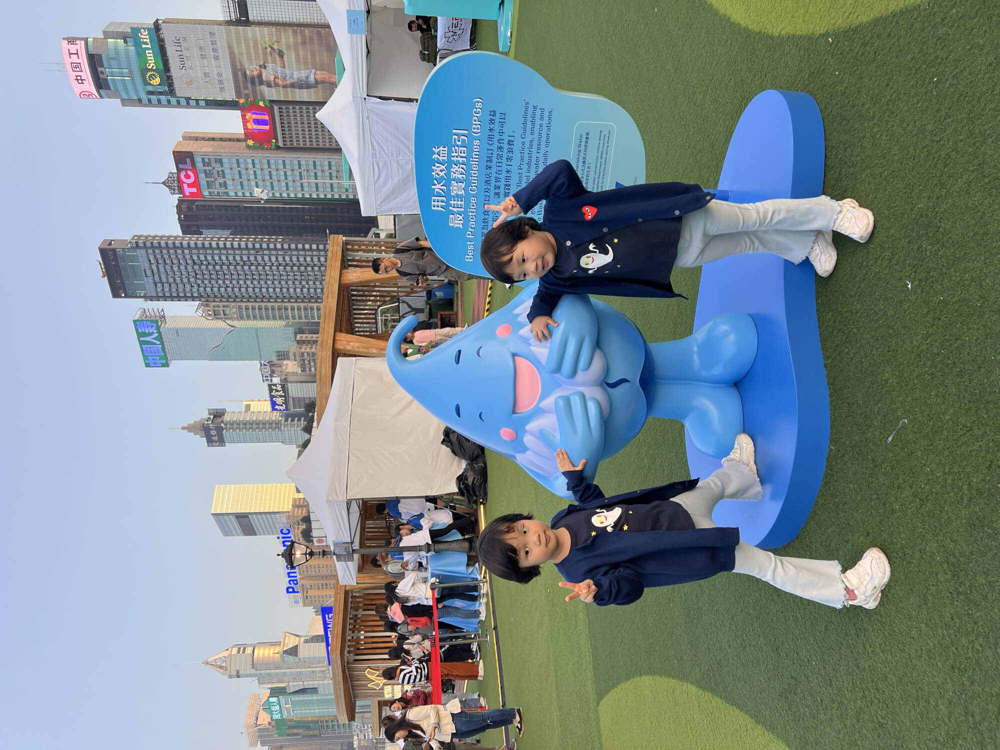
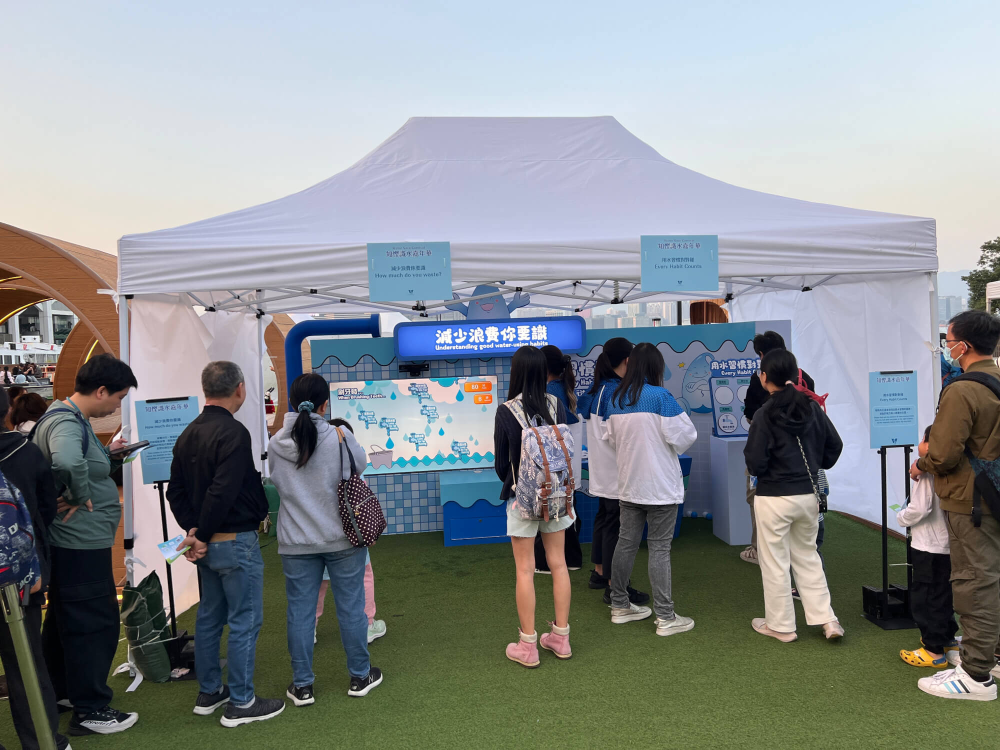
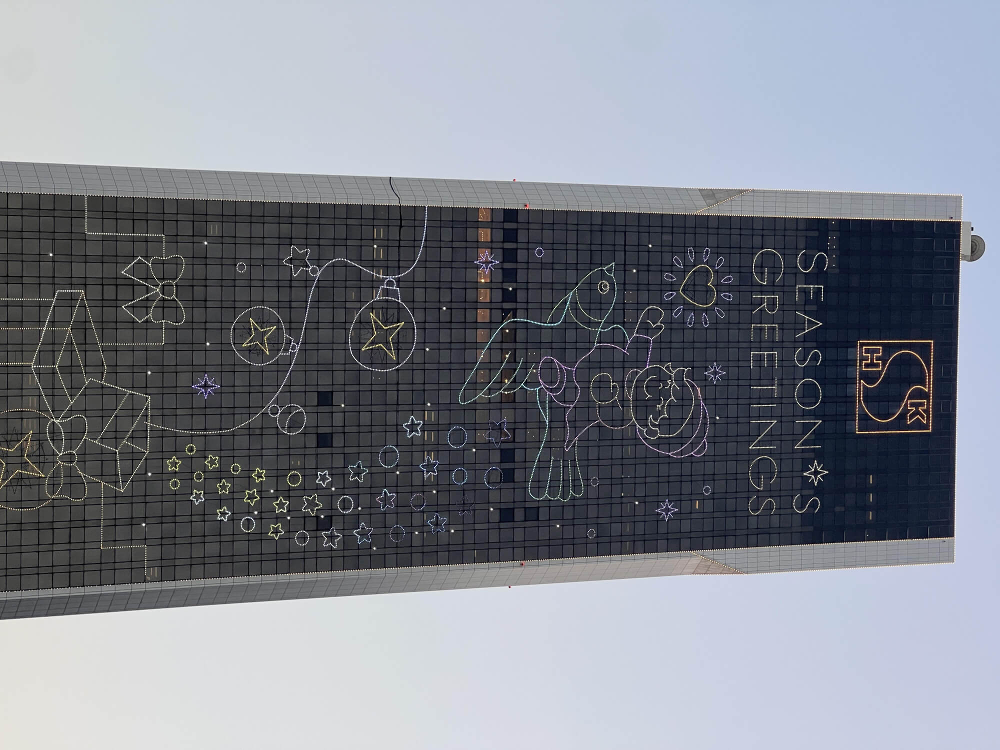
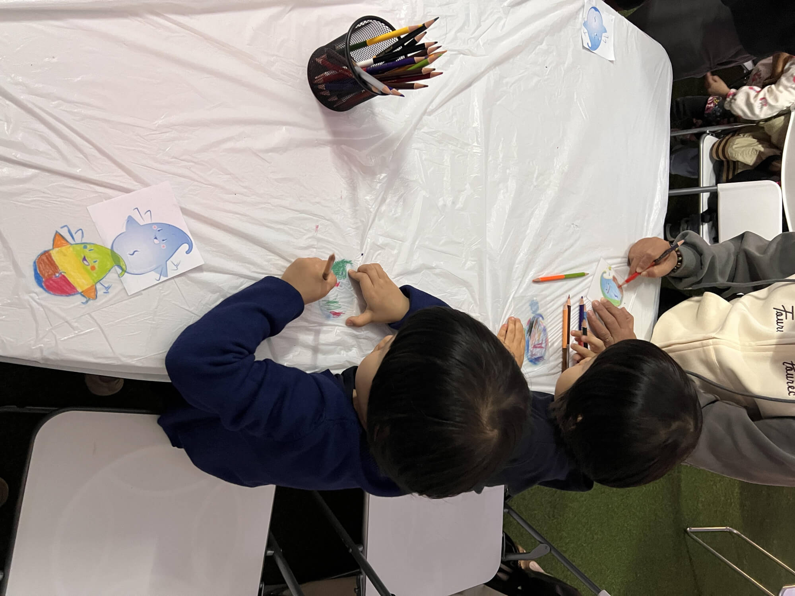
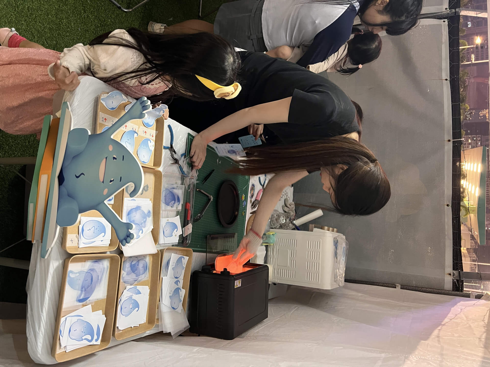
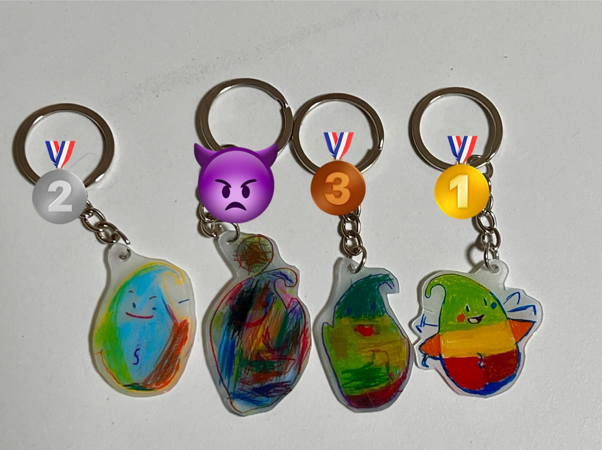
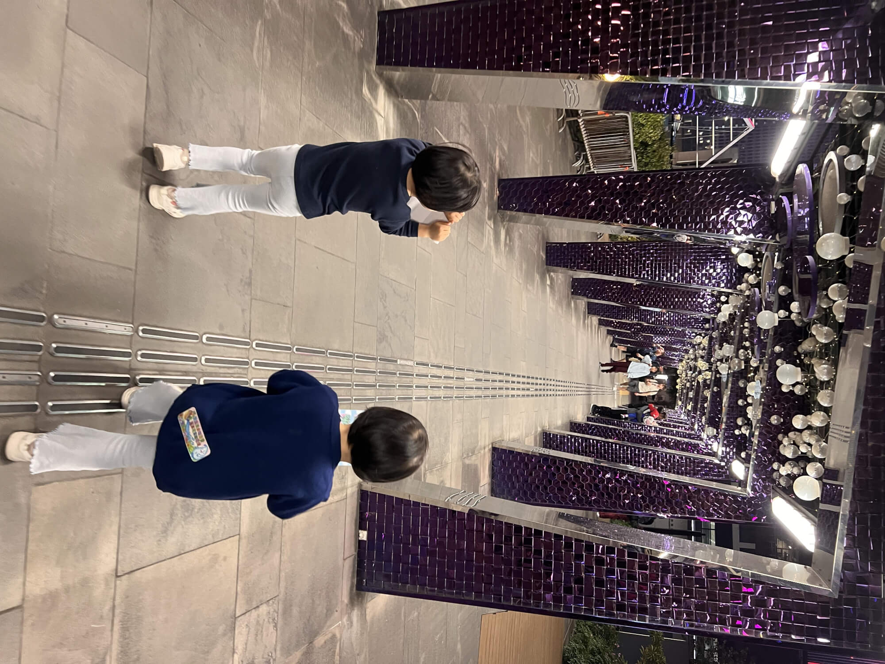

2024-12-7 周六 晴

## 赴节水嘉年华之约
今天下午，我携着珊瑚和海兔奔赴湾仔海滨，参加由水务署主办的"知悭识水"嘉年华。 这场活动紧扣“节水”主题，旨在唤起大家的节水意识，还设置了不少趣味环节，非常适合遛娃哈。
<!--more-->
"悭"字读qiān，"知悭识俭"是粤语词汇，字面意思是知道节省、懂得珍惜，通常用来形容人勤俭节约、精打细算。活动把"俭"改成"水"，算是成语化用吧，又学到了！

## 出行小插曲
按照导航，我们搭乘地铁前往湾仔站，本以为出站后很快就能抵达活动场地，没想到低估了这段路程，走起来还颇有一段距离才到海边，其实转东铁线到会展站就好了，出站过个马路便能直达，下次可得吸取教训。

## 入场初体验
顺利抵达现场后，映入眼帘的便是熙熙攘攘的人群。我们的首要任务是领取盖章活动卡，开启后续的精彩活动。场内一共设有 7 个趣味活动，每完成一个活动就能收获一个印章，集齐 3 个印章可兑换一份小礼物，集齐 6 个便能收获两份，7 个印章三份礼物。另外完成扫码打卡活动，还能解锁额外福利——玩一次扭蛋机。

## 活动进行时与小烦恼
怀揣着对礼物的憧憬，我们迫不及待地开启游玩模式。只可惜今天下午来得稍晚了些，每个活动点前都排起了长龙，短则 5 分钟，长则 15 分钟以上，耗时远超预期。就这样，紧赶慢赶玩了快一个小时，却只成功打卡 3 个活动，排队着实太耗费时间了。看来周末的活动人气爆棚，人流量大的时候，参与活动还真得预留充足的时间。

## 慧眼识节水行为
第一个活动极具教育意义，现场大屏幕上呈现出 6 个日常用水行为，泾渭分明地划分出节水与不节水两类，考验大家的观察力与节水常识。就拿刷牙来说，若刷牙时水龙头一直大开，宝贵的水资源便白白流走，无疑是不节水的做法；而采用盆接水淋浴，能精准控制用水量，是节水妙招；泡澡耗水量大，相较之下就没那么环保了。我带着宝宝开动脑筋，仔细甄别，她们的反应还挺快的。

## 小球入洞大挑战
紧接着迎来第二个活动，玩法简单却趣味十足——让小球精准滚入前方的洞中。看似轻松，实则暗藏玄机，力度把控、方向调整都大有学问。参与者们屏气凝神、小心翼翼地推动小球，现场时不时响起欢呼声与惋惜声，气氛瞬间被点燃。

## 收集节水水元素
第三个活动科技感拉满，活动有洗澡、刷牙、洗衣服等几主题，借助 Xbox的 kinect 技术，操控屏幕上的水桶左右灵活移动，接住从天而降的节水图标，中间也会有浪费水的图标干扰，十分考验手眼协调能力与反应速度，大家全神贯注，紧盯屏幕，沉浸在游戏的紧张刺激之中。

## 工坊排队小插曲
顺利完成这三个活动后，我们满怀期待地奔向手工工坊区域排队。心里惦记着 DIY 风铃，想象着亲手做出风铃，听它在微风中奏响清脆音符的美妙场景，可终究还是慢了一步，名额已满。一旁的节水器制作项目，看起来略显单调，没勾起我们的兴趣。好在做钥匙扣的工坊还有空位，于是，我们转战此处，开启了新一轮的手工小冒险。 

## 挑选心仪图案开画
钥匙扣工坊提供 6 种卡通水滴小人图案，大家按喜好各挑其一。每个人都在一张磨砂质感的热缩材料上涂色、大人透明塑料，搭配一张底图描红；小朋友则直接拿到浅浅印着图案的材料，直接涂色，难度更低。桌上彩色铅笔一应俱全，正好用来描边、上色。我和菲佣阿姨依着底图细致描红，两个小家伙则基本处于“涂鸦”状态，起初画得像“鬼画符”，好在珊瑚稍显认真，我还顺手帮忙修改了几笔。海兔天马行空、乱涂一气，成品对比起来，菲佣阿姨打趣道，珊瑚画的是“baby”(宝贝)，海兔画的堪称“Monster”(怪兽)。

## 神奇变身成钥匙扣
画完后交给工作人员，重头戏才刚开始。只见他们先沿着图案轮廓精心裁剪，把方形剪成卡通图案造型，再放入烤箱。短短十几秒，高温魔法瞬间起效，原本的大图案急剧收缩，边长瞬间缩减一半还多，牢牢锁住色彩与比例，看得人啧啧称奇。紧接着，用压板塑形，使其硬朗有型，最后打孔、穿上钥匙链，独一无二的 DIY 钥匙扣就此诞生。

## 活动尾声满载而归
结束 DIY 时已过六点，我们马不停蹄奔向领奖台。凭借集齐的印章，成功收获三个小巧精致的礼品，有水宝计时贴、实用小挂钩等，每件都印着节水元素，别致又有趣。

## 成品盲选趣味排名
带着新鲜出炉的钥匙扣，晚上到家，邀宝妈来场盲选大比拼。一番品鉴后，名次出炉，我侥幸拔得头筹，菲佣阿姨位居第二，珊瑚第三，海兔的“抽象大作”毫无悬念垫底。不过是场欢乐小游戏，大家笑声不断，输赢倒在其次。

## 线上寻宝：解锁DIY宝藏
接连参加三场嘉年华活动，都碰上了超好玩的 DIY 项目，在电信活动亲手打造专属茶杯，易趣做了面具和气球帽子，这次又做出独一无二的钥匙扣，过程中的新奇与欢乐，至今还历历在目，让我意犹未尽。

晚上在家一头扎进网络世界，搜索类似的DIY道具，这一搜可不得了，直接打开新世界大门！各类手工好物琳琅满目，价格更是亲民得超乎想象。就拿热缩材料套装来说，几十块钱就能拿下，里头配备齐全，各式图案、彩色铅笔、钥匙扣挂件、小夹子应有尽有，材料一到手，立马能开工。

钥匙扣的玩法还不止热缩这一种。还有的免烤式钥匙扣也十分出彩，商家直接备好烤好的透明坯子，附赠缤纷颜料，涂好晾干就能用。底图花样百出，除常见装饰，还有热门卡通汪汪队系列，童趣满满，价格依旧实惠，小几十块钱能买二十几个，够宝宝玩上好一阵子。

## 延伸畅想：家中的小工坊
看着这些好物，我愈发心痒痒，畅想在家打造“手工小工坊”的美好场景。把宝宝的同学、朋友邀请到家里，大家围坐一起，发挥创意、动手实操，欢声笑语定能填满房间！

虽说手工本身难度不大，但是想要玩得好，关键还在于父母的陪伴，全身心投入时间与精力，陪着孩子享受创作的每分每秒，才是重中之重~