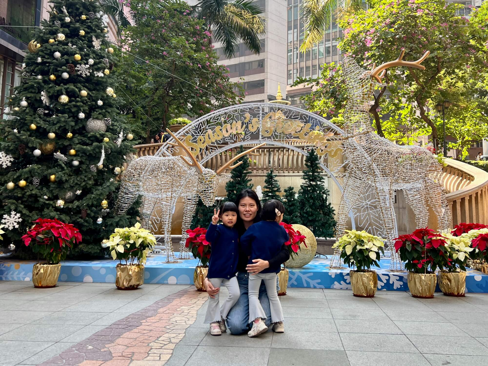
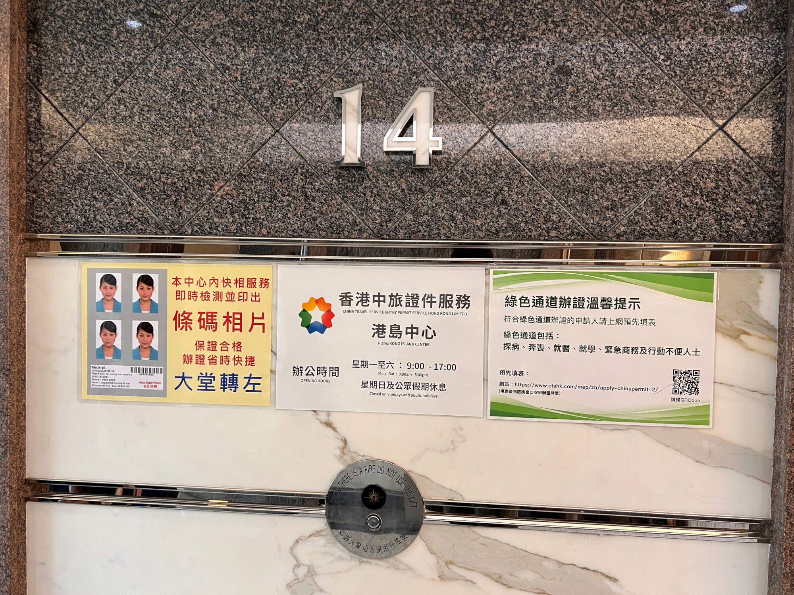
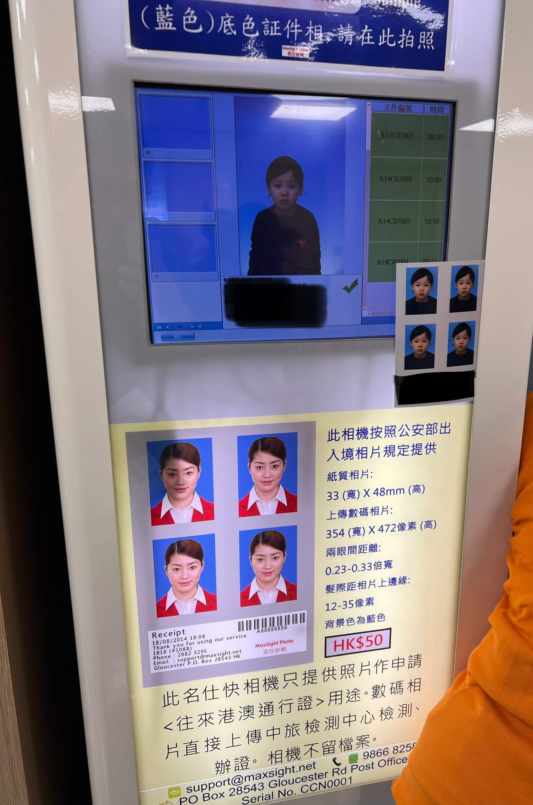
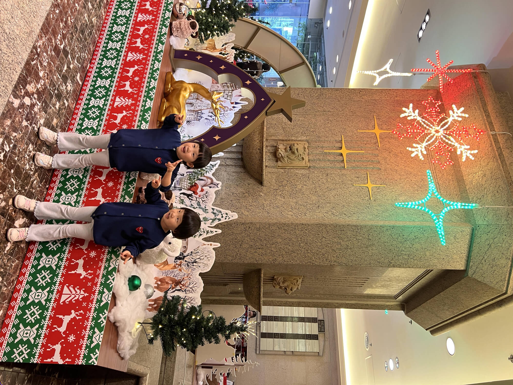

2024-12-7 周六 晴

## 港澳通行证换证记
今天在香港换了港澳通行证，过程还挺曲折，细节满满，特此记录下来分享给大家，希望能给有同样需求的朋友一些参考~
<!--more-->

## 换证背后的考量
港澳通行证，按常理来说，有效期剩半年以内才要换，可我家的四本证还有一到两年多的有效期呢。为啥着急换？这就得讲讲缘由了。

来港都快两年了，眼瞅着明年 1 月要续逗留签，获批时长没准是一年、两年，甚至三年。要是有幸批了 3 年，可现有的港澳通行证有效期不够三年，那么就只能给倒有效期，这样一来时间短了，而来全家的签证时间不一致，后续续签极为不便。综合考虑，换证迫在眉睫。

说起来，之前还跑了趟深圳，结果办理换证时要收走原件，怎么通行证原件我们就回不了香港了，无奈只能无功而返。

## 中旅社的便利之选
几经搜索，选择了离家最近的位于上环新纪元广场 14 楼的中国旅行社。这儿是中旅审核资料的代办模式，最大的好处就是不收证，不影响往来香港。提前在网上预约，动动手指搜“中国旅行社”官网，按步骤约好时间，这可是顺利办证的第一步。

## 现场有序办理
约好的日子，我们按照预约时间奔赴现场。在门口的自助取号机前，一家四口依次刷身份证取号，实际的号和预约时间不相关，主要取决于现场取号的时间，我们四个号连着，后续还能在同一窗口连贯办理，也挺方便。

## 拍照、复印小插曲
取完号，趁着排队间隙去拍照。照片有特殊的编码，必须在指定照相馆，不能自己提供。楼上和楼下都有照照相馆，我们就近在14楼拍了，蓝底港澳通行证照，50 元一张，只收现金，一家四口拍照 200 元。拍完刚号叫到号，在4号窗口先审核材料，出了点小状况，我们的逗留签过期，需要提供入境小白条，没带原件，好在复印件也行。赶忙到楼下复印，10 元一张，单人单张印最省心。

## 办证关键流程
楼下复印完毕，上来材料审核通过，移步隔壁窗口正式办证。大人备好身份证、港澳通行证、逗留签、小白条，照片；宝宝还要带上出生医学证明原件、复印件。工作人员逐一审核，签字，拍照、录指纹，左右手食指都不落，流程严谨细致，每人花费十几分钟，一家四口办下来不到一小时。

后续是两周后带着回执来领证，只要来一个大人就行。如果材料有问题，也会电话通知，保持接听即可。

## 换证后的松弛时光
办好证，心里的大石头落了地，紧绷的神经瞬间松弛。楼下满是圣诞装饰，亮晶晶的彩灯、俏皮的圣诞老人，可爱的麋鹿和小羊，满是礼物的圣诞树，氛围感拉满，逛一逛疲惫全无。然后又去了上环的“楼上“超市，零食、食材挑个遍，把购物篮塞得满满当当，心满意足地回家喽！
