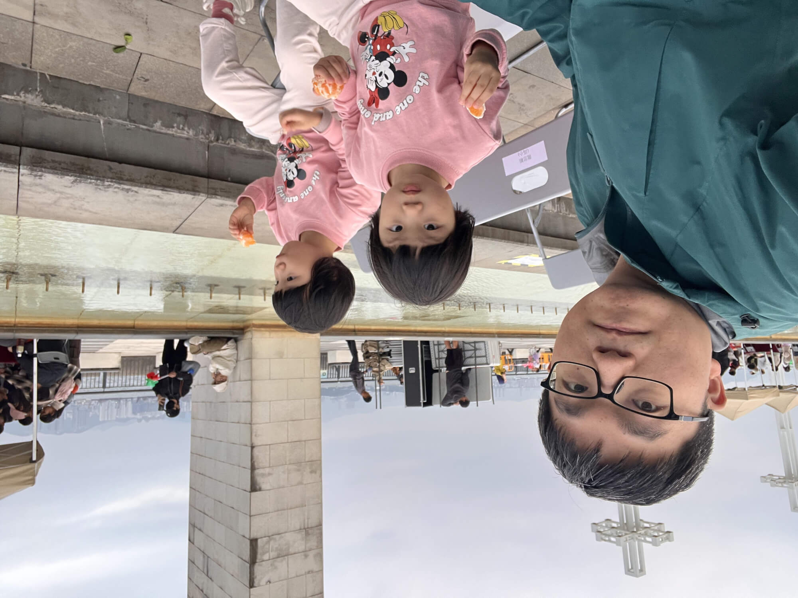
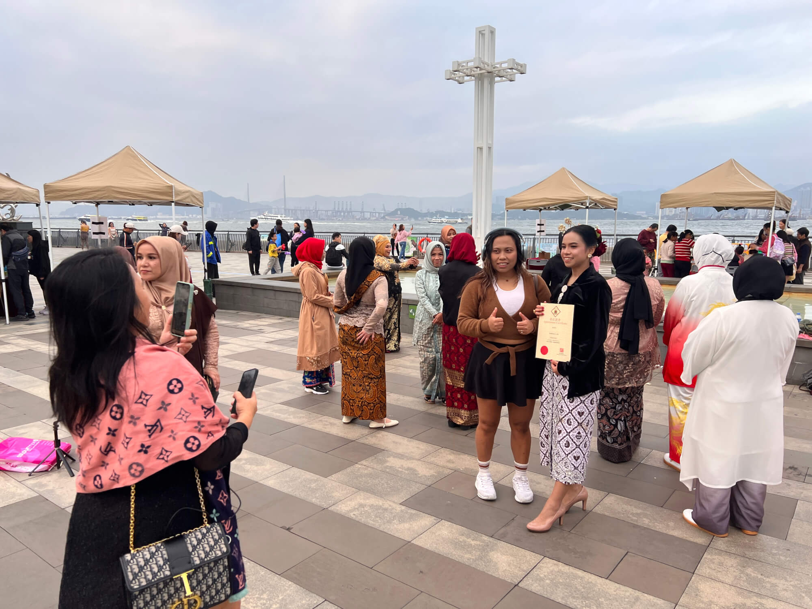
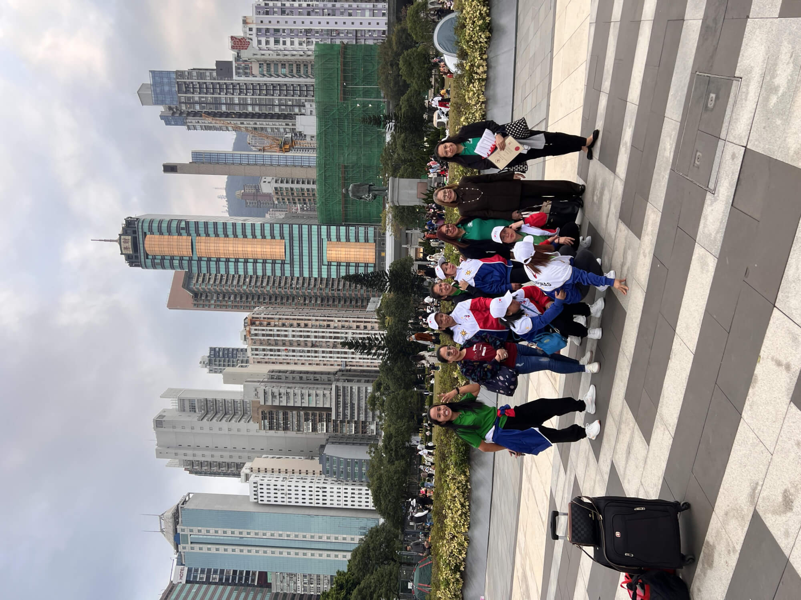
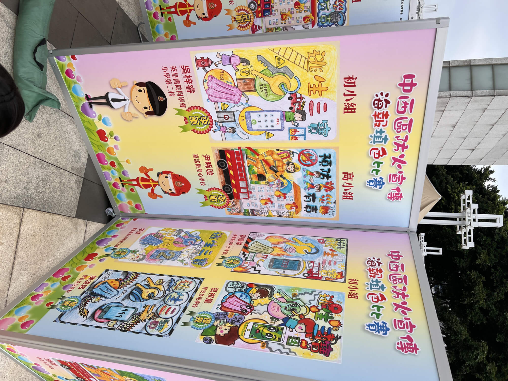
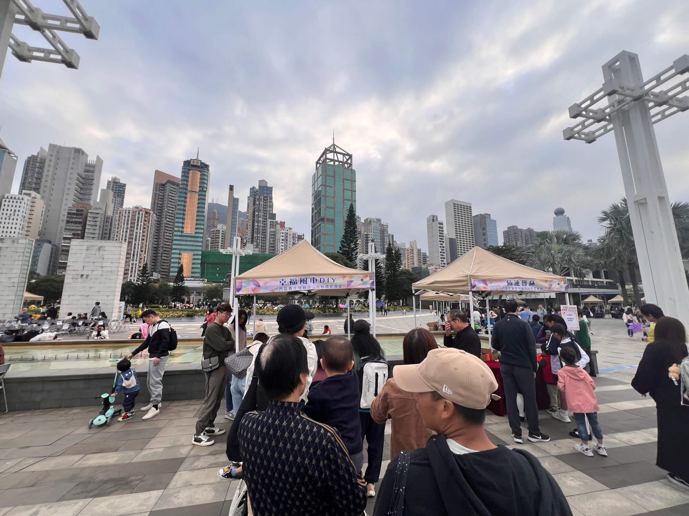
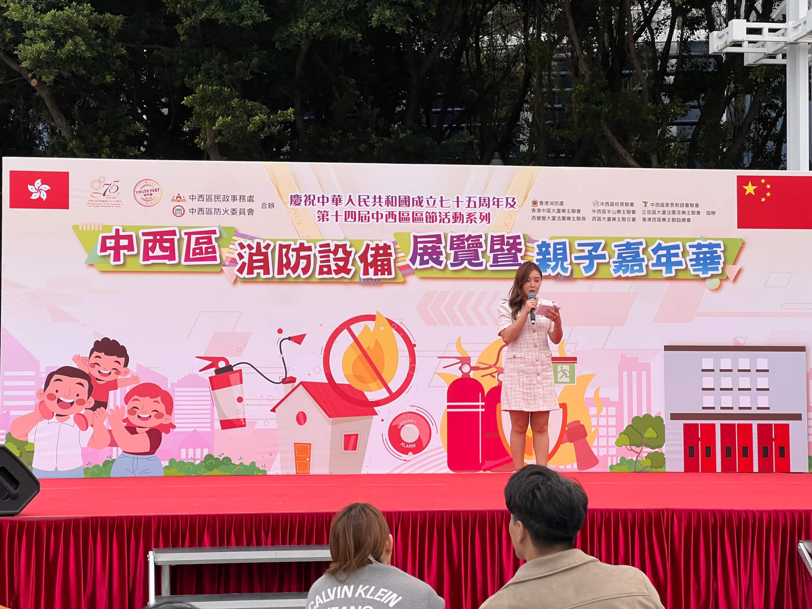
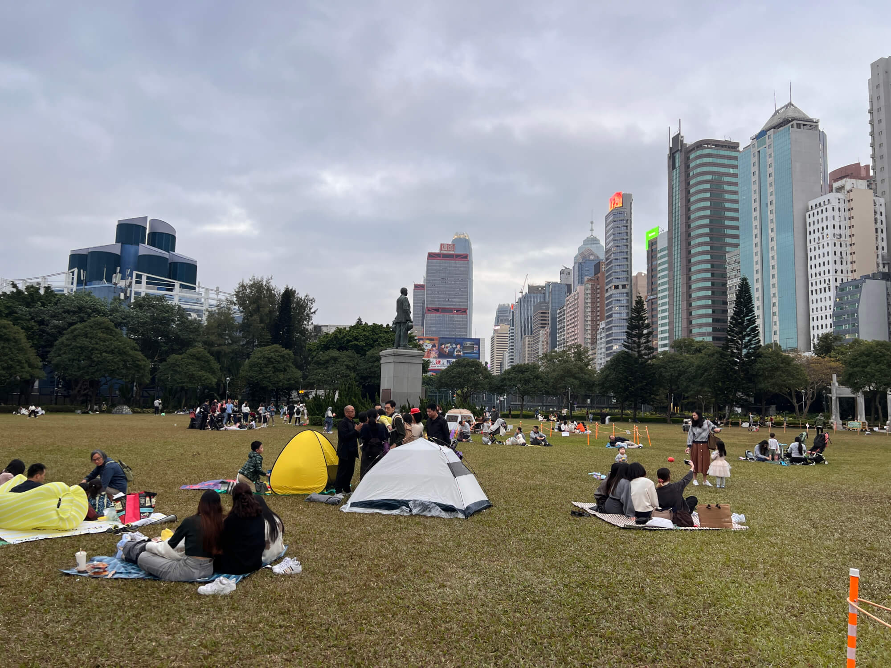
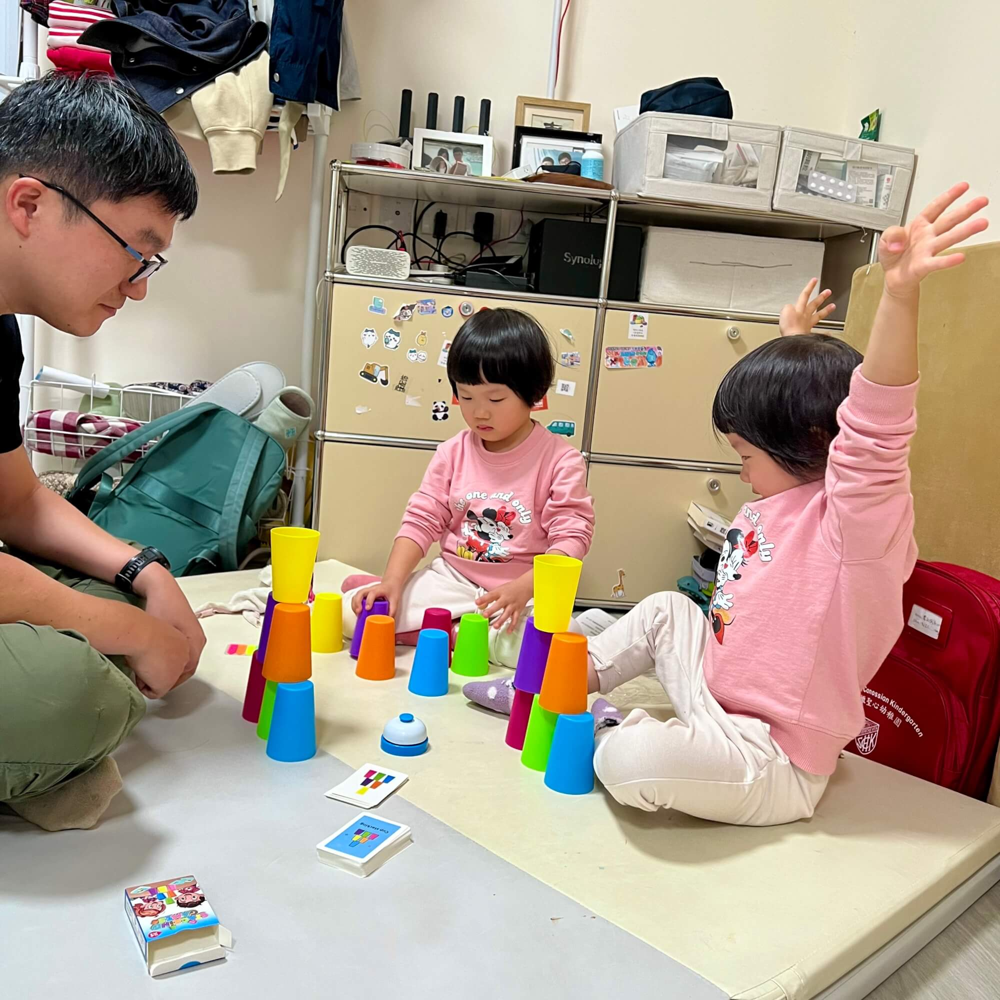

2024-12-8 周日 多云

今天又是分头独自带宝宝的一天。日程满满当当，虽说忙碌，但和宝宝相处的点滴，拼凑出了一段无比充实的时光，现在夜深人静，我便坐在桌前，细细回味这一天。
<!--more-->
## 午后仓促赴约

上午宝妈负责带娃，去了坚尼地城附近的儿童乐园。我在家写作，原计划清清库存，趁年底把草稿箱里的文章多编辑几篇，结果事与愿违，结果只完成了周六的两篇日记，没有降低库存。

午饭后，宝妈和宝宝下午两点才到家，赶紧哄睡，小家伙这一觉睡得倒沉，直接睡到了四点多，可把我急坏了，消防队的亲子嘉年华五点就要结束，我赶忙把还迷迷糊糊的宝宝拉起来。珊瑚宝宝兴许是没睡够，立马闹起了小脾气，眼眶泛红，瘪着嘴哭了几声。

我手忙脚乱地收拾，把酸奶和下午准备吃的水果一股脑塞进包里，顾不上规划路线，直接沿着东边街快步朝中山纪念公园赶去。一路上，还给宝宝做好活动可能已经结束的预期，生怕错过精彩环节，宝宝们不高兴。

## 公园里的多元盛景

过了干诺道西的天桥，热闹的氛围扑面而来，好家伙，中山纪念公园此刻人声鼎沸。儿童乐园那边，满是嬉笑玩闹的小朋友和陪伴左右的家长；草坪上也是人头攒动，老人带着孙辈悠闲踱步，全家出动露营的也不在少数，更有菲佣、印尼工人、印度人等不同族裔的人群，三三两两聚在一起，共享美好时光。

海边区域，便是此次消防嘉年华的主场地了。彩旗飘飘，人群熙攘，各类活动设施井然有序地摆放着，一眼望去颇为壮观，看得出来主办方费了不少心思。

## 趣味活动大赏

这次嘉年华大致涵盖三大板块。一是趣味摊点，虽说不用打卡盖章，但每个摊点前都排着兴致勃勃的小朋友和家长。这里准备了各式各样新奇好玩的玩具，排队的过程中，孩子们满心期待，眼睛亮晶晶的，时不时踮起脚尖张望。

二是展览区域，陈列着中西区消防安全绘画比赛的获奖作品。凑近一看，小学低年级、高年级组别各展风采，比赛内容围绕消防安全“三宝”涂色与创意发挥，跟我们最近参加过的交通安全涂色赛有异曲同工之妙，中学组则是消防安全口号创作比赛。望着这些作品，我灵机一动，琢磨着往后碰上这类比赛，借助 AI 辅助，说不定能给宝宝带来不少新奇创意，口号和对联等拟定等文字工作比较简单，绘画填色，补充内容，现在的 AI 也能派上用场，先生成创意，然后再让宝宝手工完成嘛。

三是舞台表演区，各路民间歌手登台献唱。有的唱功着实不错，可好几个人都是一手拿着手机看歌词，一手拿话筒演唱，唱国语歌时忘词尤为明显，画面有些诙谐。

## 萌宝专属体验

刚入场时，我瞧见消防员身旁，摆着儿童款橙色消防服，还有小巧的儿童汽车、摩托车，小朋友们在排队拍照。本想拉着宝宝跟消防员合影留念，给今天的行程增添个难忘瞬间，可宝宝太害羞，紧紧拽着我的衣角，直往后躲，怎么劝都不肯上前，小脸满是紧张与抗拒。无奈之下，我只能带着宝宝转战游戏摊点。

彼时活动仅剩不到 10 分钟了，先来到风车 DIY 区域，操作倒也简单，打开风车部件，把四圈绕到中间，拿支架从中穿过、撑开，很快就做好了。工作人员带着海兔宝宝，我带着珊瑚，一人做了一个，宝宝拿着海风中吹拂的风车，笑得格外灿烂，小脚丫都跟着晃悠，先前的小情绪一扫而空。

接着是叠杯子挑战，要把 10 个杯子叠成 4321 的形状，完成就能拿到彩色铅笔、卷笔刀小玩具。临近活动尾声，工作人员开启“疯狂”发玩具模式，每人一次能拿 4 个，大家收获满满，宝宝更是开心得不得了，紧紧抱着小玩具不撒手。之后又玩了小猫钓鱼等小活动，最后一共拿到十来个卷笔刀，还有精致的透明书签贴，宝宝爱不释手，一定要拿在手上摆弄，不肯给我收到书包里。

## 观展听歌与海风拂面

各项活动结束，便带宝宝去看展览，顺便听听舞台上尚未结束的歌声。坐在台下，吹着海风，边吃酸奶和橘子，边沉浸在这惬意氛围里。没成想，海风越来越大，呼啸着灌进衣领，宝宝仅穿一件长袖外套，小手冻得冰凉，我心疼不已，赶紧带着孩子往回走。联系宝妈得知她实验还没结束，我便独自带宝宝去吃晚饭。

## 晚餐的小波折

到了正街，楼下是大快活，楼上是大家乐，宝宝点名要去大家乐。点了咖喱鸡块、鱼柳炒饭，还有热柠檬茶，本想着宝宝能大快朵颐，结果小家伙完全不给面子。想来是中午吃得晚，一点多才吃完，下午五点又吃了水果、酸奶，这会儿肚子还不饿呢。我好说歹说，又是哄又是劝，喂饭也不肯，最后跟宝宝约定只吃十口，这才勉强吃了半份，剩下的都进了我的肚子，我倒吃得舒坦。

## 归家后的亲子时光

回到家，宝宝瞧见中午妈妈买的蛋糕，立马来了精神，吃得津津有味，全然没了吃饭时的萎靡劲儿。我无奈摇头，看来往后得管控下零食摄入了，不能再让宝宝饭前狂吃零食，正餐却没了胃口。

接着便是作业收尾工作，检查发现宝宝作业基本完成，只差打分这一步。我让宝宝边吃奶油蛋糕，边着手打分。弄完一看，距离 8 点洗澡还有二十来分钟，想起昨天没看完的电影《崖上的波妞》还剩 20 分钟，便和宝宝一块儿看完了。影片故事天真美好，虽说宝宝才 3 岁半，对剧情理解有限，但打小就爱听影片同名歌曲，跟着哼唱、蹦跳，看完了也很开心。

8 点工人姐姐准时到家，开始给宝宝洗澡，洗完澡，我拿出新买的堆杯子卡片玩具，每组 6 个杯子，颜色各异，卡片上印着杯子不同堆叠图案，要按照颜色和杯子正反堆叠。跟俩宝宝一块儿玩，比比我动作麻利，30 秒内就能堆好，宝宝稍慢些，我就提议她俩互相 PK。一番较量，玩了六局，结果三比三打成平手，双胞胎姐妹这点很好，势均力敌，家里有俩同龄宝宝竞赛，趣味性拉满。

## 深夜赛事与自我沉淀
刷完牙、洗完澡，本以为宝宝能迅速入睡，可下午午睡晚了，俩小家伙在床上翻来覆去，全无困意。我便在床边陪着，顺手打开手机，看起了 今年F1 最后一站阿布扎比站的赛事直播。开场悬念拉满，战况胶着，最终迈凯伦力压法拉利拿下车队冠军，红牛车队的维斯塔潘早早锁定车手冠军。咱们的周冠宇表现也十分亮眼，斩获第 13 名，最后还贡献了一记精彩超车。说起来，这赛季 F1 我看得极少，纯属凑个热闹。

看完 F1，宝宝已经睡着，我便跑出房间，用语音写了这篇总结日记。
