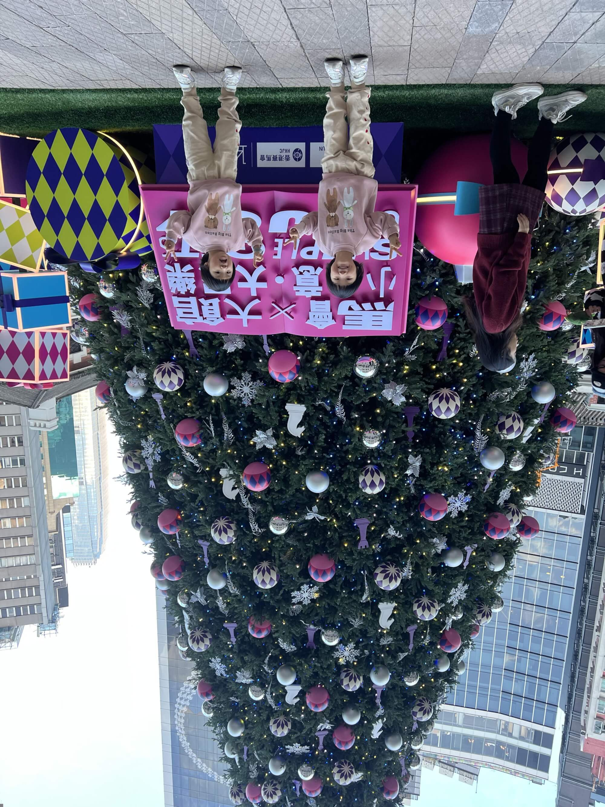
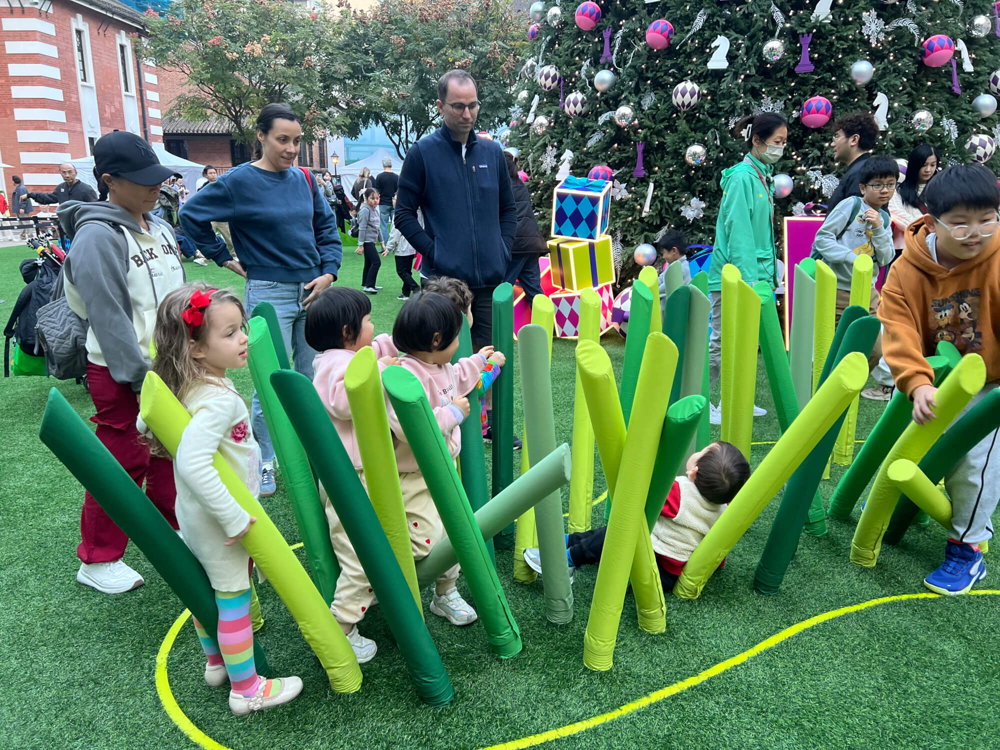
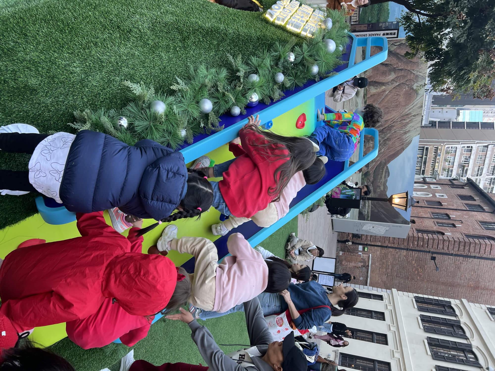
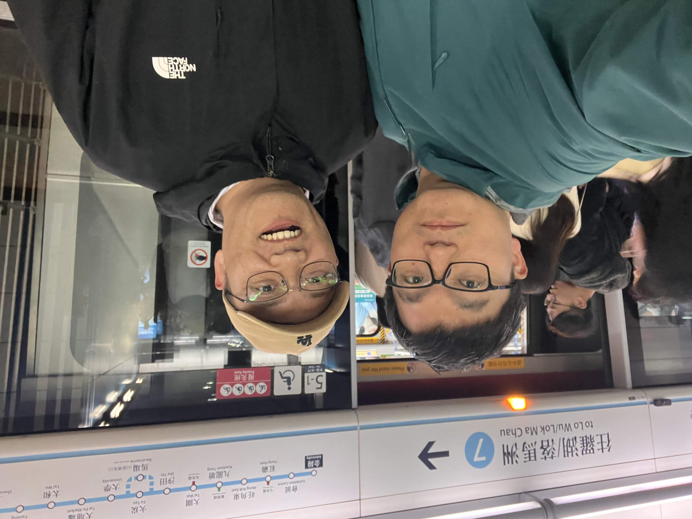
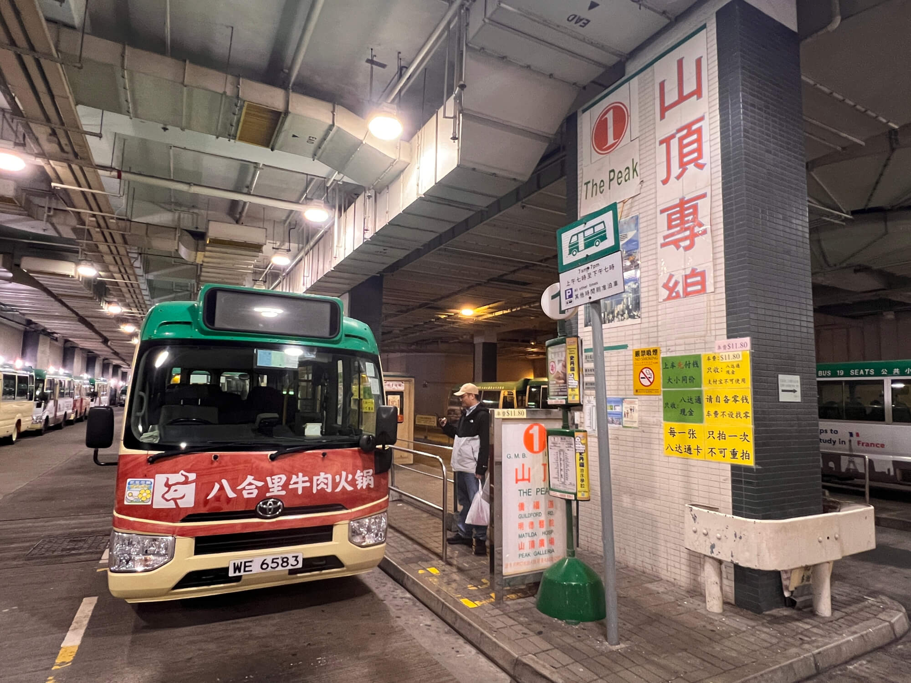
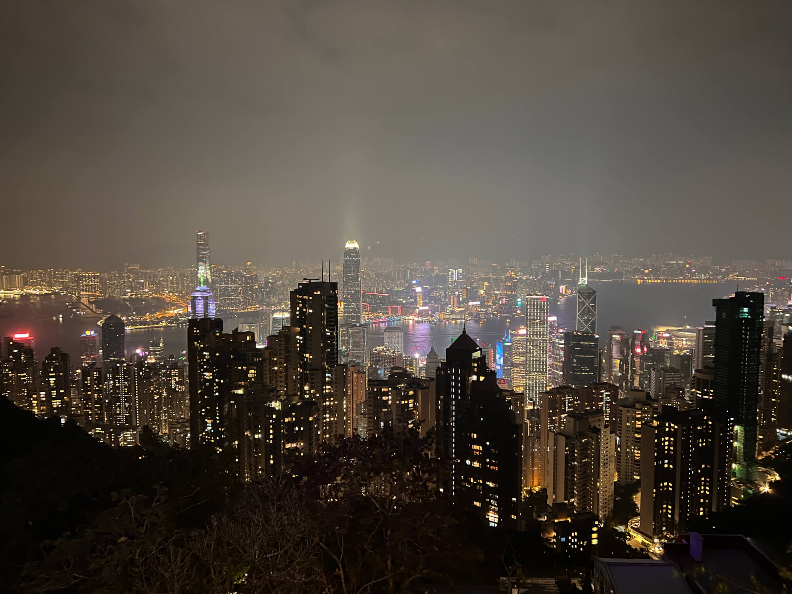
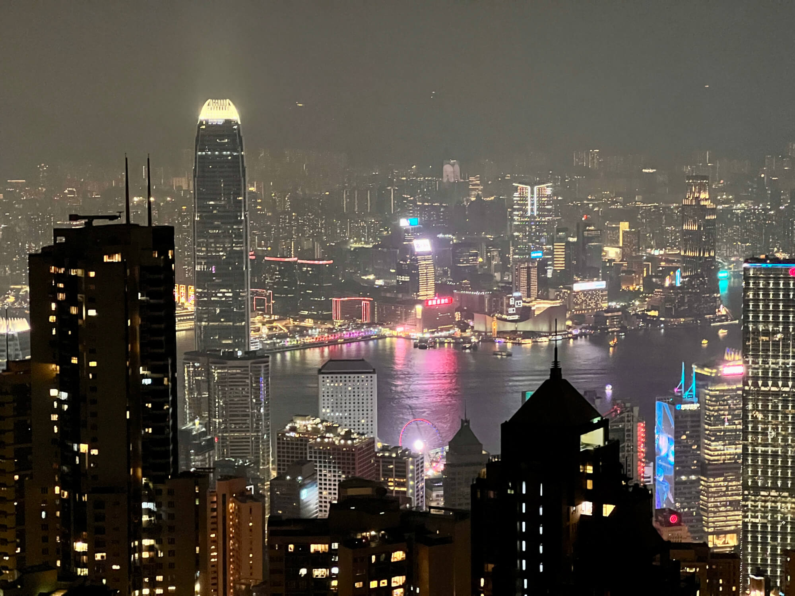

2024-12-14 周六 多云

## 午后出行
今天下午，在孩子们睡醒后，宝妈带着她们开启了一段旅程。
<!--more-->

## 前往大馆
大馆曾是英军监狱，名为维多利亚监狱或域多利监狱。那里有往昔的牢房与警察宿舍，在中环有一片被围墙圈起的区域，如今“活化”，成为了文化地标，有广场、监狱展览等，近期因圣诞节，有大圣诞树，还有赛马会布置的滑梯、小坡等艺术装置，可供孩子们玩耍。

我们从家出发，沿着半闲道前行至健道，顺着半山的路一直走到中环，再向下抵达大馆。出发时天气寒冷，风很大，但走着走着身体便暖和起来。

## 大馆之乐

到达大馆后，孩子们看到圣诞装饰兴奋不已，立刻投身于各种装置游戏中。他们欢快地玩滑梯、拨弄可推倒的草，还在小坡上轮流从高处跳下，玩得不亦乐乎。现场还有许多来自不同地区的孩子，韩国小孩、白人小孩以及当地小孩等，大家都沉浸在从高处跳下的欢乐里，每个孩子都跳了十几轮。

## 返程之趣

之后我们踏上回家的路，原路返回。途中经过一个儿童公园，孩子们又嚷着要去玩。他们在秋千、滑梯上尽情嬉戏。离开公园后经过超市，如今孩子们对超市已颇为熟悉，每次经过都会要求进去逛逛，进去后还必定要买东西。海兔拿了五个酸奶，我拿了两个，而后才心满意足地回家。现在的孩子越发难哄，必须满足他们的要求才行。 

## 香港相聚话鸡娃
晚上宝爸的大学同学刘铁俊来访，相聚家中，畅聊起了热门话题，包括不限于香港身份，各自的工作、生活和还有孩子的情况。

## 课余学业紧锣密鼓

刘的孩子在南京雨花区外国语学校就读小学一年级，学习安排可谓满满当当。

每日下午三点放学后，继续在校内开启加强课模式，游泳、书法、数独等课程依次登场，每周五天，上到五点多放学。每天请两个小时的钟点工阿姨，负责接娃和晚餐。

## 周末休闲张弛有度
到了周六，上午埋头写作业，下午先投身舞蹈课，结束后紧接着是一个半小时的一对一美术课，晚上还有亲子游泳课，一整天的日程被安排得密不透风。

周日则是全家出动郊游的时光，栖霞山、江心洲等地都留下了他们的身影，每周都几个邻居家庭一起，选择一处地方去亲近自然，放松身心。

# 山顶赏夜景之旅

夜晚，我们一同前往太平山顶领略香港的璀璨夜景，我向老友强调，来香港最不能错过的就是山顶的绝美城市夜景。随后查询得知，回罗湖的末班地铁约在 11 点，于是精心算好时间，八点多用完餐便出发。

# 便捷小巴登山行

先是抵达地铁香港站旁的小巴站，仅等了几分钟，便搭乘一路小巴向山顶进发。这一路仅耗时约 20 分钟，相比 15 路大巴动辄一小时的车程，快了许多。小巴在山路上风驰电掣，令人心跳加速，终点便是山顶广场。

# 观景之选与返程

在广场三楼观景台初览，效果不尽人意，便移步不远处的太平山狮子亭，尽情欣赏夜景、拍照。如果时间充裕，步行15-20分钟去卢吉道观景台应该会更好。

待赏景完毕，发现山顶缆车处排着长队，我们果断再次乘坐小巴，15 分钟后便回到中环，顺势登上地铁。此次体验让我深感乘坐小巴上下山是个绝佳选择，不仅速度快，无需像缆车那般长时间等候，而且价格实惠，单程仅 11 块 8，相较于缆车往返 88 元的费用，性价比超高。 