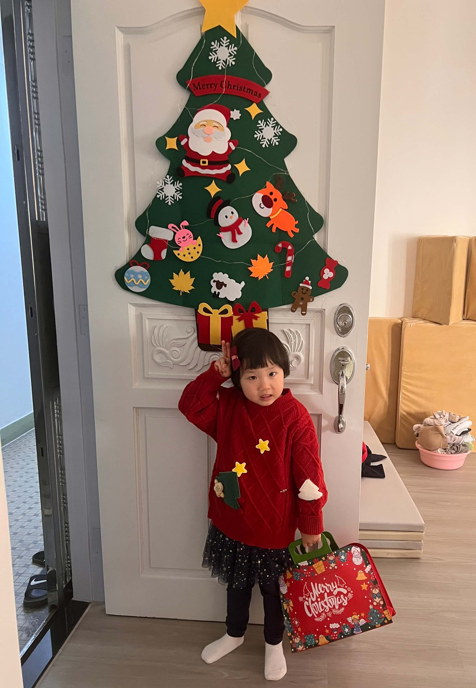

2024-12-18 周三 晴

## 学以致用：宝宝变身小翻译
今晚爷爷奶奶到香港了，因未带牙刷，便用南京话问宝宝家里有没有多余的牙刷。没想到宝宝随即转向菲佣，用英语清晰传达了爷爷的需求，大意是 "Hey Liza, grandpa need teeth brush"，菲佣顺利理解并找出了牙刷。

<!--more-->

这一场景令我欣喜不已，充分展现出宝宝已具备基本的英语交流能力，能够在日常生活中充当小小的翻译官，将爷爷的中文需求准确地转换为英语告知菲佣，这是英语表达进步的有力见证呀！ 

## 显著的口语突破
还记得初来乍到时，在楼下英语培训机构报名前，会做英语能力的评估，两个宝宝虽能听懂些许英语指令，但开口困难，仅能说出简单单词，一个完整的句子都讲不出来。

如今，她们与菲佣交流时，已能用英语表达生活需求，比如吃零食、上厕所、出去玩等诉求，甚至能说出较长句子，用英语苦恼撒娇，进行复杂一些的情感表达，这无疑是巨大的飞跃。

不仅口语进步显著，宝宝的英语听力也有长足发展。日常交流中的句子，她们大多能理解，这让我们深感欣慰，也证明了语言环境对学习的重要性。 

回忆这三个月的学习内容，主要包括学校英语课，课外辅导班，英语动画片，菲佣日常交流。

## 学校英语课：基础构建
宝宝的学校英语课以牛津的《get set go》教材为依托，按每周一个字母的进度推进，从 A 逐步学到了 J。每个字母后学习几个相关单词，另有配套的作业练习册两本，作业形式多为借助点读笔听读，然后进行画圈、连线、涂色等操作，一本侧重英语综合学习，一本聚焦拼读与单词，形成一套完整的学习资料体系，助力宝宝奠定英语学习的基础。

## 培训班课程：多元拓展
家楼下的 babinton education 培训班为宝宝的英语学习提供了补充。周二的口语课由一位来自南非的男老师授课，班级仅 3 个小朋友，属于小班教学，能给予宝宝充分的口语练习机会。周五的阶梯课程有专门教材，6人的班级，从 A 起始每周学习一个字母，虽无回家作业，但课上有贴贴画互动、作业提交与老师点评，隔段时间还会收到细致的教学评估，让家长能全面了解宝宝学习成效与综合表现。

## 双语动画片：潜移默化
宝宝在午餐与晚餐时养成了看动画片的习惯，若不给看便会哭闹。宝妈为此充值了 Netflix 会员，其丰富的多语种动画资源得以利用。中午让宝宝观看粤语版动画片，晚上则安排英语版，为宝宝营造三语听力学习环境，期望通过这种趣味方式，促进宝宝在日常娱乐中逐步提高粤语与英语的听力理解能力，实现语言学习的潜移默化。

## 菲佣交流：日常浸润
菲佣的日常对话成为宝宝英语学习环境中不可或缺的一部分。在日常生活场景里，宝宝与菲佣用英语交流互动，无论是吃饭、玩耍还是日常琐事，都在自然的交流中不断强化英语听说能力。平常宝宝有些说得不对的地方，菲佣也会帮忙纠正，比如前两天宝宝 this that 不分，菲佣就有进行具体讲讲。另外我还买了60本薄薄的英语绘本，每天午后的水果时间，要求菲佣给宝宝讲一本。

我甚至觉得，从开口说话角度来说，与菲佣的日常交流，是对宝宝们英语提升帮助最大的!

按照**费曼学习法**，把学到的东西讲出来，最有助于巩固知识。学校是大课，以听为主；课外辅导班，每周只有两节课合计2小时，宝宝开口的机会有限；动画片也是被动输入，并且我觉得对宝宝来说视觉输入听觉输入；在日常生活交流中，她们开口的机会最多。
