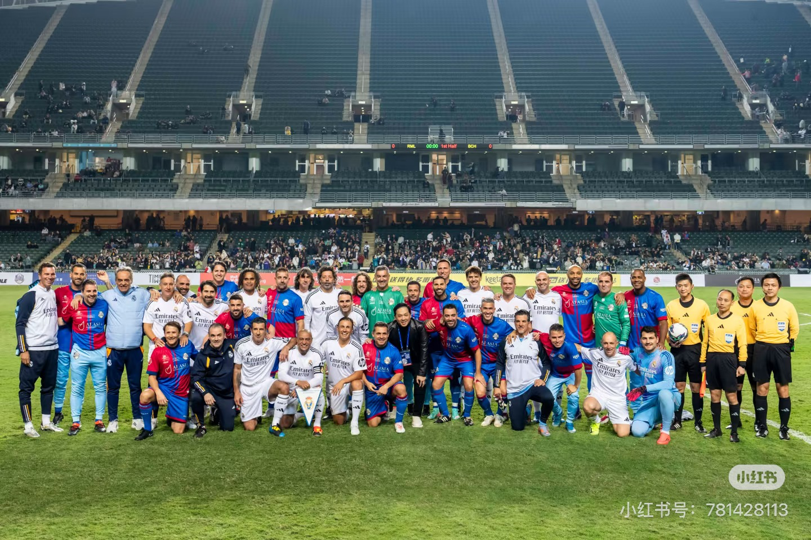
2024-12-20于我的球迷生涯而言，堪称一座崭新的里程碑！在香港大球场观看了皇马传奇vs巴萨英雄的元老赛，竟能一次性见到卡西、卡洛斯、菲戈、欧文、卡纳瓦罗，莫伦特斯，坎比亚索、普约尔、哈维、亨利，夸雷斯马、比利亚，克鲁伊维特，萨维奥拉等一众璀璨球星，心中的激动简直难以言表！
<!--more-->

## 一、票价高昂：曲折的购票历程
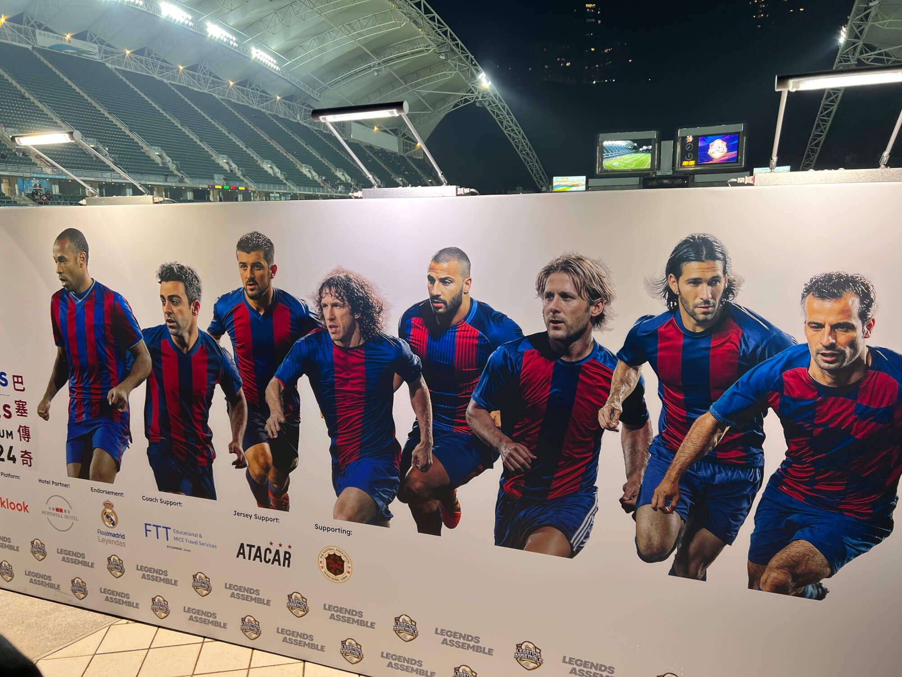

早早听闻这场元老赛要在香港举办，心中便按捺不住地期待。不过高昂的票价让我有点犹豫，最低680元，犹豫了几天，结果最低的票卖完了，其次就要1180了，最贵的6880元，可以参加球星签名见面会。后来一直关注售票情况，看到销售不理想的新闻，但官方一直没有降价，只能在闲鱼上找黄牛，小红书的评论区里蹲临时转让的，果然最后时刻等到了折扣。

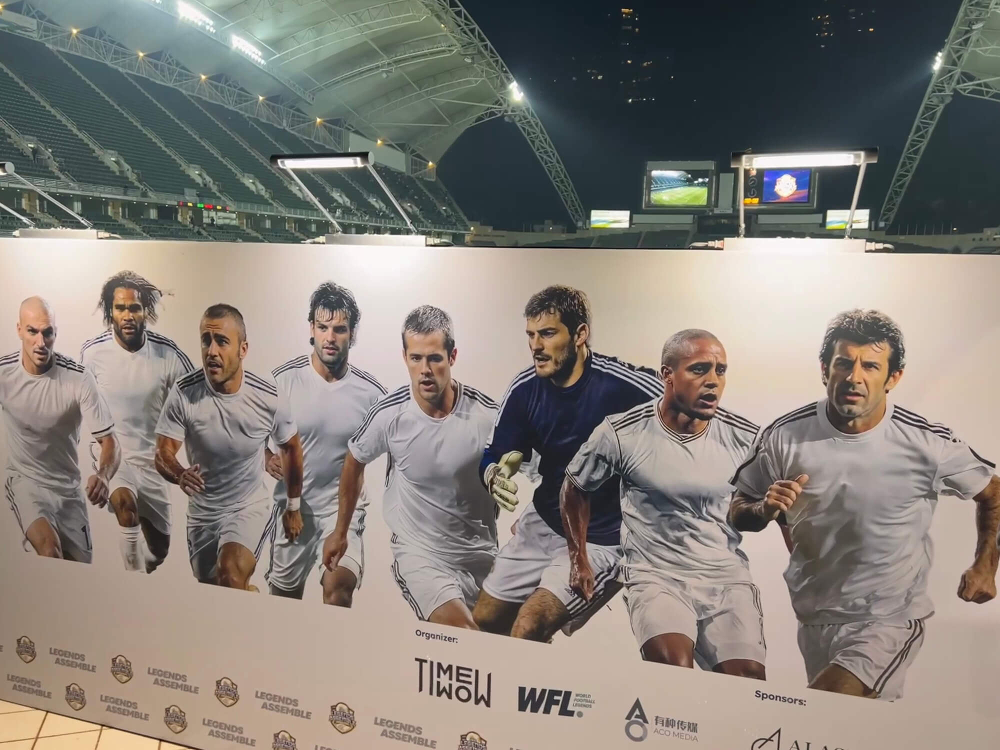

周五下班后，早早吃完晚饭，坐地铁到铜锣湾，然后步行十余分钟，抵达香港大球场，入场无需安检，只要验票即可。

## 二、赛场星光：传奇的闪耀登场
尽管这只是一场元老赛，其含金量与比赛节奏或许比不上顶级职业赛事，但这些球星可都是如假包换的足坛传奇，每一位都堪称顶级巨星。他们是我学生时期的 “银河战舰” 皇马与 “梦之队” 巴萨的巅峰对决中的明星，是那个热血沸腾的足球时代的标志性人物，能亲见他们同场竞技，实在是太过瘾了！

当我终于踏入球场，熟悉的绿茵场气息扑面而来，传奇球星们正在场地中央热身，混合着观众们的欢呼的喊叫声，让我瞬间热血沸腾。环顾四周，海报上展示着球星们的照片，每一张面孔都勾起我年少时守在电视机前为他们欢呼呐喊的回忆，而此刻，他们即将真实地出现在我眼前，在这片绿茵场上续写传奇，我迫不及待地找到靠近球场西南侧球员通道的位置，准备迎接这场视觉盛宴。

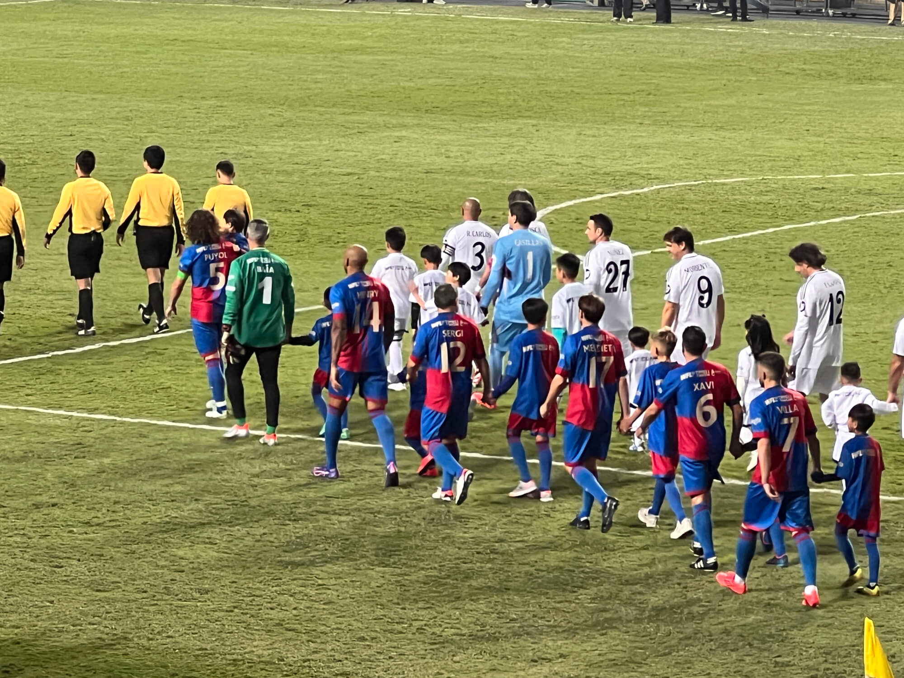

随着激昂的音乐奏响，球员们依次从通道走出，那一刻，全场沸腾。卡洛斯和普约尔作为双方队长带头出场，随后卡西稳健的步伐透着昔日顶级门将的自信，亨利灵动的眼神闪烁着杀手本色，菲戈潇洒的身姿依旧魅力十足，还有卡纳瓦罗、莫伦特斯、坎比亚索、哈维、夸雷斯马、比利亚、克鲁伊维特、萨维奥拉等。入场后，双方先是握手，然后分别合影，最后集体合影，猜边开球。

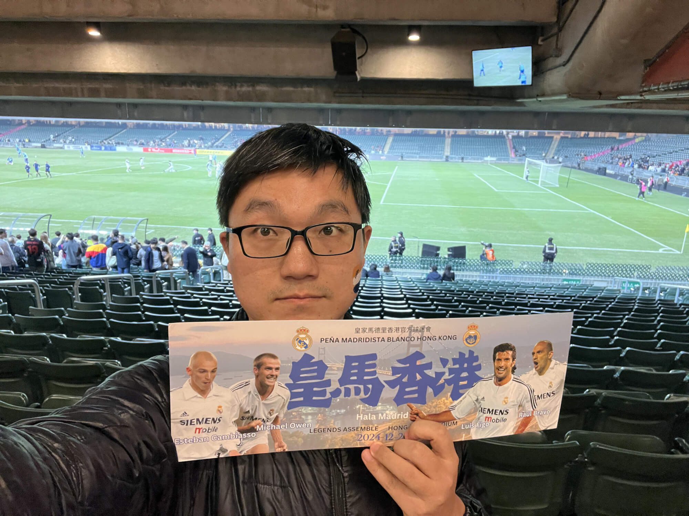

球员的入场我觉得缺乏特色，我以前看过伯纳乌的传奇赛的实况录像，每一位球星都单独登场，接受球迷们的欢呼和掌声，这样更能突出每个球星在球迷的心中的地位，将现场气氛推向一个又一个高潮，也有助于球迷们了解出场阵容。

## 三、比赛风云：哈维制霸中场，皇马快速反击
比赛伊始，便能明显察觉元老赛独特的节奏。相较于紧张激烈、分秒必争的竞技比赛，这里的节奏舒缓许多，动作也更优雅，全场只见到普约尔飞身铲球（也许是肌肉记忆了吧），其他球员踢得都挺客气的。
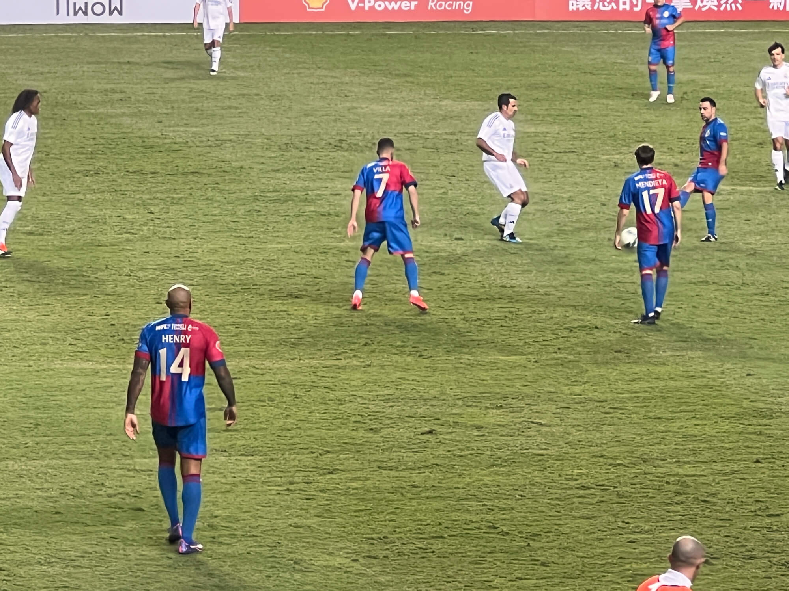

巴萨方面，控球率明显占据上风。普约尔在后场稳稳拿球，随后将球精准地传给中场核心哈维，哈维如定海神针一般，制霸中场，宛如一位优雅的指挥家，或带球稳步推进，或眼观六路，分边找到边路插上的队友。与比利亚的连线更是默契十足，多次打出漂亮配合，比利亚接到传球后，利用速度和技巧突破防线，再精准传中，夸雷斯马常常如鬼魅般插向后点，寻找破门良机，一套套战术行云流水般展开，看得人目不暇接。

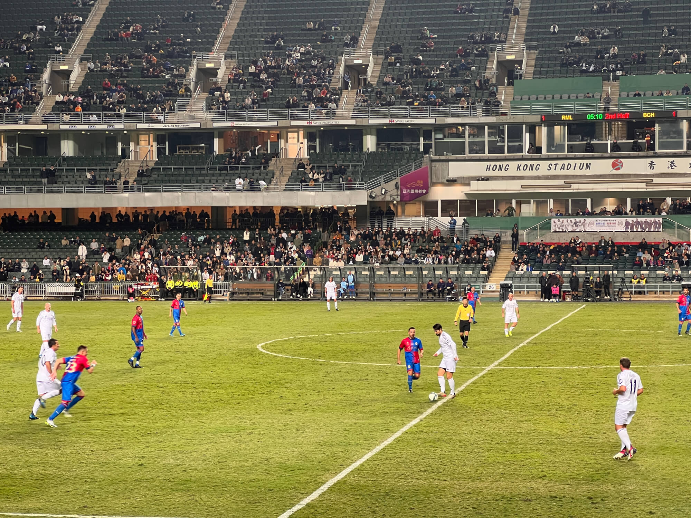
皇马这边，中场只有坎比亚索，略显薄弱，卡纳瓦罗领衔后防线，开场搭档老将坎波，后门上更年轻的帕文，他们肩负起防守重任，一次次化解巴萨的进攻。进攻端则主打边路快攻，左边莫伦特斯、右边菲戈，两人凭借丰富的经验，频繁利用速度和技术下底传中，锋线欧文则抓住机会，凭借出色的跑位和门前嗅觉，两次利用反击攻破对方球门。

## 四、换人轶事：意外与戏剧
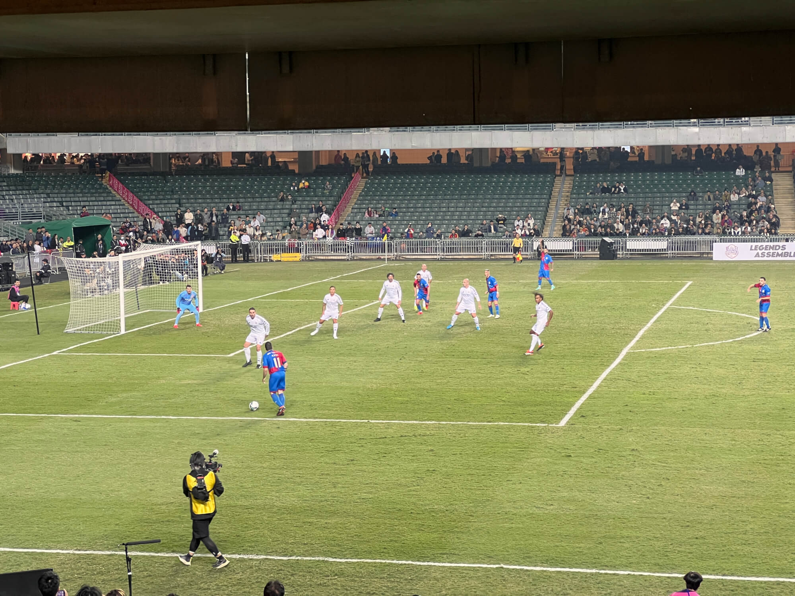

赛场上，除了精彩的比赛，球员们的小插曲也为这场元老赛增添不少色彩。卡洛斯因伤病困扰，仅出战短短 10 分钟，便遗憾下场，让球迷们心生惋惜。亨利也只踢了 16 分钟，不过每一分钟都全力以赴，多次在左边路突袭，然后内切，展示“亨利护球”。而欧文的经历堪称戏剧性，下半场先是换下，可没过多久，劳尔布拉沃受伤，欧文临危受命，再次登场。

## 五、门将风采：守护与失守的两极
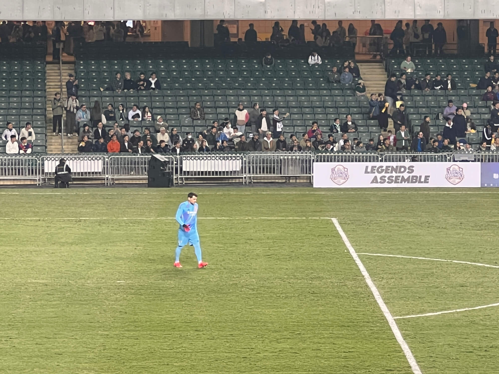
门将作为球队的最后一道防线，在这场比赛中有着截然不同的表现。皇马一开始由卡西镇守球门，他用一次次精彩的扑救证明自己宝刀未老，开场不久面对对方的射门，他反应迅速，飞身扑救。随后甚至还有一次被过之后回追，门线附近完成惊险救险，力保皇马在上半场仅丢一球。然而，下半场替补门将登场后，明显看出差距，或许是还未适应比赛节奏，扑救屡屡失手，致使皇马短时间内连丢四球，比赛局势瞬间失衡，鲜明的对比让人不禁感叹门将位置的关键与残酷。

## 六、中场互动：张敬轩献唱
中场休息时，歌手张敬轩走到球场中央，献唱了两首歌曲，除了唱歌之外，他玩性大发，竟别出心裁地 “展示” 起射门技术，佯装踢球、潇洒摆腿。同时，他奋力挥手带动节奏，引得少数观众热情应和。
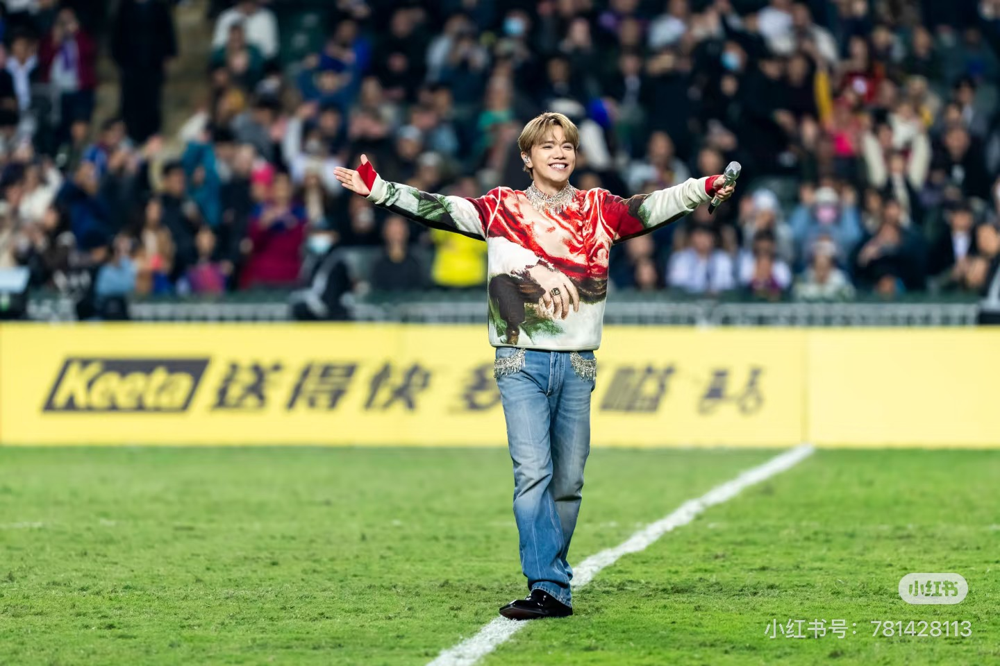

中场休息，我还去了小卖部购买了可乐，香港球场的物价真高，啤酒80，水和饮料都是40港币，热狗和薯条60-85不等。纪念品商店有球衣和球星卡售卖，排队较长，我就没细看了。
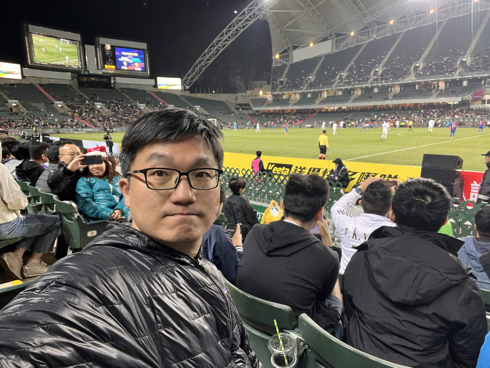

## 七、赛事商业：情怀背后的考量

从商业角度看，元老赛售卖的无疑是情怀。赛前举办的见面会与签售会，吸引众多球迷蜂拥而至，大家都渴望近距离接触心中的偶像，得到他们的签名、合影，这些互动环节极大地满足了球迷们多年来的追星心愿。
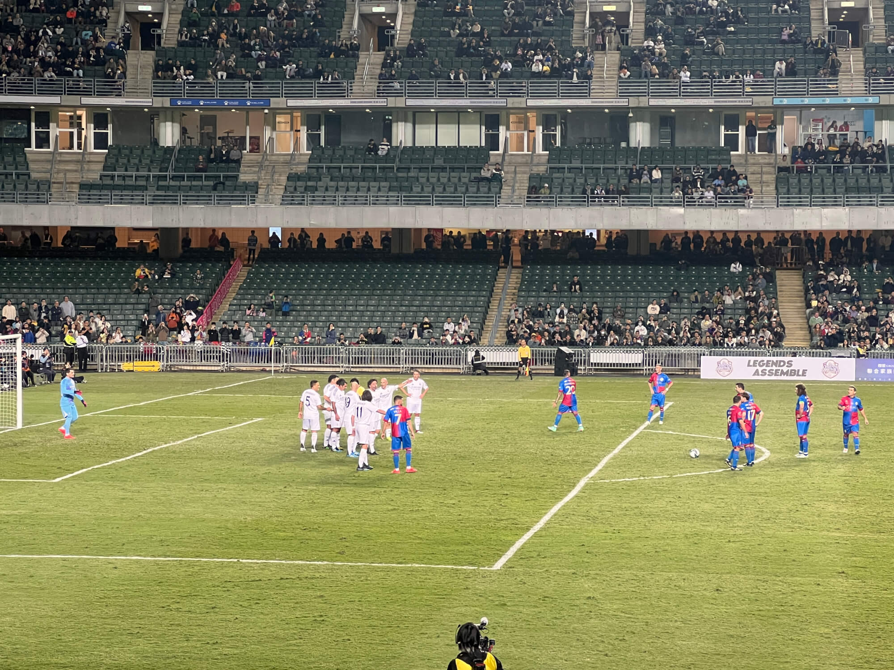

但赛事也存在不少商业短板。票价方面，过高的定价成为一大硬伤，票价是一周前在日本举行的另一场巴萨皇马元老赛的两倍，这直接导致球票销售惨淡。在容纳 4 万观众的球场，最终仅有 7982 人入场，上座率不足两成。主办方在售票渠道上也显得过于单一，只有klook一个平台，没有在内地的诸如大麦平台分销。另外据说巴萨和皇马的香港球迷会也难以获取指定看台的团体门票，无法组织助威。若主办方能在票价策略、售票渠道和看台安排上优化改进，这场元老赛本可以营造出更热烈的氛围。

## 八、赛后回味：记忆中的璀璨星光
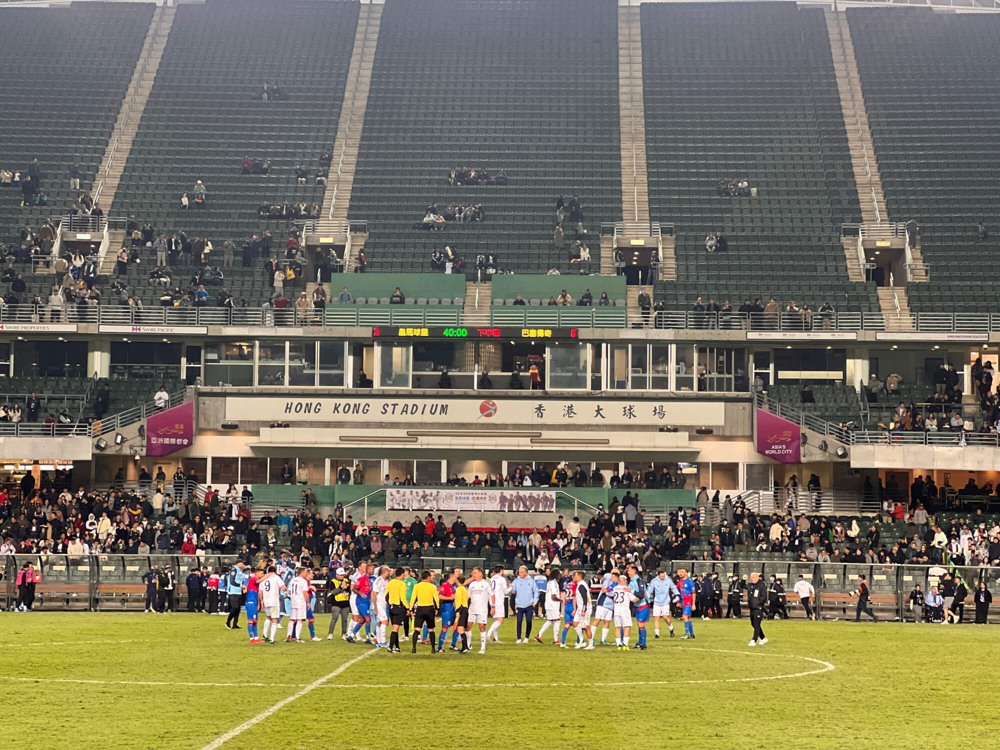

随着终场哨声响起，这场元老赛落下帷幕。5：2的比分，7个进球，让观众们不虚此行。这场比赛，不仅是一场足球竞技，更是一次对往昔足球岁月的深情回溯。它让我再次感受到足球的魅力，我带着满心的欢喜与感慨，缓缓离开球场，知道这份与足坛传奇重逢的记忆，将永远珍藏在我心中，成为球迷生涯中最璀璨的回忆之一。

## 附：双方球员大名单
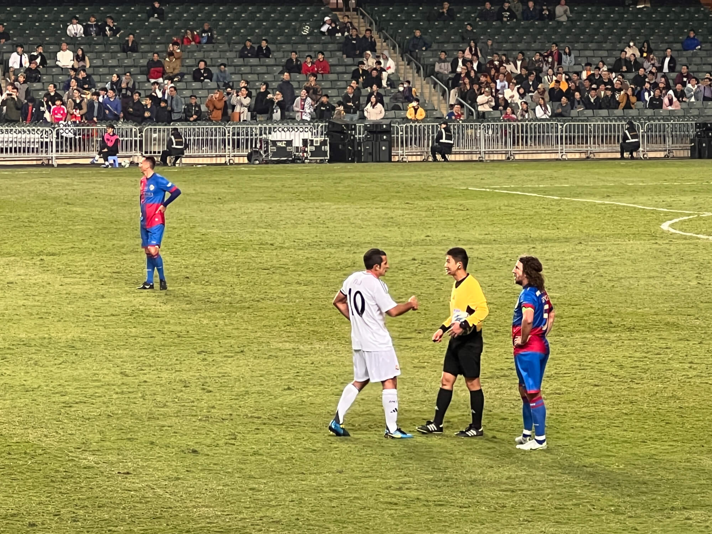

巴塞传奇队球员包括：

亨利（Thierry Henry）、哈维（Xavi Hernandez）、比利亚（David Villa）、普约尔（Carles Puyol）、夸雷斯马（Ricardo Quaresma）、门迭塔（Gaizka Mendieta）、路易斯·加西亚（Luis Garcia） 、久利（Ludovic Giuly）、拜亚（Vitor Baía）、塞尔吉（Sergi Barjuan）、萨维奥拉（Javier Saviola）、德胡（Frédéric Déhu）、科科（Francesco Coco）、埃德米尔森（Edmilson）、约弗雷·马特（Jofre Mateu）、达尼·托尔托莱罗（Dani Tortolero）、克鲁伊维特（Patrick Kluivert）

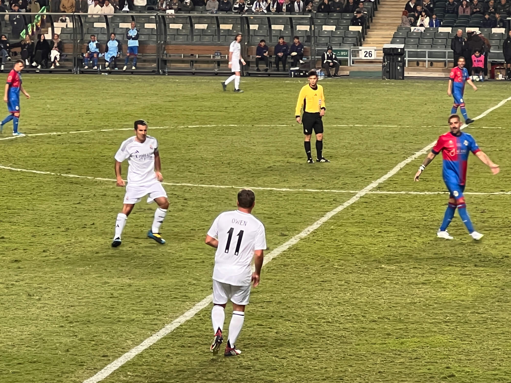

皇马球星队球员包括：

菲戈（Luis Figo）、罗伯特·卡洛斯（Roberto Carlos）、卡西利亚斯（Iker Casillas）、欧文（Michael Owen）、莫伦特斯（Fernando Morientes） 、卡纳瓦罗（Fabio Cannavaro）、 卡伦布（Christian Karembeu）、坎比亚索（Esteban Cambiasso）、阿方索·佩雷斯（Alfonso Perez Munoz）、伊万·坎波（Iván Campo Ramos）、佩德罗·孔特雷拉斯（Pedro Contreras）、劳尔·布拉沃（Raúl Bravo Sanfelix）、帕文·巴拉霍纳（Francisco Pavon Barahona）、鲁本·德拉雷德（Rubén dela Red Gutierrez）、阿马维斯卡（Jose Emilio Amavisca Garate）

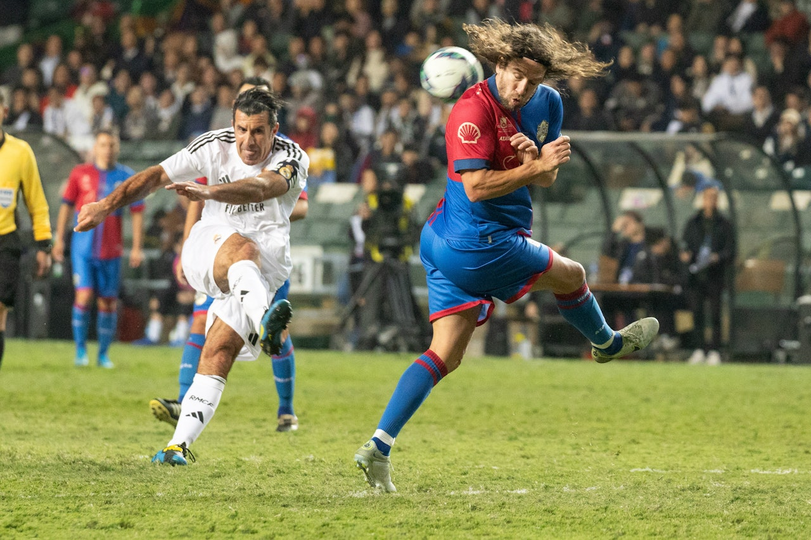