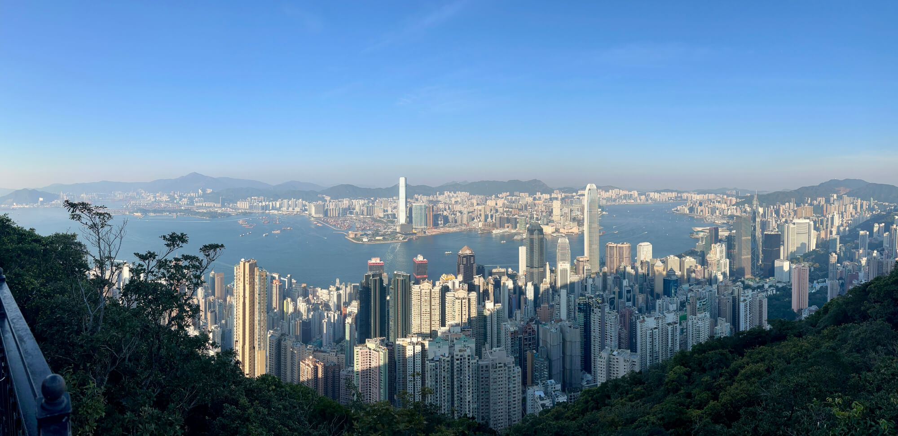

2024-12-21 周六 晴

最近宝宝的爷爷奶奶来到香港，我与宝妈终于觅得自由时光，今天下午开启了精彩的太平山卢吉道之旅。
<!--more-->
我们从家出发，穿越香港大学，从后门大学道出，转入克顿道，跨越宝珊道，顺利进入龙虎山晨运径。

进入郊游径，先抵达克顿道休憩处，这里有公厕，还有直饮水，我们把饮料瓶灌满水，继续沿着蜿蜒的山路徐徐前行。途中经过松林炮台，据说这是香港最高的炮台，二战时英军在此守卫日军，如今这里只剩下一块空旷的平地，往昔威严的大炮已不见踪迹，唯有旁边的一些建筑遗迹，在默默诉说着时光的变迁。再往上走，在一个拐弯之处，我们转道进入了卢吉道。

卢吉道不愧是观赏太平山及港岛风景的绝佳之处。沿途山景迷人，一侧是郁郁葱葱的山林，另一侧则是令人惊叹的城市全景。向北眺望，香港岛繁华的心脏地带尽收眼底，中环的摩天大楼高耸入云，上环的古老街道与现代建筑交织，西营盘的民居错落有致，远处维港的海面在阳光的照耀下闪烁着金色的光芒。海对面的九龙半岛清晰可见，环球贸易广场（ICC）在阳光的反射下，犹如一颗璀璨的明珠，熠熠生辉，更远处的大屿山也在朦胧中展现出它的雄伟轮廓。今天虽有薄雾笼罩，但这丝毫没有影响眼前景色的壮丽，相反，给整个画面增添了几分神秘的美感。

在卢吉道上，我们还见到了一棵令人瞩目的古印度榕树。它犹如一位古老的守护者，静静地伫立在那里，见证着岁月的流转。其树干粗壮，枝叶繁茂，高高地伸向天空，吸引了众多游客纷纷驻足拍照留念。旁边贴心地设有信息展示板，用中文、英文和日语三种语言详细介绍了这棵榕树的生长习性、历史背景等知识。

一路上各种信息展板很多，有植物介绍，有野生动物保护，有港岛的气象介绍，还有遛狗规范等，这不仅满足了大家的好奇心，还让我们在欣赏美景的同时，学到了有趣的新知识，这种信息发布的方式真的很棒。最

让我喜欢的是这里的地图，每个路口都有路牌指示，大的岔路口有很详细的地图展示，地图上除了有地标的图片外，还配有爬升下降的路线高度图，甚至还有1:2500的等高线图，这在内地是完全不敢想的。内地1﹕50万、1﹕25万和1﹕1万的属于秘密级国家秘密，比例尺为1﹕2.5万、1﹕5万和1﹕10万的地形图属于机密级国家秘密。

沿着卢吉道前行，我们最终抵达了山顶广场。这里与我上周六晚上前来时的冷清截然不同，此刻游客熙熙攘攘，热闹非凡。有来自各地的游客悠闲地漫步，还有许多内地旅行团，大家都沉浸在这欢乐的氛围中。山顶缆车处排起了长长的队伍，广场内人头攒动，各种店铺琳琅满目。我们在广场内的“天人茗茶”买了一杯奶茶，坐下来细细品味，感受着这热闹的气息。

休息片刻后，我们踏上了返程之路，选择了夏力道。卢吉道与夏力道就像一个三角形的两条边与底边，两者相连环绕着太平山顶的山腰。在夏力道上，我惊喜地意识到今天进山后全程没有台阶，都是平缓的斜坡路。怪不得途中看到有家长推着婴儿车，还有带着宝宝踩着脚踏车，这样的路况对于带小孩或者想要保护膝盖的人来说实在是太友好了。走着走着，忽然听到一阵清脆的水流声，原来是一处名为卢吉飞瀑的小瀑布。虽然规模不大，但在香港太平山上能看到瀑布，还是给了我们一个不小的惊喜。清澈的水流从高处落下，在周围绿树的映衬下，显得格外灵动。

这次太平山之行，让我对香港的自然与人文之美有了更深的感受。这里不仅有壮丽的城市风光，还有宁静优美的山林景色，更有完善的登山设施与贴心的信息展示。无论是那清晰的路径地图、丰富的自然生物介绍，还是合理分布的直饮水设施与厕所，以及规范的遛狗指示，都体现出了这座城市对游客细致入微的关怀。期待下次还能有机会来探索更多的美景。 
