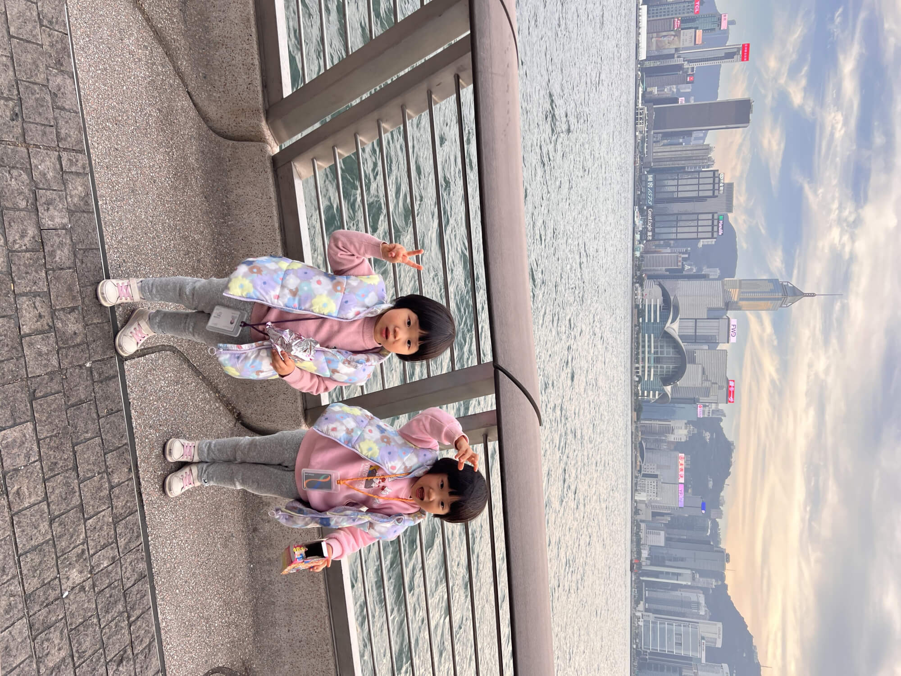
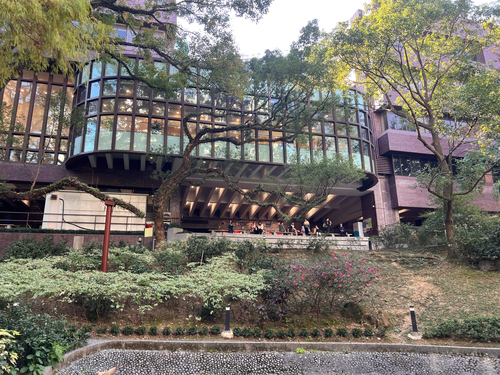
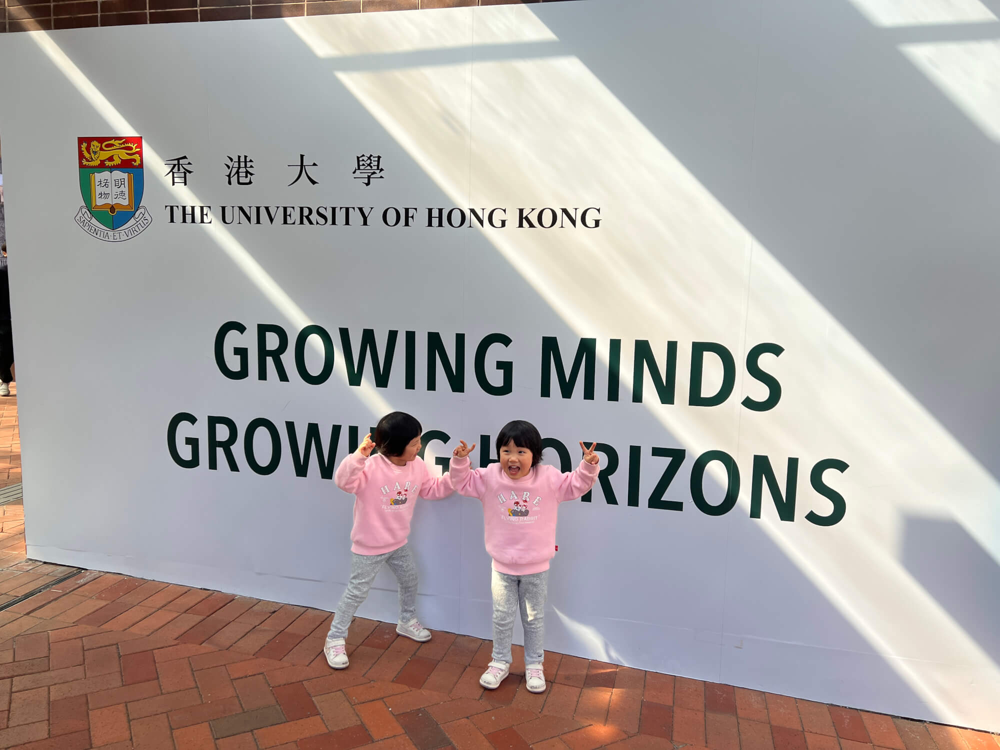
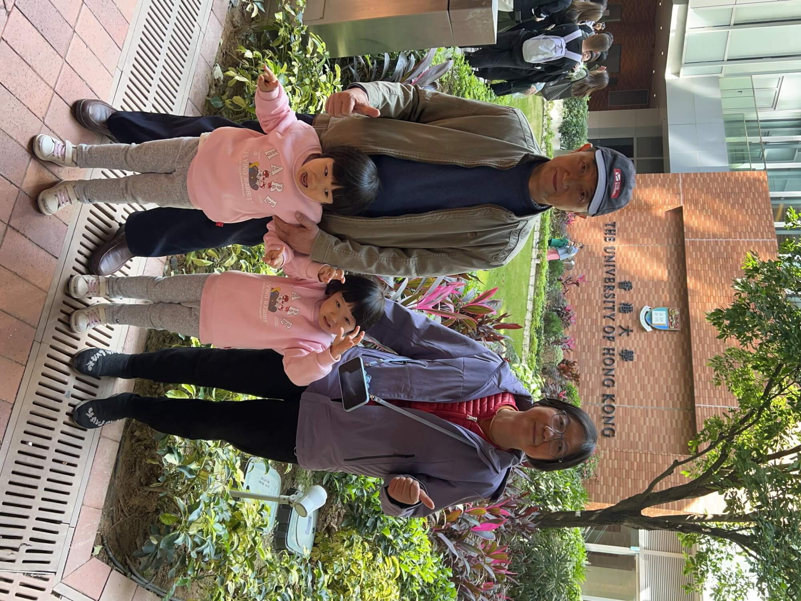
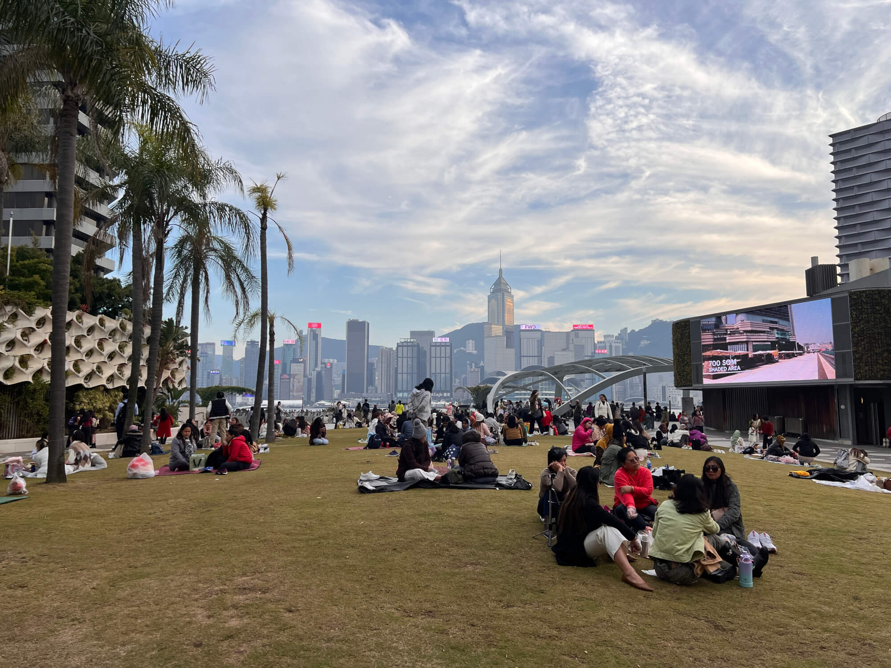
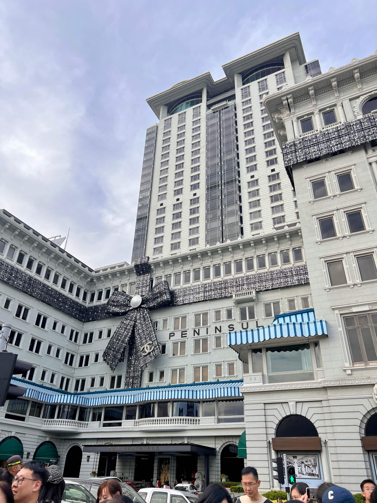
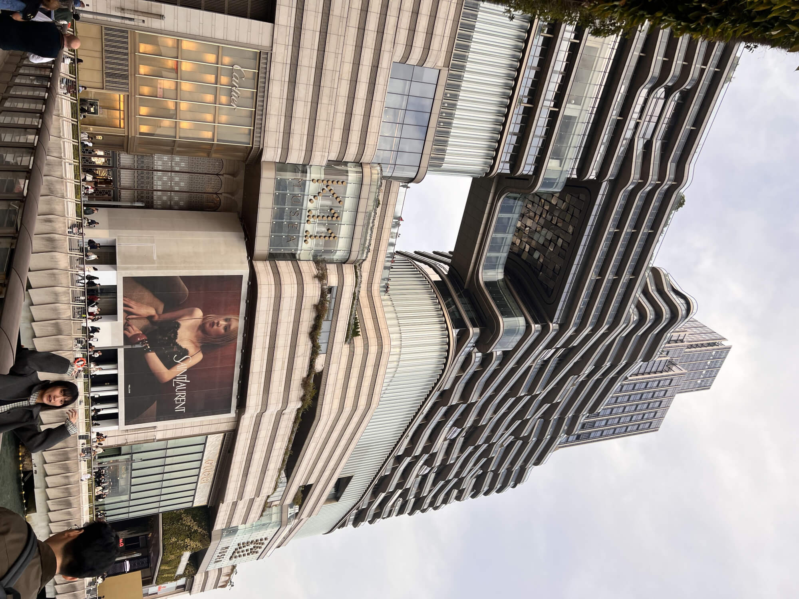
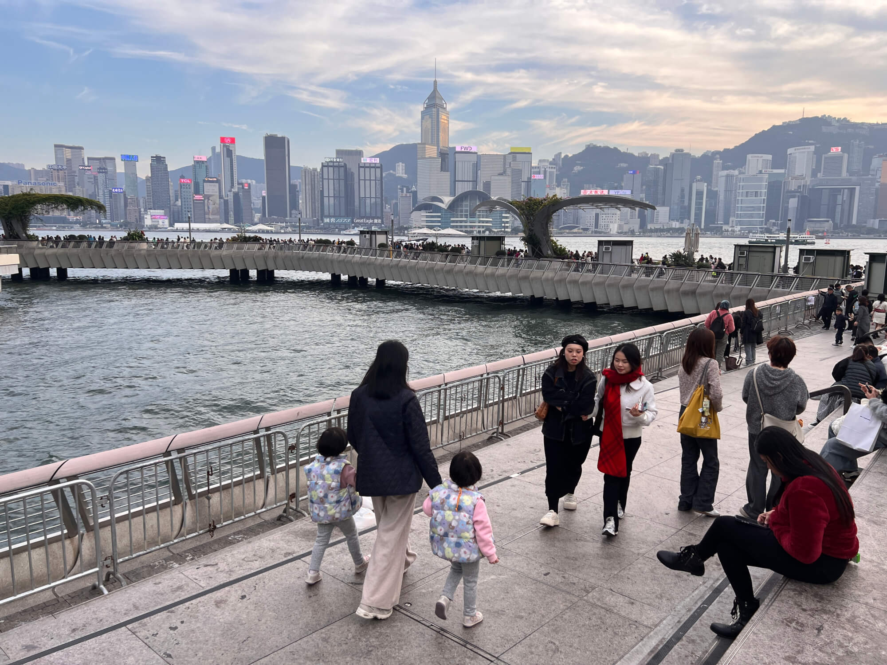
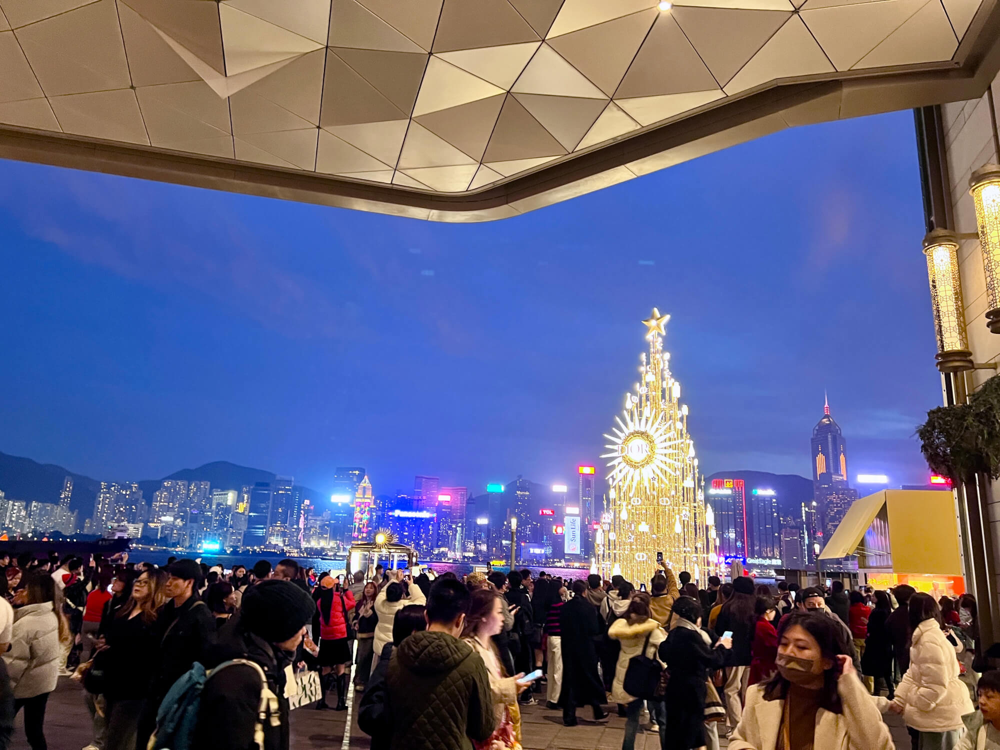

2024-12-22 周日 晴

## 🔬宝妈的科研日常与家中温馨画面
今天是星期天，宝妈作为一位科研工作者，依然心系实验室的任务，一大早就奔赴实验室继续做实验啦。而家中呢，爷爷奶奶则陪伴着宝宝，开启了寒假作业的小旅程。宝宝的作业充满童趣，大多是画画、贴贴画之类的，看着宝宝专注地摆弄着画笔和彩纸，爷爷奶奶在一旁耐心指导，画面别提多温馨了。忙活了一上午，将近 11 点，厨房里飘出阵阵饭香，原来是爷爷已经把午饭烧好了，一家人的上午时光充实又温暖。
<!--more-->

## 🏫漫步港大：历史与青春的碰撞

11点，我和爷爷奶奶带着宝宝们下楼 ，前往香港大学参观，港大周一到周六要预约，只有周日可以随意参观。我们沿着西营盘的巴丙顿道拾级而上，从港大的东门踏入这所充满底蕴的学府。一进校园，仿佛踏入了知识的殿堂，每一处角落都散发着历史的韵味。顺着大学街，一路向西，从本部校园朝着百周年校园前行，沿途风景如画，近处有山，远处有还。不一会儿，孙中山先生的塑像映入眼帘，旁边饶宗颐先生题字的碑刻更是为其增添了几分庄重。

校园里热闹非凡，不少留学机构带着小朋友们来游学，老师绘声绘色地讲解着港大的历史、人物，小朋友们听得津津有味。听说近年来这类游学活动在国内可是相当火爆，北京的清华北大、香港的高校以及欧美海外大学，一到寒暑假就人满为患，收费还不低呢！今天遇到的这些小朋友，看起来像是深圳的，他们离香港近，早出晚归方便，能有更多机会感受不同的学术氛围。

走着走着，来到了百年校园的网红墙，本想拍照留念，可排队的人实在太多，目测至少得等十几分钟，无奈之下，我们只能远远地拍了一张，然后从附近的地铁口出去，沿着般咸道慢悠悠地走回家，结束了上午的行程。

## 🌆尖沙咀的午后狂欢：购物、美景与美食的交织
下午，宝宝睡醒后，我和宝妈带着两个宝宝前往尖沙咀逛街。乘坐港岛线转荃湾线，在尖沙咀出站后，瞬间被热闹的氛围包围。往南朝着海边走去，哇，那场面简直太震撼了！人头攒动，到处都是熙熙攘攘的人群，圣诞前夕的消费热潮扑面而来，人们穿梭在各个店铺之间，尽情享受逛街购物的乐趣。

来到海边，眼前的美景让人心旷神怡。对面港岛的高楼错落有致，从中环的繁华商业区，到会展中心的现代大气，再到湾仔、铜锣湾的热闹街区，在阳光的照耀下熠熠生辉，背后的太平山巍峨耸立，为这幅画面增添了磅礴之气。

这边半岛酒店别具一格的香奈儿风格圣诞装饰吸引了众多目光，许多年轻漂亮的小姐姐在那里摆出各种姿势打卡拍照，成为一道亮丽的风景线。沿着海滨长廊和星光大道漫步，看到众多明星留下的手印，仿佛能看到他们曾经在这里留下的辉煌瞬间。

逛着逛着，我们走进了 K11 Musea，这座海边的文化地标商场可真是应有尽有，集公园、乐园、文化、艺术、购物等多功能于一体。宝妈一直心心念念一件可外穿可内穿的抓绒衣，于是我们直奔巴塔哥尼亚专卖店。在店员的热情介绍下，结合宝妈的需求，最终挑选了一件轻量级的 R1 Air款抓绒衣。购买后，宝妈还不放心，上网搜了搜评测，发现这款抓绒衣在众多品牌中确实表现不俗，当然，性价比最高的还是迪卡侬，不过巴塔哥尼亚的穿着舒适性和耐用性确实值得称赞。之后我们又逛了几家鞋店，可惜没有遇到特别合心意的款式。

逛累了，宝妈突然想起 K11 有霸王茶姬，这兴致勃勃地点了两杯，结果却在商场里迷了路，怎么都找不到店铺。一番搜索后才知道在尖沙咀另一家 K11 art 店。没办法，我们只好步行十来分钟前往。这家店离尖沙咀地铁站更近，靠近D口。到了 K11 art 店，一楼琳琅满目的奶茶店让人眼花缭乱，尤其是内地的知名品牌，像喜茶、霸王茶姬、奈雪的茶等齐聚一堂。我心里不禁犯嘀咕，为啥这些品牌都扎堆在这家店呢，海边那家 K11 游客更多，难道是租金太高？不得而知。

## 🏡温馨返程：带着美好回忆回家

天色渐晚，带着一下午的欢乐与收获，我们回到尖沙咀地铁站，踏上了回家的路。一路上，我带着宝宝们回顾今天的所见所闻，顺便完成了这篇日记的写作。这一天，虽然忙碌，但满满的都是温馨与幸福，希望以后的日子也能常常有这样美好的亲子时光。

💕感谢大家阅读我们的周末日记，愿你们也能拥有美好的每一天！