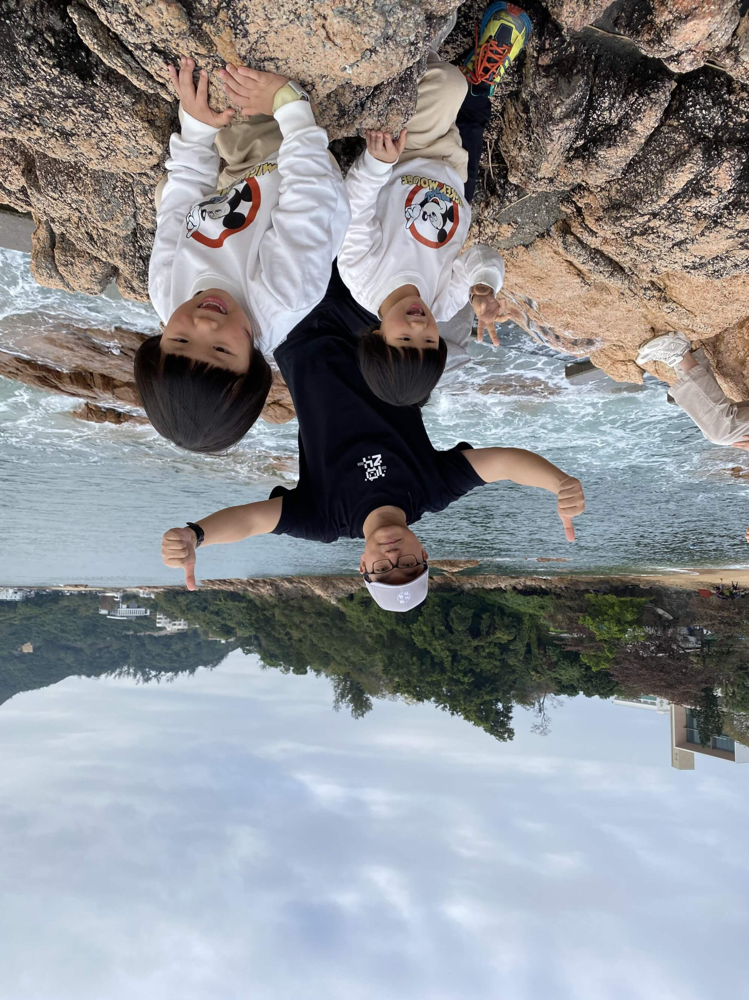
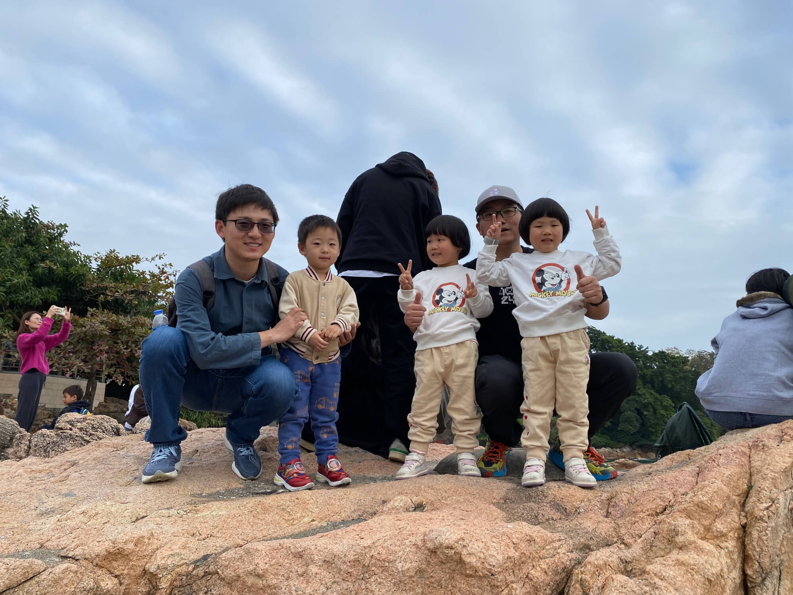
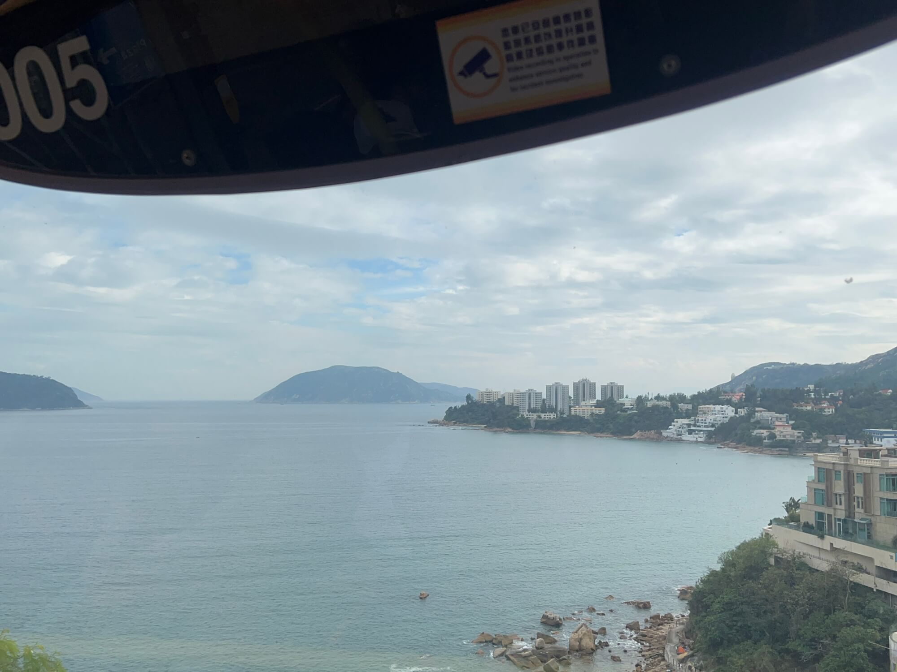
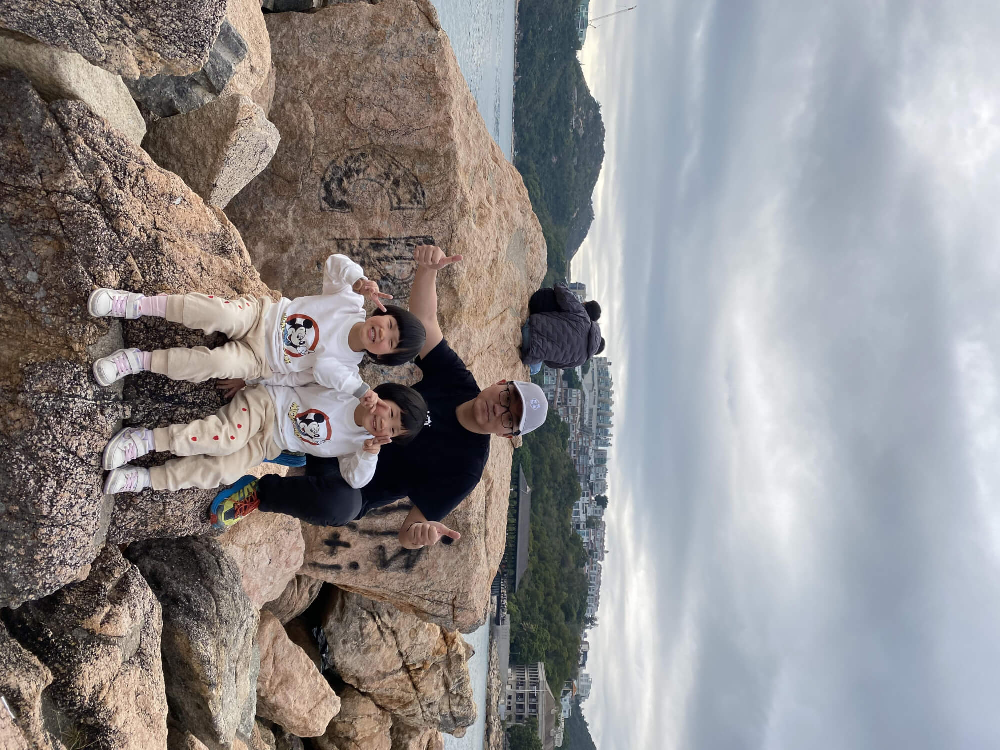
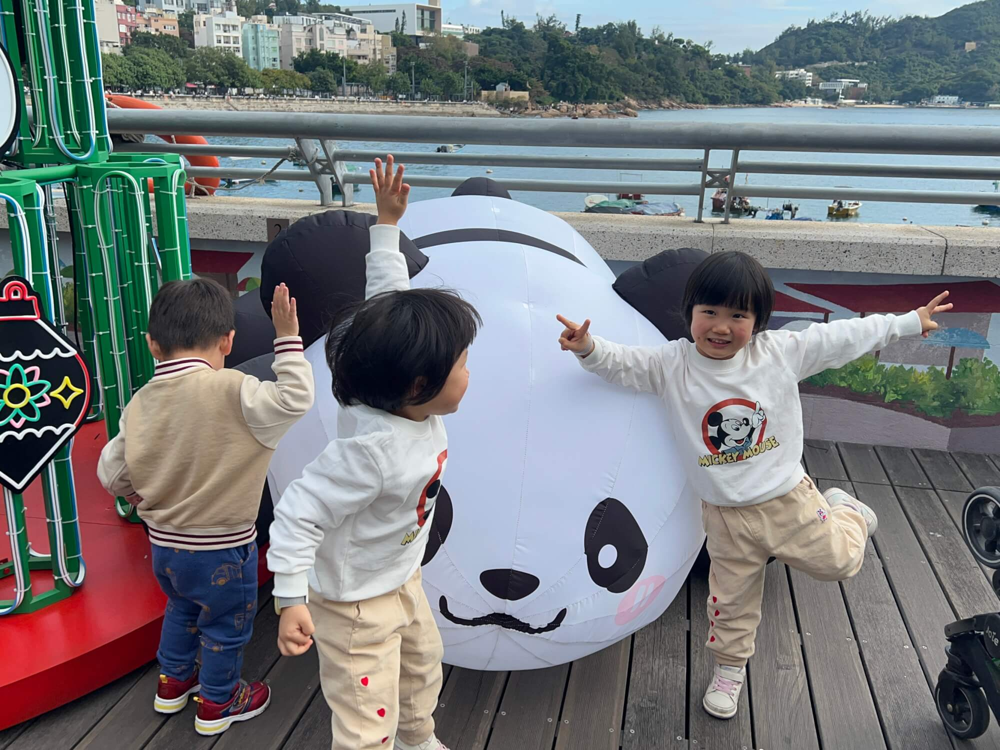
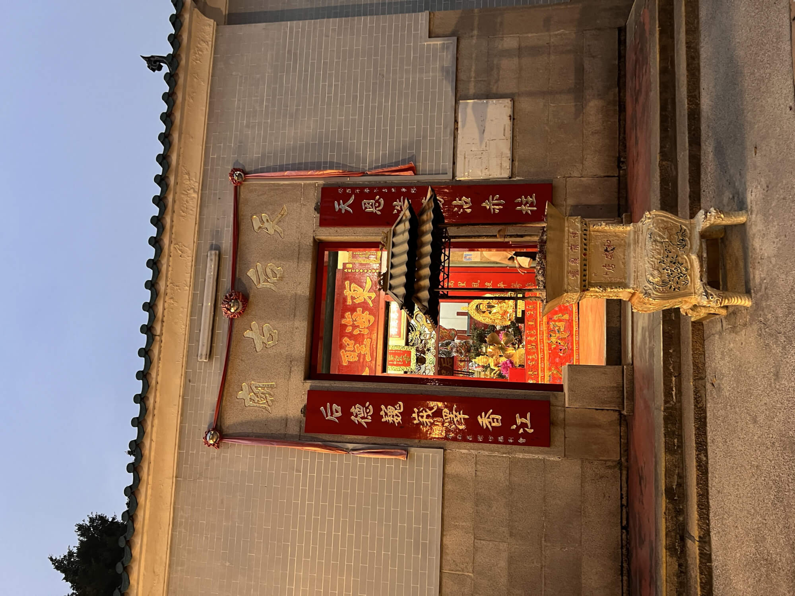
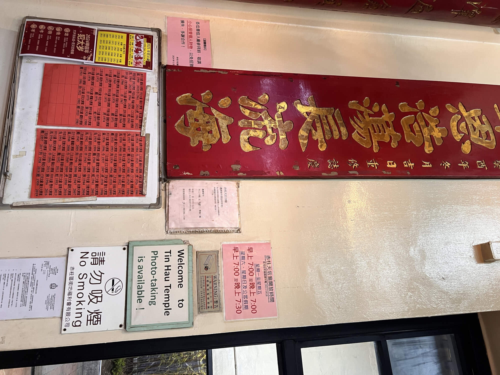
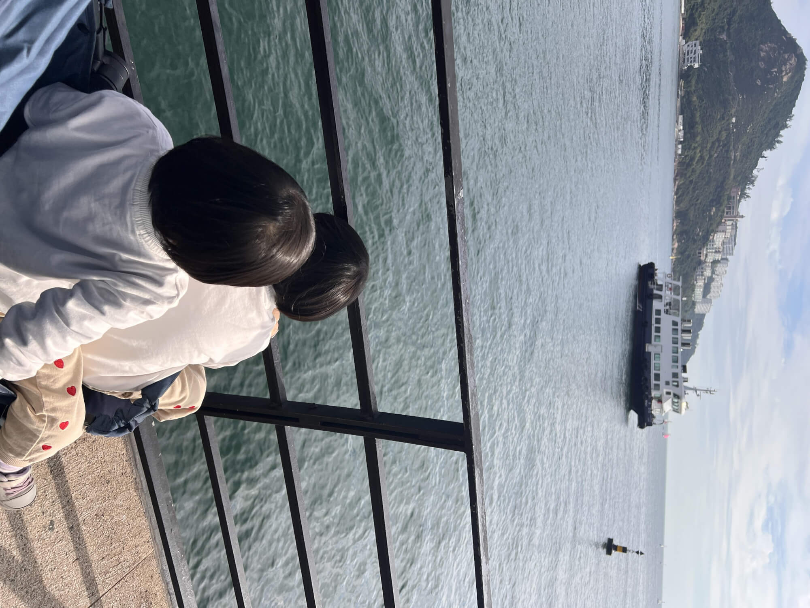
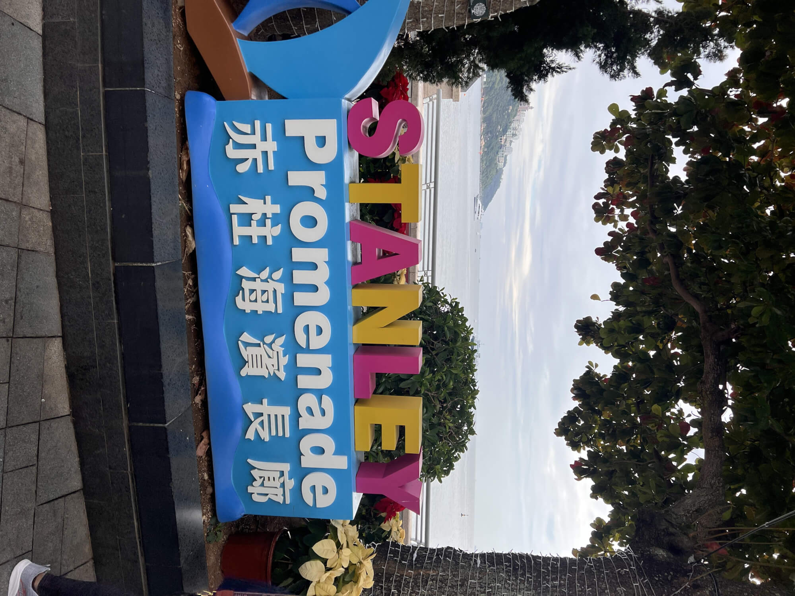
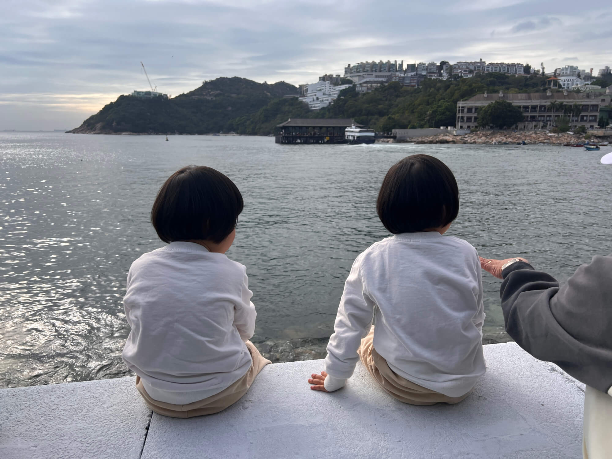

## 圣诞之约，老友重聚
不得不说，圣诞节应该是香港最热闹的节日了。整座城市都沉浸在浓郁的节日氛围之中，处处张灯结彩，洋溢着欢乐与温馨。商家挖空心思提供消费的机会，人们也尽情享受着节日的喜悦，各种精彩纷呈的活动轮番上演。在这一天，大家都能毫无顾忌地欢庆佳节，尽情释放自己的快乐，感受这座城市的魅力与活力。
<!--more-->

我和老朋友byvoid，徐喵喵相约，十年前大学毕业，我们一起乘坐火车穿越西伯利亚，如今香港重聚，各自带上小朋友，踏上前往赤柱的探索之旅，开启这充满欢乐的一天。

## 公交漫行，赏景赴约

从中环的交易广场出发，我们登上了 6 路公交，开启奔赴赤柱的旅程。6 路公交沿着蜿蜒的山路前行，山上郁郁葱葱的树木和突然出现的海景，让第一次在香港乘坐双层巴士的东东小朋友兴奋不已，他的眼睛瞪得大大的，好奇地张望着窗外的一切，时不时发出惊叹声，为这段旅途增添了许多欢乐的氛围。

## 赤柱初遇，海滨集市

赤柱位于香港岛的最南部，是一个充满魅力的小镇。它曾是英军军事据点，融合了本土小镇特色与欧式风情，拥有阳光海滩、独特建筑和购物饮食中心，是观光消闲的好去处.

经过大约一小时的车程，我们终于抵达了赤柱，在赤柱广场下车，这里正在举办第九届 “魔幻圣诞盛会”，广场上人头攒动，热闹非凡，市集上有很多文创产品、手工艺品、圣诞主题特色美食以及游戏摊位，浓郁的节日气息扑面而来，一片欢乐的海洋。

## 古迹探寻，文化寻踪

在赤柱广场不远处，静静矗立着始建于乾隆年间的天后古庙，这是香港最古老的天后庙之一，庙不大，游览的时候，我正犹豫能不能在庙里拍照，看到墙上用英文写着“Photo-taking is available”（可以拍照），开心极了~

随后，我们又来到了卜公码头，其独特的建筑风格吸引了我的注意，感觉和中环的码头很像，经过查询，铸铁上盖就是从中环的卜公码头迁移而来。这里也是拍照打卡的好去处，近处有轮船⛴和帆船⛵️，远处是一望无际的南中国海，波光粼粼，令人心旷神怡。

## 海滨嬉戏，童真童趣

接着，我们沿着赤柱海滨的长廊漫步，先是坐在海堤上聆听拍打海岸的海浪声，随后宝宝们在长廊旁的礁石上攀爬、玩耍，还蹲在沙滩上堆砌着属于自己的城堡，玩得不亦乐乎。看着孩子们纯真的笑脸和开心的模样，我们也感受到了这份简单的快乐和幸福。

## 返程之途，依依惜别

随着天色渐晚，我们沿着赤柱大街返回，街道两旁有很多摊位和小卖部，售卖着各种礼品和玩具，由于游客太多，餐位紧张，我们便在赤柱广场的麦当劳吃了晚餐。返程选择了 6X 路公交，候车的人潮超出了我们的想象，队伍蜿蜒数百米，我们等待了近一个小时，才终于挤上了车。6X和6路线路类似，不过不用翻山，而是走香港仔隧道，节省约20分钟。最后我们在香港站合影分别，期待下次在东京再见~

今天交流了很多话题，重点交换了0-3岁的育娃经验，我在内地和香港带过娃，朋友的娃在美国和日本生活过，各地的支持系统很不一样，有很多的有趣碰撞，明天再写，敬请期待~