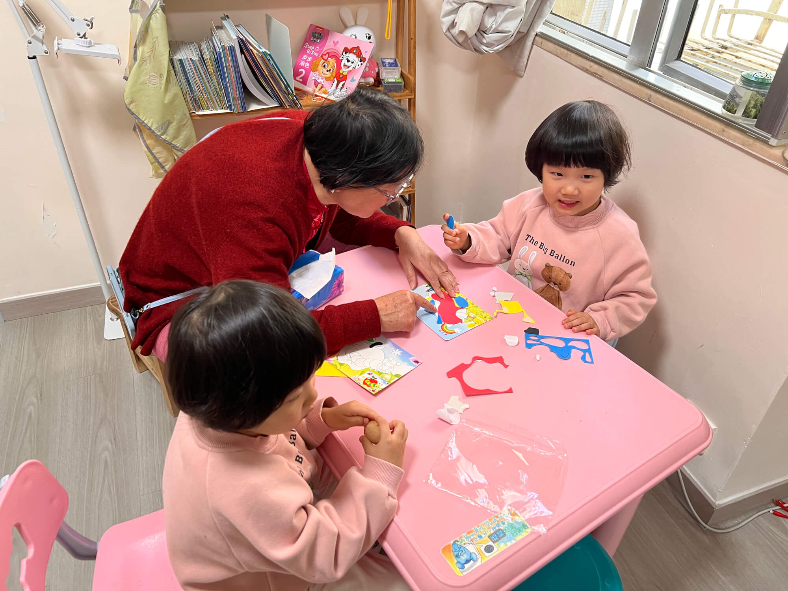
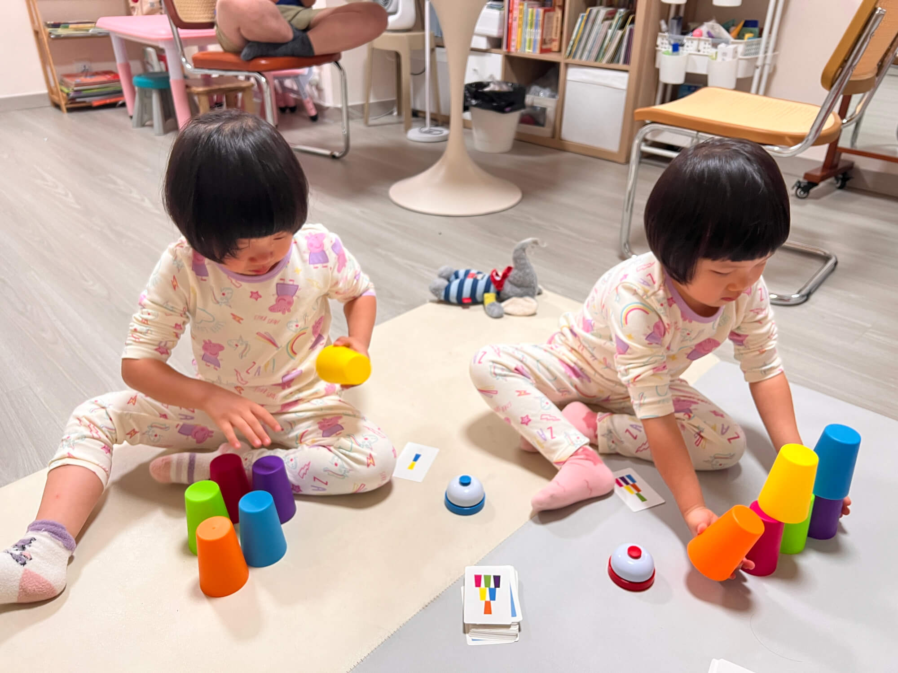
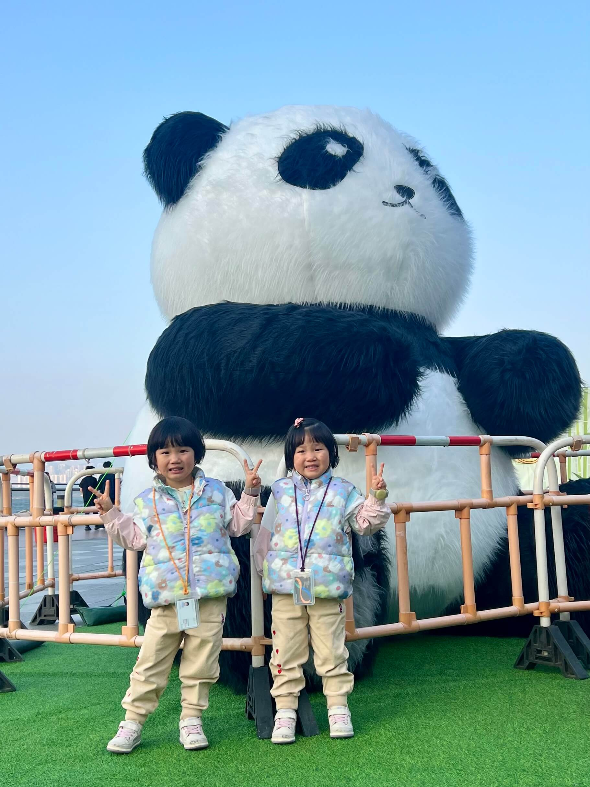
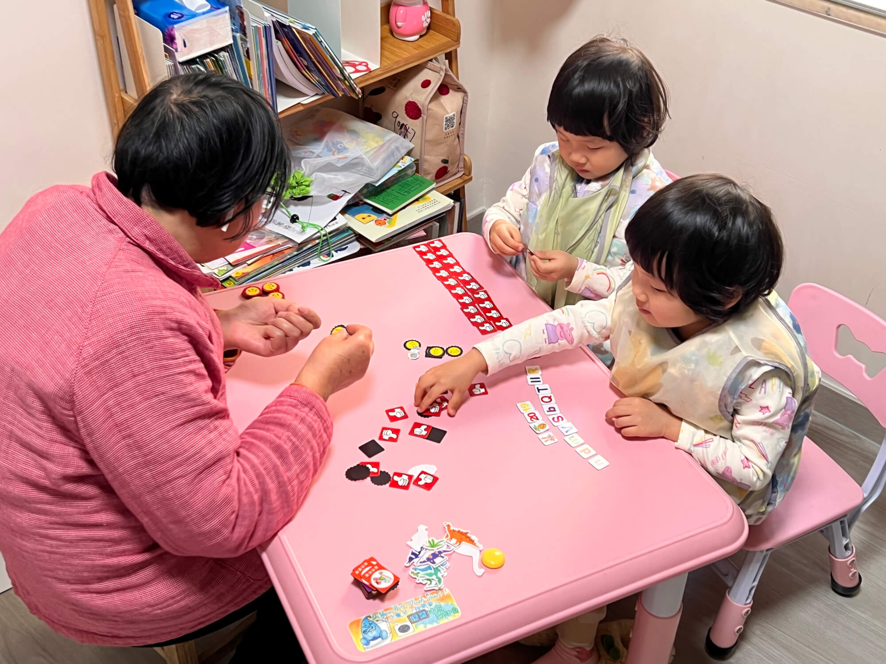

2024-12-30 星期一 晴

在育儿的道路上，长辈们常常会展现出令人惊喜的智慧和创意。今天，就来和大家分享一下宝宝奶奶带娃的奇妙故事。
<!--more-->

# 晨起新篇：传统游戏新玩法
清晨，阳光洒进屋内，一幅温馨的画面映入眼帘：奶奶正陪着宝宝玩摆不同颜色小杯子的游戏。这是我之前为宝宝购入的叠杯子益智玩具，配有 6 种颜色杯子和展示不同颜色组合形状的卡片，宝宝按照不同的卡片，把杯子按照颜色叠成下3中2上1的格式，旨在锻炼宝宝动手反映能力。而奶奶却在传统玩法上大胆创新，不仅如此，还对宝宝进行了特殊指导，这让我颇为惊喜。

# 记忆挑战：开启智慧新旅程
奶奶的创新玩法之一，是加入了记忆力考察环节。她先让宝宝仔细观察卡片上杯子的摆放样式，然后迅速将卡片收起。宝宝需要凭借自己的记忆力，在脑海中勾勒出杯子的位置，再动手进行摆放。这一玩法的转变，将简单的动手游戏升级为锻炼记忆力与动手能力的双重挑战，让宝宝在游戏中收获更多成长。

# 复盘成长：经验积累促提升
每次游戏结束后，奶奶的带娃智慧再次闪耀。她会带着宝宝们复盘游戏过程，比较两个宝宝的完成速度，并从中总结经验。像是某一局中，指出珊瑚双手同时抓两个杯子，摆放更快，而海兔双手只抓一个杯子，稍慢一些。通过这样的复盘，宝宝们将实践转化为经验，在后续游戏中愈发熟练，玩得越来越好，也让游戏时间充满了学习的乐趣。

# 创意无限：整理也能变游戏

奶奶的带娃妙招可不止于此。面对家里杂乱的小磁贴和小卡片，奶奶巧妙地将其转化为分类游戏。她带着宝宝一起，将这些小物件当成游戏道具，引导宝宝分辨不同类型，并将它们一一整理，放入对应的盒子中。在欢声笑语里，不仅让杂乱的物品变得井然有序，还让宝宝学会了分类知识，宝宝玩得开心，也达到了整理的目的，可谓一举两得。

奶奶带娃的这些创意玩法，不仅让宝宝在欢乐中成长，也为我们提供了宝贵的育儿启示。让我们一起学习长辈的智慧，用心陪伴孩子成长的每一刻。 