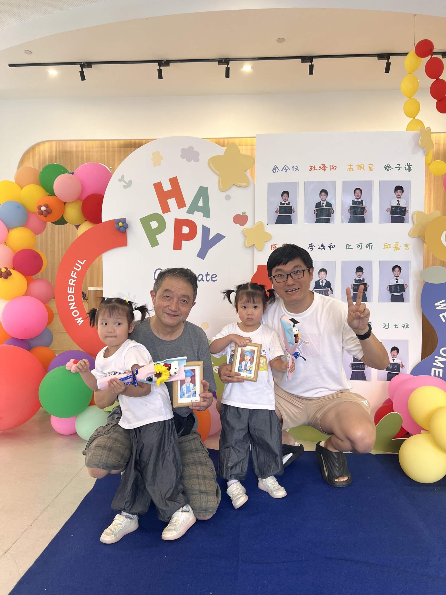

## 2024年的四个阶段

岁末之际，又到了撰写年终总结之时。回首 2024，于我而言，是忙碌充实的一年，大概分为四个阶段:

<!--more-->

### 沪上耕耘（1 月 - 7 月）
年初至七月，我主要定居在上海，两周回一次杭州，11-11-6的工作异常辛苦，在这座繁华都市留下了忙碌的身影和奋斗的足迹。

### 杭城搬家（7 月）
七月，短暂驻足杭州，忙着收拾行囊，筹备搬家事宜，在西子湖畔的短暂停留，充满了对新生活的期待与忙碌的琐碎。

### 金陵消暑（8 月）
八月回到老家南京，在陪伴孩子度过欢乐暑假的同时，继续整理物品，为下一次的搬家做准备，在长江边感受着亲情的温暖与生活的充实。

### 香江新篇（9 月 - 12 月）
九月抵达香港，两个宝宝开启幼稚园的学习生涯，我也开启了远程工作新模式。

这一年，竟在四个城市都留下了深度生活的印记，堪称近年来最为丰富多样的一年旅程。这一年，始终脚步匆匆，但也记录下了许多珍贵瞬间。尤其值得一提的是，AI 技术的进步显著提升了我的写作效率，临近年终竟能实现准日更，全年博客创作八十余篇，无疑是一份令人欣喜的收获。接下来，我将逐月梳理那些难忘的大事，回味这一路的风景与成长。 

## 一月：工作之余，生活多彩
年初的一月，日常工作占据了大部分时间，日常扎根于上海，办公室和出租屋两点一线穿梭。然而，周末时光却为生活增添了别样色彩。

元旦假期在杭州度过，去了湖州走亲戚，在法喜寺礼佛。随后的四个周末里，有两个周末回到了杭州，上午睡懒觉，下午带娃去了浙大西区等地方玩耍。

还有一个周末奔赴南京，外甥从美国归来，全家人相聚一堂，一同前往中山陵游玩，在庄严肃穆的历史古迹中感受亲情的温暖，之后的聚餐更是欢声笑语，其乐融融，为寒冷的冬日注入了浓浓的温情。

留在上海的那个周末，在华东理工附近参加了一个小的聚会，与群友们玩了财富流游戏，顺利带领大家出圈，在热闹的氛围中放松身心，为新的一年积蓄能量。

在 1 月的业余时间里，我沉浸于微信群AI机器人的开发与优化，对群消息、公众号文章进行总结归纳，提高了微信交流的效率，也感受着大模型的魅力。

## 二月：新春漫行，团圆相伴

二月的春节，除夕在杭州度过，放烟花，看春晚。大年初一上午前往灵隐寺，烧香祈福，许下美好的心愿。下午攀登北高峰，这是连续多年的习惯。初二奔赴湖州走亲戚，带宝宝做了摩天轮，晚上在西湖边和姑奶奶一家聚餐，初三前往西溪游玩。

初四到初六和宝妈带宝宝自驾前往苏州和无锡，初四去了苏州木渎古镇，初五上午参观了无锡博物院，下午于贡湖湾湿地公园欣赏太湖自然生态之美。初六返程路过苏州，品尝地道苏州菜，在诚品书店畅游书海，享受精神食粮，夜晚回到杭州温馨的家。

初七带娃漫步杭州的西湖的曲院风荷、岳湖，下午看了电影《热辣滚烫》。初八返回上海继续工作征程。

月末的26号是宝宝的三岁生日，生日前的周末赶回杭州，全家一起庆祝，在温暖的亲情包围中见证宝宝的成长，为二月的行程画上圆满句号。 

## 三月：赛事、生辰与探索之旅
阳春三月，生活被多样的活动填满，处处皆精彩。

### 激情中超月

三月中超联赛盛大开幕，3-1周五晚上，我亲临上海浦东足球场，见证了中超开幕式，目睹海港队以 3:1 战胜武汉队的精彩瞬间，紧接着的第二周周六，我又回到杭州，观看浙江队与海港队 0:0 战平的赛事，借助亚运余威，这场比赛的32087观众创造了浙江队史中超上座率新高，球迷们的热情呐喊仿佛仍在耳边回响。

### 南京城墙行

3 月 16 日迎来我的生日，我回到南京，携手老妈参观了南京城墙博物馆，一同领略历史的厚重与岁月的沉淀。夜晚，在充满烟火气息的老门东品尝美食，温馨的氛围让这个生日格外难忘。

### 科技前沿风
第四周，我在上海参与了一场先锋开发者大会，聚焦当下热门的 AI 领域。会上，前沿的技术理念、创新的应用成果相互碰撞，让我沉浸其中，收获颇丰，仿佛打开了一扇通往未来科技世界的新大门。

### 杭城春日浓

清明前夕的月底周末，我回到杭州，上午扫墓祭祖，在慎终追远中寄托对先人的思念之情，中午在西子宾馆里午餐，带宝宝感受西湖畔的美好春光，为三月的生活画上了一个温暖的句号。 

## 四月：多地奔赴，温情相聚
四月，趁着清明假期踏上旅程，平日里的周末也满是温情时刻。

### 深港之行

清明假期带宝宝前往深圳和香港，上一次到访香港还是去年 10 月的宝宝幼稚园面试，时光匆匆，眼看快到 180 天期限，便快进快出，海上世界、蛇口、上环、坚尼地城新海旁，都留下了的我们的足迹。

### 沪宁杭周末活动

四月第二个周末回了南京，与返乡的舅舅相聚一堂。

第三周周末在杭州，带娃去了兰里和中国美院良渚校区，享受亲子欢乐时光。

最后一个周末留在上海，去了上博东馆，还现场观看了上海海港1:1上海申花的德比足球赛，第一次现场看同城德比，氛围太好了，当然抢票不容易，安保也比平时严格很多。

## 五月：多彩假期，欢乐周末

五月，丰富多样的活动编织出一段段难忘的时光，无论是假期还是周末，都充满了乐趣与探索。

### 杭城假日游
五一假期，五天的悠长时光皆在杭州度过。带着孩子一同漫步于杭师大仓前校区，感受校园的青春活力与学术氛围；前往宝寿山，亲近自然，在山水之间嬉戏玩耍，放松身心；走进浙江省地质博物馆，探索地球的奥秘，开启一场奇妙的知识之旅。假期的最后一天，回到上海，踏入复旦大学的校园，吴阳阳带我领略了名校的魅力。

### 申城周末享

五月的周末同样精彩。十一号的周六，在上海体育馆聆听了蔡琴的演唱会，动人的歌声如天籁般萦绕耳畔，度过了一个美妙的夜晚。十八号的周六，参与了启昌私董会的聚会，分享了大模型应用的玩法。二十五号的周末，回到杭州，陪伴宝宝去了浙大博物馆，让孩子进行文化熏陶。月底还在上海体育场听了邓紫棋的演唱会，度过了一个活力四射的晚上。

### 亲子智趣伴

这个月，还精心买了几种不同的机器人编程等益智玩具，带着宝宝拼积木，并用平板控制。看到孩子兴致勃勃地摆弄玩具，沉浸在探索的乐趣中，脸上洋溢着开心的笑容，内心也充满了满足感，亲子之间的互动也因这些充满创意的玩具而更加亲密温馨，为五月的生活增添了许多温暖和幸福的色彩。 

这个月，还尝试了代餐粉减肥，初期有效果，后来没能坚持下去。

## 六月：端午出游与红色之旅
今年的六一儿童节刚好是周六，方便回杭州，观看宝宝们幼儿园组织的的六一汇演，还给宝宝准备了汪汪队瞭望台的大玩具，宝宝们很开心。第二天带宝宝们去了浙大紫金港校区，游览了求实大讲堂，还看了湖边的鸭子和天鹅。

### 福冈文化探索

端午假期前和佳鑫一起去了福冈。第一站抵达下关，参观日清和谈纪念馆，在历史的遗迹中感受岁月的沉淀，体会甲午战争的风云变幻。第二站自驾前往太宰府和九州国立博物馆，太宰府里的定远馆很不起眼，却是用打捞的定远舰残骸建设，作为曾经的"北洋水师"军迷，无限感慨！九州国立博物馆，主题是文化的交流，九州到中国上海、韩国首尔、日本东京距离差不多，位于东亚的地理中心，是三国文化交流融合的地点。之后在福冈博物馆、福冈塔、天神游玩一天，感受现代与传统的交织，体验福冈独特的城市魅力，每一处风景都印刻着不一样的风情。

### 红色游学征程

端午假期，参与了高老师的“十年千万商学院”游学活动，奔赴韶山和井冈山这两处革命圣地。在韶山，瞻仰毛主席故居，追寻革命先辈的成长足迹，感受那段波澜壮阔的历史起点；而后经过刘少奇故居，彭德怀故居，前往井冈山，重走革命道路，体会当年红军艰苦奋斗的精神力量，接受深刻的红色教育洗礼。之后自驾一天回宜兴，顺风车到无锡，最后乘坐绿皮火车回到上海，在旅途中回味红色之旅的震撼与感动，让心灵在历史与现实的交织中得到升华，为六月的行程画上了浓墨重彩的一笔。 

### 欧洲杯激情夜
六月的德国欧洲杯激战正酣，作为球迷的我沉浸其中，每日工作完毕回到家中，便迫不及待守在屏幕前，全身心投入这场足球盛宴。西班牙队的青春风暴在绿茵场上刮起，活力四射、配合默契，一路过关斩将，我亲眼见证了他们捧起冠军奖杯的荣耀时刻，那些夜晚因足球而热血沸腾，为六月增添了一抹别样的激情色彩。

## 七月：告别与新启，忙碌亦有温情
七月，是一个充满离别愁绪与新生活前奏的月份，诸多事务交织，构成了生活的复杂纹理。

### 双城告别与搬家打包

在上海的工作和生活于此月暂告段落。着手整理行囊，将上海出租屋中的物件寄回南京八大箱，自驾带回杭州一整车，同时处理了苏州的房产出售事宜，每一个决定都意味着生活轨迹的一次调整，在忙碌与不舍中，为过往的生活画上了句号。

### 亲子陪伴与毕业留念

这个月也是宝宝托班毕业的重要时刻，我特意留出几日陪伴在孩子身旁，穿梭于校园之中，用镜头记录下宝宝的上学日常，见证孩子成长路上的重要节点，并且找了各科老师录制了对宝宝的回忆和祝福视频，留下珍贵的回忆。

### 白蛇雅韵与奥运激情

7 月 20 号，我在杭州聆听了《新白娘子传奇30周年演唱会》，白蛇传的故事承载着我对这座城市最初的情愫，这场演唱会恰似一场与杭州的深情告别礼，在熟悉的旋律中回味往昔。

月底，巴黎奥运会盛大开幕，体育赛事的激情点燃了生活的热情。乒乓球与网球赛场的精彩对决成为关注焦点，运动员们的拼搏精神透过屏幕传递，让我在打包行囊的忙碌间隙，沉浸于体育竞技的魅力之中，为七月的生活增添了一份别样的活力与激情。 

## 八月：迁徙转折，奔赴新程
八月，生活的轨迹继续前行，经历了告别与新起点，在奔波中迎接生活的新篇。

### 杭城辞行与工作新篇

月初，与生活许久的杭州家依依惜别，每一件物品都有过去生活的痕迹，收拾起来真得有万般不舍，最后先寄了十几箱到香港，再用货拉拉满载着生活的过往与回忆，驶向南京。

### 扬镇文化熏陶

月中，携家人前往扬州、镇江。游览了扬州博物馆、镇江博物馆、金山寺，富春茶社的晚餐，更是品味到了扬州美食的精致韵味，两日的旅程沉浸在文化与美食的交融之中。

### 六朝遗风探索
下旬，在南京的家中，又整理出近十大箱行李寄往香港。顺便带娃走亲访友，还去了南京六朝博物馆等地点，今年暑期各种博物馆过于热门，不算是带娃出游的好时机。

### 自驾江西探寻

月底，自驾旅程拉开帷幕。从南京出发，一路南下，经安徽、江西，抵达广东，目的是把车放到深圳，为后续的生活做好准备。四日的自驾路程主要游览了物华天宝，人杰地灵的江西。首日抵达南昌，深入参观海昏侯墓、滕王阁以及江西博物馆；继而前往吉安，探寻吉安博物馆，领略当地独特的文化魅力；再到赣州，驻足赣州博物馆与郁孤台，在历史遗迹与文物瑰宝中穿梭，体悟岁月的沉淀与传承。

### 香港新家初印象

行程的终点是香港，在八月的尾声入住新家。初入家门，便忙碌于收拾整理行李，熟悉新的居住环境，让这个陌生的空间逐渐充满家的温馨与生活的气息，也标志着八月的奔波暂告一段落，即将开启在香港的全新生活篇章，怀揣着对未来的憧憬与期待，迎接未知的精彩与挑战。 

## 九月：工作新启，双城生活
九月，生活翻开崭新一页，从南京到香港，开启新生活。

## 金陵工作序曲

月初开启职业生涯新征程，先远程工作，未来也可以在香港线下办公。工作之余，继续探访南京的文化古迹，带娃去了南京博物院，自己也趁着周末游览了天妃宫、静海寺。

## 香江生活新篇

月中，带着宝宝奔赴香港，正式开启港漂岁月。白日投身于工作，夜晚则陪伴孩子，辅导作业，或是漫步香港街头巷尾，探索城市的每一处新奇角落，记录下在港生活的点滴日常，汇成一篇篇港漂日记。周末的时光，穿梭于香港与深圳之间，感受双城的不同风貌，在深圳主要是采购和放松，回到香港则专注于熟悉周边环境，从邻里小店到公共设施，逐步融入香港的生活节奏，在陌生中找寻家的温暖与归属感，让九月成为新生活的坚实起点，向着未来稳步前行。 

## 十月：多彩港城假日与双城周末探索
金秋十月，在香港这片充满活力的土地上，假期与周末都绽放出绚丽多彩的生活之花。

### 港城十一狂欢

十一长假期间，全身心沉浸在香港的独特魅力之中，感受节日的欢庆氛围。在维港看了烟花秀，璀璨夺目的光彩照亮了整个港湾。还参观了香港故宫，东涌东荟城，并与朋友们聚会，带孩子游玩了香港的许多地方。

### 双城周末逸趣

十月的周末同样精彩纷呈。月中的周末带娃去了深圳玩耍，体会北上消费的感觉。随后的周末奔赴浅水湾，那里的沙滩、海浪与阳光构成了一幅松充满弛感的画卷，孩子在海边尽情嬉戏玩耍，享受大自然赋予的美好。

月末，再次踏上深圳的土地，走进南山博物馆，还在阿奇拉水疗中心舒缓身心，褪去一周的疲惫；回到香港后，又带着孩子踏入梦幻的迪士尼乐园，在童话般的世界里，孩子的笑声回荡在每一个角落，为十月的生活画上了一个圆满而充满童趣的句号。

## 十一月：沉浸香港生活，偶赴深圳之约

整个月的大部分时光，都全身心投入到香港的生活中。除了月底去了一趟深圳盐田，中英街，其他周末都在香港度过。每个周末都会带娃参加各种活动，石塘咀儿童乐园，西九龙禁毒嘉年华，九龙公园电信嘉年华，让孩子在不同的活动中体验快乐、增长见识，也进一步增进了亲子关系，同时自己也对香港的文化和生活有了更深入的了解。

### 十二月：忙碌港城，多彩周末

十二月，整月都在香港，工作愈发忙碌，周中全力办公，但周末依旧会抽出时间陪伴家人。带娃参加了渣打艺趣嘉年华、湾仔节水嘉年华，消防嘉年华，DRT潜水展，幸福家庭博览会等，下旬开启了健康又惬意的户外运动模式、在龙虎山、卢吉道等地徒步，还看了皇马vs巴萨的传奇元老赛。月底爷爷奶奶来到香港，宝宝也迎来了圣诞两周假期，上午爷爷烧饭，奶奶带着写作业、下午出去玩，我则继续坚守工作岗位，为这一年的工作画上句号。

回顾 2024 年，从上海、杭州、南京再到香港，生活和工作的环境发生了很大的变化，但我积极适应，努力平衡工作与生活，让自己和家人都在这一年中收获满满。希望在新的一年里，能够继续保持这份热情和积极心态，让生活更加丰富多彩，工作更上一层楼。
