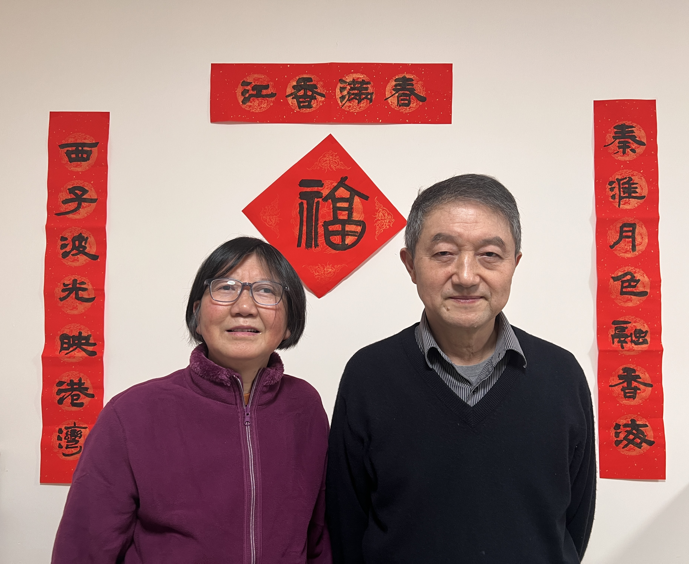

2025 年 1 月 9 日，星期四，晴

## 春节将至，筹备开启

春节的脚步越来越近，爷爷奶奶要回南京准备过年了。在他们离开前，我们决定好好布置一下在香港的家，迎接这个重要的节日。

<!--more-->

## 精心筹备，情系墨香

爷爷热爱书法，我深知他一定很期待能亲手为家里写春联。于是，考虑时间紧迫，我选择在京东购买所需物品。京东的物流速度真的太给力了，晚上 11 点前下单，自营商品第二天就能送达香港，11 点后下单第三天也能到。而且还有满 299 包 10 公斤邮费的政策，虽然需要凑单，但也不难。我买了七言的对联纸、写福字的方形纸、毛笔和墨水，还顺便买了些零食凑单。

## 快递送达，墨香四溢

快递很快就到了，奶奶兴奋地打开包裹。爷爷迫不及待地抽出时间开始书写。他先写了各种字体的福字，隶书的古朴、楷书的规整，每一个福字都饱含着对新年的美好祝愿。还有 “祥” 字，以及包含宝宝名字 “怀瑾握瑜” ，充满了家的元素。

## AI 助力，春联添彩

接着准备写对联了，我想用含有我们家特点的内容，于是教爷爷一个好办法：借助 AI 助手写春联，给出提示词：“请帮我写 10 个春联，上联下联都是 7 个字，要求主题包含南京人、杭州人在香港过春节”。没想到 AI 很快就生成了好多富有创意的春联，爷爷从中挑选了一个特别满意的，然后用毛笔认真地书写下来，那字迹苍劲有力，让人赞叹。

## 欢乐合影，喜庆满溢

因为我和宝妈是否回南京和杭州过年还不确定，所以提前拍全家福。晚饭过后，我们给宝宝穿上了红色的衣服，家里瞬间更有过年的氛围了。墙上贴好爷爷写的对联、横批和福字，我们一家人站在前面，准备拍摄春节全家福。不过拍照的时候，家里的 “小调皮” 珊瑚海兔不太配合，好多照片里它的表情都很滑稽，让我们笑得不行。

## 更换装饰，迎接新春

拍完照片，我们又一起用贴纸、春联和横批替换了大门上之前圣诞节的圣诞树装饰。看着焕然一新的家，春节的气息扑面而来。这个春节筹备的过程，充满了欢乐与温馨，每一个细节都让我们感受到家的温暖和节日的喜悦，真的太难忘了。
