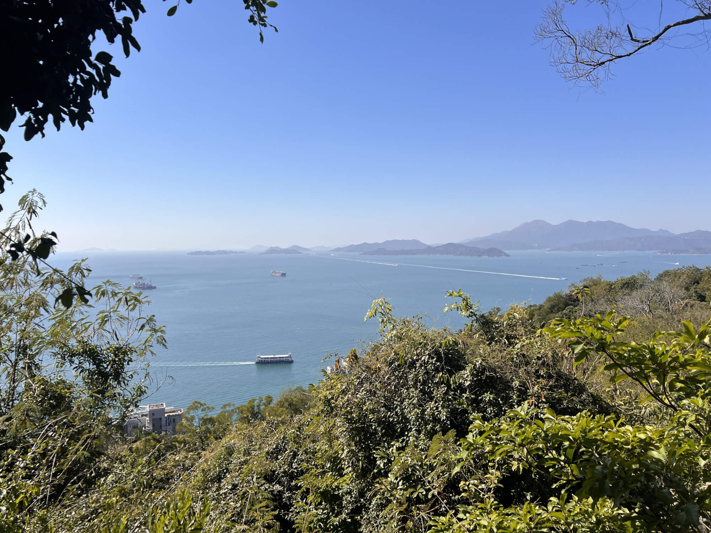

2025年1月12日，星期日，晴

在城市的喧嚣中，我们总是渴望着一方能让心灵栖息的净土。而港岛的高楼大厦之外的山水之间，恰好藏着这样的宁静与惊喜。本周，我在网上刷到轨迹为恐龙图案的25公里的徒步线路，刚好符合我的周末拉练需求，而且景色景色宜人，于是我开始用脚步去丈量土地，用心灵去感受自然。
<!--more-->

## 海边漫步，阳光与海的色彩交响

上午从坚尼地城漫步至摩星岭西侧的海边。这里的一切，仿佛一幅徐徐展开的画卷，瞬间吸引了我全部的目光。

眼前的美景令人惊叹！今天阳光正好，在阳光的轻抚下，海水呈现出独特的色彩。不再是多云天时的深沉蓝色，此时的海水是淡蓝色中透着微微的绿色 。这种清新而独特的色调，宛如大自然精心调制的色彩，比那深沉的蓝色更显灵动与明媚，美得让人移不开眼。

近处，宁静的港湾尽显祥和之态，船只徐徐航行，仿佛在诉说着一个个关于港湾的故事。远处，交椅洲与大屿山相互映衬，构成了一幅绝美的山海画卷。连绵的山峦与辽阔的大海相互交融，真的是美不胜收，让人心旷神怡。

## 登顶摩星岭，探寻历史与美景

我开始攀登摩星岭，正式进入山林，沿着蜿蜒的盘山公路前行，途中行车的盘山公路，也有台阶的捷径。巧妙地利用这些小路，不仅少走了重复路，还让登山变得更有趣味。在快到山顶处，赛马会的青年旅社出现在眼前。旅社内部为提供住宿，外部的露营区域则充满着自然的气息，是个亲近自然的好地方。

继续拾级而上，不久到达了海拔约200米的摩星岭山顶，首先映入眼帘的是古老的炮台，它曾是英军的遗迹，在二战期间遭受了日军的轰炸和炮击，岁月的痕迹清晰可见。再往后，看到雷达站、军营、厕所遗迹，各处遗迹处虽然分散，但每个遗迹旁都有清晰的介绍牌，完善的告示信息让我能深入了解这段历史。军营的房子内设有中英双语的展览，详细介绍了炮台的分布和历史，

站在山顶向下俯瞰，阳光洒在碧蓝的湖面上，波光粼粼，美不胜收。

## 邂逅薄扶林的别样风景

离开摩星岭，旅程从薄扶林道路开启，为了走出恐龙的手，要从穿越薄扶林坟场下山，再从碧荔道上来，回到薄扶林道，然后从薄扶林村再进山。

当我从薄扶林道拐进置富道，路左边的薄扶林村棚户区一下子吸引了我的目光。在繁华的港岛，这片区域显得格格不入。这里没有高楼大厦的宏伟，房屋随意地排列着，缺乏精心规划。底层是居住的空间，顶层则搭满了棚子，五颜六色的衣物在风中飘动，展现出一种无序却真实的生活状态。这让我看到了港岛不为人知的一面，繁华背后，也有着这样为生活努力打拼的角落。

## 薄扶林郊野公园

再次进山后是薄扶林郊野公园，这里被郁郁葱葱的树木环绕，空气格外清新，仿佛置身于一个与世隔绝的绿色世界。这条路线与我之前在走过港岛径只有很少有交集，对于不喜欢走回头路的我来说，充满了新鲜感和挑战。

这段路大部分是硬地面，能容纳一辆汽车通行，可能有防火道的作用。途中也有一段野路，充满了自然的野性。行走时得时刻留意路标或导航，不然很容易迷失方向。不过，这种探索未知的感觉让我兴奋不已。

## 山顶的奢华与美丽风光
到达山顶后，先沿着山顶道下行，在中石化加油站进行了补给。随后从一条狭窄的小道上山，爬到施勋道，施勋道非常狭窄，仅能容纳一辆车通行，道路两旁是一栋栋独立的豪宅，建筑精致复杂，尽显奢华。这里曾经是被评为世界上最贵道道路，律政司司长官邸在下方，上方有许荣茂和吴官正的豪宅，环境优雅，让人不禁感叹这里的宁静与繁华。

接着来到了山顶广场，经夏力道，从西侧爬到山顶公园。站在山顶公园往港岛南边望去，美丽的海岸线和城市景色尽收眼底，美不胜收。之后我沿着东侧的柯士甸山道往下，切到卢吉道，又回到龙虎山。这一段下山的路我比较熟悉，走起来轻松了许多。最后从龙虎山下到薄扶林道，回到起点坚尼地城，结束"恐龙径"的旅程。

### 港岛恐龙径全程回顾

港岛的恐龙径全程约25公里，总爬升达1100米 ，整体难度不算高。全程路面状况良好，几乎都是硬地面，只有龙肚子部分存在一段野路，粗略估计全程野路加起来不超过一公里。对于跑步爱好者而言，需要穿过基督教华人永久坟场的这一段路，可能会有些心理上的忌讳，但除此之外，全程没有其他大问题。路面主要是柏油路和硬台阶路，其中硬台阶路占比较大。

### 个人状态评估
今天测试下来，我的状态还算不错。完成25公里后，身体虽有些疲劳，但仍感觉有劲，照此状态，正式比赛时再坚持坚持，应该能够跑完全程。身体也没有出现太多不适，目前只有右脚大脚趾有一点甲沟炎，稍有疼痛，不过还在可忍受范围内，比赛前需要想办法处理一下。

### 装备使用反思
在行走过程中，明显感觉借助登山杖爬坡比自己单纯攀爬要轻松许多。但遇到长下坡时，收纳登山杖比较麻烦，现在收纳登山杖要么找人帮忙，要么得脱下背包，十分耽误时间。后续打算对自己的越野包进行改装，尝试把登山杖放在前面，方便取用和收纳。

### 赛前准备情况
目前大部分赛前所需的装备都已购置齐全，只剩下一两个小件物品，计划周一白天在京东下单，最快周二或周三就能送达。

### 饮水情况考量
今天25公里的行程中，我喝了大约2.5升水，差不多每十公里一升水，甚至可能不需要这么多。由于比赛时每十公里设有一个补给站，所以饮水问题不大，届时可以考虑少背一些水，减轻负重。 