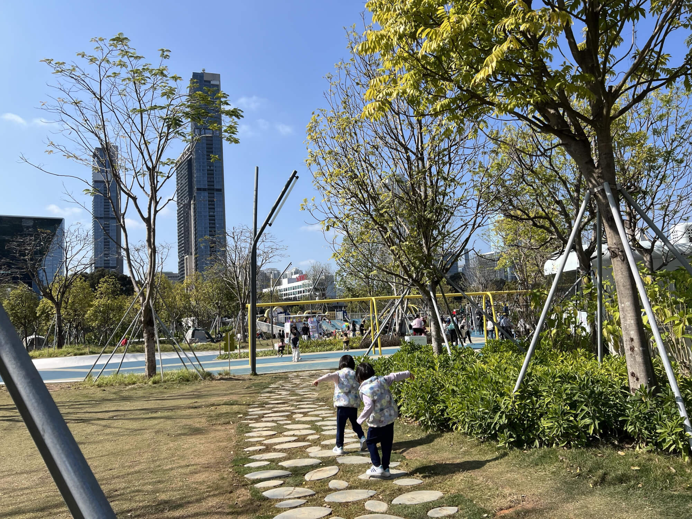
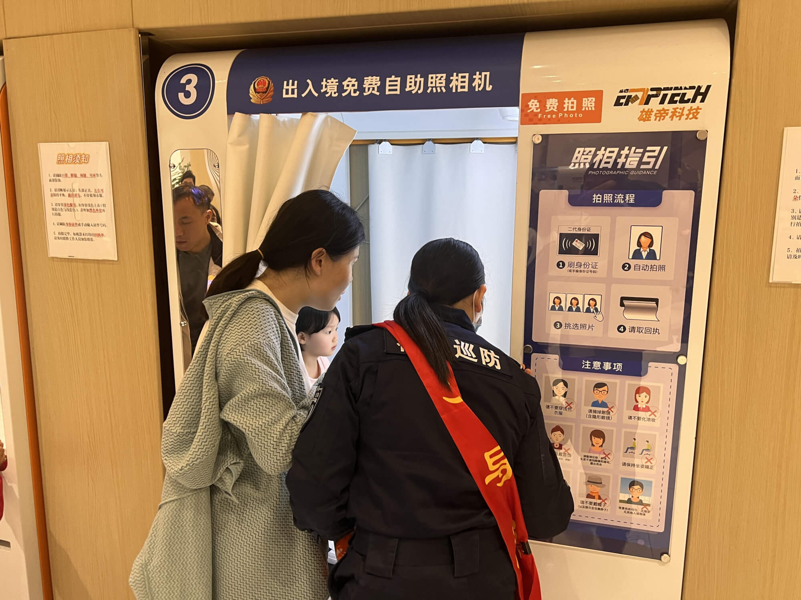
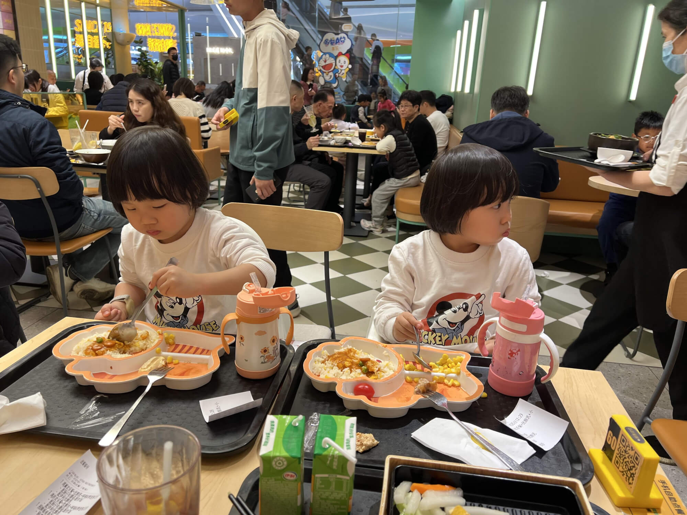
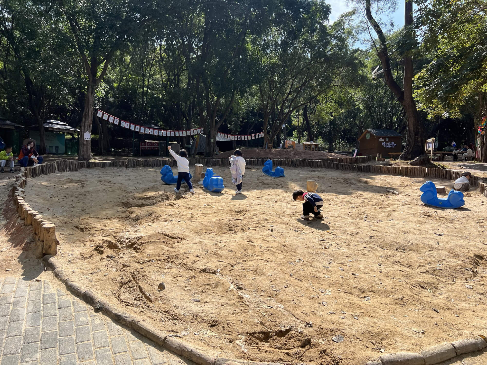
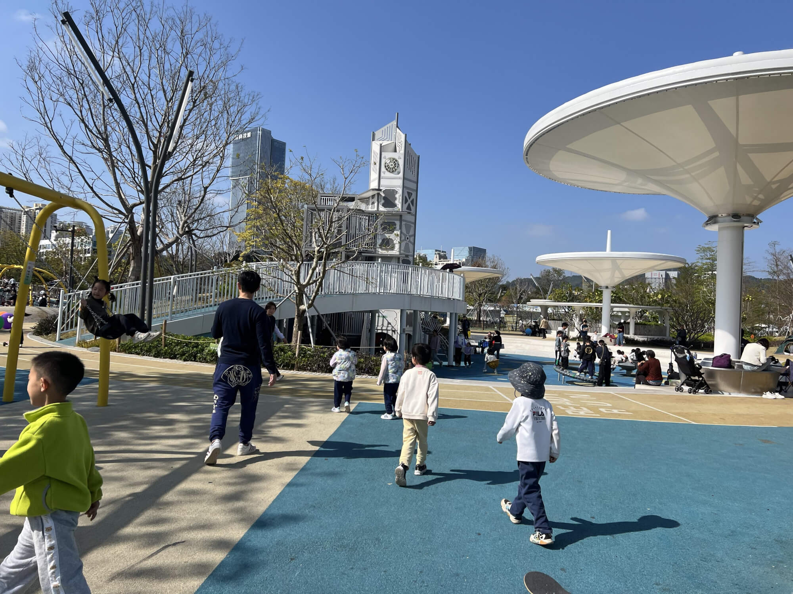
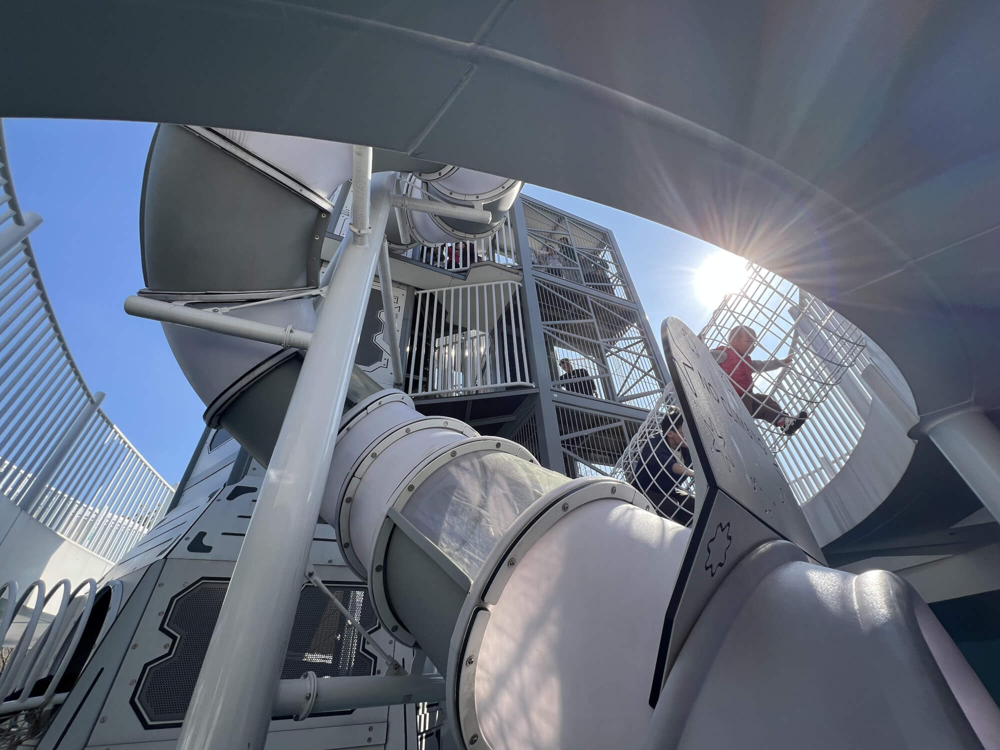
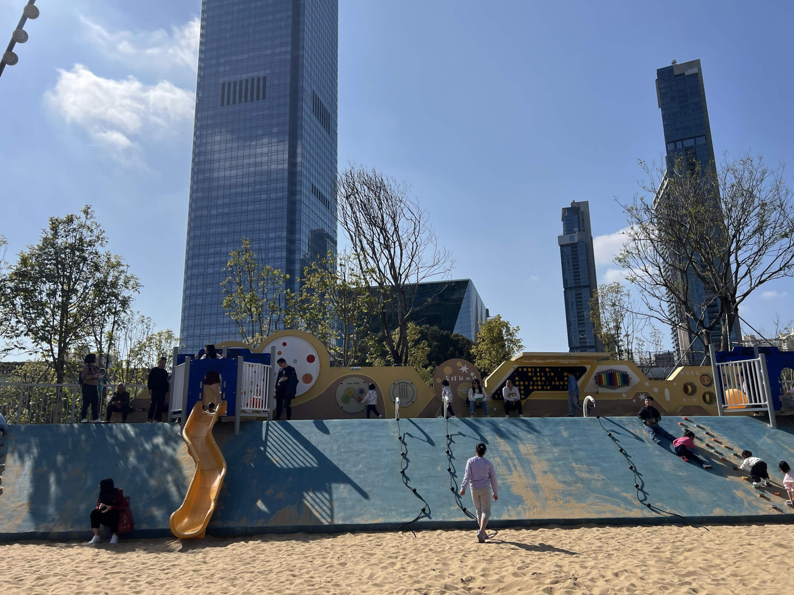

2025-01-25 深圳 晴

## 福田出入境办证
24号晚上抵达深圳，住在靠近福田区出入境的沙尾地铁站全季酒店的双床房，房间里空间局促，价格比我们在惠州住的五星级还高，我们把两张床拼在一起，宝爸宝妈睡两侧，两个宝宝睡中间。<!--more-->
<!--more-->
25号早上去了福田区出入境服务大厅，办理港澳通行证的逗留签续签，顺便提交了加急申请，预计三个工作日内出证（具体的优才续签流程，我会等全部流程完成后再写一篇攻略）。

##  亲子游目的地选择
随后宝爸开始上班，宝妈我决定带着孩子们出门游玩。一直听闻深业上城很不错，可一直没去过，于是我把它定为了此次出行的目的地。查看周边攻略后，惊喜地发现深业上城连接着莲花山公园和笔架山公园，通过连廊就能直接抵达这两个森林公园，丰富的游玩选择让我对这次出行充满期待。

## 深业上城的午餐时光

我们先来到深业上城，在商城里享用了美味的午餐，补充好能量后，便前往三楼的外街。站在那里，仿佛已经能感受到公园带来的自然气息，连廊就像是通往欢乐世界的桥梁，正等待着我们去探索。

## 莲花山公园的童趣时光

沿着连廊没走多远，就到达了莲花山公园。这里有几个小小的沙池，还有一些可爱的秋千。孩子们一看到沙池，就迫不及待地冲了过去，尽情地在沙堆里玩耍，一会儿堆城堡，一会儿挖地道，玩得不亦乐乎。玩了好一会儿，我带他们冲洗干净手脚，准备开启下一段旅程。

## 笔架山公园的欢乐冒险

就在这时，我偶然得知笔架山公园有大型儿童游乐场，孩子们一听，瞬间没了睡意，吵着闹着要去玩。

于是，我们又穿过外街，来到了笔架山公园。果然，这里的游乐场十分壮观，高高的滑滑梯、各式各样的攀爬架，还有大大的沙池，沙池上面还配备了许多有趣的游乐设施。孩子们兴奋极了，两人紧紧抱在一起，从高高的滑滑梯上飞速滑下，脸上洋溢着抑制不住的喜悦。

## 欢乐中的小插曲

孩子们玩得太投入了，连尿尿的时间都忘记了，结果不小心尿湿了裤子。无奈之下，我只好给他们买了新裤子换上。不过这小小的插曲并没有影响大家的心情，换好裤子后，我们带着满满的欢乐和美好的回忆踏上了回家的路。这真是开心又难忘的一天！ 

## 红包封面时间
500个卡通蛇图案的红包封面，欢迎免费领取~

领取完别忘了点个赞或者留个言哦~