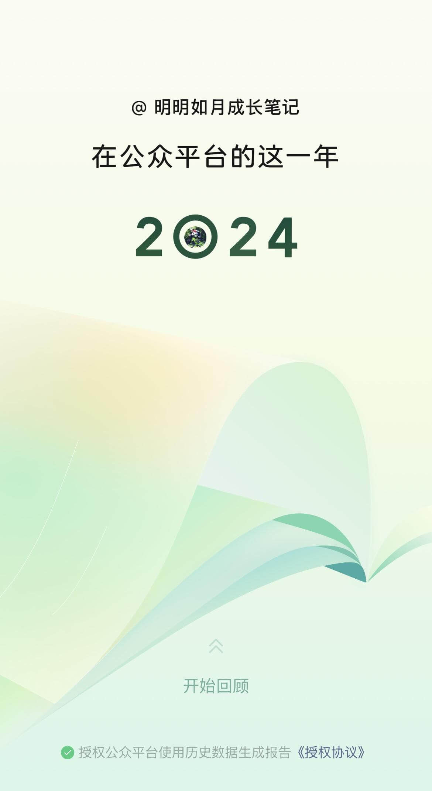
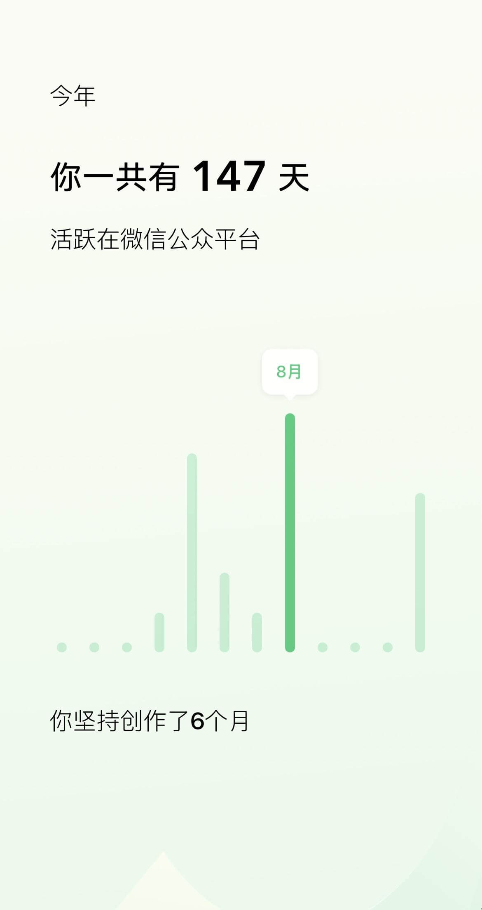
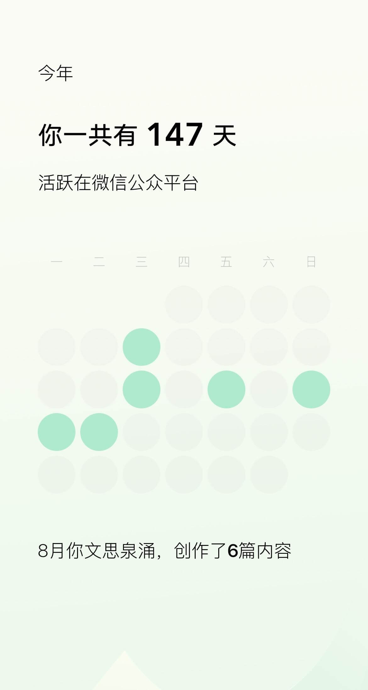
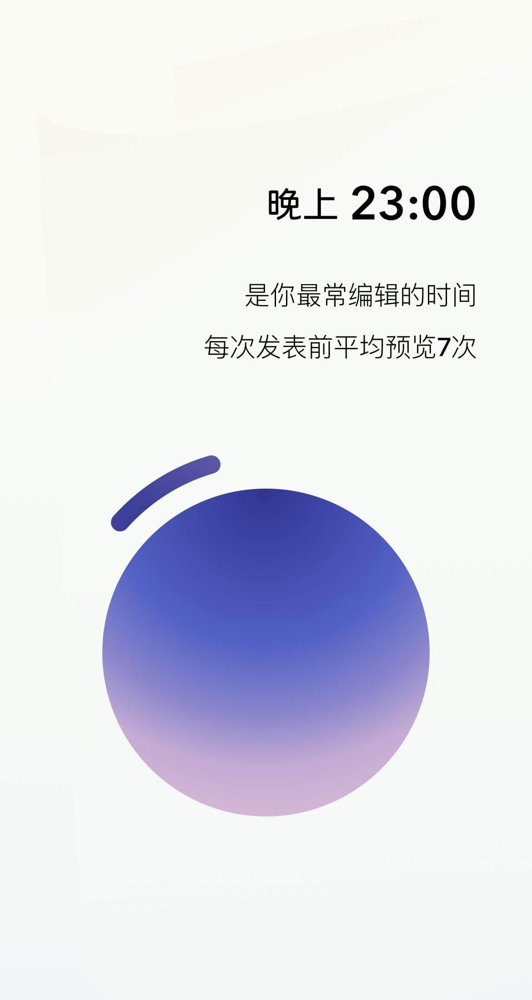
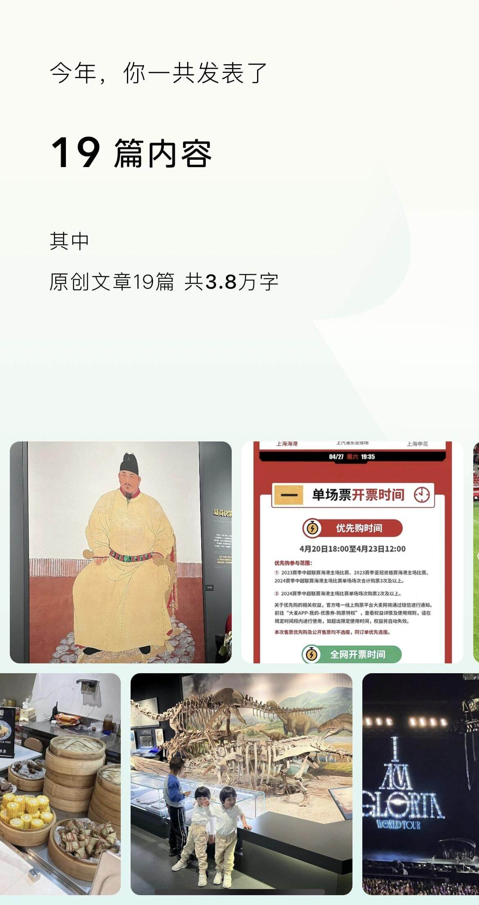
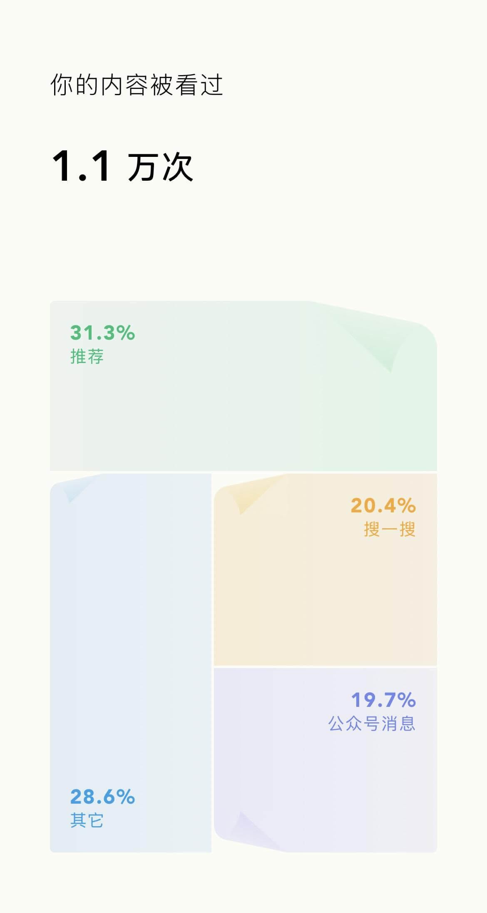
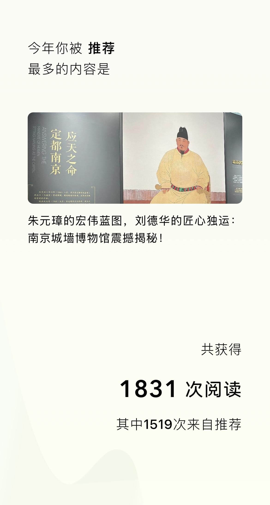
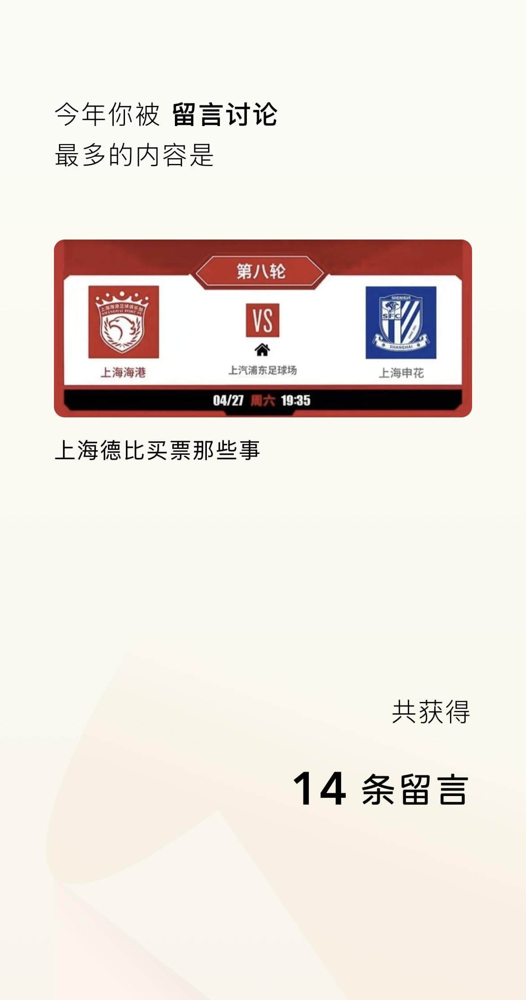
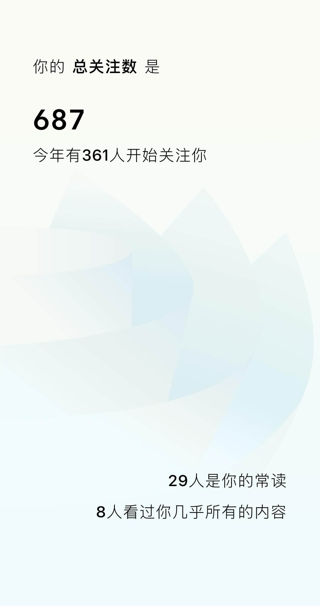
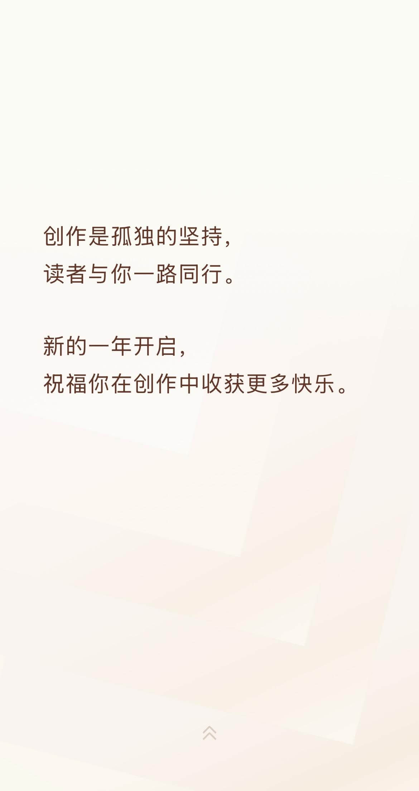

微信公众平台给创作者推送了「你的 2024 年公众号创作回顾」，里面有很丰富的数据，还赠送了红包封面：
<!--more-->
下面分享下我的数据，免费的红包封面在最后哦：

活跃时间：这个号5月、8月、12月最活跃，其实今年在小号【明明和虹虹】上更活跃，从九月份开始更新《港漂日记》，截止年底共写了55篇。

每年都是12月写作欲最强烈，今年12月在【明明如月成长笔记】写了4篇，【明明和虹虹】写了25篇，合计共写了29篇，几乎是日更了！

因为公众号每天只能发一篇的限制，大部分文章都是赶在晚上12点之前发布。磨磨蹭蹭到11点，然后一番输出，最后赶在11:50多点击发布，几乎是常态。

这样的写作方式，其实并不健康，好几次忙中出错，慌乱中忘记勾选原创、标题有明显错字等。不过也有一点好处，就是对“拖延症”有一定效果，如果没有每天0点前必须发文的限制，很多文章可能会拖延很久，甚至烂尾。

大号，19篇文章，3.8万字，小号67篇文章，12.2万字，合计 86 篇文章，16万字，大概是一本200-300页的书了！

大号1.1w次阅读，小号3.3w次阅读，平均每篇的阅读率差不多。

阅读量最多的一篇，文章是用心写的，不过标题有点标题党XD

每次写足球方面的文章，评论都很多，尤其是中超联赛相关的，总是有各地球迷在评论区吵成一团。。。

分享次数主要靠自己分享到朋友圈和微信群，其他集中在几篇游记攻略性质的文章。关注也以我自己的好友为主，感觉内容不够垂直，大杂烩，不容易吸引关注。

最后，由于坚持不断的创作，微信给小号奖励了1500个红包封面，可以创作3个红包，每个500份。

大号由于是企业号，没有获取奖励的资格。所以红包只能通过小号发放，大家通过下方的链接领取呀：

最后互动一下，本公众号让你印象最深刻的是哪篇文章？明年想看我写什么样的新内容呢？欢迎交流，也欢迎你把这个号，分享给更多的朋友。