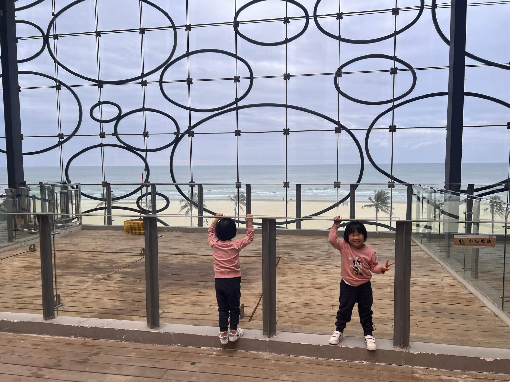

## 自驾出发，开启春节之旅
今天正式开启了我们的春节自驾旅程。总体计划是从深圳出发，先前往粤西，首站是阳江的海陵岛，接着途径北海，之后在南宁过大年，随后在南宁周边城市自驾，初六返回深圳，初七回到香港。这次旅程由我和宝妈带着两个宝宝先行出发，外婆会在除夕夜飞到南宁与我们团聚，一起吃年夜饭并继续后续的游玩。
<!--more-->

## 宝宝闹情绪，行程稍有延误
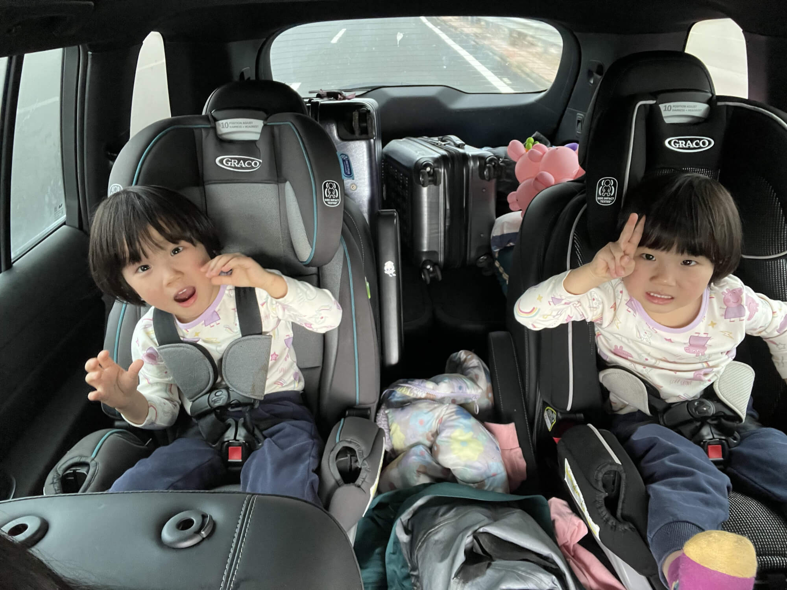

担心深中通道堵车，原本计划早上8点出发，12点抵达目的地。然而，早上珊瑚宝宝闹起了情绪，不肯刷牙、穿衣服，吃饭也慢吞吞的，这一系列状况耽误了不少时间，我们直到9点半才正式出发。

## 踏上高速之路，体验深中通道
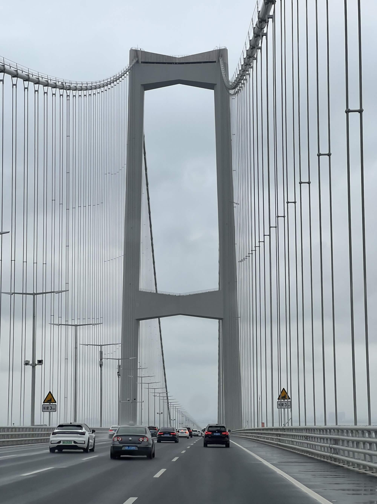

出发后还算顺利，尽管天空飘着小雨，但出门几公里就上了高速。先是行驶在京港澳高速，大约10点钟左右，到达宝安机场附近后转上深中通道，虽然没有出现严重堵车，但缓行状况明显。刚进入深中通道的第一段是隧道，一开始车速能达到80，后来就只能维持在70左右。隧道与大桥衔接的上坡路段，是以往的堵点，很多车因为上坡不给油，导致行驶速度缓慢，造成拥堵。今天情况依旧，车速只能开到五十多，连六十都达不到。隧道方面也意识到了这个问题，通过大喇叭和隧道顶端的文字提示，提醒司机上坡加油提高速度，但很多车还是开得很慢。

## 一年两箱油，如何能优化？
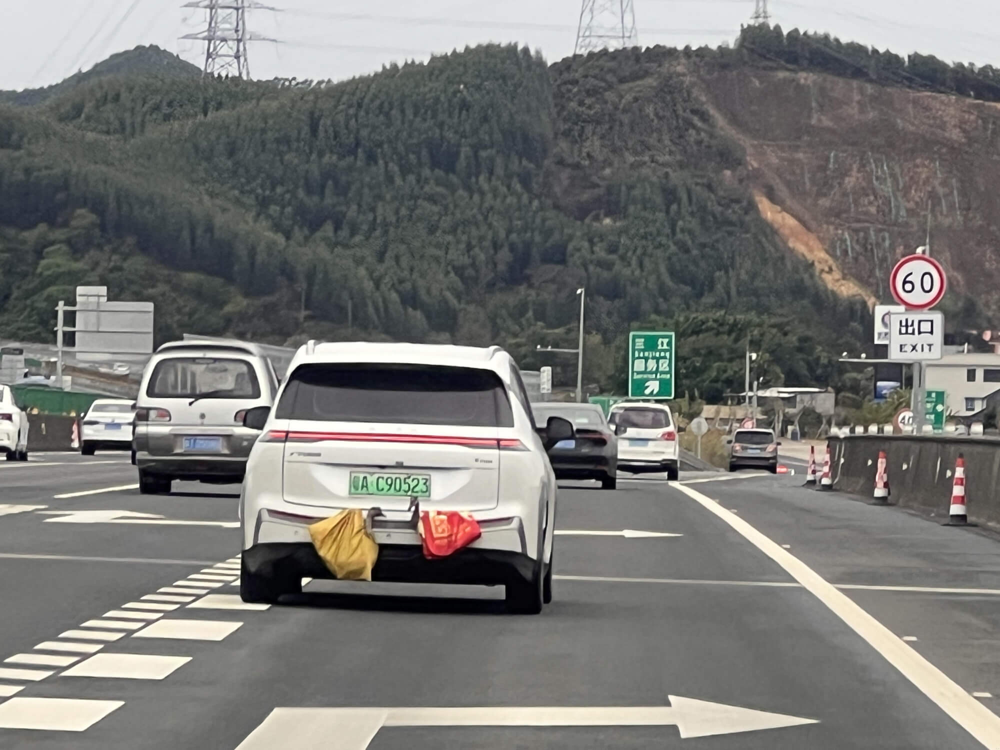

路上遇到了不少“一年两箱油”的车，在限速一百二的高速上只开六十，还挡在快车道上，十分影响通行。不过，我们出发得早，没有遭遇严重拥堵，还算顺利。过了上坡路段上了大桥后，车速能达到七十多，过了南沙的叉路口后，车速能达到八十以上。其实路上车并不算多，如果大家都能开快一点，开到八十甚至一百是完全可行的。国内高速的特点是慢车太多，而且长时间占用快车道。近期看到一些讨论，有人建议学习国外，规定快车道不许长期占用，只能用于超车或者按限速行驶，速度慢的车都在第二、第三车道行驶，这样或许能更好地利用道路资源。按照我的理解，我国的超车道也是规定不许长时间占用的，只是没有对占道和慢车进行治理，也许是技术上有难度吧。想要在不堵车的情况下让所有车辆按限速行驶，确实是个难题。

## 中阳高速缓行，服务区稍作休整
过了中山之后，我们沿着中阳高速（中山到阳江的高速）行驶。这一段是三车道，但车流量较大，车速却提不上去，平均速度可能都不到100。快车道上慢车众多，需要左右反复变道才能保持车速，有时候慢车道的车反而更多一些，可能是因为临近春节，大货车少了很多。我们在江门的服务区停下来休息，服务区里人头攒动。我们买了咖啡、面包和薯片，简单吃了点东西当作午饭，补充一下能量。

## 转道沈海高速，顺畅抵达海陵岛
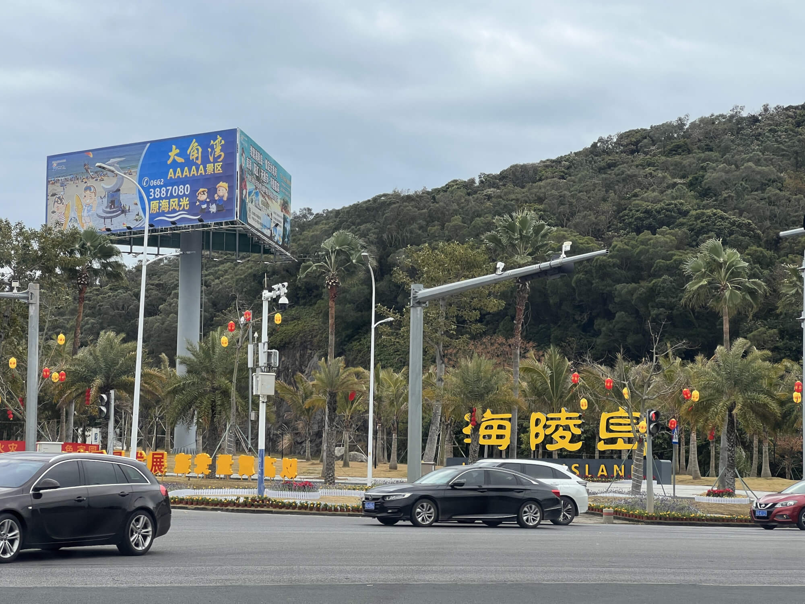

离开服务区后，中阳高速在转沈海高速再转肇阳高速，前往海陵岛。沈海高速这一段是四车道，道路宽阔，开起来感觉比之前舒服很多。它作为国家重要的南北高速，交通承载能力很强，从北京/上海/广州/深圳去海南都要走这条路。而肇阳高速我们走的这段，专门是从阳江前往海陵岛，路上几乎没什么车，行驶起来十分畅快。我们一路开启120车道保持巡航，向着目的地海陵岛快速进发。

## 跨海登岛，感受旅游氛围
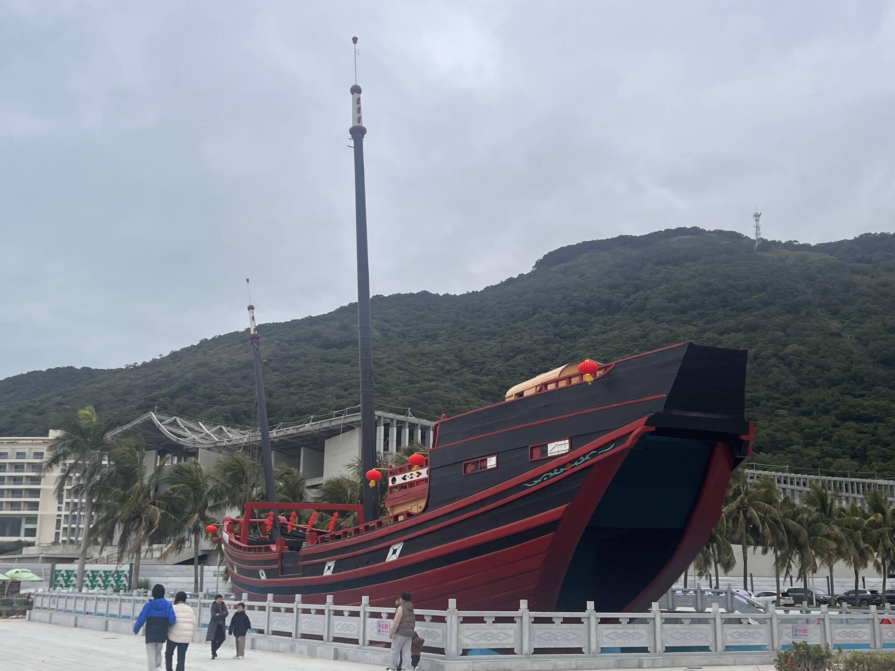

从阳江过海前往海陵岛，这一段海面并不宽阔，海面上能看到一些小船，还有一些养殖设施。连接两地的跨海大桥并不是那种高大跨海大桥，我猜是因为海陵岛不大，方便绕行，没有大船的航运通行需求，所以大桥离海面的高度较低，能降低建设成本和安全风险。登上海陵岛，便能明显感觉到已经来到了旅游区。道路两旁建设得十分漂亮，路边张贴着各种标语和海报。路上往来的车辆大多是外地车牌，看来全国各地的游客都慕名而来，十分热闹。

## 直奔海博馆，探寻丝路遗迹
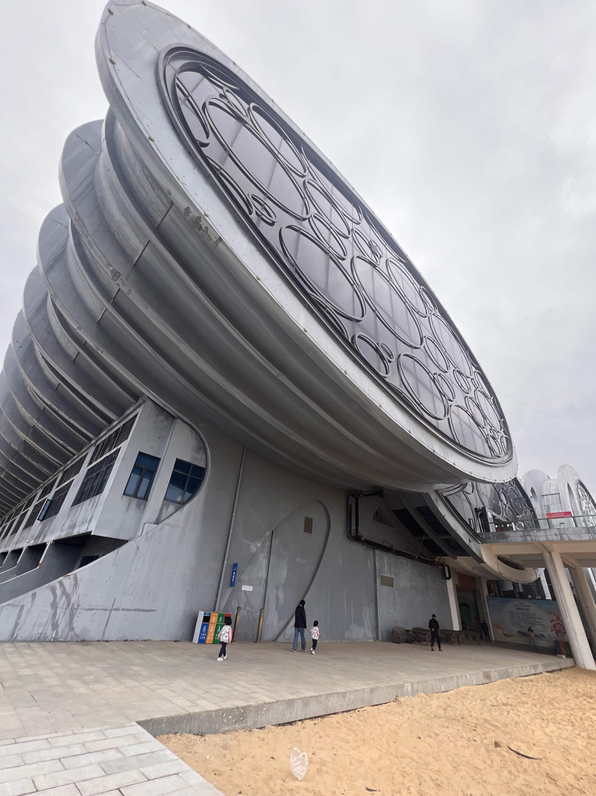

上岛后，我们沿着公路继续前行，径直前往广东海上丝绸之路博物馆。这座博物馆展示的是“南海Ⅰ号”古沉船打捞出水后的相关展览，感受古代海上丝绸之路的辉煌与繁荣。到了才知道，“南海Ⅰ号”是在阳江外部的海面上打捞的，所以博物馆建在了这里，更令我吃惊的是，整艘船是用一个大的框架完全围起来，然后整体打捞上来的！博物馆也是为了配合对打捞的船体进行考古建设的，所以大的框架和船体现在就在博物馆里面，游客可以从外面围观。

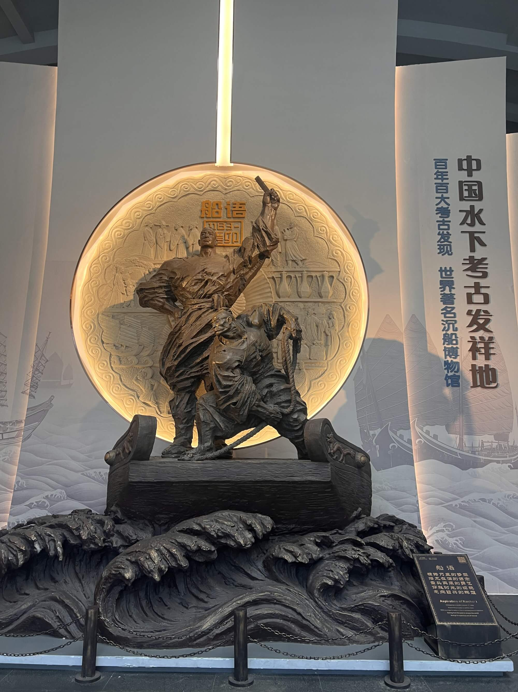

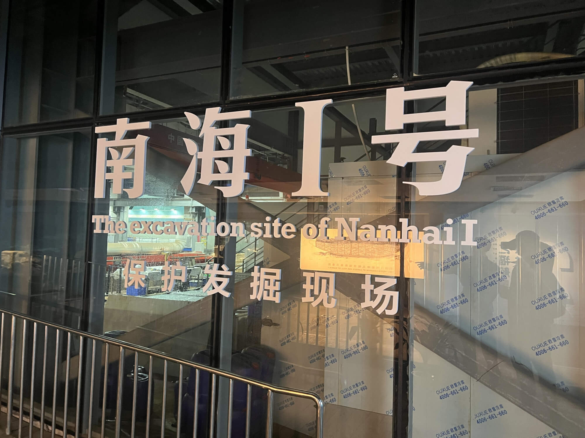

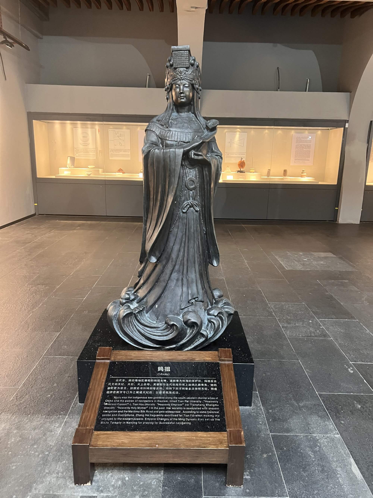

## 天气突变，海边游玩受阻
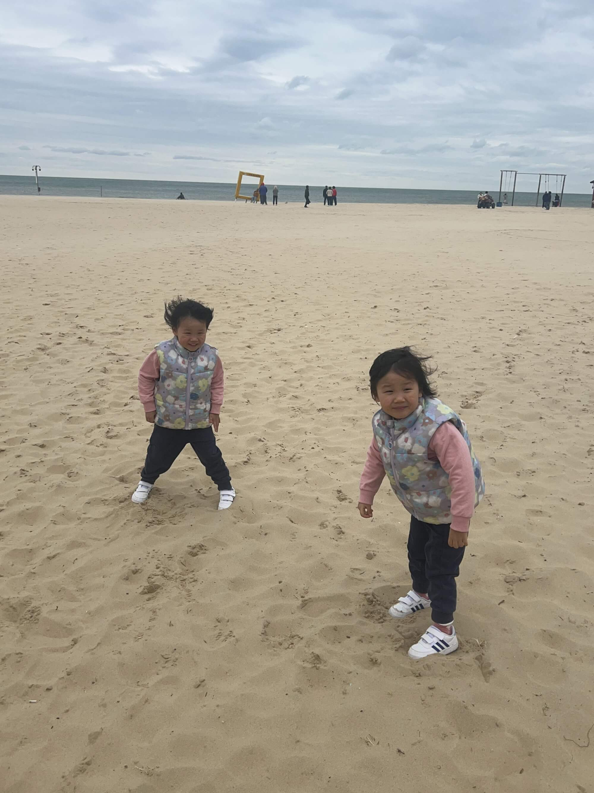

今天海陵岛天气大变，海边风力强劲，天气预报显示有5级大风。海风呼啸，吹得我们直打哆嗦。宝宝原本穿了羽绒背心，后来又套上了厚厚的羽绒服。宝爸的羽绒服收在箱子里拿取不便，只能穿着一件冲锋衣，在海边被吹得瑟瑟发抖。这里的海景和沙滩都很不错，但因为风太大，根本没办法好好玩耍。听当地人说，昨天还能穿短袖，没想到今天就这么冷，气温不到10度，海风凛冽，冻得人够呛，给我们留下了不太好的印象，甚至都不想再来了。

## 沿海观光，了解海边格局
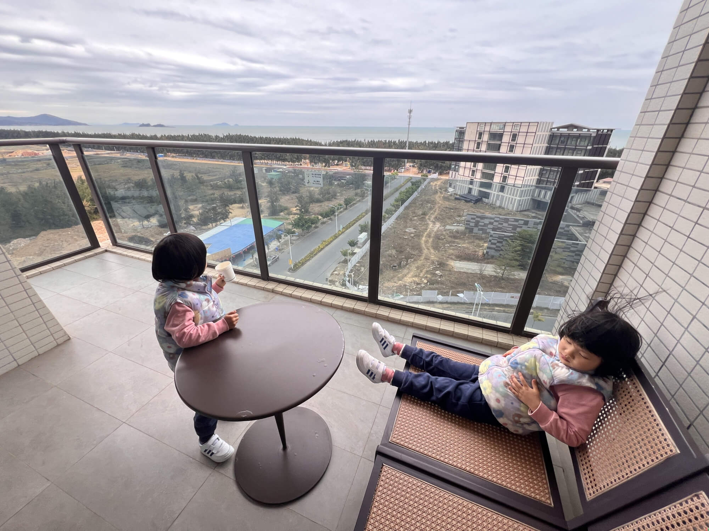

下午游玩完博物馆后，我们在海边简单转了转，便开车回酒店。我们住在万豪旗下的源宿酒店。沿着海边一路行驶，发现海陵岛南岸的格局大概是这样的：西边是老镇，中间是博物馆，再往东是保利银滩，保利在海边建造了大量的别墅和高层海景房。再往东北是万豪新开发的海湾，有酒店，民宿，还有很多未完工的建筑。

路上有二手房甩卖的广告，显示89平方米的房子售价36万一套，算下来每平方米大概4000元。近几年旅游地产受到一定冲击，估计不太好卖。保利那边的海景房建得很漂亮，楼下有各种小饭店、海鲜馆和大排档，还有许多做民宿的小店，感觉是集中托管投资客的二手房出租。这里的房价确实很低，之前在网上找的镇上五十平的双床民宿，现在只要69元一晚，春节期间会涨到三百多，但价格依旧很实惠。

## 海鲜大餐，品尝当地美食
晚上在点评上找到了"秋姐美食店(12年老字号保利店)"，这家店评价还不错，4.7分，关键是有16000条评论，这么多人评论过的店，一般都不会太差，我们便决定去尝尝。

店里的海鲜很新鲜，价格也不贵，有多种团购的套餐，双人套餐有98元、163元和269元三种，我们点了一个269元的套餐，海鲜六选三，大菜是蒜蓉蒸龙虾（小青龙），还点了椒盐基围虾、爆浆鱿鱼，炒时蔬等，分量很足，味道不错，服务也很主动。除了装修和卫生条件是大排档风格外，其他没什么缺点。

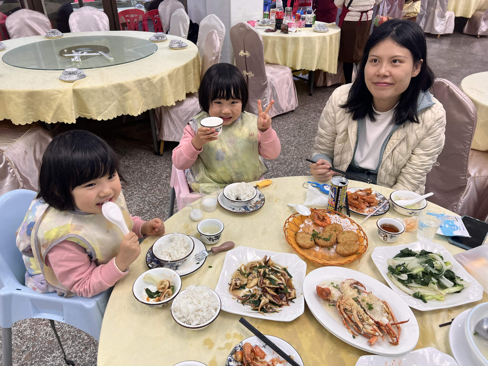

## 海边温度，春节去哪里玩？

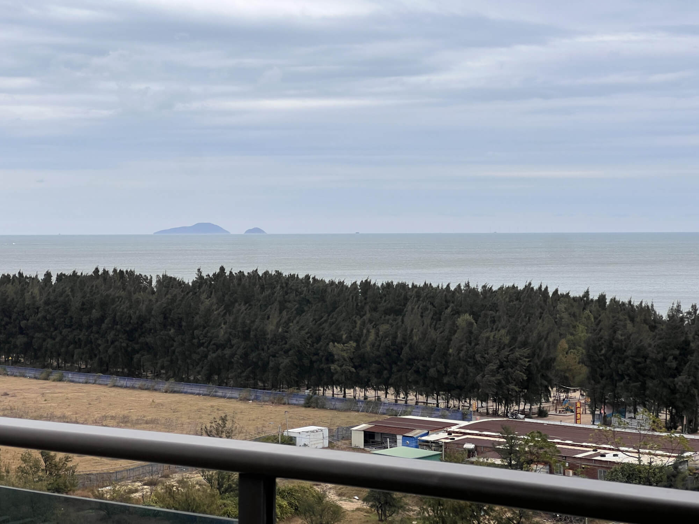

来到阳江才发现，这个季节天气太冷，不适合海上活动。感觉中国东南沿海地区，春节期间都有点冷，不太适合海边游玩。为了印证我的猜测，我们特地用车上的副驾屏看了天气预报，今年春节前我国东北西北都是-20度，中部长江流域0度，西南的昆明也是3-10度，南部沿海包括海口都是10-20度有点冷，只有海南南部的三亚是热带气候，15-25左右，比较适宜，怪不得全国的人都往三亚挤呢。
