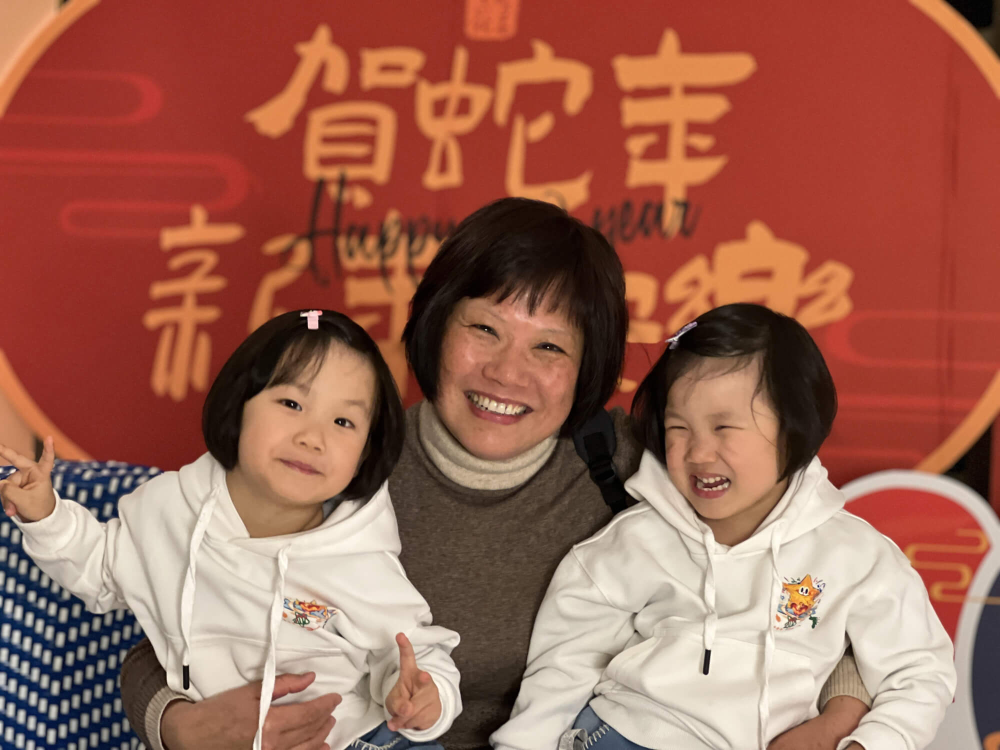

2025-1-28，腊月廿九，除夕

## 钦州City Walk：古韵与温情之旅

### 启程：老街初印象
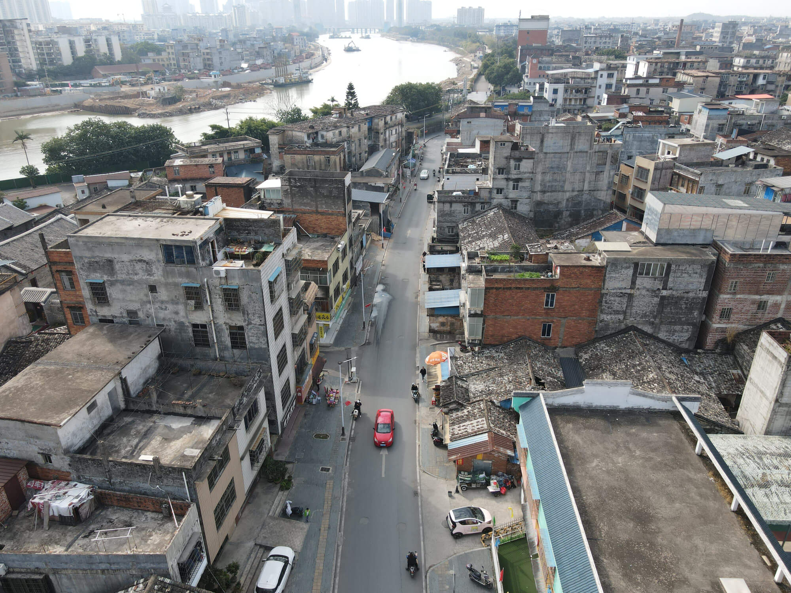

早餐后，我与宝妈带着两个宝宝，从金湾大酒店出发，开启了在广西钦州的独特City Walk。沿着钦州老街一路向南，时光仿佛慢了下来。老街的建筑透着古朴的韵味，一砖一瓦都像是在诉说着过往的故事。两个宝宝兴奋地东张西望，好奇地打量着这个充满新鲜感的世界。
<!--more-->

### 探寻：广州会馆的魅力

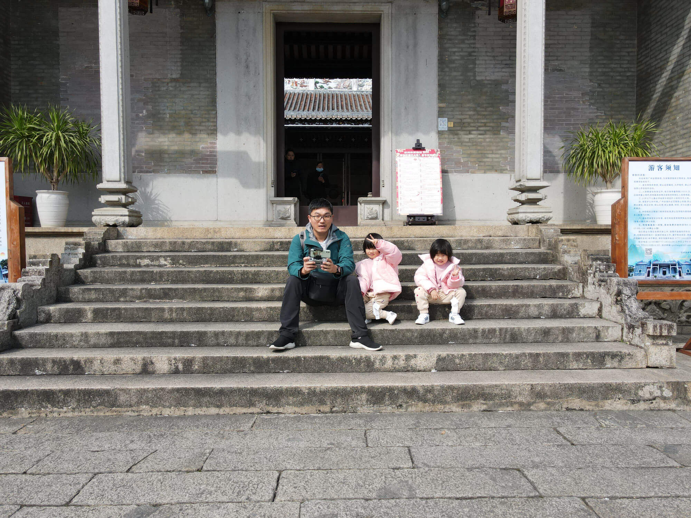

首先来到了广州会馆，这座始建于乾隆四十八年的建筑，承载着深厚的历史底蕴。进入会馆，我们参观了这里的展览。

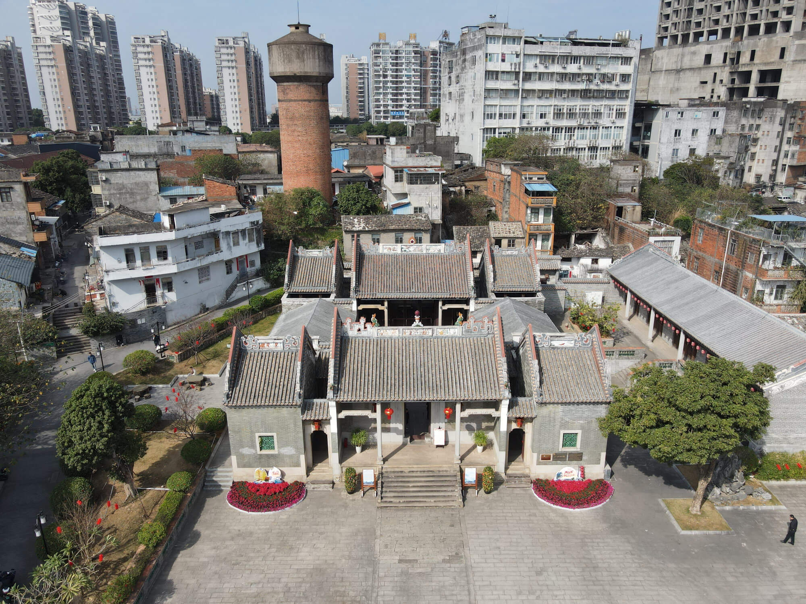

“舟楫不绝——钦州海丝贸易文化展”让我们深入了解了钦州在海上丝绸之路中的重要地位。从古代的贸易往来，到灵渠水系对贸易发展的促进，再到广州会馆作为海丝贸易见证的独特意义，每一个展板、每一段文字都仿佛在我们眼前展开了一幅波澜壮阔的历史画卷。宝宝们虽然似懂非懂，但也被眼前的一切深深吸引。

### 遗憾：冯子材故居的错过
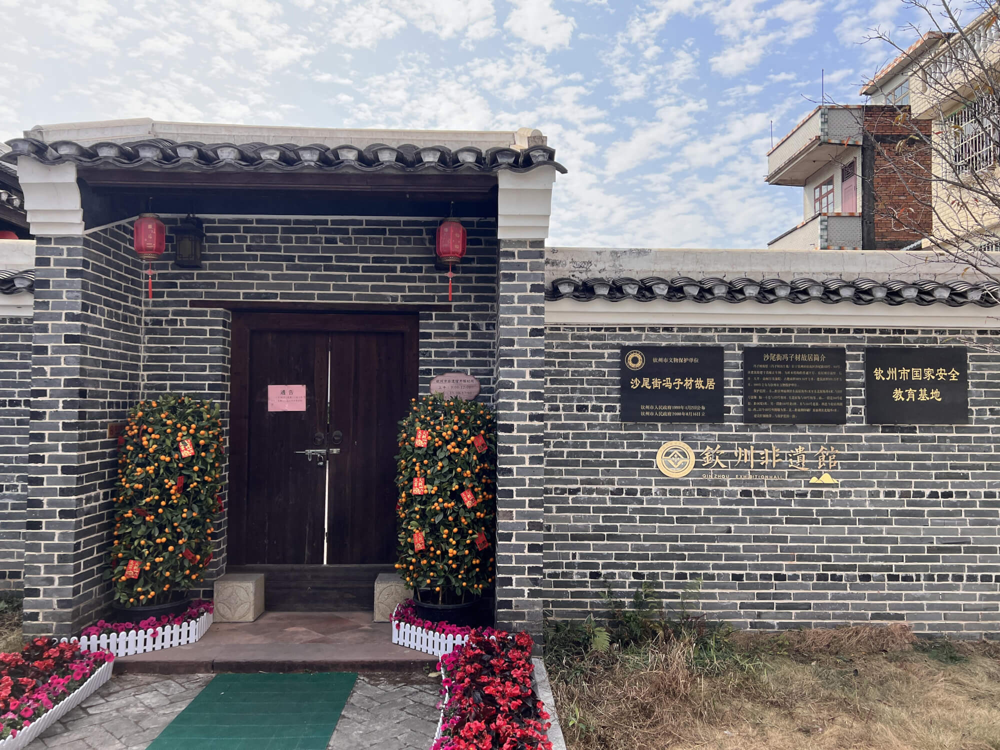

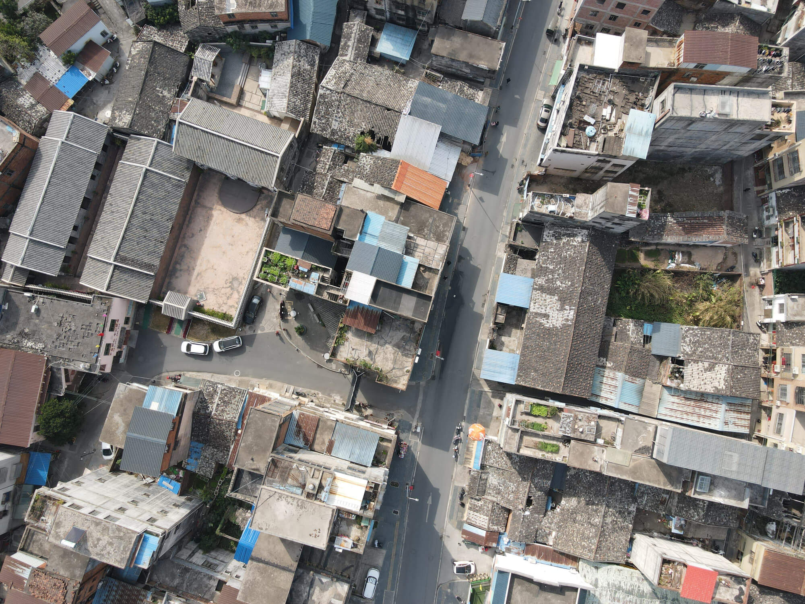

继续前行，路过冯子材故居时，却发现当天并未开放。这座承载着英雄事迹的故居，此刻紧闭大门，像是一个神秘的宝藏等待着我们下次再来开启。

### 漫步：城墙遗址与河堤风光
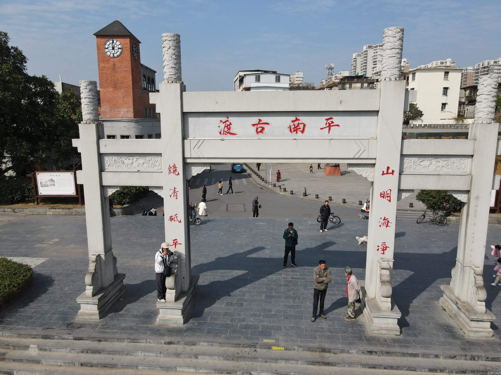

再往南走，我们来到了城墙遗址。古老的城墙虽已历经岁月的洗礼，但依然能让人感受到当年钦州古城的雄伟与威严。

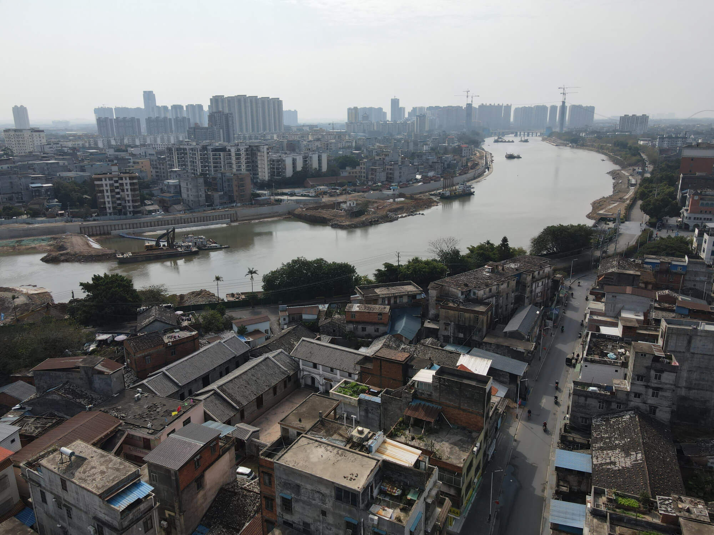

沿着河堤漫步，江风拂面，带来丝丝清凉。宝宝们在河堤上欢快地奔跑，笑声回荡在空气中。远处的江水波光粼粼，与岸边的景色相映成趣，构成了一幅宁静而美丽的画面。

### 闲逛：中山路步行街的热闹

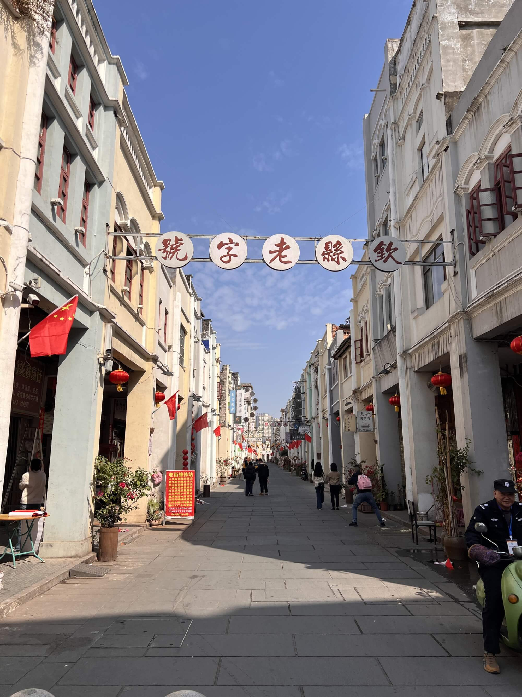

最后，我们来到了中山路步行街。这里有很多特色商铺、手工艺品琳琅满目。宝宝们手里拿着喜欢的零食，脸上洋溢着幸福的笑容。在这条充满活力的街道上，我们尽情享受着这悠闲的时光，为此次钦州City Walk画上了一个圆满的句号。

### 返程：宝宝首次体验电动车
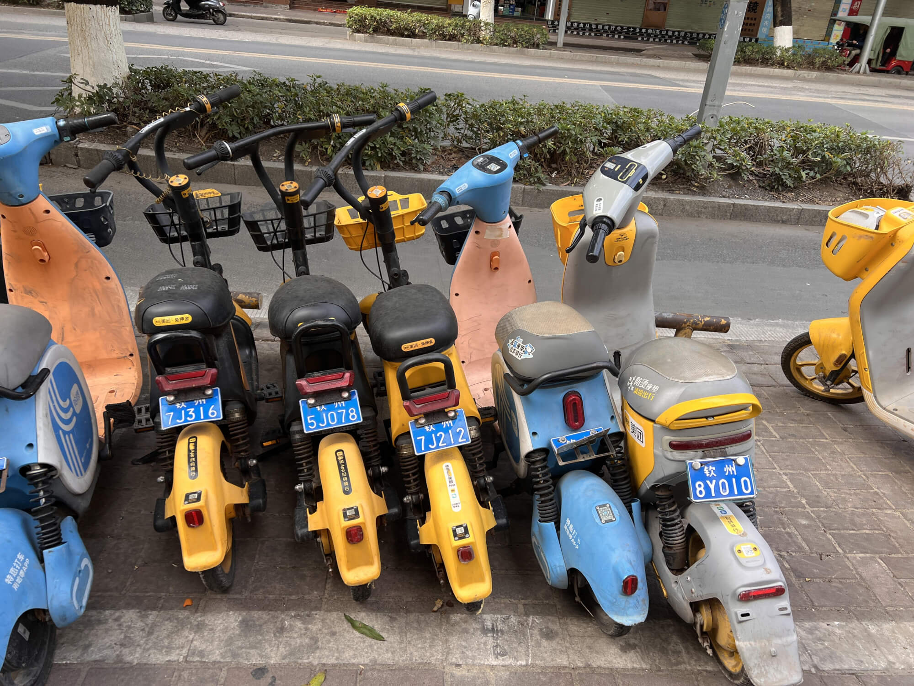

返程的时候，我们本打算打车回酒店，毕竟带着两个宝宝，打车会轻松许多。可是我和宝妈同时使用高德，始终等不来能载我们回去的车。

无奈之下，我们只能另寻他法。这时，我发现街边停放着不少共享电动车，反而完全没有共享单车的踪影，这些共享电动车的品牌还挺多，青桔、美团等等都有。

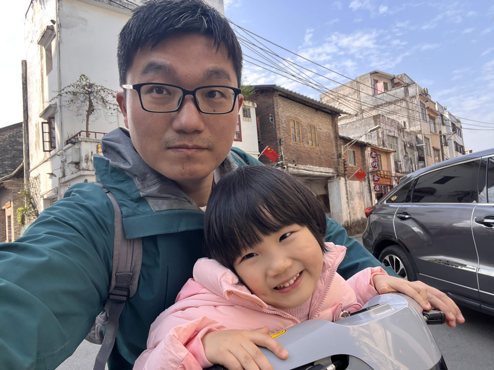

我拿出手机扫码解锁了一辆共享电动车，带着宝宝小心翼翼地坐上去。不得不说，在钦州这座城市，共享电动车似乎成了大家出行的热门交通工具。街道上，一辆辆共享电动车穿梭其中，不带头盔、小朋友站在前排也是常见操作，虽然有些电动车行驶起来横冲直撞的，但不可否认的是，它确实非常方便。

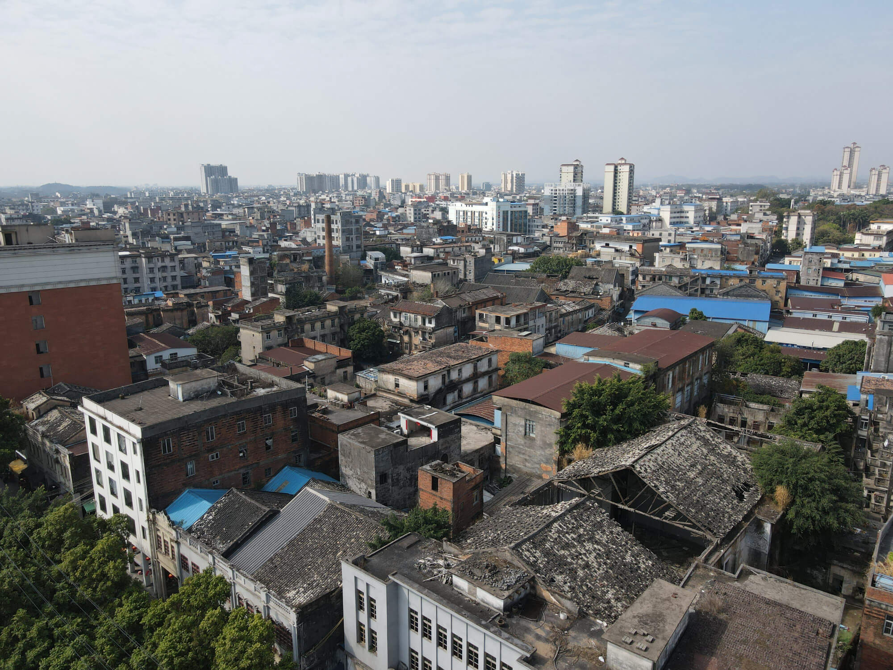

我缓缓启动电动车，带着宝宝穿梭在钦州的街道上。微风吹过脸颊，带来丝丝凉意，宝宝们兴奋地看着周围的一切，时不时发出欢快的“电鸡电鸡”的叫声。就这样，我们依靠共享电动车，顺利地踏上了回酒店的路，为这一天在钦州的游玩画上了一个特别的句号。 

### 钦州印象：慢节奏的怀旧之城

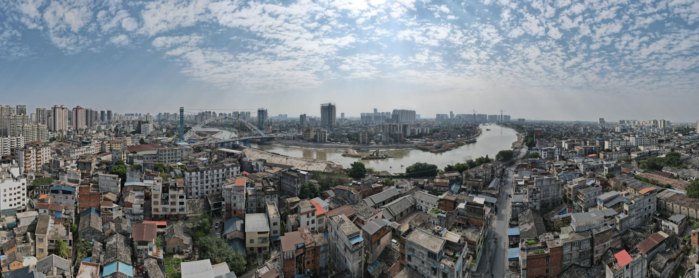

这次钦州之行，虽然有小小的遗憾，但更多的是满满的美好回忆。城市有些旧，也许能让宝宝感受南京和杭州20年前的样子。生活的慢节奏、老街的古韵、会馆的历史、遗址的沧桑、河堤的宁静以及步行街的热闹，都让我们对这座城市有了更深的了解。

## 老牌酒店，解锁别样旅行洞察
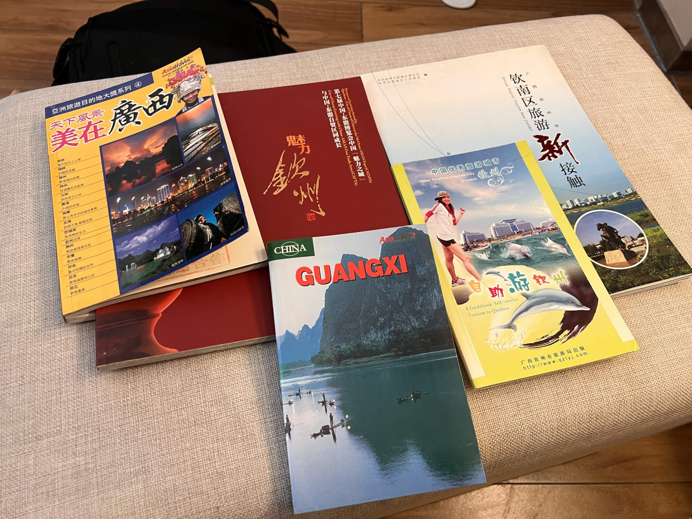

在旅途中，入住老牌大酒店与下榻旅行快捷酒店，往往能带来截然不同的体验。踏入老牌酒店的房间，扑面而来的是一种沉稳、庄重的气息，处处细节都彰显着其独特的魅力。

与快捷酒店不同，老牌酒店的房间里通常会贴心地摆放一些旅游攻略。这些攻略风格严谨，与真假难辨、软文泛滥的网络攻略相比，有着无可比拟的权威性和严肃性。它们是经过专业人士精心编撰，对当地的风土人情、名胜古迹、特色美食等进行了深度挖掘和整理，为住客提供了真实可靠的出行指南，让每一次探索都变得更加安心和高效。

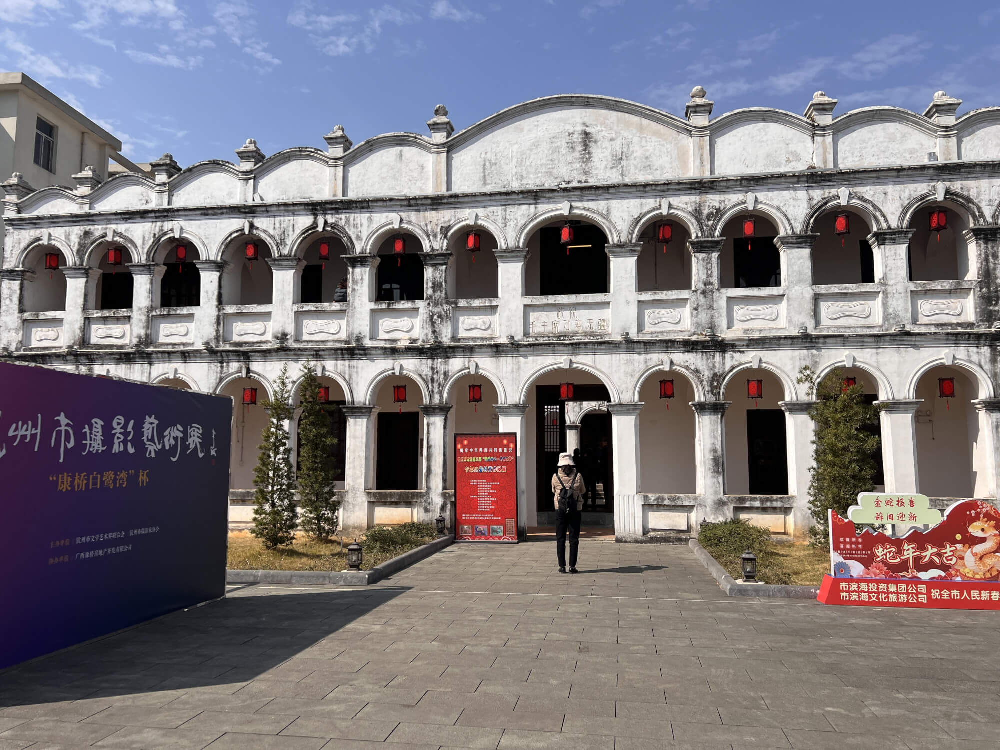

更让我惊喜的是，房间内还配备了招商引资相关资料。作为一名高考地理考生，这些资料就像一座知识宝库，对我有着极大的吸引力。通过仔细研读这些资料，我能直观地了解一座城市的发展脉络，清晰地把握其区位优势、特色产业以及未来的发展规划方向。

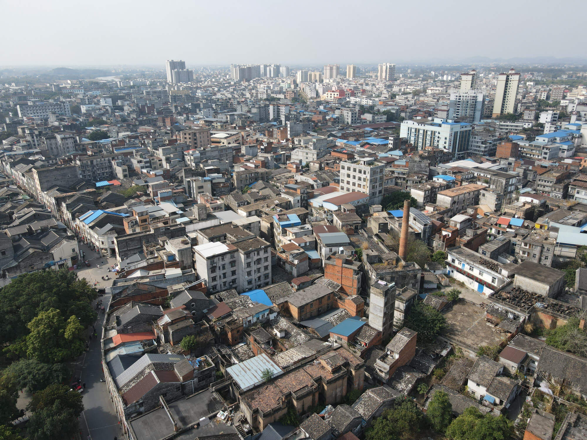

以钦州这座城市为例，通过酒店提供的资料，我对它有了全新且深入的认识。钦州凭借得天独厚的港口优势，石油化工冶炼产业发展得风生水起，成为了当地经济增长的重要引擎。同时，它地处北部湾，与东南亚毗邻，在东盟贸易中占据着举足轻重的地位，是一座极具潜力的贸易港口。钦州不仅拥有便捷的航运优势，在工业基础和人力成本方面也极具竞争力，发展前景十分广阔。这些资料就像一把钥匙，为我打开了一扇了解城市发展的大门，让我在旅途中收获了许多宝贵的知识和深刻的见解。 

## 年夜饭：千里团聚暖意融
下午，我们在南宁吴圩机场接乘飞机来一起过年的宝宝外婆，提前在网上查了接机攻略，然后约在航站楼3层出发层外面的9号门，果然很方便，都是第一次到机场，但是像是老司机一样，快速接到了外婆，然后前往南宁万丽酒店入住。

昨天夜里才开始研究年夜饭，有点晚了，而且夜里不方便打电话预定。今天中午挨个打电话，知名餐厅都提前几天订满了，最后只能在南宁万丽酒店的中餐厅万丽轩享用年夜饭。办理入住后，先洗去一身疲惫，换上喜庆红衣。6 点前下楼，满心期待着即将开始的年夜饭。

### 贴心留念，定格新年美好
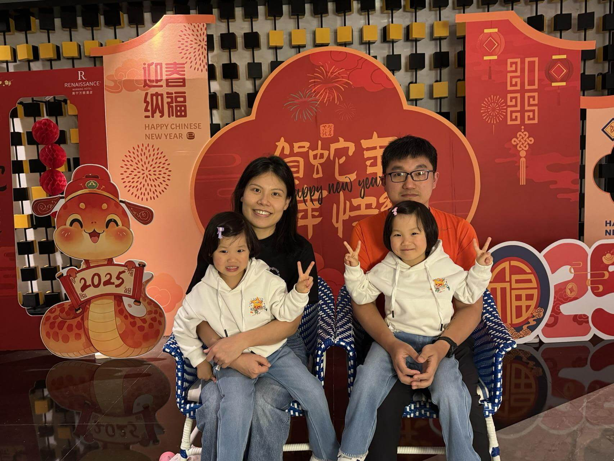

餐厅门口专门设有春节合影区，工作人员为每户家庭在喜庆的背景墙前拍照并打印装框，让新年的喜悦定格，成为珍贵留念。

### 浓郁氛围，尽显节日气息
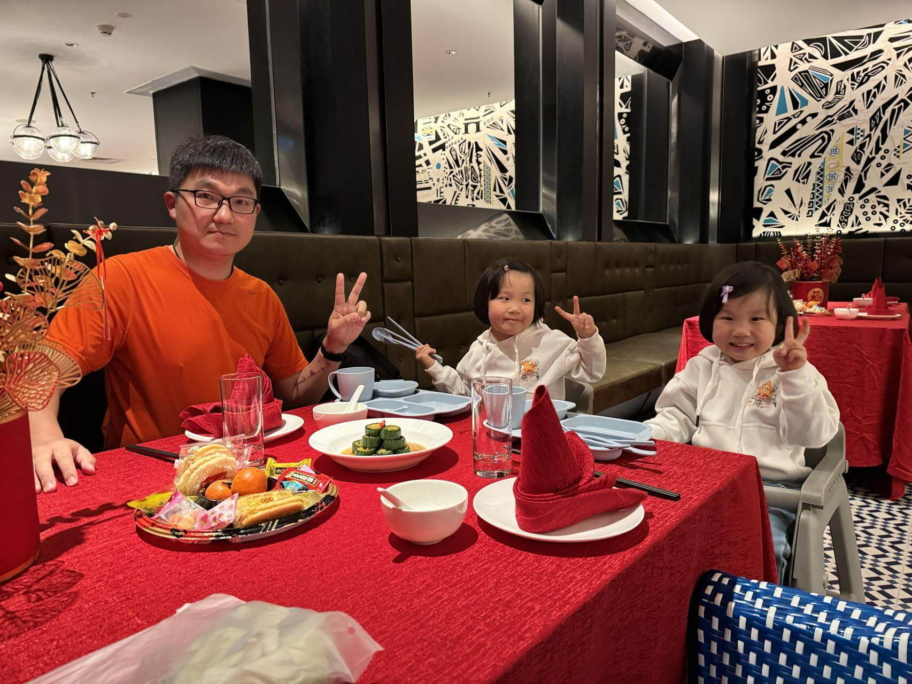

走进餐厅，每张桌子铺着红桌布和餐垫，摆放着红花与零食果盘，处处洋溢着新年的欢乐与温馨，节日氛围十足。6 点 08 分准时开餐：

### 珍馐美馔贺岁宴
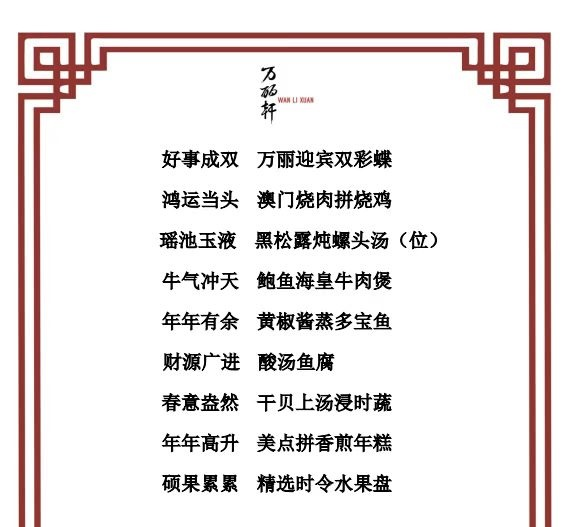

- 凉菜开场，开胃又喜庆：第一道菜 “好事成双，万丽迎宾双彩蝶”，凉拌黄瓜清爽，无骨鸡爪微辣，打开食欲。
- 红红火火，双喜临门：第二道："鸿运当头，澳门烧肉拼烧鸡"，烧肉皮脆脂香、金红透亮，烧鸡肉嫩多汁、油润入味，佐以酸甜梅酱与椒盐蘸碟，咸鲜交织中迸发吉祥滋味。
- 靓汤滋补，温暖身心：第三道 “瑶池玉液，黑松露炖螺头汤”，黑松露与螺头的鲜美交融，汤汁醇厚，暖胃又暖心。
- 牛气满满，鲜香四溢：第四道 “牛气冲天，鲍鱼海皇牛肉煲”，牛肉软烂、鲍鱼弹牙，海皇食材搭配，香气诱人。
- 鱼香四溢，寓意美好：第五道 “年年有余，黄椒酱蒸多宝鱼”，鱼肉鲜嫩，黄椒酱增添鲜辣，满含新年祝福，鱼头鱼尾当然要留着啦~
- 酸汤开胃，财源广进：第六道 “财源广进，酸汤鱼腐”，金黄酸汤，鱼腐吸饱汤汁，酸中带鲜，令人食欲大增。
- 清新时蔬，春意盎然：第七道 “春意盎然，干贝上汤浸时蔬”，鲜嫩时蔬搭配干贝上汤，清新解腻。
- 美点年糕，年年高升：第八道 “年年高升 美点拼香煎年糕”，香煎年糕外酥里嫩，美点口味丰富，寓意生活节节高。
- 水果收尾，甜蜜圆满：最后是 “硕果累累，精选时令水果盘”，清甜水果解腻，寓意新一年收获满满。

### 童趣祝福汇吉言
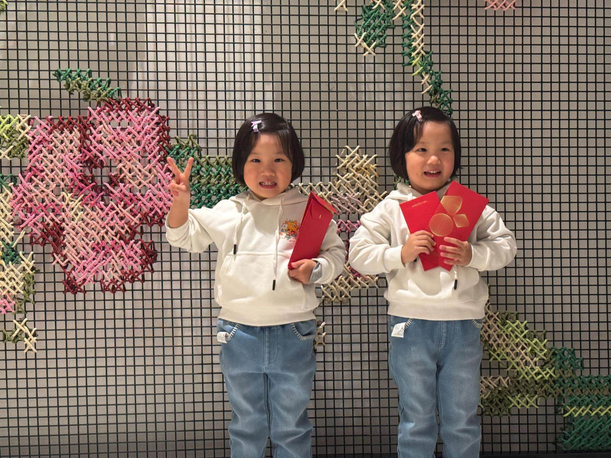

饭后宝宝们在饭店和酒店一楼的儿童乐园里录制了新年祝福视频，用了普通话、粤语和英语，我用剪映拼接，发了新年专属了朋友圈，获得很多拜年点赞。

### 经典重现忆往昔
随后开始看春晚，最让我欣喜的是白蛇赵雅芝和许仙叶童参唱的《新白娘子传奇》插曲，我太喜欢这部电视剧了，去年还在杭州看了《新白30周年演唱会》。

### 守岁新章蕴期许
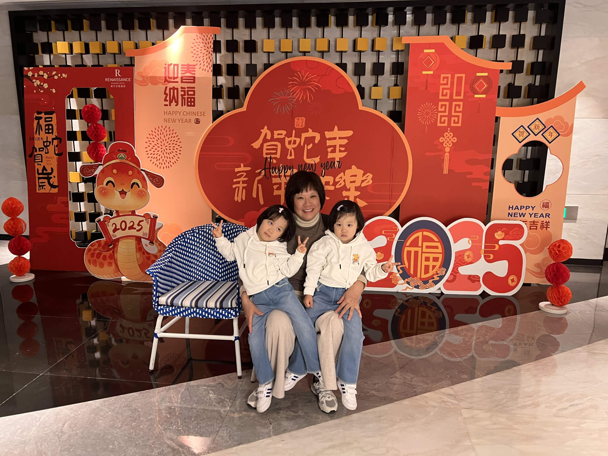

由于午后没有休息，一直在开车，导致今天特别困，眼皮终是敌不过本命年小蛇的倦意，晚上九点多就睡着了，连续二十多年“守岁”记录就此打破，看来这蕴意变化的蛇年呀🐍~

