2025-01-31，大年初三，茂名，晴

## 中华第一滩欢乐行：亲子时光的海滨之旅

### 出发：奔赴海滨的期待
今天，外婆要提前返回杭州，茂名没有机场，最佳的返程方式是高铁，由于没有直达的票，中午先从茂名到广州南，下午再从广州南到杭州，晚上十点到家。
<!--more-->
我和宝妈、宝宝则继续留在茂名，准备前往中华第一滩游玩。中华第一滩位于茂名市电白区，是一处以海滩为主题的旅游景点，被誉为“中华第一滩”。这里有绵延数十公里的金色沙滩，海水清澈，沙滩平整，是一处理想的度假胜地。

怀揣着满心的期待，我带着宝宝踏上了前往中华第一滩的旅程。我们从茂名市区出发，一路向南，驱车约30公里，首站来到了童子湾。

本满心欢喜地打算在童子湾、晏镜岭开启一段美好的游玩时光，可刚到目的地，眼前的景象就让人犯了难。游客数量远超想象，停车场规模有限，根本无法容纳众多车辆，外面堵得水泄不通，车子如同蜗牛般缓缓挪动。无奈之下，我们带着一丝遗憾，直接奔赴中华第一滩。

### 抵达：人潮涌动的海滩
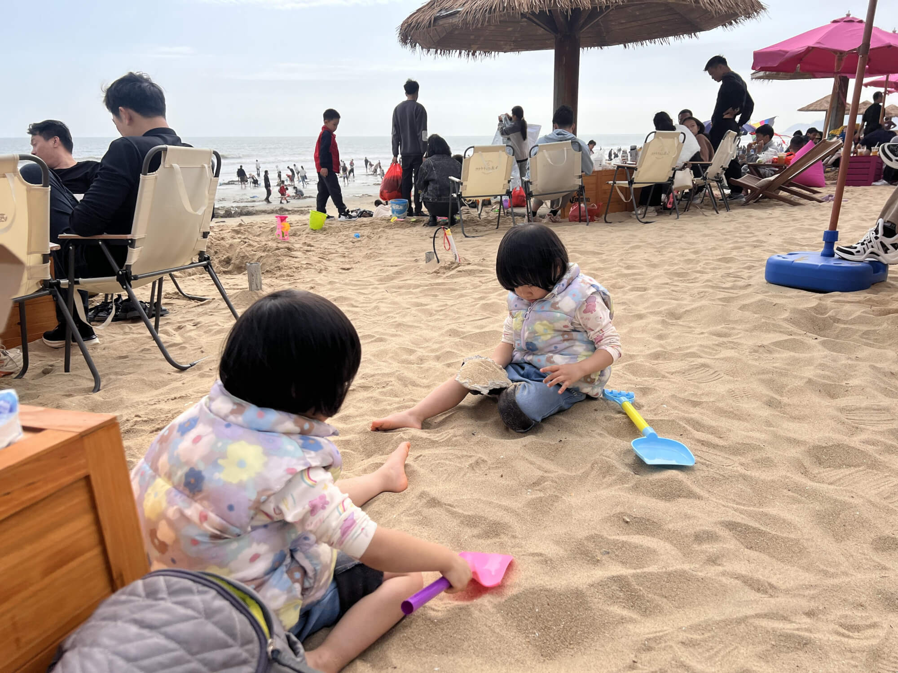

历经波折，终于抵达了中华第一滩。眼前的场景十分震撼，这里早已是人山人海，游客们熙熙攘攘。中华第一滩给人的第一印象便是极具亲民感。无需支付门票，游玩成本低，物价也十分实惠，这一点着实令人惊喜。

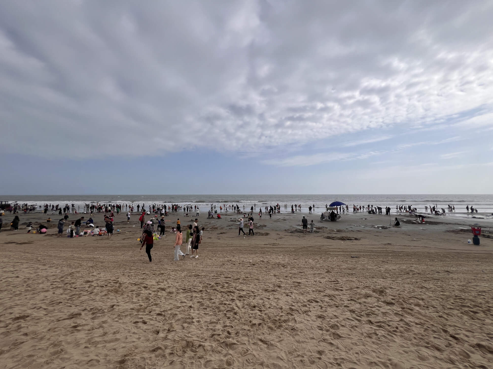

海滩边的儿童游乐设施虽谈不上高端华丽，但充满了质朴的童趣。大型充气蹦床、小火车、卡丁车等俱全，充满孩子们的欢声笑语。放眼望去，海滩上密密麻麻全是人，其中以外地游客居多，大家都沉浸在这海滨的欢乐氛围中。

### 游玩：惬意的亲子时光
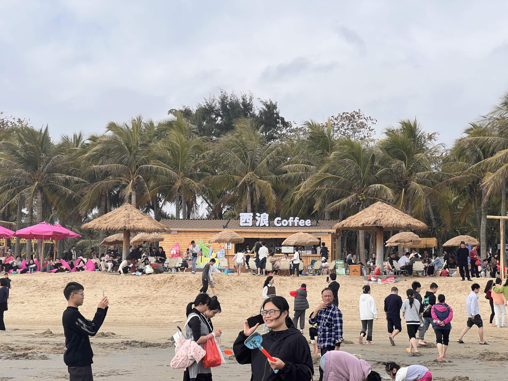

在热闹的海滩上，我们找到了一处宁静的角落——沙滩咖啡区。点上一杯香浓的咖啡，寻了把椅子坐下，惬意地享受着这份悠闲。

宝宝则拿着小铲子，在一旁的沙滩上开启了他的“创作之旅”。他先是专心致志地用沙子堆砌出一座座“梦幻城堡”，随后又兴致勃勃地挖起洞来，仿佛在探索神秘的地下宝藏。我们一边品尝着美味的小吃，一边看着宝宝专注玩耍的模样，温馨又快乐。时间就在这轻松愉悦的氛围中悄然流逝，不知不觉就到了下午3点半。

### 惊喜：超值的小火车体验
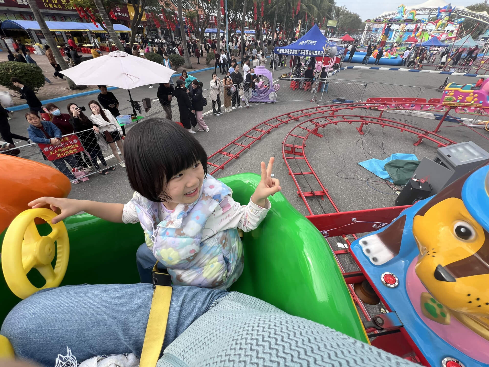

准备离开时，我们决定带宝宝体验一下汪汪队小火车。票价是25元一位，大人还能免费陪同。原本小火车是开五圈，可当天游玩的人不多，后面没人排队，热心的工作人员格外通融，直接让我们玩了十几圈，相当于买一送一。小火车缓缓开动，宝宝坐在上面，兴奋得手舞足蹈，脸上洋溢着灿烂的笑容。这意外的惊喜，为我们今天的中华第一滩之行画上了一个完美的句号。

## 茂名博物馆
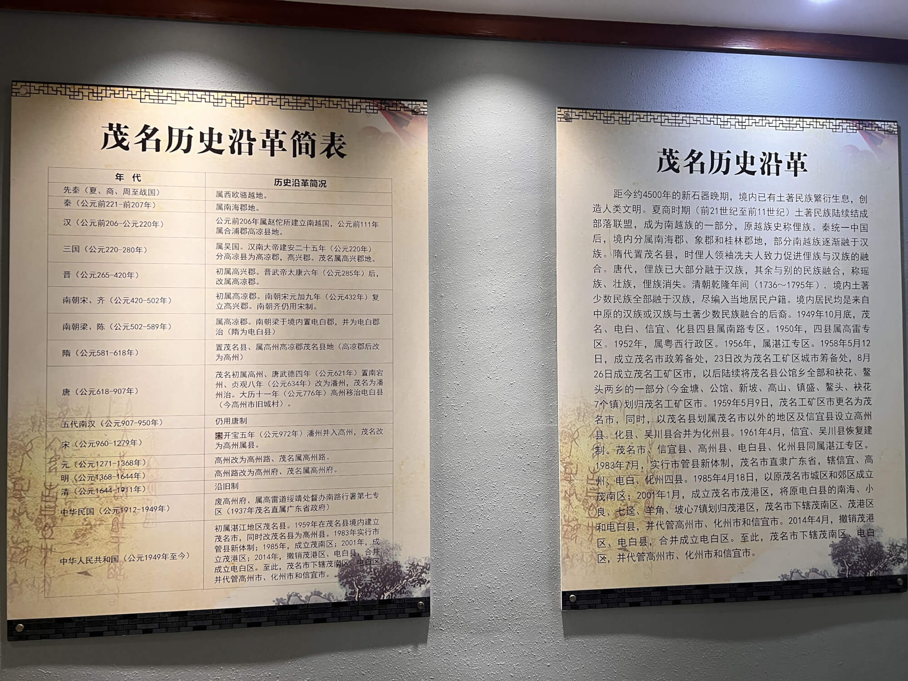

下午回城后，我参观了茂名博物馆，这是一座市级地级市的博物馆。整体逛下来，给我的感觉是可看的东西并不多，大约半个小时就看完了。主要的几点参观体验： 

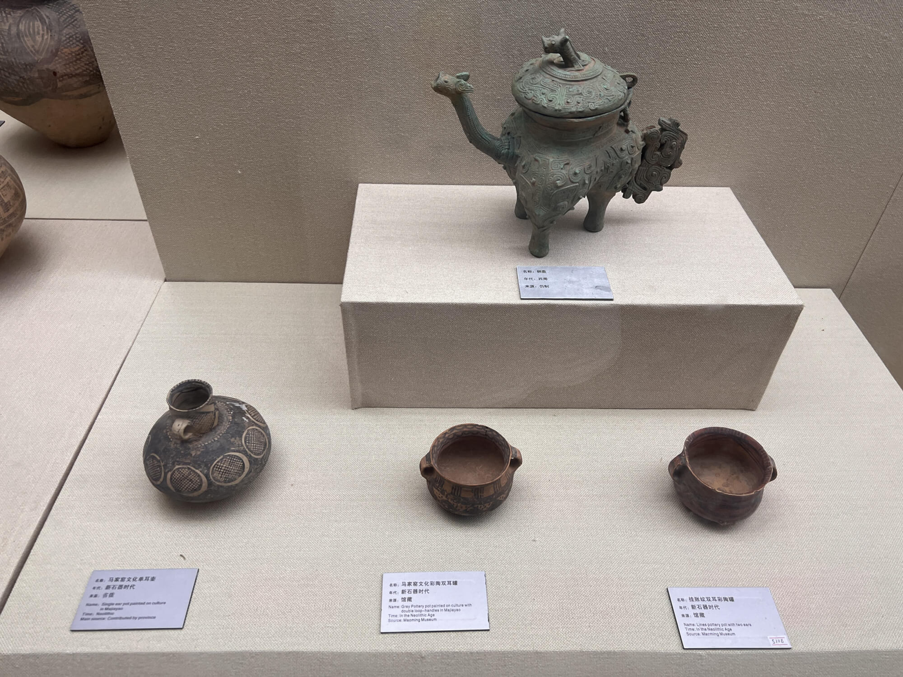

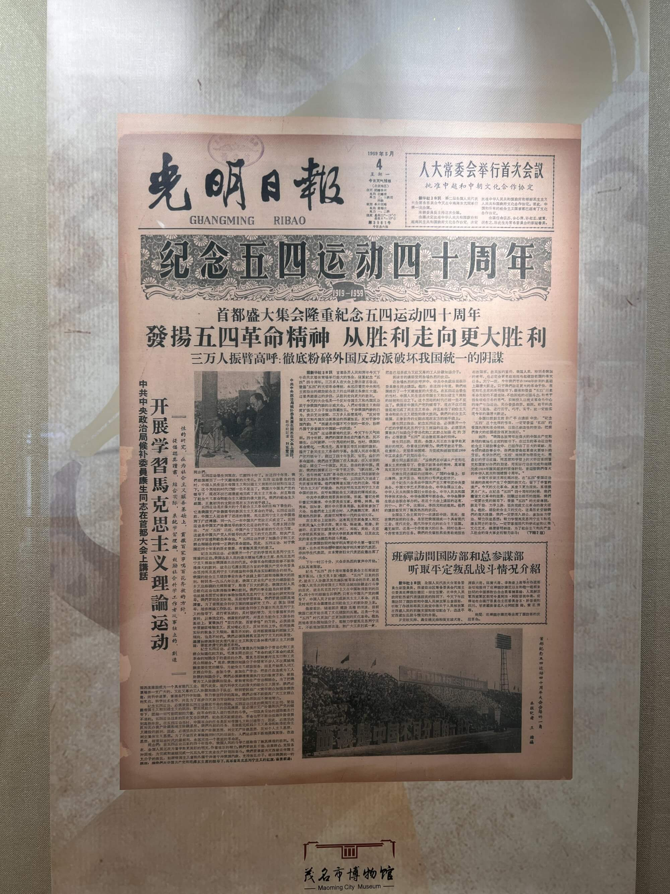

1. 历史展览部分：这是博物馆的重点区域，然而这里拿得出手的历史展品着实稀少。第一部分是关于先秦时期的展示，主要展出了一些恐龙蛋以及页岩油相关内容。茂名地处偏远，远离中原，曾属于南越地区，后来被秦始皇统一，此后开始与中华文化有了交流。馆内有一些墓葬出土的文物，但最珍贵的文物都被收藏在广东省博物馆了，这里展示的只是复制品。而且很多藏品仅标注了“省拨”“馆藏”，并未标明出土地点，看起来很多都并非本地出土，大多是作为通史介绍，缺乏本地特色。
2. 革命历史部分：一般博物馆都会设有本地革命历史相关的展区，茂名博物馆也不例外。不过，茂名本地并没有涌现出太多历史名人，也没有发生过重大的历史事件，所以这部分内容比较平淡。 
3. 其他小馆：博物馆里还有几个小馆，我只是走马观花地看了一下。这些场馆的展示方式以图片介绍为主，实物文物较少，内容不够丰富。
4. 遗憾之处：我觉得茂名最值得深入介绍的是页岩油。储量占中国探明的六分之一，非常丰富，石油化工在当地的GDP中占据了很大比重。然而，博物馆却没有对这方面进行深入的讲解和展示，实在是有些遗憾。

## 雅朵酒店入住体验：超乎想象的舒适之旅
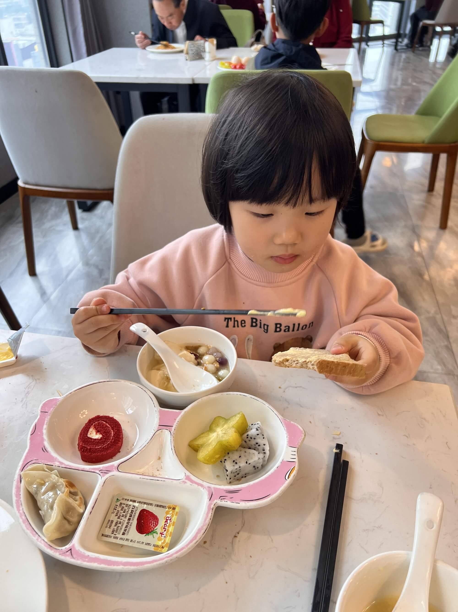

住进来雅朵酒店这两天，必须要好好夸一夸它！从踏入酒店的那一刻起，就能感受到它在基础设施上的贴心设计。虽然美中不足的是地下停车场没有充电桩，但这小小的瑕疵完全掩盖不了它在其他方面的出色表现。

### 舒适实用的房间设施
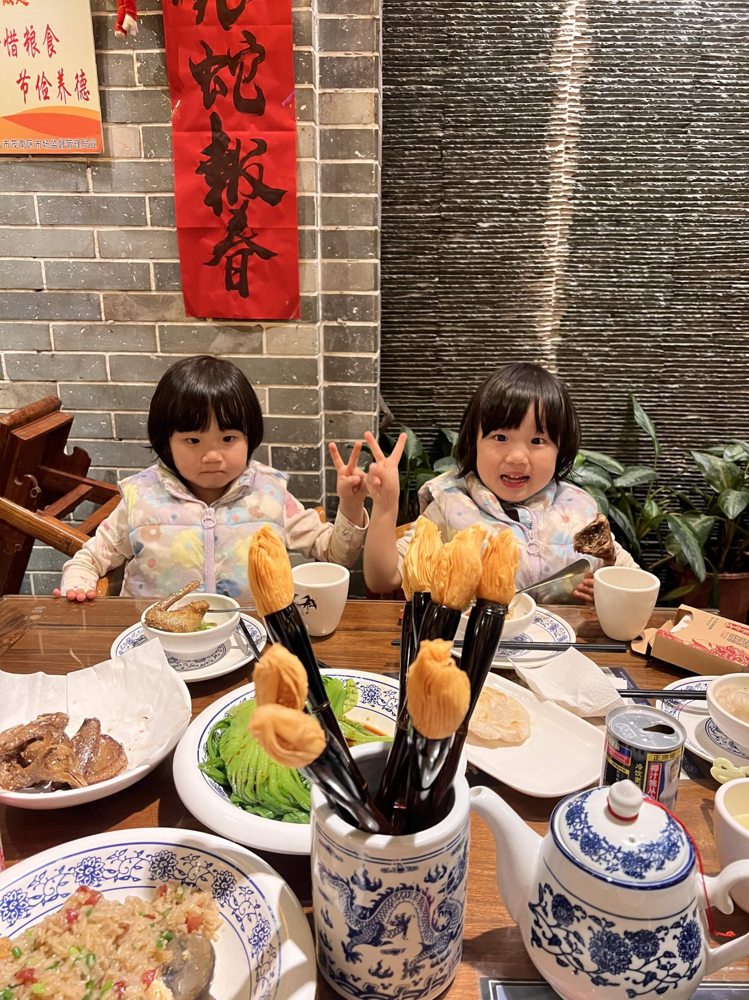

进入房间，各种设施都让人倍感舒适。书桌桌面上设计了斜插排，充电时再也不用低着头趴在地上找墙角的插头，还不用担心充电插头容易掉落。电话线边上配备的一拖三 USB 充电器，随时随地都能给电子设备充电。房间里的沙发、办公桌、各种装饰以及茶包、茶杯、小茶壶一应俱全，营造出一种优雅惬意的氛围。床头柜上摆放的书籍，方便住客随时阅读。而且，酒店一楼半还有书吧，为喜欢学习、阅读的客人提供了专属空间，这些设计真的十分贴心。

### 惊喜满满的洗衣服务

在众多令人满意的设计中，最让我开心的当属酒店的洗衣房。洗衣房配备了3个洗衣机和3个烘干机，相比一些酒店昂贵的付费洗衣服务，这里的自助洗衣机零成本使用，还贴心地提供了洗衣液和消毒液，洗完衣服后还有袋子方便收纳。更绝的是，洗衣房边上有小便条，住客可以勾选要洗、要烘或者洗衣加烘干等选项，还能注明黑衣服白衣服是否分开洗，以及填写房号要求送回房间。我自己就体验了两次，两晚洗完衣服后发现烘干机要排队，等的时间太长就先回房间睡觉了，没想到早上一开门，烘好的两包衣服就挂在门口，这服务简直太贴心了，必须给五星好评！洗衣房里还有很多洗衣篮，挂着“未洗”“已洗”“干”等小吊牌，方便大家整理衣服，这些小细节真的很加分。

### 暖心暖胃的特色夜宵
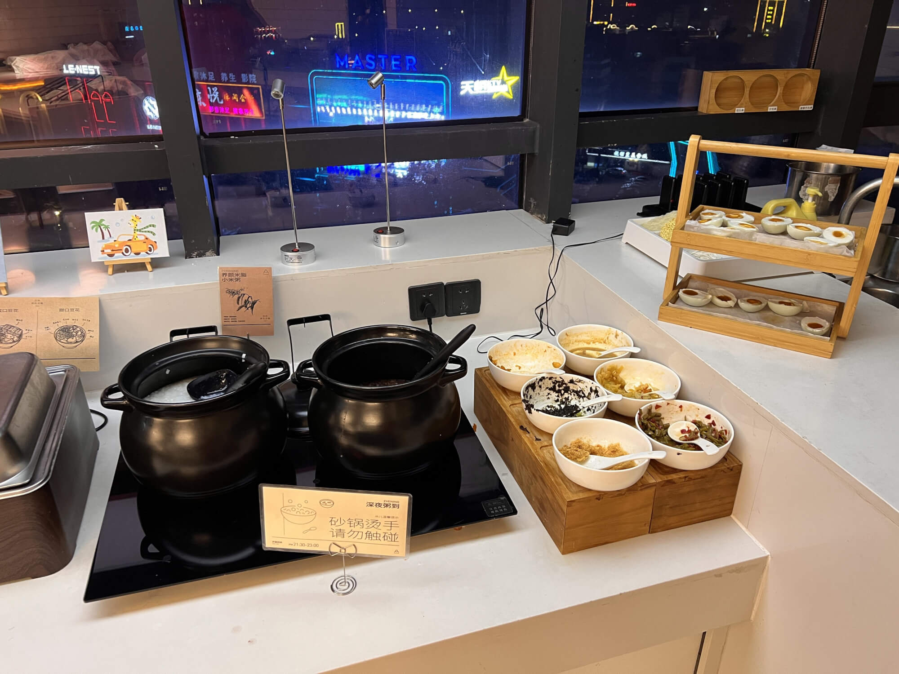

除了以上这些，雅朵酒店的夜宵服务也值得称赞。一般酒店都只有早餐，而雅朵酒店在早餐之外，还贴心地提供夜宵。昨晚九点半到十一点，夜宵区提供了包子、馒头、红豆粥、白米粥以及小菜等食物。我自己喝了几碗，还拿了一碗回到房间和宝妈分享，干净又卫生，有了这些夜宵，都不用点外卖了，实在是太方便了。

### 书香四溢的阅读空间
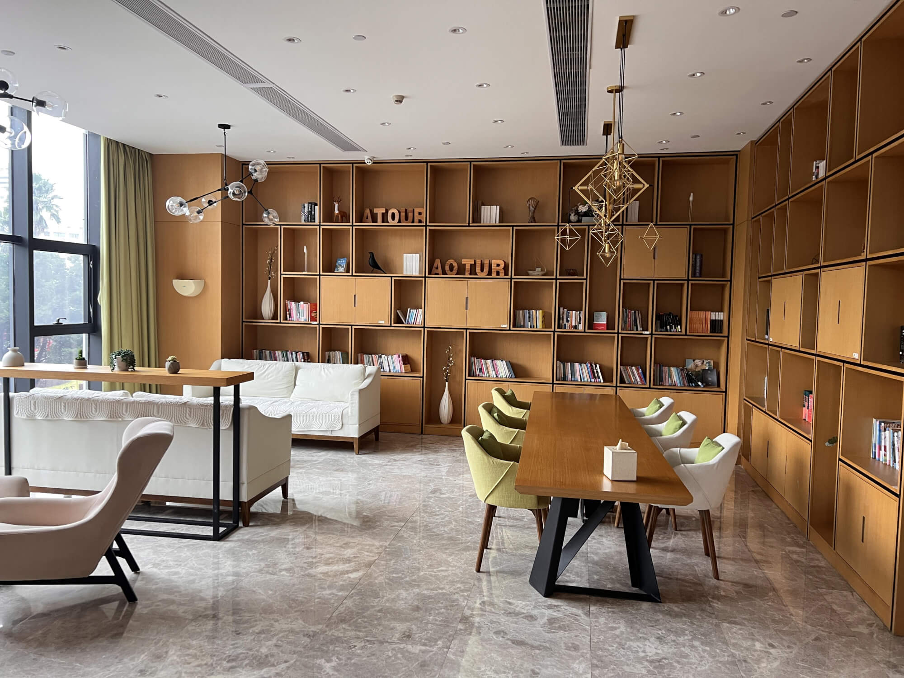

酒店2楼的书吧同样给我带来了不少惊喜。走进书吧，能发现这里选书的品味相当不错，每一本都能看出酒店的用心。更棒的是，通过小程序还能选择自己想要的书，酒店会直接送到房间，这一服务简直太方便了。而且每个房间的墙上也都摆放了一本书，让阅读触手可得。

书吧里不仅有舒适的沙发，还有办公桌，为阅读和学习提供了良好的硬件条件。虽然一楼会传来一些噪声、也会飘来一些烟味，但只要戴上耳机，瞬间就能沉浸在自己的阅读世界里。这样的环境完全符合我对阅读空间的需求，安静又惬意。 

