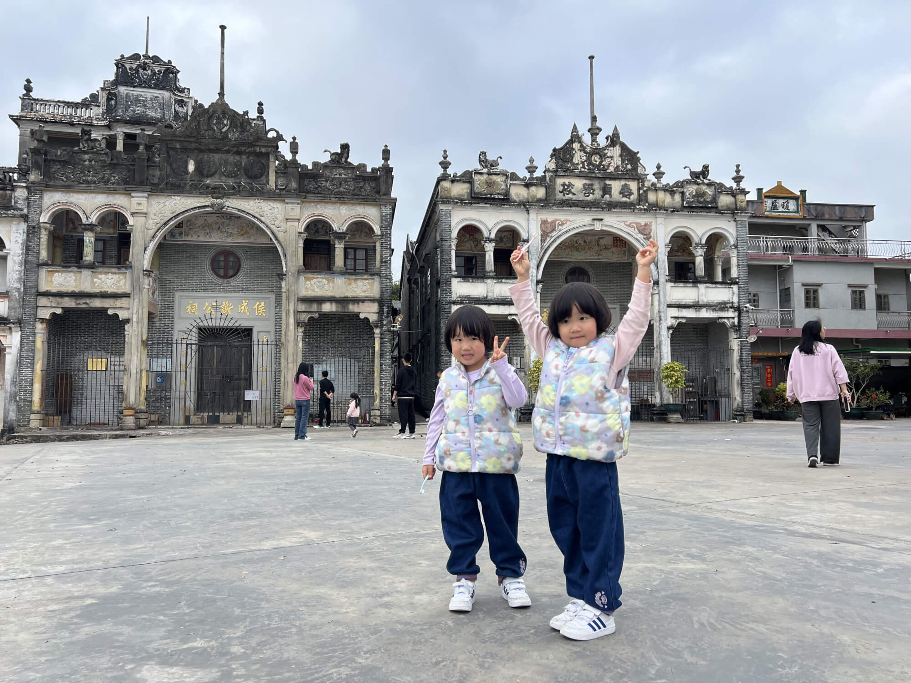

2025-02-01，大年初四，茂名，晴

## 茂名出发前的作业时光
2025年2月1日，大年初四，今天我们准备从茂名出发前往江门。早上起床后，一切按部就班，下楼吃过早饭，便着手安排宝宝的寒假作业。虽说假期正酣，但学习任务也不能落下。
<!--more-->

## 绘制独特挥春
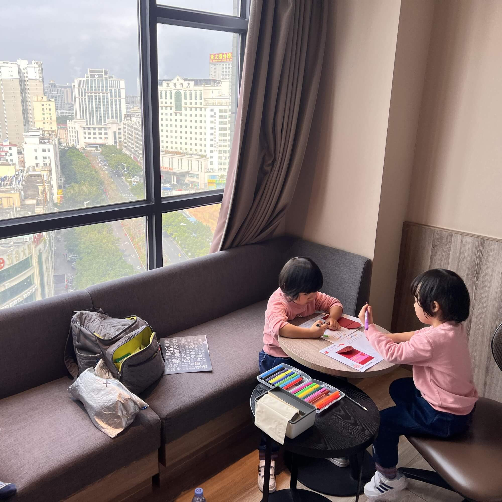
今天宝宝的作业有两项，第一项是画挥春。挥春在粤语里，类似春联、福字这类具有春天氛围的装饰。 我先拿出春联贴纸，让宝宝体验了一番贴春联的乐趣。接着，准备画挥春了。我先贴了一个横批，在中间写了个“蛇”字，让宝宝在旁边画蛇。宝宝拿起黄色的笔，歪歪扭扭地画了几笔，再用红色点上眼睛，一条可爱的小蛇就诞生了。

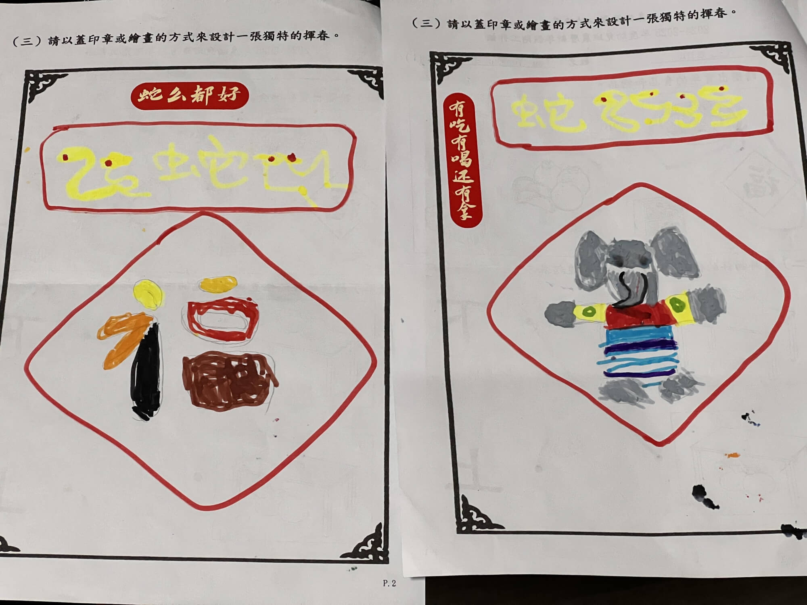
随后，我又画了个菱形方框，准备让宝宝写“福”字。考虑到宝宝写字还不太熟练，我先用铅笔打好底稿，海兔宝宝就认真地沿着底稿给福字涂色。这时，珊瑚宝宝提出要画一只小象，我同样用铅笔帮他打好底稿，让他自己涂色。两个小家伙一边画一边玩，进度缓慢，但满是童趣。

## 描绘学校喜爱设施
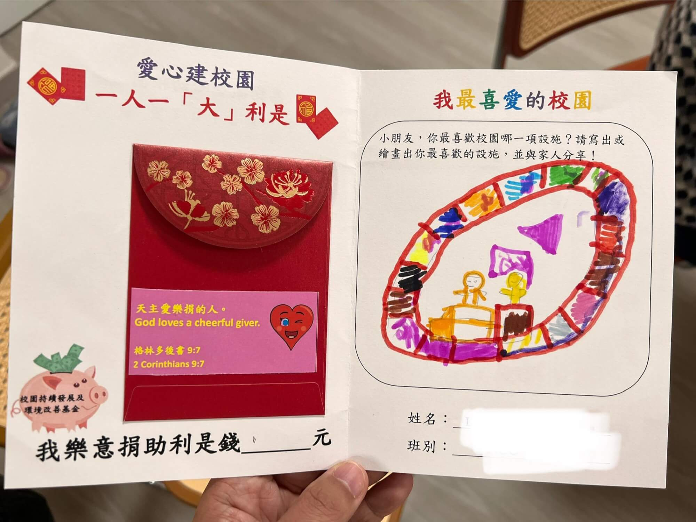
第二项作业和学校有关，作业纸的封面是红包装饰，要求给学校捐款，里面作业要求画自己最喜欢的学校设施。学校里虽没有充气城堡，但有大型玩具，我便给海兔宝宝画了一个充气城堡，给珊瑚宝宝画了小火车和铁轨。宝宝们专心致志地涂着颜色，完成了这项作业。

## 磨蹭出门
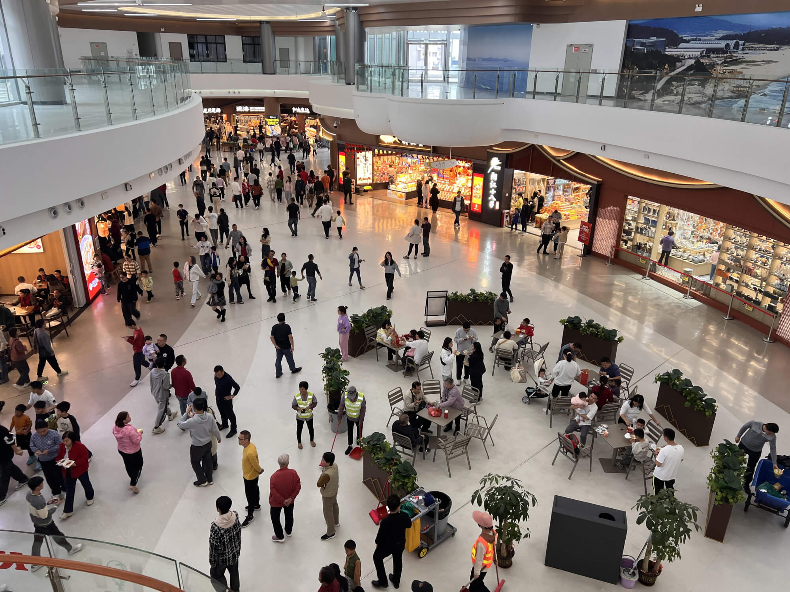

就这样，磨磨蹭蹭地吃完早餐，又完成了作业，一看时间，已经十一点多了。收拾好东西，我们这才准备出发前往江门。虽说出发时间晚了些，但和宝宝一起完成作业的过程，充满了温馨与欢乐，也算是旅途中一段特别的小插曲。 

## 踏上旅途，高速遇堵
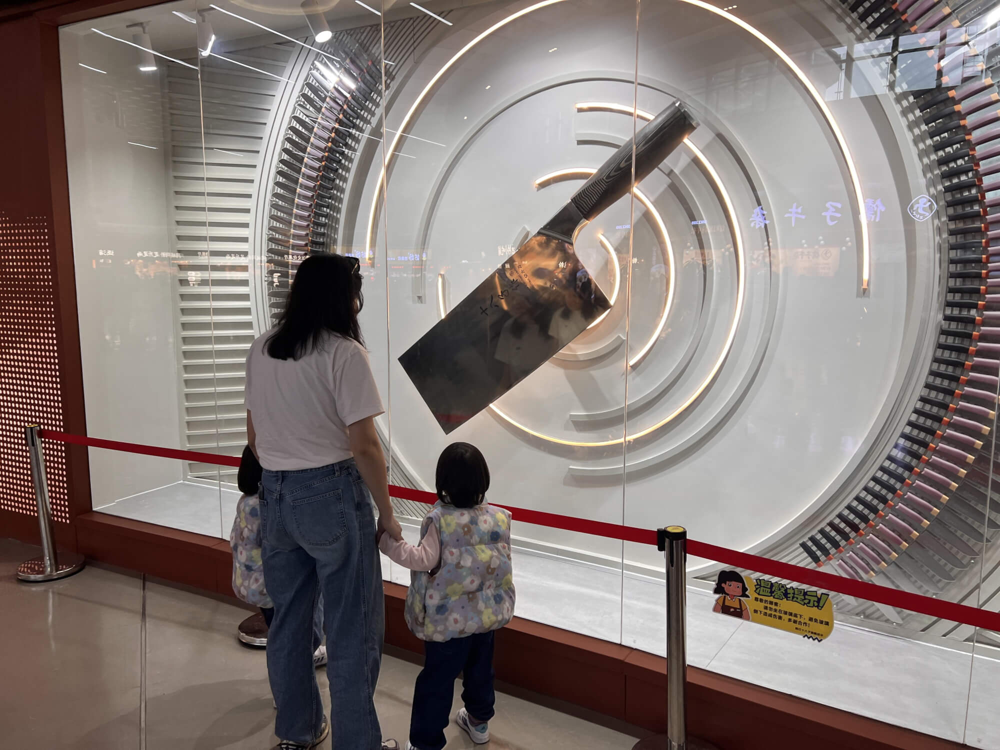

从茂名出发前往江门，计划途中先去开平碉楼，晚上再入住江门。摆在面前有两条高速路线可选，导航显示走沈海高速会更快些。昨晚查询路线时，显示行程大概两个多小时，全程200多公里，可今天早上出门再看，时间延长到了三个半小时。谁能想到，上了高速后，直接陷入了严重的拥堵。随着时间推移，预计到达时间不断增加，最后显示接近五个小时才能抵达。一路上也没碰上什么交通事故，纯粹是车流量太大了。初四这一天，估计很多回粤西过年的人都踏上了回粤东搞钱的返程路，导致四车道被塞得满满当当。堵车的时候，左侧快车道的车速反而最慢，慢车道车辆因为没有什么货车，变道更灵活，速度相对更快一些。（补充：初七是返程高峰，写作本文时，查询了同样路程，需要7个小时以上，太堵了！）

## 艰难抵达阳江服务区

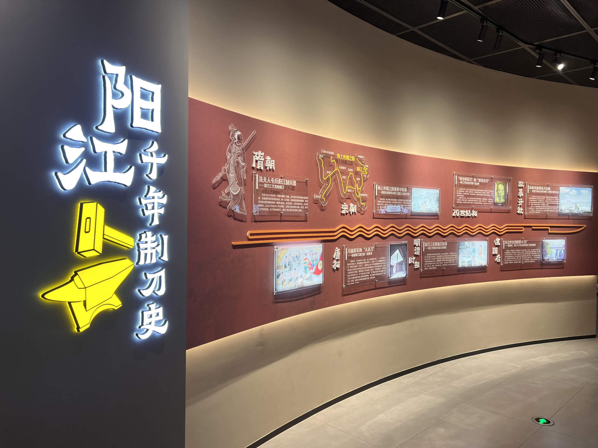

一路艰难前行，到了中午饭点，途经好几个服务区，路上大屏都提前显示人太多。大概下午两点，我们终于抵达了阳江服务区。这个服务区给人的第一印象非常好，首先它很新，充电桩数量充足，大概有二三十个，我们到的时候就直接有空闲的可以使用。服务区里商铺也十分不错，不仅有肯德基(K coffee)，隔壁服务区还有星巴克、麦当劳等比较正规的餐饮品牌。而且，服务区内还有文化展示区域，比如展示阳江刀具，就像是一个小型展览馆，颇具博物馆的氛围，展示区旁边就是销售区，能让过往的旅客在休息的同时了解当地特色文化。

## 服务区的优缺点
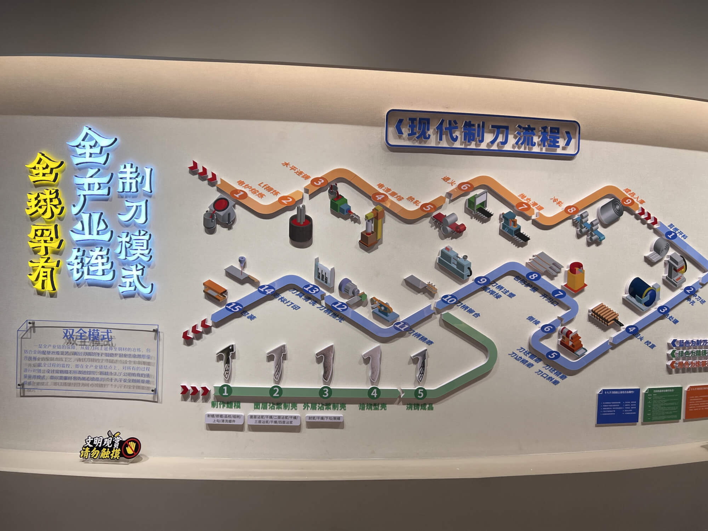

阳江服务区虽有诸多优点，但也存在一些不足。充电价格太贵了！高达1.9元/度，是我充过最贵的桩，没有之一。另外，人实在太多了，在肯德基点餐，竟然要等二十分钟才能取餐。在这个繁忙的出行高峰，服务区虽尽力满足大家的需求，但还是难以应对如此庞大的人流量。 

## 邂逅开平仓东村：惊喜碉楼之旅
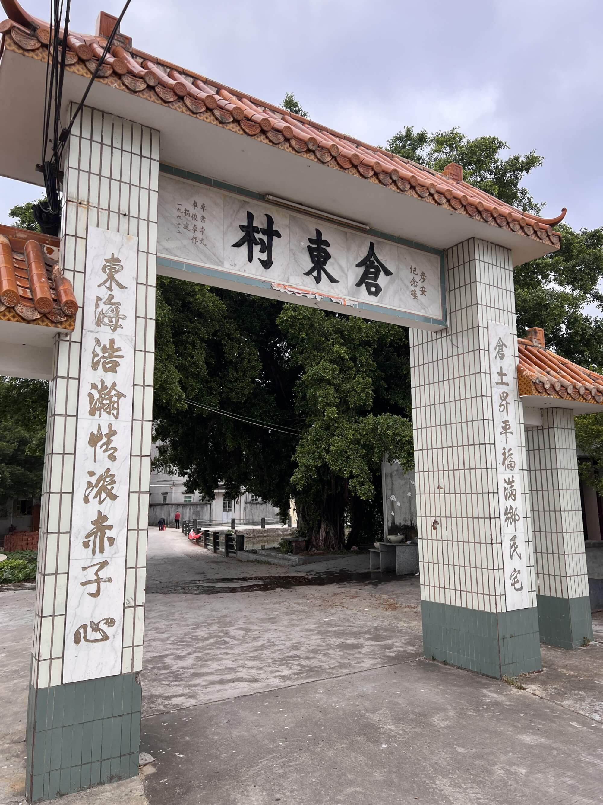

### 堵车延误，邂逅小众之美
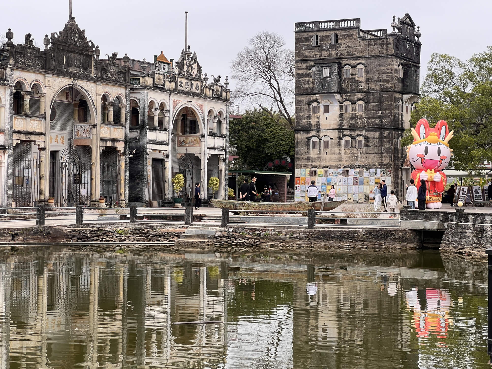

原本满心欢喜地计划着一场开平碉楼深度游，早早出发，却没想到在途中遭遇了堵车大军。漫长的等待让时间一点点流逝，原本紧凑的行程被打乱。直到下午4点半，我们才抵达开平。此时，看着自立村50元、立园100元的门票价格，再算算所剩无几的游玩时间，实在觉得性价比不高。正有些失落时，宝妈查询得知立园旁边有个免费的仓东村，值得一看！于是。我们决定改变计划，前往这个小众村落，开启一场未知的探索。

### 便捷停车，初入古朴之境
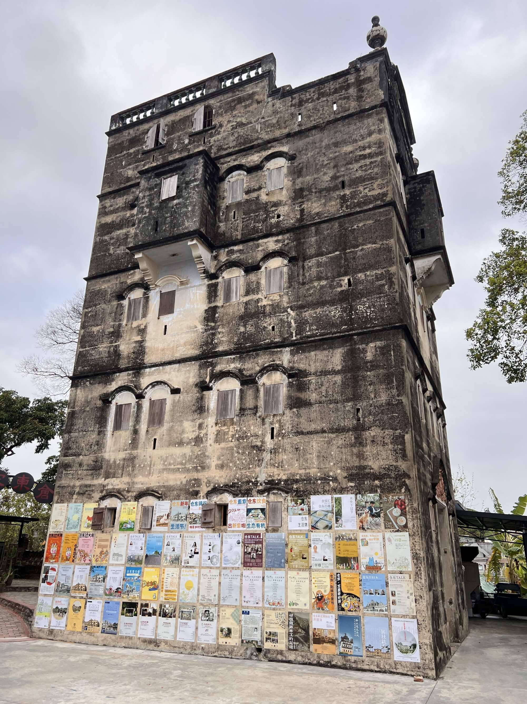

到达仓东村，游客不多，停车十分方便，一下子就驱散了堵车带来的些许烦躁。从村口的牌坊往里走，不过200米左右，便看到了两个谢家祠堂。祠堂前有一方清澈的水池，水面如镜，倒映着祠堂的古朴身影。祠堂修旧如旧，保留了原汁原味的历史韵味，飞檐斗拱、每一处细节都诉说着岁月的故事。阳光洒在祠堂的墙壁上，光影交错间，仿佛能看到往昔的繁华与热闹。

### 古建民宿，感受岁月沉淀
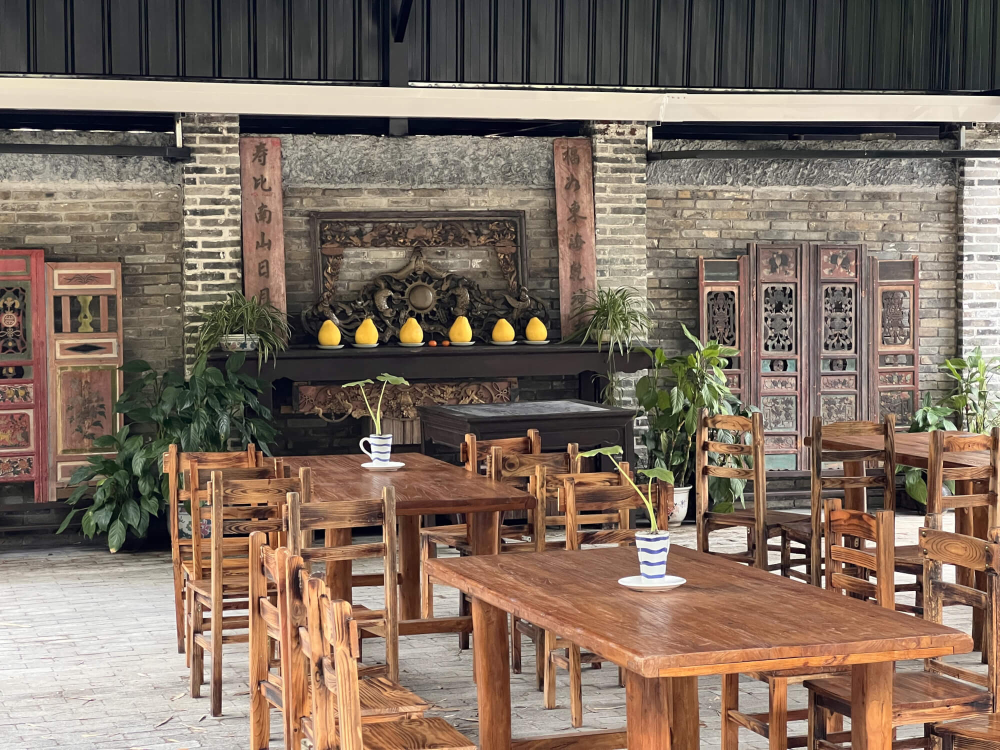

走近祠堂，细细观赏，不仅为其精湛的建筑工艺所折服。随后，我们发现祠堂后面还有一些别具一格的民宿。这些民宿由老式建筑改建而成，保留了传统建筑的外观，庭院深深，绿树成荫，营造出一种宁静而温馨的氛围。我好奇地查了一下春节期间的价格，竟然要1700+一晚，几乎满房证明了它的独特魅力。想象着在这样的地方住上一晚，伴着月光入眠，听着鸟鸣醒来，该是多么惬意的体验。

### 漫步村落，共享亲子时光
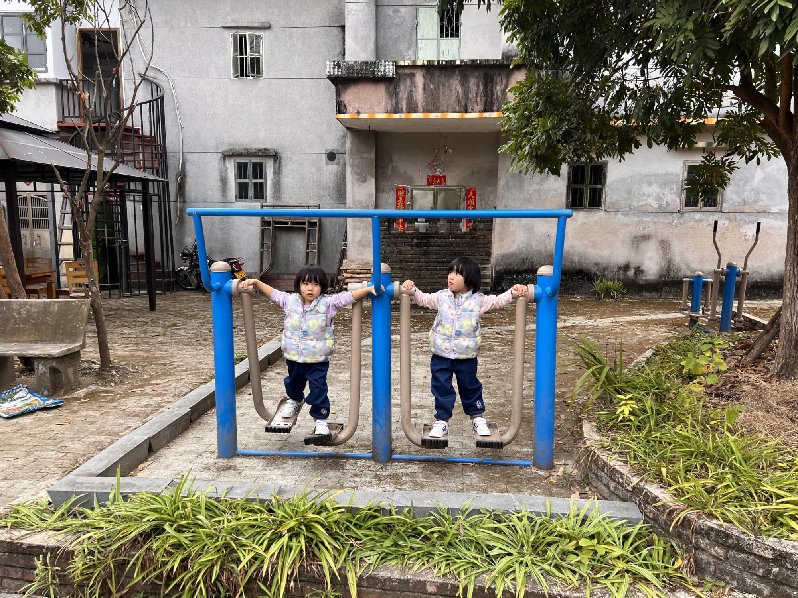
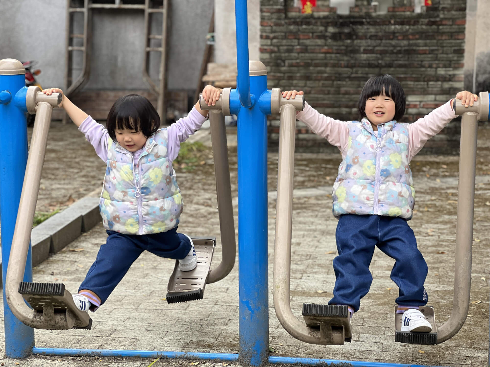

带着宝宝在村子里闲逛，每一步都充满了惊喜，墙壁上爬满了绿色的藤蔓，充满了生机。宝宝兴奋地跑来跑去，这里玩玩，那里看看，眼睛里闪烁着好奇的光芒。我们一路欣赏着乡村的美景，享受着难得的亲子时光。

### 广场留影，航拍记录美好
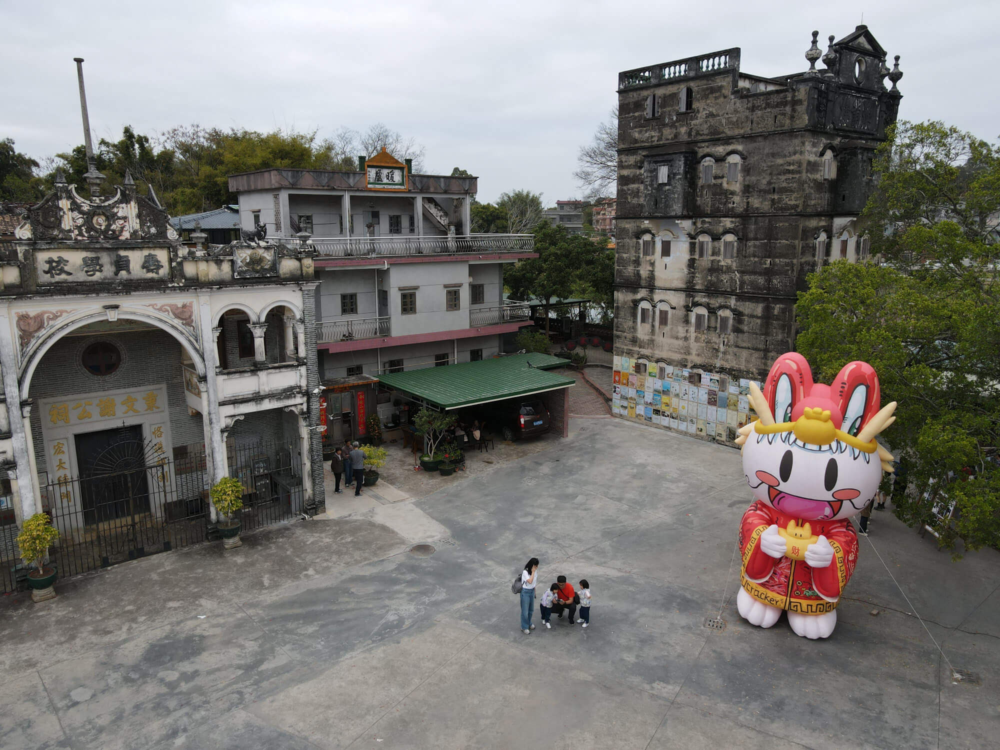

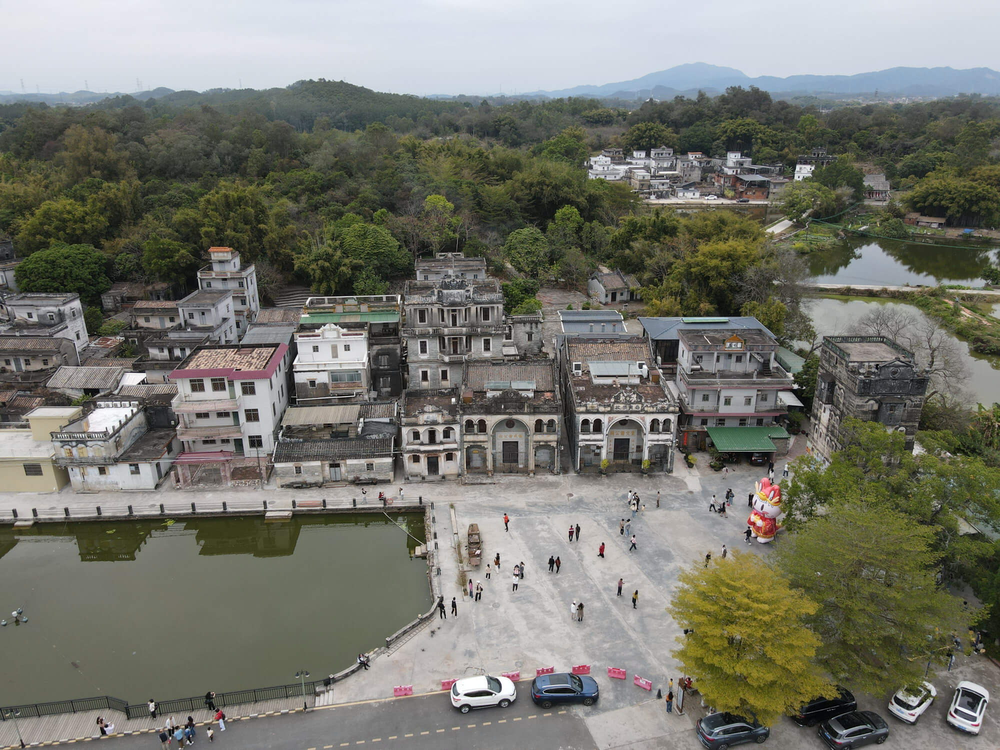

逛到村外的广场，一个巨大的兔子充气玩偶吸引了我们的目光。宝宝兴奋地跑过去，拉着我要拍照。在广场上，除了这个可爱的玩偶，还有几座别具特色的房子。我拿出无人机，让它缓缓升空，从高空俯瞰整个仓东村。在无人机的镜头里，仓东村宛如一幅美丽的画卷，奇特的碉楼、清澈的水池、郁郁葱葱的树木，构成了一幅和谐的乡村美景图。我用镜头记录下这美好的瞬间，希望能将这份美好永远留存。

### 意犹未尽，踏上返程之路

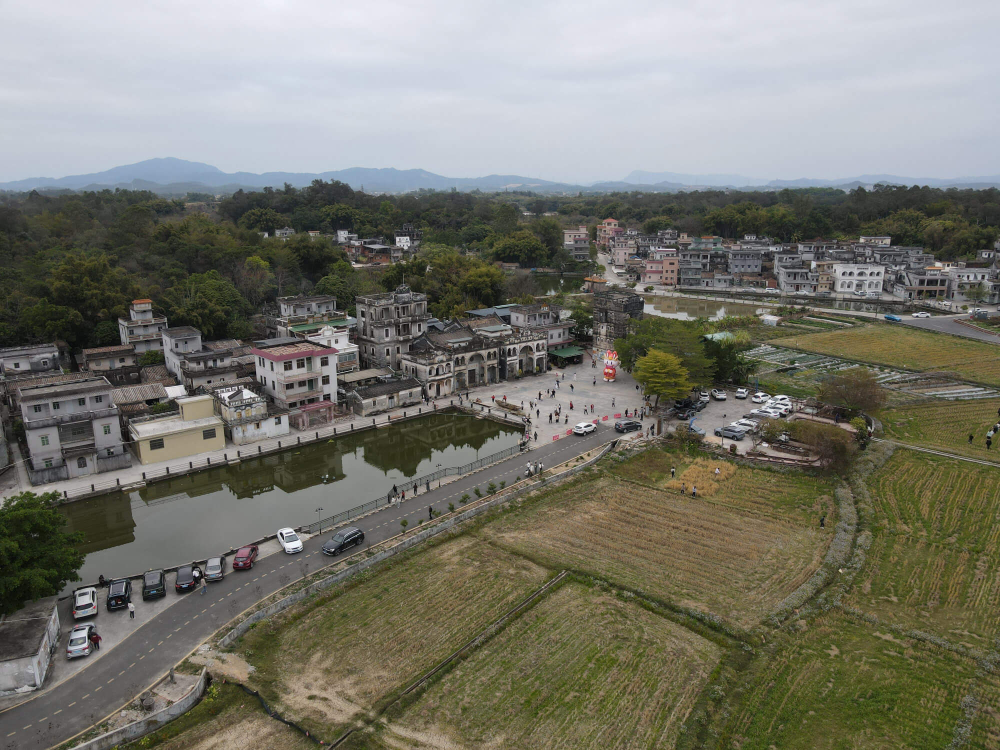

不知不觉，天色渐晚，我们在仓东村的游览也接近尾声。虽然在仓东村停留的时间不长，但这里的一切都给我们留下了深刻的印象。它没有知名景点的喧嚣与繁华，却有着自己独特的宁静与韵味。带着满满的回忆和不舍，我们开车前往江门。这次意外的仓东村之行，成为了我们旅途中最难忘的一段经历，期待着下次还能有机会再来开平，深入探寻碉楼更多的魅力。 

## 江门初五夜宿希岸Deluxe酒店
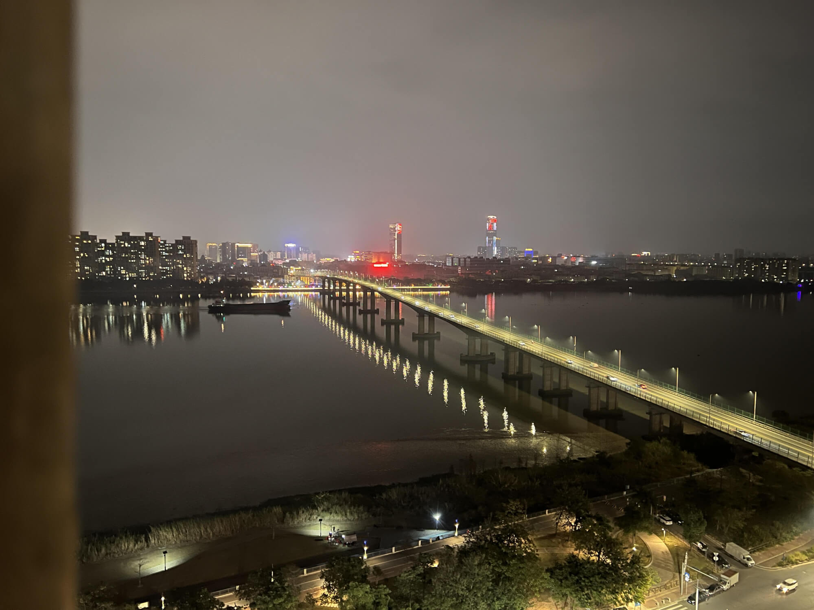

夜幕降临，华灯初上之时，我抵达了江门，选择下榻在江门外海大桥希岸Deluxe酒店。它位于江门市东边的江海区，与中山市一江之隔。办理好入住手续后，我迫不及待地来到房间。推开窗户，一阵带着江水气息的微风扑面而来。眼前，便是浩浩荡荡的西江，江水在夜色中泛着粼粼波光，而江的对面，便是中山。酒店就紧靠着西江，不远处的大桥横跨江面，车辆在桥上穿梭，灯光闪烁，与江水相互映衬，构成了一幅绝美的夜景图。

## 湿地公园，鞭炮声声
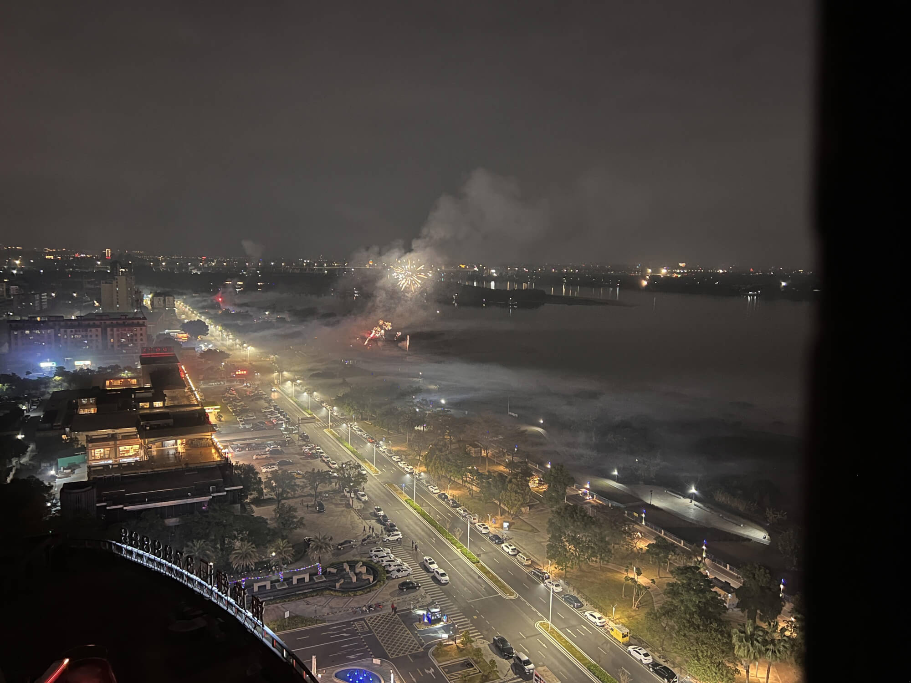

酒店楼下是湿地公园，有鞭炮燃放点，鞭炮声此起彼伏，五彩斑斓的烟花在夜空中绽放，将整个夜空装点得格外绚丽，宝宝们也在窗台欣赏不同的烟花，眼力充满兴奋。

## 舒适江景，智能体验
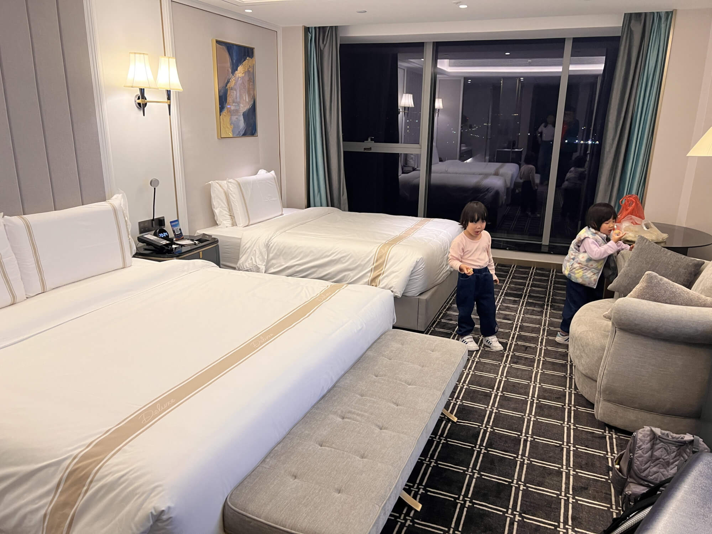

我们入住的是江景亲子间，房间里一大床一小床的配置十分贴心，满足了家庭出行的需求。房间整体采用欧式装修风格，典雅而不失温馨，每一处细节都透露着精致。更让我惊喜的是，房间里配备了小度智能音箱，只需动动嘴，就能轻松开关窗帘、调整灯光，播放音乐，智能化的体验增添了不少便利与乐趣。

## 深夜放烟花，迎财神
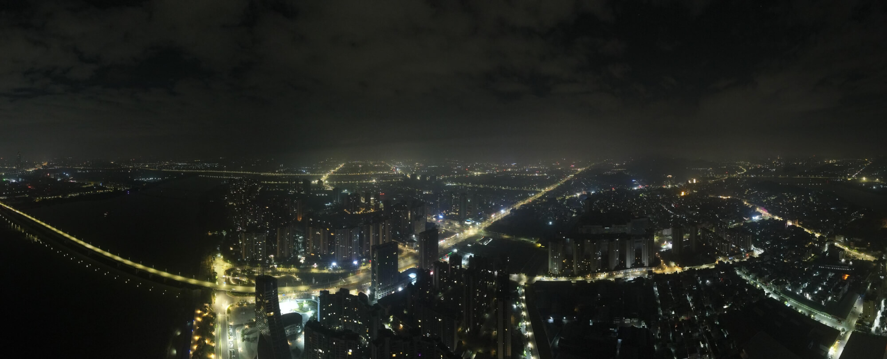

年初五迎财神，本以为江门和中山这边会鞭炮声声，热闹非凡，可实际感受下来，氛围似乎没那么浓烈呢。十二点整，我特意跑到西江边上的烟花燃放点，满心期待能邂逅一场璀璨烟火秀。傍晚时分倒是还有不少人在放，可到了夜里，现场却冷冷清清，鲜有人影。我还派出无人机飞到高空侦察，结果也没捕捉到那种热闹的迎财神氛围。最后，我自己简单放了两根烟花，感受一下这仪式感，就打道回府啦。 

## 设施完备，便捷出行
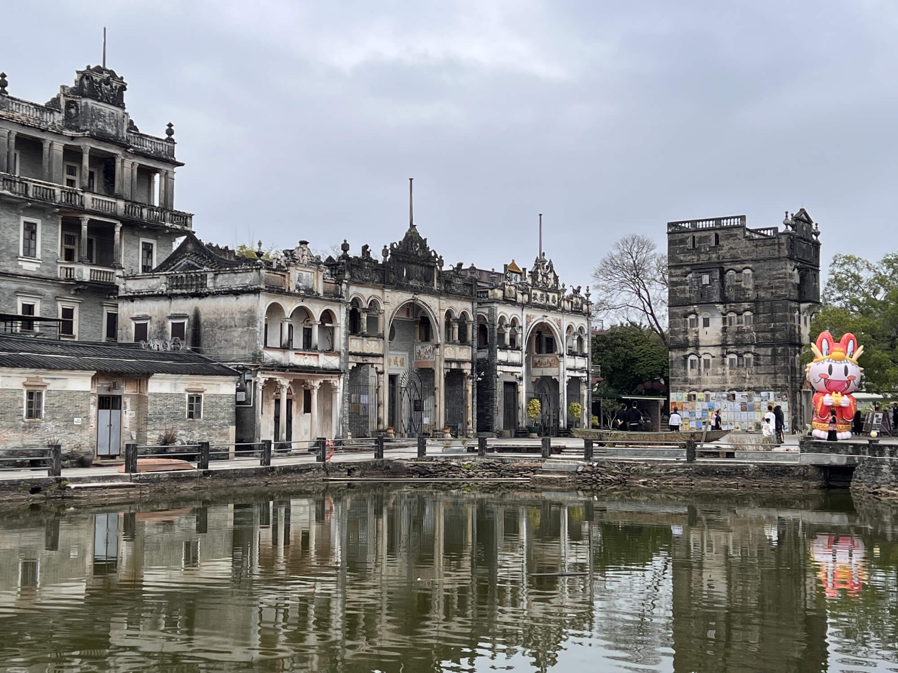

这次在江门江门外海大桥希岸Deluxe酒店的住宿体验很不错，它不仅有着优越的地理位置和舒适的环境，更有着贴心的服务和完备的设施，一楼有大堂吧和奶茶店，方便晚上宝宝熟睡后溜出来写游记，院内也有充电桩。期待接下来在江门的旅程，能收获更多美好的回忆。 
