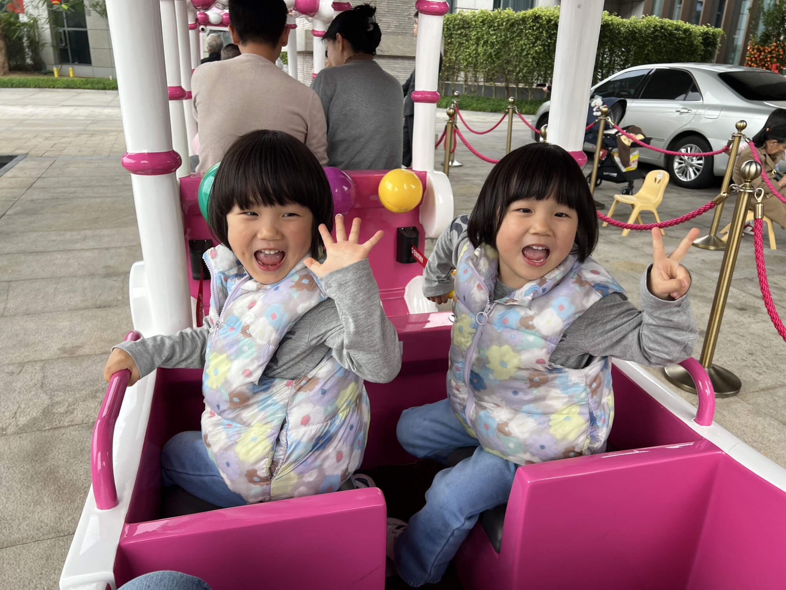
2025-02-03，大年初六，东莞，多云

## 清晨时光：宝妈遛娃，我打包行李

早上，宝妈带着宝宝出门去享用早餐，接着去玩小火车和儿童乐园。而我则留在房间里开启了一项“艰巨”的任务：打包行李。
<!--more-->

## 艰难打包：塞满箱子的“战斗”

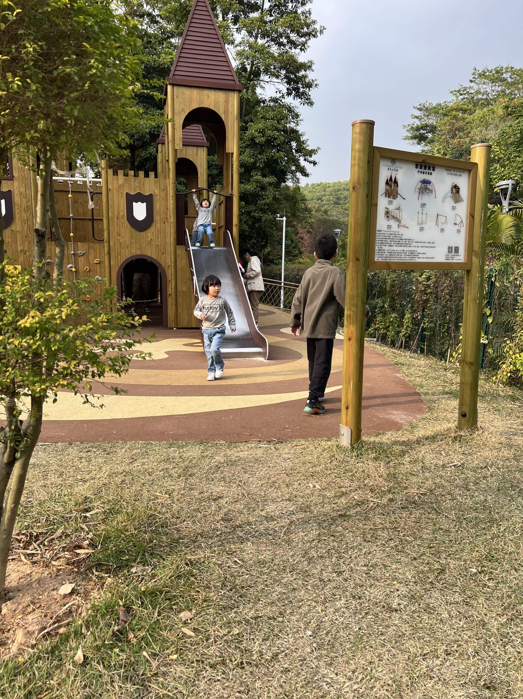

这打包工作可没那么容易，前几天一直在赶路，行李只需要简单地打包，每天上车下车就可以了。可今天情况不同，我们即将返回香港，内地的车只能停在深圳，而不是开到香港家楼下，所以散落大包小袋子里行李实在不便携带，必须得把所有东西都规整到一大一小两个行李箱里。

我花了好一会儿时间，费了九牛二虎之力，才终于把东西一件件塞进箱子里，两个箱子都被塞得满满当当，压了半天才关上。即便如此，还是有一些东西塞不进去，无奈之下，我又另外带了一个小包来装剩余物品。

## 打包反思：优化之路的探索

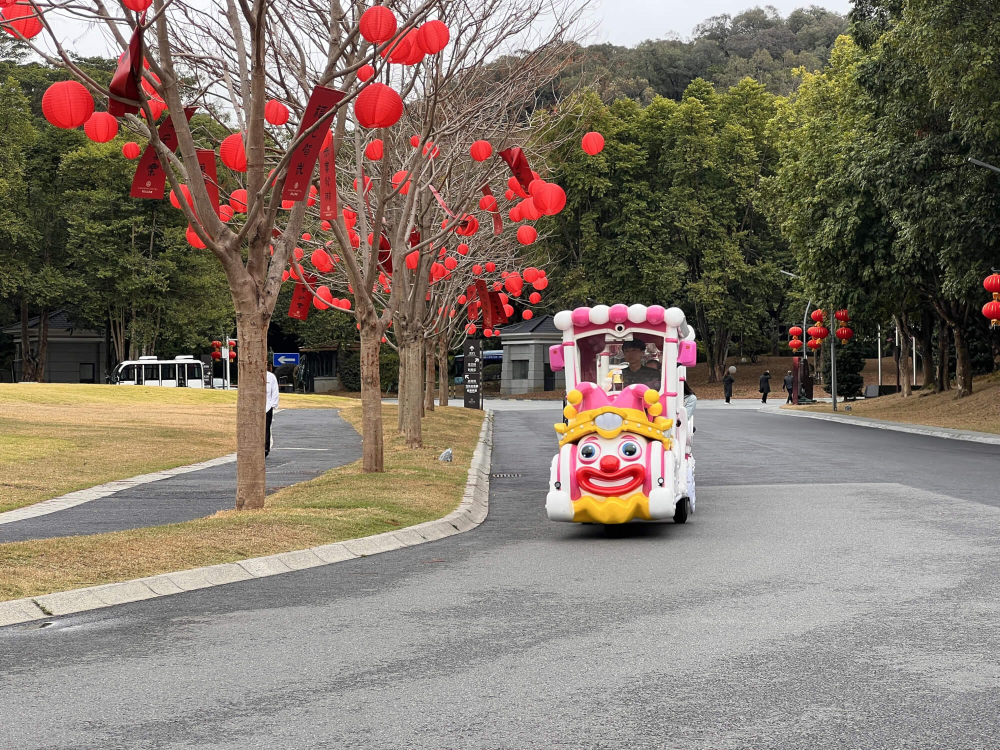

这次出门，每天收拾行李都耗费了我大量的精力。感觉在这方面确实有很大的优化空间。首先想到的是考虑将宝宝的行李箱和父母的行李箱分开，这样或许能让物品分类更清晰。但这样一来，每天入住酒店又要拿两个箱子上楼，操作起来也不太方便。

或许可以把日用品放在一个小箱子里，那些不常用的物品则放进大行李箱，这样可能会方便一些。不过，具体怎么操作才能更高效，我询问了 DeepSeek，它给出的几点建议还是蛮有启发的，比如"将行李箱按使用场景分三层","利用箱体轮子凹槽空间放置扁平物品","每晚预收次日要穿衣物",尝试"行李箱压力测试"等等。这些方法都值得尝试，希望下次旅行能更从容优雅地完成打包工作。

## DeepSeek建议(供参考)

**一、立体化分类系统（核心物品管理）**
1. **垂直分层法**：将行李箱按使用场景分三层
   - 顶层：每日必需用品（尿布/湿巾/奶粉分装盒）
   - 中层：隔夜换洗衣物（用压缩袋立体收纳）
   - 底层：低频物品（备用药品/工具包）

2. **时间轴收纳原则**
   - 前48小时用品放在易取位置
   - 返程前24小时物品单独设置"缓冲区"
   - 长期备用物品用真空袋压缩后平铺箱底

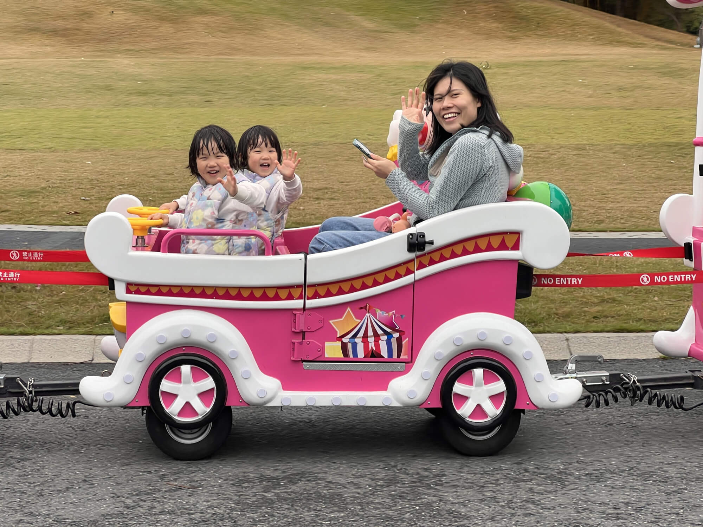

**二、动态调整策略（应对日常使用）**
1. 建立"移动工作站"概念：
   - 保留1个20L折叠包作为灵活容器
   - 白天装入：水杯/零食/应急物品
   - 晚上变身脏衣收纳袋

2. 采用"蜂巢式收纳法"：
   - 用六边形收纳盒填满箱体空隙
   - 小物件分类存放（如充电器/药品）
   - 利用箱体轮子凹槽空间放置扁平物品

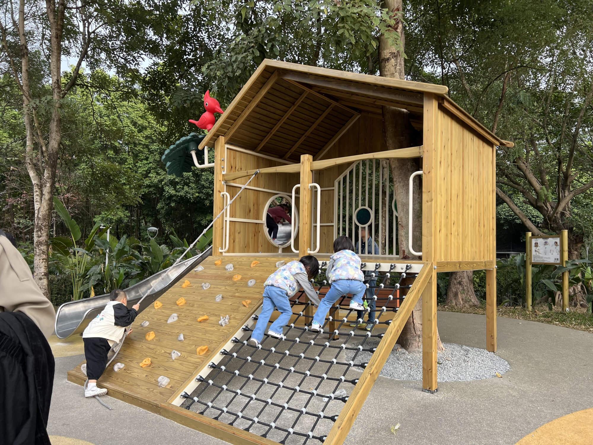

**三、预防性打包技巧（事前准备）**
1. 制作"行李矩阵表"：
   - 每小时 | 随身包前袋 | 每日补充
   - 每日 | 小箱上层 | 隔日补充
   - 全程 | 大箱底层 | 不需补充

2. 实施"5分钟日常维护"：
   - 每晚用手机定时提醒整理
   - 处理已消耗物品空间（如空奶粉盒）
   - 预收次日要穿衣物

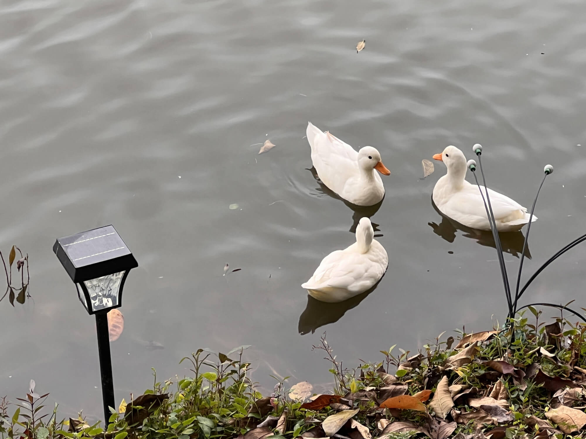

**四、空间魔法实践**
• 衣物采用"寿司卷收纳法"：将整套搭配卷成筒状
• 鞋履变身收纳容器：袜子塞进鞋头，充电线绕鞋底
• 利用箱盖空间：粘贴磁吸收纳板存放常用小物

建议尝试"行李箱压力测试"：打包完成后模拟3次开箱取物场景，检验物品易取程度。经过2-3次旅行磨合后，您会发现打包时间能缩短40%以上，且空间利用率提升30%。这种系统化思维同样适用于育儿其他场景的流程优化，期待您下次旅行能更从容优雅地完成这项"三维拼图"挑战。

## 启程返程：车脏难洗的无奈

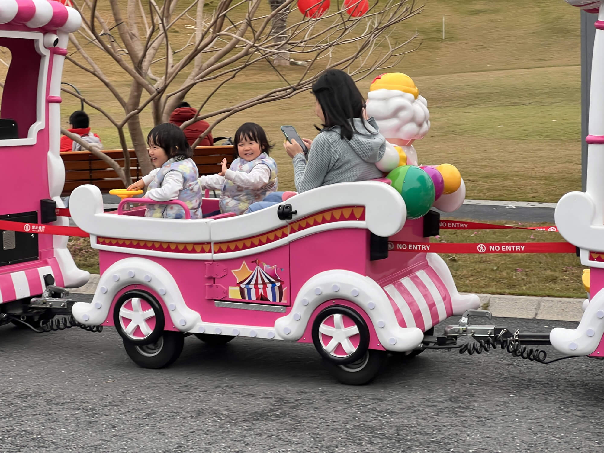

随后，我们踏上了返程之路。这几天连续开车，车子外观沾满了灰尘，内里也凌乱不堪。本想着找个洗车店给车子做个清洁，可沿途搜索了好几个洗车店，结果都处于关门状态，电话问都是要到初八才营业。无奈之下，我们只能放弃洗车的念头，直接向深圳出发。

## 高速之行：路况的变化
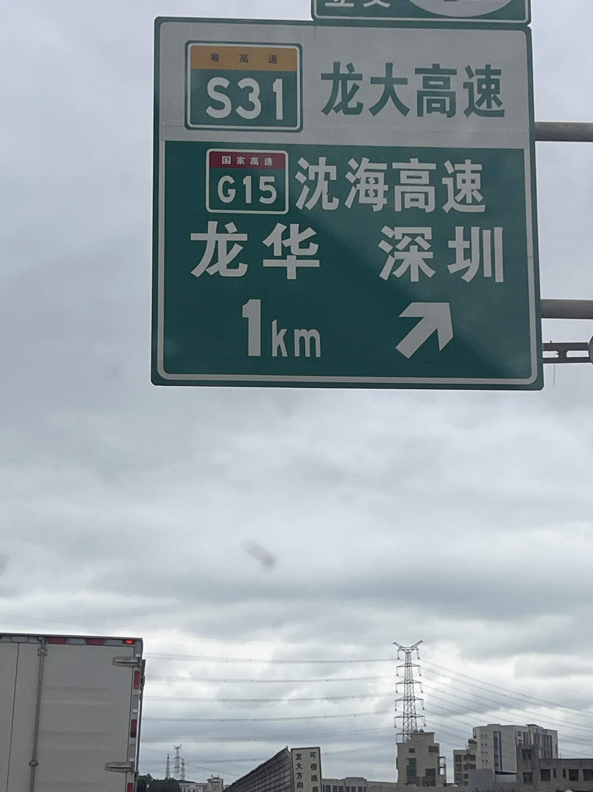

从东莞回深圳有3条高速可选，三条路线所需时间都相差无几，我们最终选了中间最近的龙大高速+福龙路。东莞的那段道路有些坑坑洼洼，车子行驶起来颠簸不已。一进入深圳，明显感觉路况好了很多，道路变得宽阔平整，通行顺畅。大概一个多小时后，我们顺利抵达了深圳福田。

## 取证与午餐：行程的衔接
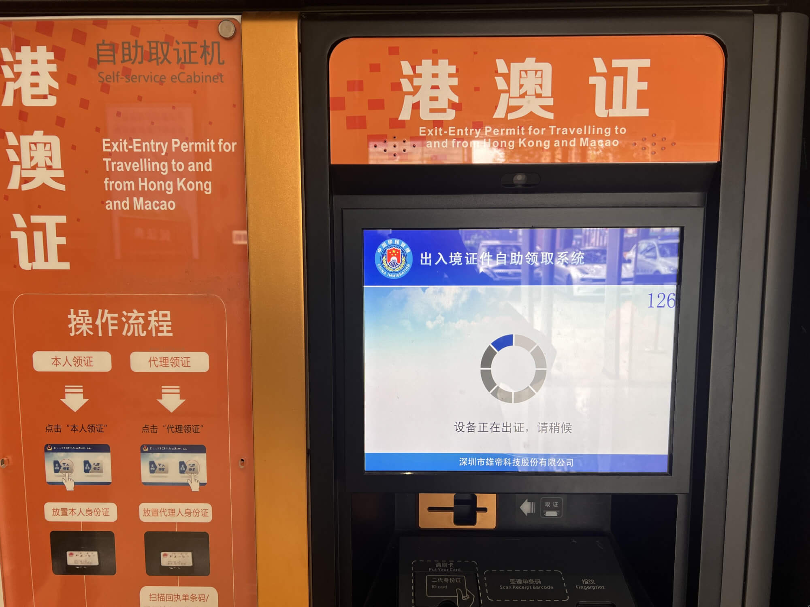

到达深圳后，我们先前往沙尾的福田区出入境大厅，在自助机上刷身份证，很顺利地取到了带有新逗留签签注的港澳通行证。接着把车开回位于岗厦北的停车场，此时已经是下午1点多了。从停车场出来，我们在岗厦北地铁站地下商场的味千拉面解决了午餐。

## 创新返程：新方式的尝试
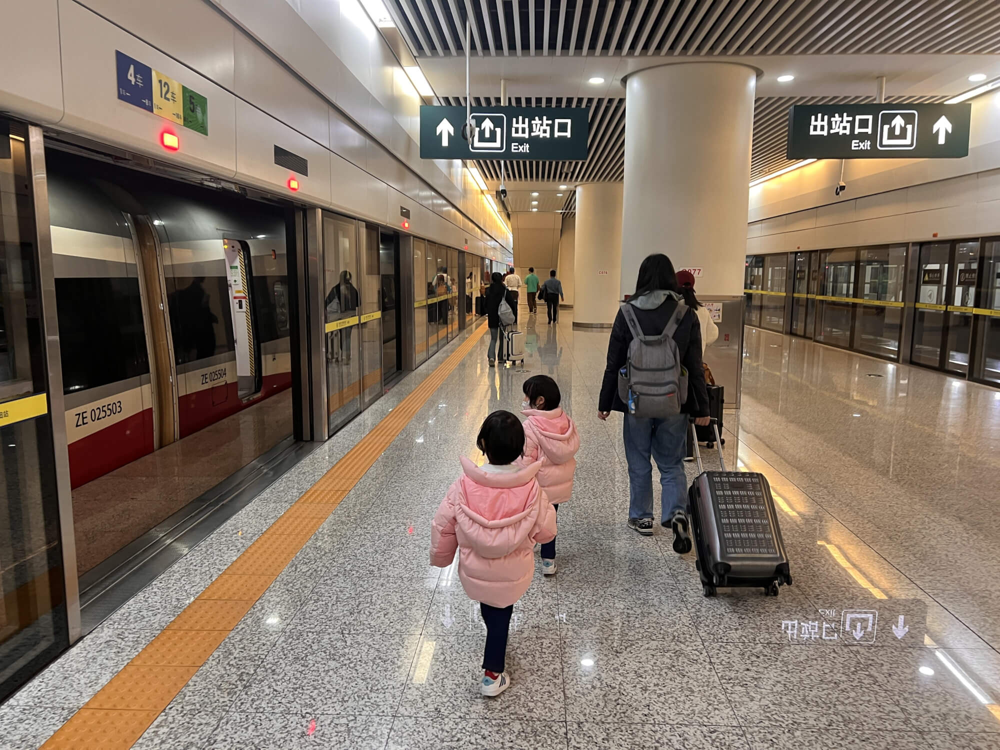

按照往常的经验，我们从福田回香港有两种方式：打车到皇岗，再坐跨境大巴到上环，然后转地铁回家；或者打车/坐地铁到福田口岸，接着搭乘东铁线再转港岛线回家。

但今天带着两个小孩和两个沉重的箱子，我们想换一种更轻松的方式。于是先打车到福田高铁站，乘坐高铁到西九龙，最后打车回家。原本担心从西九龙打车过海回家费用会很高，没想到实际操作下来，不仅节省了时间，人也轻松了不少，而且总费用几乎和前两种方式差不多。

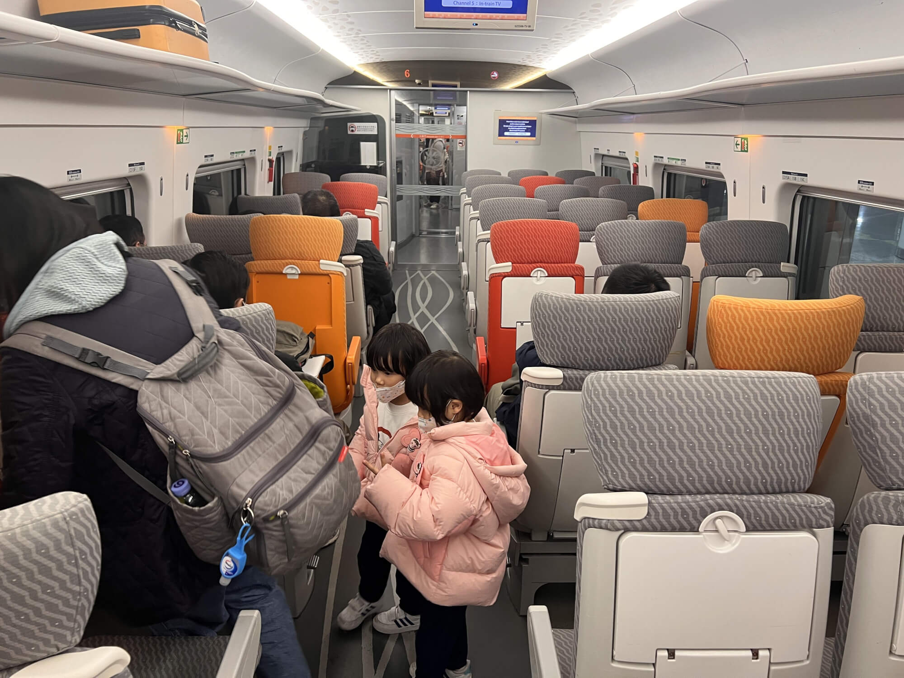

## 时间费用分析：新方式的优势

经过仔细核算，发现选择坐高铁+打车的方式确实很方便：

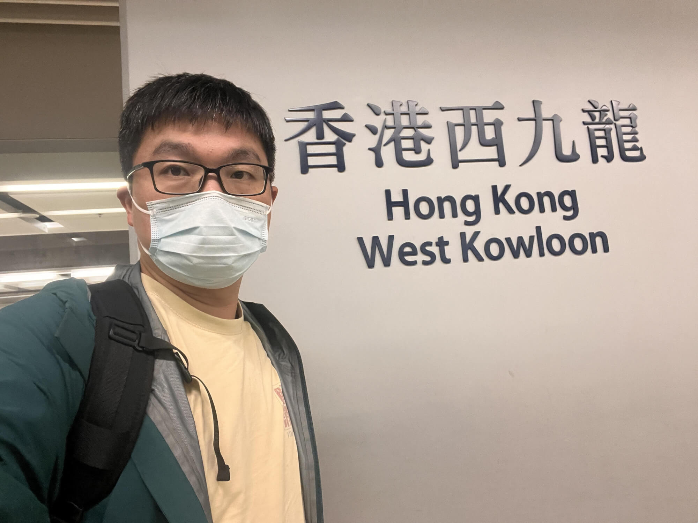

时间上看，西九龙是一地两检，而福田和皇岗口岸都是两地两检，拿着行李上下车走路的距离更长。大交通上，高铁14分钟，大巴50分钟，地铁1小时。小交通上，打车送到家门口，比地铁出站再走一段省时间。

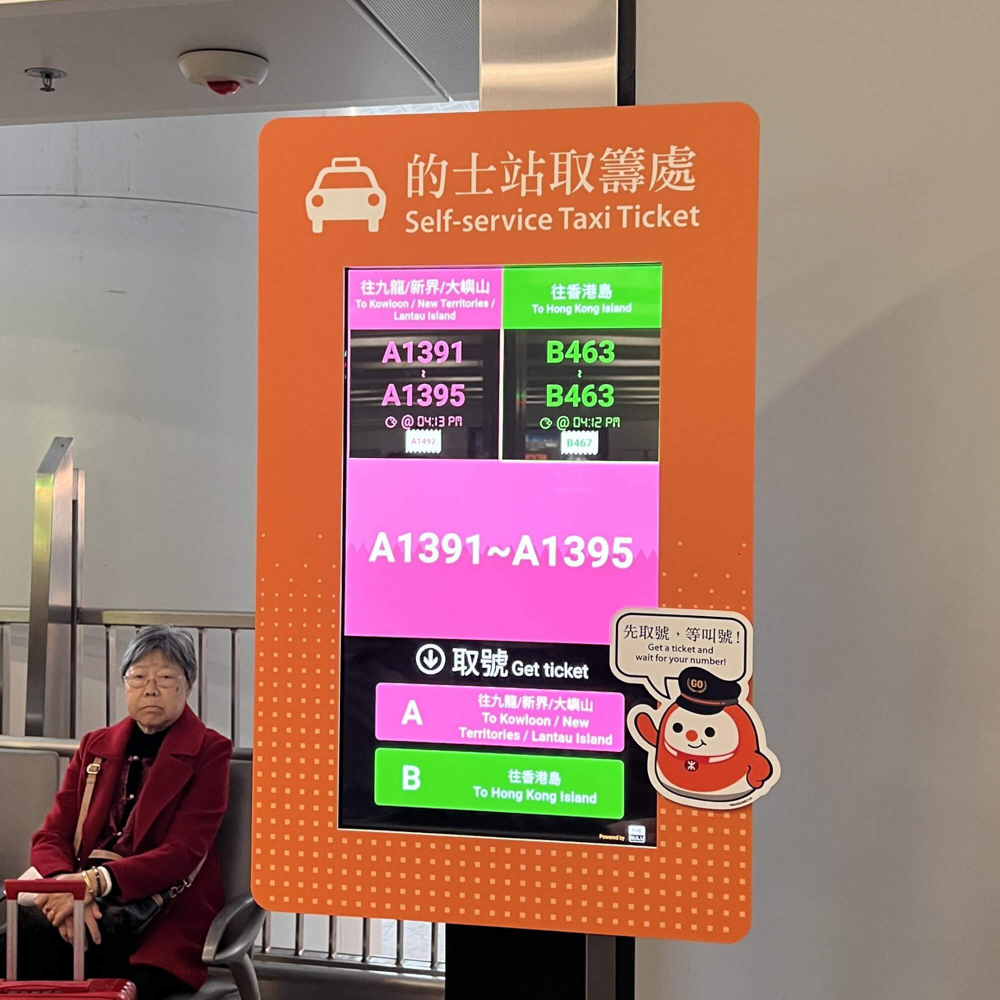

费用上看，大交通高铁68，大巴60，东铁线全程55，价格类似。而一家四口总价差不多，主要是因为六岁以下的宝宝可以免费随大人乘坐高铁，福田往返西九龙的区间车都坐不满，买两人的二等座，旁边的三人座位几乎都是空着的，小孩也不用挤在大人身上。

而坐东铁线小童是半价，宝宝坐跨境大巴更是全价票，两个娃要120，接近打车过海的钱了，所以算下来总价相差无几。

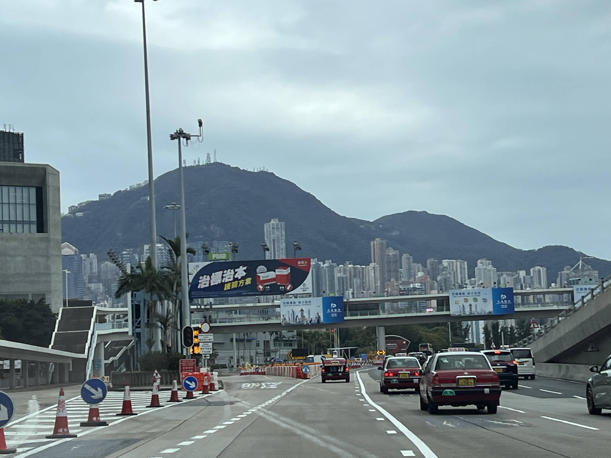

之前没想到这种方式，是因为西九龙去附近的柯士甸/九龙地铁站都挺远，这两个站转港岛线都不方便，并且香港打车贵，过海还有加收50，造成总价会很高的错觉。这次体验后，一家四口 高铁+打车轻松很多，以后可以多多尝试。
