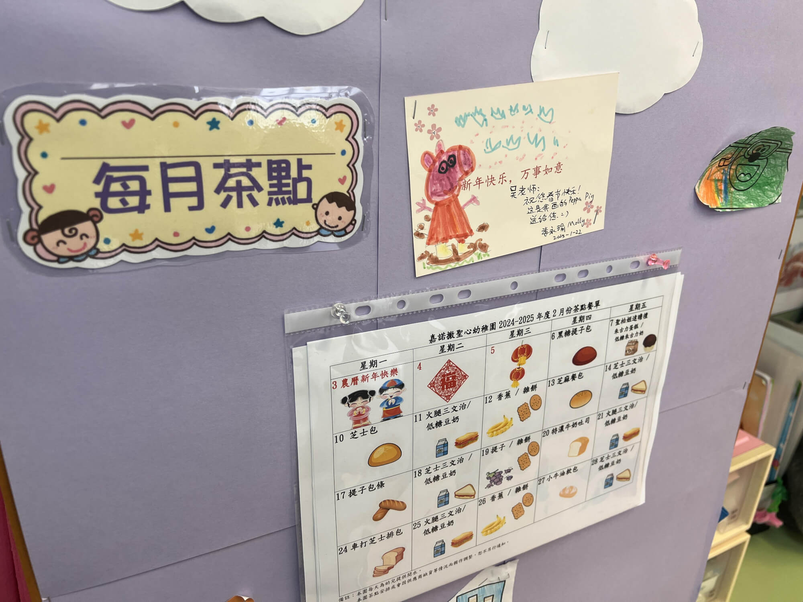
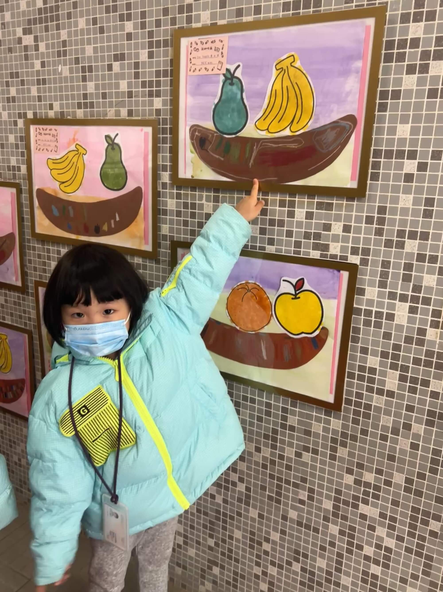
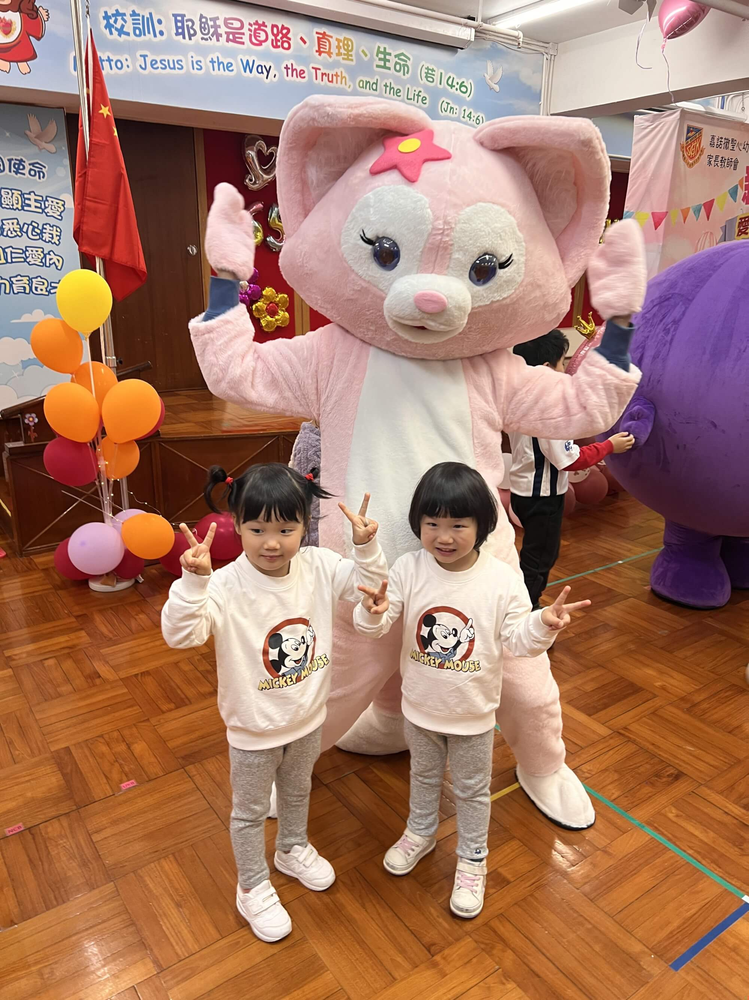

2025-02-22，星期六，香港 晴

## 期待满满，开启行程
今天参加了宝宝幼儿园举办的亲子同乐日活动，上午班的孩子参加上午场，下午班则是下午场。活动形式类似嘉年华，由老师和家长志愿者带领小朋友们一同玩耍。周五放学时每个小朋友都领到了一张游戏券，只要完成六个游戏并盖章就能获得奖品。

## 出行波折

活动时间是上午 9:30 到 11:30，我和奶奶带着两个宝宝，大约 8 点 50 分从家出发。两大两小，原本打算打车前往，可是第一次在家门口打车，才发现家附近的般咸道和柏道两边都是黄线，出租车根本不停，包括正街和柏道的公交站也都是黄线，只有公交车可以停靠。无奈之下，我们选择乘坐公交车。周六车少，等了许久，终于来了一辆 23 路，结果每一站都因为有很多乘客要上车，都停留很久。

## 抵达学校，拱门开场

大概在9:30 左右，我们准时抵达学校门口。此时，门口已经有一些人在排队了。一个印有165周年字样的充气拱门矗立在门口，像一个欢乐的入口，小朋友们都在拍照，我们也不例外。

## 六楼体验，轻松开场

到达学校后，我们发现来得比较早，现场人并不多，各个活动基本都无需排队。我们先抵达6楼，这里是大肌肉游戏区，设有小猫钓鱼和投沙包活动。小猫钓鱼的展板上展示着学校倡导的正面品格以及一些不良行为，像“睡懒觉”“不洗手”等。规则是小宝宝要钓到6个代表正向品格的“鱼”，正向品格都是用四个字表述，不良行为都是三个字。还算容易识别，顺利完成后就能得到大大的盖章。而投沙包项目，宝宝表现稍显逊色，投篮不太准。

## 五楼活动区印象

下到5楼，这层是宝宝学校的活动空间，颇似半露天的操场。里面放置着许多大型儿童玩具，像弹弹床这类深受孩子们喜爱的设施。参与游玩的规则是捐款5 - 10元，便能享受5 - 10分钟的欢乐时光。由于我们来得较早，此时这里还没什么人。考虑到下面还有不少打卡活动，我们便决定先略过这一层，想着之后再来。可当我们后来再返回时，这里早已排满了人，最终遗憾地错过了在这层楼的活动体验。

## 四楼宝宝教室参观

下到4楼，这层楼是教室，每个教室都有独特的打卡活动。我们首先走进了宝宝所在的NCC班级教室。此时，教室里正在进行一个有趣的小游戏，我们参与其中，玩完游戏后，顺便参观了教室。

在教室的墙上，我们发现了宝宝们的绘画。有宝宝们不久前在课堂上的作品，也有之前宝宝绘制的新年祝福卡片，也被贴在了墙上，承载着满满的祝福。

另外，春节作业里“画出学校里你最喜欢的设施”这一作品，也在楼道上的橱窗里展示着。宝宝们兴奋地伸出小手指着自己的作品，满脸自豪地向我和奶奶介绍，眼神中闪烁着光芒。 

## 四楼趣味打卡活动体验

4楼是打卡游戏区，每间教室都藏着一个独特的打卡活动。我们首先走进一间教室，参与了一场别开生面的扔大骰子游戏。骰子停下后，上面显示的指令十分有趣，比如单脚站立等充满挑战的动作，孩子们和家长们都积极响应，欢声笑语不断。

在另一间教室里，我们体验了将乒乓球投掷到类似放鸡蛋架子上的游戏，目标是让乒乓球稳稳停在架子上。这个看似简单的活动实则需要相当的技巧和耐心。

最后一个打卡点是答题套圈活动，题目涉及学校历史文化，包括会祖嘉诺撒的相关问题，以及校训、校长等内容。

## 三楼工坊，动手创造

来到3楼，这里设置了多个富有中华文化特色的工坊活动。我们首先参与了毽子工坊，用底座、羽毛和胶水，亲手制作了一个精致的毽子。在隔壁房间的踢毽子比赛中，小朋友们最多能踢两个，大人中最厉害的能连踢13个，而我的"战绩"是五个，好多年不踢，有点力不从心了。

## 印染与鼓，多彩创作

接着，我们来到扇子印染工坊。只见老师在水面上倒入涂料，轻轻转动扇面，便能印出独一无二的美丽花纹。

随后，我们又参与了波浪鼓制作。波浪鼓的一面可以贴上"春""福"等喜庆贴画或可爱的小燕子，另一面则由宝宝们自由发挥。宝宝们现在只有涂色能力，画画还处于随性涂鸦的状态。

## 二楼义卖区

我们来到二楼，这一层主要是义卖活动。我们首先看到的是气球摊点，摊主精心扎出了各种形状的气球，小巧玲珑的20元一个，大一些的则要50元一个。两个宝宝都相中了花形状的气球，都是50元的。由于身上没带足够零钱，为了凑单，我们便买了两个，刚好100。在气球摊旁边，还摆放着各式各样的商品，有儿童玩具，还有165周年纪念的钥匙扣等，看起来十分有趣。可惜我身上只有40元零钱，剩下的都是百元大钞，而义卖活动只能将钱投入盒子且无法找零，导致很多想买的东西都没办法下手。

## 人偶互动合影

在义卖区域中间，有几个引人注目的大人偶，有可爱的玲娜贝儿、经典的愤怒的小鸟、人气颇高的皮卡丘，还有一个警务处的小人偶。这些人偶吸引了众多小朋友，他们纷纷围过去与人偶们合影留念。宝宝们也兴奋地加入其中，脸上洋溢着灿烂的笑容，现场充满了欢声笑语。

## 警务安全宣传活动

这里还有一个与警务相关的安全宣传活动，似乎与反诈内容有关。每个小朋友都可以领取一个宣传海报，同时还能获得五枚硬币，将硬币投到特制的彩虹道具上，就能根据投中的位置领取不同的礼物。越靠近彩虹中心位置，奖品越好。我家两个宝宝都投中了小奖，是一支小小的圆珠笔。尽管奖品不算贵重，但孩子们参与得兴致勃勃，在玩乐中也学到了一些安全知识。 

## 排队参与热门活动

完成大部分活动后，我们回到三楼。看到许多小朋友背上都背着一个小蝴蝶形状的翅膀，看起来十分有趣。宝宝们瞬间被吸引，吵着也要玩。只见活动区域门口排着长长的队伍，无奈之下，我们也只能加入排队的行列。这个活动进行的速度比较慢，半天才能出来一两个人。后来工作人员似乎察觉到时间不够，排队的家长又太多，便将隔壁一个人少的教室活动搬了出来，让更多小朋友能在里面做蝴蝶，一下子就放进去好多人。

## 蝴蝶制作与捐款小插曲

我们进入活动区域时，遇到了一个小状况。原来这个活动属于打卡项目，需要捐款，金额随意，5元、10元、20元都可以。可我身上恰好没有零钱，犹豫之下，只好捐了100元。老师们看到这金额也有些惊讶。不过转念一想，这毕竟是义卖捐款，和高价购买物品性质不同，心里也就释然了。

进入教室后，我们带着两个宝宝开始制作蝴蝶翅膀，制作材料是两张彩色透明纸，用来做蝴蝶的翅膀。先把中间卡纸上的蝴蝶图案抠下来，再将透明纸贴上去，剪成蝴蝶形状，最后在中间系上两根松紧带，方便背在膀子上。由于时间有限，宝宝们做了一会儿后，老师也帮忙一起制作，最终成功完成了两个蝴蝶的制作。

## 领取奖品与活动落幕

两个宝宝把做好的蝴蝶背在身上，开心得不得了。完成所有打卡项目后，奶奶带着我们前往五楼领取奖品。每个小朋友都能领到一个袋子，里面装着一些小零食和小玩具。至此，我们顺利结束了今天精彩的亲子同乐日活动，满满回忆让我们倍感温暖与幸福。 

## 活动总结
参加此次亲子同乐日活动，总体而言，体验非常棒。这所历史悠久的学校在活动组织方面展现出了极高的水准。活动类型丰富多样，游玩、体验、义卖等活动一应俱全，在老师、家长以及义工的共同协作下，整个活动精彩纷呈，十分充实。

不过，我在活动中也遇到了一些问题。比如义卖环节，学校在活动通知里明确强调过需要现金且不设找零，我自己大意了，只带了2张20元，远远不够，不过在电子支付如此普及的今天，这里也可以有所改进，比如捐赠箱上放上支付二维码，应该更方便。

## 经验留存

为了在今后的类似活动中获得更好的体验，我也总结了一些经验：

首先，提前做好准备工作至关重要，要提前查看活动说明，了解热门项目，尽早到达现场，优先排队参与热门项目，之后再去体验无需排队的项目，这样能更高效地利用活动时间。

其次，合理安排出行时间也很关键，若能早点结束活动，返程无论是乘坐公交车还是打车，都能避免排队等待，让整个行程更加顺畅。

最后，借助活动的机会，与同学和家长们交流，互相学习，也是不错的契机。我因为不会粤语，这次完全不敢开口，变成了一个"小透明"，下次要勇于开口表达，其实学校老师和义工家长都非常友好，也都在用普通话回复我们的问题。

相信下次再参加这样的活动，我们一定能更加从容，收获更多的快乐。