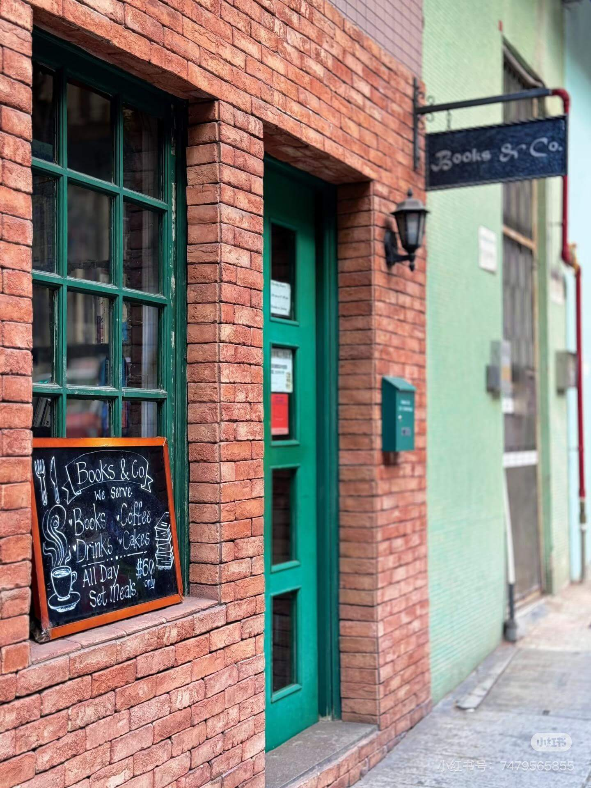

2025-5-10 周六 香港 晴

### 萌生探店念头
下午，百无聊赖的我困在家中，总觉空气沉闷压抑，心绪也跟着有些烦躁。突然想起家附近的网红打卡地旧书店，一直想去却未曾踏足，便决定出门一探究竟，为平淡的周末增添些别样色彩。

<!--more-->

### 独特的地理位置
目的地是位于柏道上的 Book & Go，这是一家集旧书店与咖啡厅于一体的场所。距离西营盘地铁站C口仅咫尺之遥，对我来说更是近在咫尺——就连我送孩子去上学公交站，都恰好设在书店门口。如此近便的地方，我却一直未曾踏入，想想真是有些不可思议。

### 心仪已久的网红地
在小红书等社交平台上，我多次刷到过关于它的推荐，精美的店内陈设、醇香的咖啡以及丰富的藏书，都让我心生向往。可不知为何，此前虽无数次路过，却始终未能走进店内，直到这个略显无聊的周六下午，才终于有机会揭开它的神秘面纱 。 

### 门口的靓丽风景线

抵达Book and Go门口时，映入眼帘的是几位妆容精致的漂亮小姐姐，正专注地摆着各种造型拍照。她们的穿搭风格颇具日韩时尚气息，举手投足间尽显优雅。虽然戴着耳机没能听清她们的交谈内容，但从神态和动作来看，她们精心凹出的一个个造型，画面极具美感，为书店增添了一道独特的风景线。

### 亲切的初入体验
待小姐姐们拍完照，我推开书店的门。没想到刚一进去，工作人员便热情地向我问好，这突如其来的亲切问候，着实让我感到意外又温暖，瞬间对这家店多了几分好感。

### 震撼的藏书世界

走进书店内部，眼前的景象令我大为吃惊。书架、过道、吧台，目光所及之处满满当当全是书籍，堆积程度堪称惊人。与之形成鲜明对比的是，用于喝咖啡的座位在这书的海洋中显得格外逼仄，过道也被书籍挤占得狭窄曲折，仿佛走进了一个由书堆砌而成的迷宫。

随手翻阅几本书，发现品类丰富多样，小说、历史、文学、旅游等各类书籍应有尽有。这些书大多是旧书，可品相极佳，不少还细心地包着书皮。有的书籍贴着价格标签，有的则尚未标价。仔细一看，品相好的书价格可不低，比如一本原价仅5块钱的旧教科书，在这里竟然标价数百元。

### 热闹的店内氛围

书店里人气十足，不少人正沉浸在翻书的乐趣中。咖啡厅的几张桌子也都坐满了客人，有金发碧眼的洋妞，也操着普通话的内地面孔，大家一边品尝饮品，一边愉快地交谈着，空气中弥漫着轻松惬意的氛围，让人不自觉地想融入其中，享受这美好的阅读与休闲时光。 

### 丰富的藏书发现
在书店里，我看到了很多有意思的书。比如一本很老的上海地图，封面是英文，里面却是中文内容。根据地图上标注的乐山关路那一带，能感觉到满满的年代感，和现在完全不一样。还有一本 90 年代关于长城的画册，应该是以前去内地旅游的人带回来，之后通过各种渠道被收集到这家二手书店的。从书上的一些名字和来源可以看出，这些书都有自己的流通渠道。

### 多元的书籍宝藏

随机翻阅各种旧书，最令我惊讶的是竟然发现了计算机类书籍，一本英文的《设计模式》赫然在列，着实让我有点意外。难以想象店主是通过何种渠道收集到如此丰富的藏书。

但与此同时，店内书籍堆积得过于密集，多个放书的过道都被塞得满满当当，人根本无法进入，角落里的书籍也因堆放太深而难以翻阅，我只能在外侧一圈活动。这一圈同样被书籍占据，地上、高处皆是，仅容一人侧身通过，就连服务员送餐时，都得小心翼翼地避让，通行颇为不便。

### 邂逅心仪旅行读物
我此行对旅行类书籍尤为感兴趣，书店里恰好有一个区域摆满了游记、旅行画册，还有诸如《Lonely Planet》之类的旅行攻略与地图。除了书架上整齐排列的书籍，桌上、地上也堆放着不少。一番寻觅后，我发现了两本香港地图册，分别出版于2002年和2007年，一本是交通图，一本是大厦图。地图印刷精美，尤其是那种活页夹形式，每一页都是区域详图，质感十足，相较于手机屏幕，阅读体验更佳。尽管2007年距今已有15年，但香港核心城区如我家附近的中西区，变化并不大，物业分布与如今相差无几 。而香港国际机场的详图更是让我受益匪浅，此前去机场多次，也拿过手册，都没有像这样看地图，更清晰了解到机场小火车如何从出发点抵达40号登机口，再通往卫星厅，原来机场建筑结构是两个相连的Y型楼体。

### 愉快的购书体验

一番浏览后，我挑选了其中一本香港交通图和一本《香港郊野径》旅游攻略。《香港郊野径》原价六七十，现定价30。交通图原本没有标价，结账时店员现场估价60，我觉得价格合理，两本书共计90元。不过在付款环节遇到了小插曲，书店不支持信用卡支付，仅接受八达通、香港版支付宝和微信，因我未携带现金，且大陆版支付方式无法使用，最后刷八达通完成付款，倒也十分便捷，就这样，我可以带着心仪的书籍，结束这次探店之旅。 

### 关于书店的改进
在这家书店，店员展现出了出色的语言能力，能够用流利的普通话、粤语和英语与顾客进行交流，这让我印象深刻。

付款之后，我和店员聊了几句。我提到书店里的书摆放得太满，很多角落堆满了书，根本进不去，也看不到里面的书。 店员表示，店里新进了不少旧书，所以堆放得比较杂乱。他还告诉我，最近会对书籍进行整理，下次来的时候，很多书会被收到仓库里，找书体验可能会更好。

### 书店的综合评价

总的来说，这家书店作为旧书店很值得一逛，有不少不错的书。但作为咖啡厅，环境就差强人意了，书摆放得太拥挤。在这里和朋友聊聊天、喝喝茶还行，如果是想静下心来办公或学习，感觉斜对面的星巴克会更合适。 

### 旧书店的独特魅力
总体而言，这家旧书店给我的感觉很棒，网上的评价也大多不错。在香港这样的地方，能有这样一家旧书店实属不易。以后等它整理好，我想我会经常去逛逛，说不定能邂逅更多有趣的书。

### 旧书店的经营不易
线上买书匹配到喜欢的书相对容易，而线下在这么多书里找到心仪的书确实不太容易，但翻阅和发现的过程本身也是乐趣。开这样一家旧书店，要收集、整理这么多书，还要考虑如何吸引顾客，真的不是一件简单的事。希望生意越来越好，能吸引更多人来这里淘书、喝咖啡，享受阅读的乐趣。