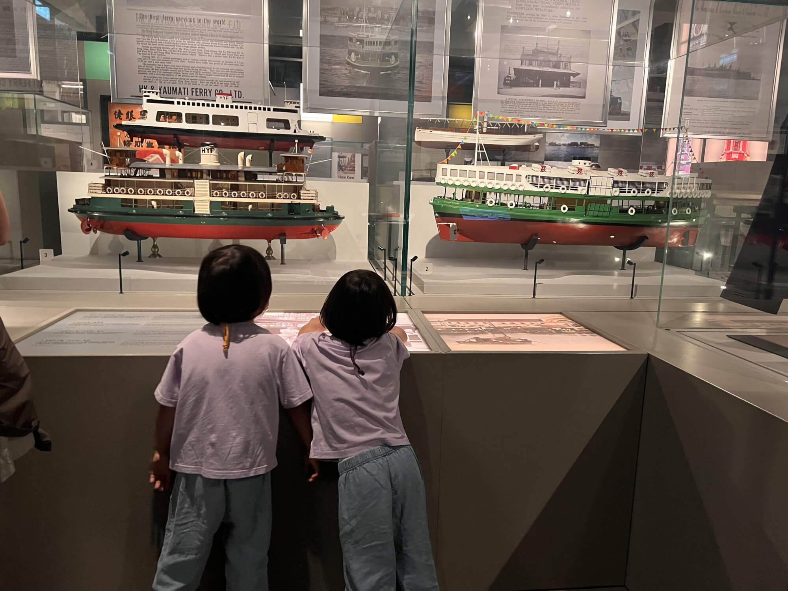

## 参观缘起：一句玩笑促成的文化之旅
今天是星期天，我和宝妈带着宝宝前往香港历史博物馆，参观“天下一统，陕西秦汉文明展”。这个展览早在4月中旬就已开幕，宣传十分到位，我们家门口西营盘地铁站内，大幅海报十分醒目，让我一直心生向往。

<!--more-->

前几天在宝妈面前吹牛时，她一句“信你还不如信我是秦始皇”的调侃，触发了我的灵感，我立刻提议周末带宝宝去香港历史博物馆，看秦始皇兵马俑展，正好我们办了博物馆年卡，不去着实可惜，于是便有了这次行程。

## 交通与展馆初印象：便捷与惊喜并存

我们乘坐地铁，经港岛线转荃湾线，在佐敦站下车后步行前往。港岛线转荃湾线相对便捷，但步行距离比港岛线转东铁线的红磡站过去稍远，整体耗时应该差不多。抵达香港历史博物馆，发现它紧邻香港理工大学。

进入馆内后，惊喜地得知此次展览由赛马会赞助，无需门票，即使没办博物馆年卡也能免费参观。博物馆一楼是特展厅，“陕西秦汉文明展”将持续至7月初；二楼则是国安展和香港历史展。

## 展馆布局：严肃与趣味的巧妙融合

一楼的“天下一统，陕西秦汉文明展”展览为两个区域，内部是严肃的展览区，外部是互动区。互动区布置了许多Q版造型，设有盖章、儿童互动游戏等区域，将严肃的展览与充满趣味的儿童活动区分开，满足不同人群的参观需求，这种设计十分贴心。

## 展览内容：浓缩秦汉文明精华
进入展览区，首先映入眼帘的是香港和陕西文物相关领导的致辞。展览以“天下一统”概念开篇，从制度、经济、文艺、科技、互鉴、秦汉时期的相关等角度，介绍了秦汉文明的辉煌成就。

既有文物，也有图片和文字。 展出的文物均来自陕西，包括秦始皇陵，汉景帝阳陵，陝西考古博物館，涵盖秦朝和汉朝时期。

其中，兵马俑、汉俑、动物塑像等展品各具特色。虽展品数量不算多，但极具代表性，如带有“千秋万岁”“长乐未央”字样的瓦当，还有青铜器铜剑、矛、砚等。展览还通过文字介绍，对比同一时期欧洲文明，帮助参观者更好地理解秦汉文明的独特之处。

我家宝宝特别喜欢小动物塑像，看到绵羊和山羊俑时开心不已。此外，展品中的一号铜车马是复制品，其他大部分都是真品，让人得以近距离感受秦汉时期的文化魅力。 

## 趣味互动：古今身高大比拼
展览里的互动区域十分有趣，不过需要排队体验。我们参与了身高测量项目。一台机器搭配绿幕，通过拍照测量出身高，并换算成古代的尺寸，还会将测量者与古人进行对比。我和“孔子”对比，发现自己比孔子矮不少；宝宝身高约一米一，测量后弹出了孔子的矮个弟子“子羔”，其身长仅五尺，和宝宝差不多高，这些数据对比十分有趣，让我们在玩乐中感受到古今差异。

## 视听学习：粤语纪录片解读秦汉历史
互鉴区设有纪录片观看区，播放着粤语解说的秦汉历史纪录片。内容介绍详细，让我收获颇丰。秦皇汉武、海昏侯等都有涉及，纪录片还着重介绍了秦汉时期的南越国，提及南越王赵佗定都番禺（今广州），后面秦汉时期的香港还提到香港长沙湾李郑屋汉墓中发现带有“番禺”字样的文物，巧妙地将秦汉文明与香港历史紧密相连，使整个展览更具地域特色和文化深度。

## 多元体验：互动娱乐与知识学习并存

展览结束后，我们走到外面的互动区。这里设置了许多趣味展板，可供参观者拿起道具拍照。还有教育小册子，可以用印按压出三种图案“大吉番禺”，“五铢钱”和“瓦当”，宝宝玩得不亦乐乎。

此外，一楼的国安展互动区也人气十足。排队参与答题后，还能通过抓彩蛋获取小礼品，珊瑚宝宝幸运地拿到了小熊猫挂件，海兔宝宝也得到了计时器等小物件，大家都开心不已。 

## 二楼探秘：多元主题展现家国风采

参观完一楼的展览后，我们登上了二楼。二楼首先是国家安全展，这个展览内容丰富，并非单纯讲述国家安全，还穿插着新中国建国的历史，并展示了我国在诸多领域的最新科技成果，如火箭、载人航天技术、无人机、机械狗、潜水艇和舰船等。这些展品充分彰显了我国强大的综合国力，激发了参观者的爱国情怀。展厅内不仅陈列着实物、模型，还设有3D眼镜放映厅，视觉效果出色。我带着宝宝一同观看体验，度过了一段愉快的时光。

## 历史回溯：感受香港的发展脉络

国安展之后，我们来到香港历史常设展展区。看了“香港多面体”展览，这个展聚焦三个主题香港油尖旺历史，香港与旧金山的联系，以及香港葡萄牙人的故事。展区通过生动有趣的方式呈现内容，包括海港城、天星小轮等特色介绍，搭配模型与文字展示，让历史变得鲜活起来。此外，展区还设置了游戏区域，我们带着宝宝尽情体验，在玩乐中了解香港的发展变迁。

## 美食收尾：充实行程的温馨句号

参观结束时已过下午一点，我们离开了博物馆，前往附近的元朗冰室用餐。这家餐厅以猪肉菜品闻名，我们品尝了猪排饭等美食，味道相当不错。享受完美食后，我们踏上了回家的路，这次博物馆之行也在充实与满足中落下帷幕。 

## 链接
https://hk.history.museum/ 香港历史博物馆官网

https://hk.history.museum/tc/web/mh/exhibition/The-Great-Unity.html “天下一统”展览的官方网页，包含电子版的小册子、图册、儿童图册等。