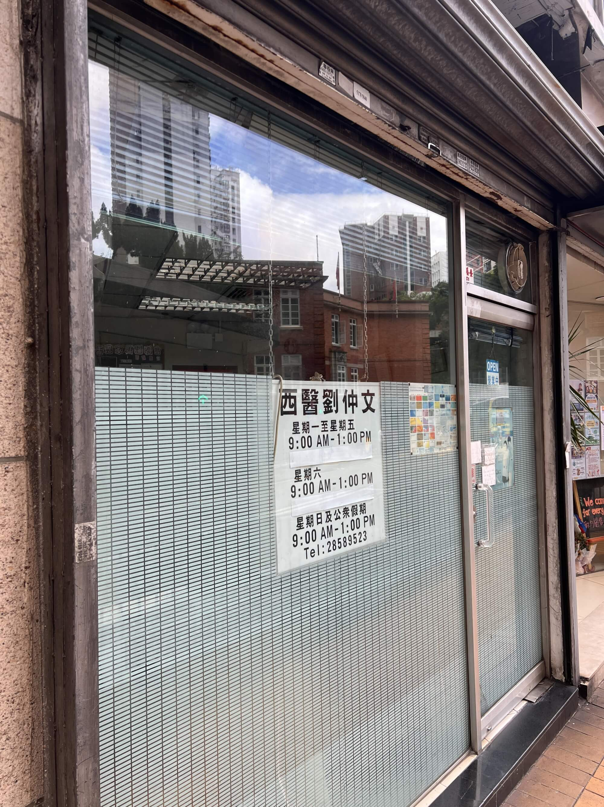

2025-5-16 周五 香港 晴

## 首次体验香港私立诊所的契机
今天是我第一次在香港私立诊所看病，想和大家分享下就医体验。此前由于没有购买私立医保（门诊和住院都没买），为了省钱，我在香港就医只能选择公立医院。

<!--more-->

香港的公立医疗的质量非常好，缺点是预约麻烦，小病排队周期长，我的超声造影排到了2027年。如今我开始线下办公，公司从4月1日起为我配置了商业医保，让我终于有机会体验香港的私立医疗服务。

## 优质的公司医保保障
公司为我们投保的是保柏（BUPA）的医保套餐，这是一家源自英国的知名医保企业，口碑颇佳。公司的套餐属里，住院是半私家类型，也就是入住两人间的费用全报销；门诊在网络内就诊同样无需自费，此外每年还包含一次洗牙福利，保障十分全面。公司的医保政策不仅覆盖本人，还可涵盖配偶及最多两名子女，一家四口都能享受同样优厚的保障，住院和门诊报销条件相同，让人倍感安心。

## 深入研究医保细则
拿到保险后，我开始仔细研究相关细则。先是从公司内网查找注册资料，依据指引注册了保柏医保主账号，关联了自己、夫人和两个孩子的信息。注册完成后，通过官网不仅能搜索医生，还能查阅详细的双语合同，我将部分重要合同打印留存，同时把保险套餐介绍、医生网络信息等内容的PDF电子版下载到手机，方便随时查看。

## 便捷的数字化服务体验
保柏公司开发的APP也十分实用，我下载注册后绑定了医保账户，通过APP可以便捷地查找周边诊所、出示就诊卡，还能在线提交报销申请。值得一提的是，这份保险的保障范围覆盖全球，除香港本地医疗网络外，在其他地区看病也可报销，但门诊每日报销金额根据病症不同，可报200多至600港币多不等，每年报销总额也有一些限制。 

## 选择私立诊所就医的缘由
近期我持续流涕，在家自测新冠呈阴性，于是自己在家吃了点药，但一直不见好转。想着去医院配药，可公立医院不仅要电话预约，还需长时间排队，流程繁琐。于是，我决定尝试前往私立小诊所就诊。

## 便捷的诊所搜索与选择
我打开“Blua Health”APP，通过地理位置搜索到一家距离我家极近的诊所，直线距离仅100米左右，步行5分钟内就能抵达，就在楼下麦当劳的对面。

去之前，我在网上查看了该诊所医生的评价，有谷歌地图评论，也有些本地的医疗网站，整体尚可。虽然医生只会英语和广东话是个小缺点，但好在就诊人数少、无需久等，看病效率高，权衡之下，我决定前往。

## 初次就诊的现场体验
出发前，我尝试致电诊所，奈何接线员全程说广东话，沟通无果后，我直接前往。到了现场才发现，诊所面积很小，仅有一间房，内部隔成两个区域：外面是病人休息区，旁边设了个小窗口，里面是一个女护士or工作人员，一个男医生。我向工作人员出示了香港身份证和手机上的保柏医疗卡，随后被要求填写住址、电话、姓名等个人信息，他们在系统中核对我的身份信息与就医卡是否匹配。几分钟后，确认信息无误，便进入了问诊环节。

## 细致的问诊与沟通
医生开门与我交流，考虑到我处于感冒期间，他并未坐得很近，而是保持一两米的距离，我继续坐在休息室的凳子上。起初因语言障碍，我们尝试用普通话和广东话相互交流，发现沟通不畅后改为英语。过程中部分单词我听不懂，好在护士帮忙翻译，让交流得以顺利进行。医生还夸赞我的英语口语不错。问诊时，医生询问得十分细致，包括是否有新冠病史、疫苗接种情况、近一个月用药记录、活动轨迹、日常用药以及药物过敏史等。问完后，医生为还用听诊器检查身体状况，我也将近期服用的药物展示给他看。

## 明确的诊疗与用药建议
医生表示我日常服用的降压药可继续使用，无需再吃自备的抗生素，服用他开的药即可。整个问诊过程大概持续了10分钟。结束后，医生进里屋开药，随后拿出保柏保险公司的确认信和收据让我签字，并给了回执。

一共开了三种药：一种口服糖浆，推测用于止咳；一种药丸，经查询是对乙酰氨基酚，应该是治疗感冒的；还有一种无包装的胶囊药物，暂未查到具体名称，猜测是抗生素。所有药物都装在贴有诊所小标签的袋子或瓶子里，由于医保限制，此次仅开了三天的药量，诊金加药费大约240元，属于一口价，根据用药天数不同，价格会有差异。医生叮嘱我先服用三天，若未好转再来复诊，至此，此次看病流程结束。 

## 总结：商业医保带来的就医体验

拥有商业医保后的这次就诊，总体体验相当不错。香港公立医院虽然医疗水平高，但电话预约难度大，看大病时排队等候时间漫长。而商业医保作为有力补充，让我在应对感冒流涕这类小病时，能够快速前往私立诊所就诊拿药；在看专科时，也能大幅缩短排队时长，极大提升了就医的便捷性与时效性。

此前为孩子购买的半私家住院医保，如今也能与公司投保的医保相互配合。只要我能持续正常工作，这些医疗费用都能由医保公司承担，不仅减少了经济负担，也让我和家人的健康保障更加全面，切实感受到商业医保带来的便利与实惠。 